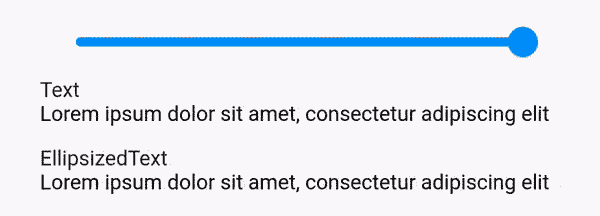

# 在 Flutter 中编写定制小部件(第 1 部分)——ellipsized text

> 原文：<https://itnext.io/writing-custom-widgets-in-flutter-part-1-ellipsizedtext-a0efdc1368a8?source=collection_archive---------3----------------------->


# 介绍

Flutter 中的声明式 UI 非常漂亮，易于使用，而且尽可能多地使用它是非常诱人的。但是开发人员经常会过度使用它——以声明的方式编写所有内容，即使有时任务可以更有效地完成，并且以更命令的方式更容易理解。

每个人都应该明白的是——声明式和命令式编程之间必须保持平衡。每个人都有自己的用途，每个人在一些任务上比其他人更出色。

在这一系列文章中，我将描述如何通过从头开始创建自定义小部件来解决不同的问题。每一个都比前一个复杂一点。

# 快速理论

在看代码之前，我们需要知道一些基本的东西。

`Widget` —是一个不可变的(最好是常量)类，包含`Elements`和`RenderObjects`的配置属性。它还负责创建所述的`Elements`和`RenderObjects`。重要的是要理解——小部件从不包含状态或任何业务逻辑，只传递它们。

`Element` —是负责实际 UI 树的实体。它有对所有子节点的引用，也有对其父节点的引用(不像`Widget`)。除非`key`或`Widget`被改变，否则`Elements`大部分时间都被重用。因此，如果只改变了`Widget`的属性，即使分配了新的`Widget`，`Element`也将保持不变。

`State` —只不过是`Element`中的一个用户定义的类，它也有一些来自其`Element`的回调。

`RenderObject` —负责实际尺寸计算、儿童放置、绘图、触摸事件处理等。这些对象与 Android 或其他框架中的经典`Views`非常相似。

为什么我们同时有`Elements`和`RenderObjects`？因为效率。每个`Widget`都有各自的`Element`，但只有部分有`RenderObjects`。由于这一点，许多布局，触摸和其他层次遍历调用可以省略。

# 密码

第一个例子是一个非常简单的小部件，当文本不合适时，它会将其省略。你可能会问，当内置文本已经支持省略号时，我们为什么还需要这样一个小部件？答案很简单——从现在开始，它只按单词而不是按字符进行切割([https://github.com/flutter/flutter/issues/18761](https://github.com/flutter/flutter/issues/18761))。因此，如果你在最后有一个很长的单词，大多数时候你只会看到这个单词的第一个字母，即使还有很多空间可以填充。

让我们开始吧。Flutter 有很多内置的基类和 mixins，可以帮助构建完全自定义的小部件。以下是其中的几个:

*   LeafRenderObjectWidget 没有子项
*   SingleChildRenderObjectWidget 有一个子对象
*   MultiChildRenderObjectWidget 具有任意数量的子级

在我们的例子中，我们将使用 LeafRenderObjectWidget，因为我们只需要呈现文本，并且没有子元素:

```
**enum** Ellipsis { **start**, **middle**, **end** }

**class** EllipsizedText **extends** LeafRenderObjectWidget {
  **final** String **text**;
  **final** TextStyle? **style**;
  **final** Ellipsis **ellipsis**;

  **const** EllipsizedText(
    **this**.**text**, {
    Key? key,
    **this**.**style**,
    **this**.**ellipsis** = Ellipsis.**end**,
  }) : **super**(key: key);

  @override
  RenderObject createRenderObject(BuildContext context) {
    **return** RenderEllipsizedText()..**widget** = **this**;
  }

  @override
  **void** updateRenderObject(BuildContext context, RenderEllipsizedText renderObject) {
    renderObject.**widget** = **this**;
  }
}
```

我们已经创建了我们的小部件。唯一不同寻常的是存在两种方法:

*   createRenderObject —负责实际创建我们的 RenderObject
*   updateRenderObject 当微件的数据发生变化但 RenderObject 保持不变时将被调用。在这种情况下，我们需要更新 RenderObject 中的数据，否则它将呈现旧文本。

我还需要注意，最好将每个值从小部件复制到 RenderObject。但是我会传递整个小部件，因为它们无论如何都是不可变的(我也懒得写那些样板代码)。

现在让我们从实际的 RenderObject 开始:

```
**class** RenderEllipsizedText **extends** RenderBox {
  **var _widgetChanged** = **false**;
  **var _widget** = **const** EllipsizedText(**''**);

  **set widget**(EllipsizedText widget) {
    **if** (**_widget**.**text** == widget.**text** &&
        **_widget**.**style** == widget.**style** &&
        **_widget**.**ellipsis** == widget.**ellipsis**) {
      **return**;
    }
    **_widgetChanged** = **true**;
    **_widget** = widget;
    markNeedsLayout();
  }
}
```

这里我们定义了所有的变量，并编写了一个 setter 来更新它们。还有一个检查值是否真的改变了的安全措施——如果什么都没有改变，就不需要重新计算省略号和重新绘制文本。

现在我们需要布局我们的 RenderObject。

```
**class** RenderEllipsizedText **extends** RenderBox {
  *// ...
 * **var _constraints** = **const** BoxConstraints();

  @override
  **void** performLayout() {
    **if** (!**_widgetChanged** && **_constraints** == **constraints** && **hasSize**) {
      **return**;
    }

    **_widgetChanged** = **false**;
    **_constraints** = **constraints**;

    **size** =_ellipsize(
      minWidth: **constraints**.**minWidth**,
      maxWidth: **constraints**.**maxWidth**,
    );
  }
}
```

布局的过程非常简单。我们需要做的就是——根据提供给我们的约束计算 RenderObject 的大小。约束仅仅描述了我们必须遵守的最小和最大尺寸。此外，如果没有任何变化，并且在之前的布局过程中已经计算了尺寸，则增加额外的检查。

创建椭圆化文本的实际过程相当繁琐，肯定有更好的解决方案，但我选择使用二分搜索法来找到最佳匹配。

```
**class** RenderEllipsizedText **extends** RenderBox {
  *// ...* **final _textPainter** = TextPainter(textDirection: TextDirection.**ltr**);

  Size _ellipsize({**required** double minWidth, **required** double maxWidth}) {
    **final** text = **_widget**.**text**;

    **if** (_layoutText(length: text.**length**, minWidth: minWidth) > maxWidth) {
      **var** left = 0;
      **var** right = text.**length** - 1;

      **while** (left < right) {
        **final** index = (left + right) ~/ 2;
        **if** (_layoutText(length: index, minWidth: minWidth) > maxWidth) {
          right = index;
        } **else** {
          left = index + 1;
        }
      }
      _layoutText(length: right - 1, minWidth: minWidth);
    }

    **return constraints**.constrain(Size(**_textPainter**.**width**, **_textPainter**.**height**));
  }
}
```

我不会重复所有这些逻辑(如果你愿意，你可以从头到尾读一遍)。但重要的是，TextPainter 是用来计算文本大小的。如果文本长度超过了我们的限制，我会尽量把它变得越来越短，直到它符合我们的限制。

`_layoutText`用于计算我们裁剪的文本尺寸:

```
double _layoutText({**required** int length, **required** double minWidth}) {
  **final** text = **_widget**.**text**;
  **final** style = **_widget**.**style**;
  **final** ellipsis = **_widget**.**ellipsis**;

  String ellipsizedText = **''**;

  **switch** (ellipsis) {
    **case** Ellipsis.**start**:
      **if** (length > 0) {
        ellipsizedText = text.substring(text.**length** - length, text.**length**);
        **if** (length != text.**length**) {
          ellipsizedText = **'...'** + ellipsizedText;
        }
      }
      **break**;
    **case** Ellipsis.**middle**:
      **if** (length > 0) {
        ellipsizedText = text;
        **if** (length != text.**length**) {
          **var** start = text.substring(0, (length / 2).round());
          **var** end = text.substring(text.**length** - start.**length**, text.**length**);
          ellipsizedText = start + **'...'** + end;
        }
      }
      **break**;
    **case** Ellipsis.**end**:
      **if** (length > 0) {
        ellipsizedText = text.substring(0, length);
        **if** (length != text.**length**) {
          ellipsizedText = ellipsizedText + **'...'**;
        }
      }
      **break**;
  }

  **_textPainter**.**text** = TextSpan(text: ellipsizedText, style: style);
  **_textPainter**.layout(minWidth: minWidth, maxWidth: double.*infinity*);
  **return _textPainter**.**width**;
}
```

差不多就是这样。我们剩下要做的——实际上画出我们的文字。

```
@override
**void** paint(PaintingContext context, Offset offset) {
  **_textPainter**.paint(context.**canvas**, offset);
}
```

这是结果:



你可以在我的 GitHub 上找到实现:
[https://github.com/MatrixDev/Flutter-CustomWidgets](https://github.com/MatrixDev/Flutter-CustomWidgets)

希望你喜欢它！

# 其他文章:

*   [第 2.a 部分——儿童规模(有助手)](https://rlesovyi.medium.com/writing-custom-widgets-in-flutter-part-2-singlechildrenderobjectwidget-5637fecdf9bb)
*   [第 2.b 部分—子女人数(无助手)](https://rlesovyi.medium.com/writing-custom-widgets-in-flutter-part-2-b-childsize-no-helpers-61c578c9bbd2)
*   [第 3.a 部分—简单叠加(带助手)](https://rlesovyi.medium.com/writing-custom-widgets-in-flutter-part-3a-simpleoverlay-with-helpers-6b3990db48b6)
*   [第 3.b 部分—简单叠加(无助手)](https://rlesovyi.medium.com/writing-custom-widgets-in-flutter-part-3-b-simpleoverlay-no-helpers-9ddf45cea983)