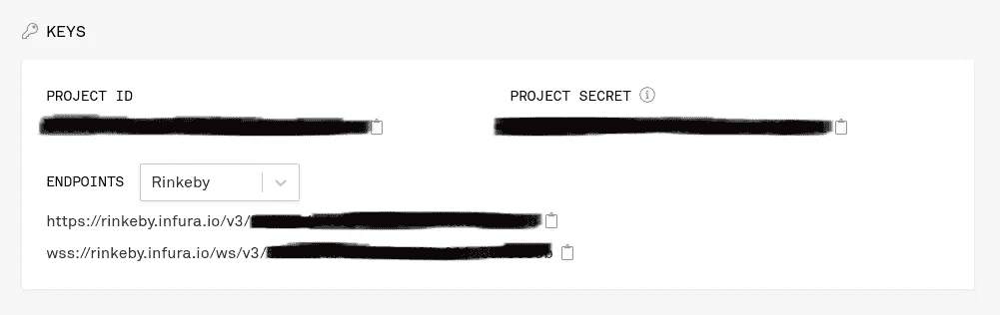

# 用颤动+坚实写 DAPPs

> 原文：<https://itnext.io/writing-dapps-with-flutter-solidity-27d0621fd01?source=collection_archive---------0----------------------->

来源:https://ethereum.org/

# 介绍

就经济而言，我们正生活在有趣的时代，似乎我们正处于基于加密货币和区块链的去中心化经济的新时代的前沿。每天我们都在发现使用区块链技术编写软件的新方法，从而改变 it 创造“价值”的方式。

# 分散式应用

它们是普通的应用程序，提供类似的功能，但关键的区别是它们运行在对等网络上，如区块链。

## 利益

*   **开源:**这鼓励了 dapp 生态系统的广泛发展，使开发者能够构建具有更多有用或有趣功能的更好的 dapp。
*   **基于区块链:**由于它们由智能合约制成，它们可以轻松地将加密货币集成到 Dapp 的基本功能中。
*   **无停机:**依靠点对点系统确保即使个别电脑或部分网络瘫痪，dapps 也能继续工作。
*   不受审查:由于没有单点故障，政府或有权势的个人很难控制网络。

# Fluthereum:一个实际的例子

## 合同

首先，我们需要一个智能合同来与应用程序进行交互，编写合同的方法是使用一些面向这类程序的编程语言。在这个例子中，我们将使用 **Solidity** ，这是一种面向对象的编程语言，语法与 Javascript 和 Typescript 相似。

我们还将使用 Remix 作为开发环境来编译和部署我们的合同。

> ***重要:*** 你应该将你的合同部署到 remix 提供的几个测试链中的一个，在我的例子中是 **rinkeby。**你不应该用主以太坊链来测试你的 app。

如您所见，代码非常简单易读，即使您不熟悉 Solidity，也很容易看出契约就像一个内部有函数和属性的类。

在这个例子中，我们只有一个从 0 开始的余额，然后我们可以用*存款()*增加它，用*取款()*减少前端应用程序提供的给定金额。

## API 访问

一旦我们部署并运行了合同，我们就可以创建一个端点，让它可以从 Flutter 应用程序访问，一个简单的方法就是使用 [Infura](https://infura.io/) 。

Infura 为我们提供了一个 API 端点，以一种简单的方式与我们部署的契约进行交互，并且不需要任何服务器端应用程序。创建和设置帐户后，您只需提供合同 ID，他们将为您提供一个端点来访问您部署的合同。

## 颤振应用

一旦我们有了端点，我们就可以开始处理前端部分了。在这种情况下，我将运行一个正常的颤振应用程序。

为了能够通过 API 与智能合约进行交互，我们需要添加 [**web3dart**](https://pub.dev/packages/web3dart) 依赖项来设置连接。

安装后，我们可以通过使用以下代码获取我们的合同接口:

为了创建与智能契约的交互点，我们可以创建一个通用的 dart 函数来发送和接收来自它的数据。

现在，我们可以与已部署契约中的所有公共函数和属性进行交互:)。

> 如果你想看完整的集成 UI 示例，请访问这个 [github repo](https://github.com/MCarlomagno/fluthereum) 并留下星号；)

# 结论

尽管这是一个愚蠢的例子，但本文的目标是展示如何建立一个管道来与 Flutter 应用程序的智能合约进行交互，创建直接与分散的区块链网络进行交互的 DAPPs，这样就可以实现更多有趣的应用程序。