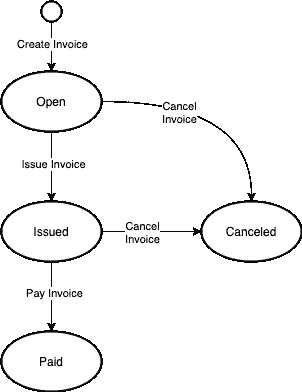
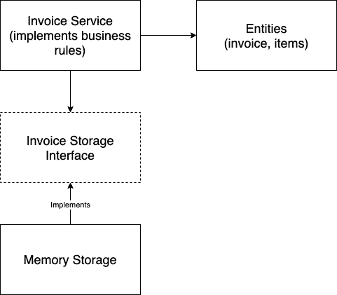
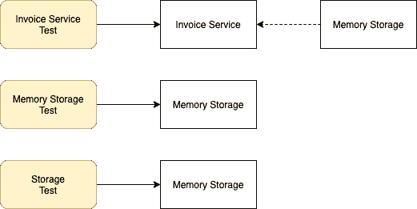
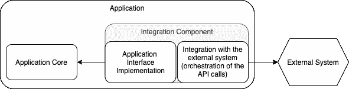
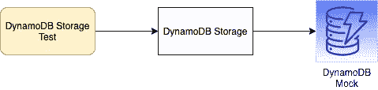
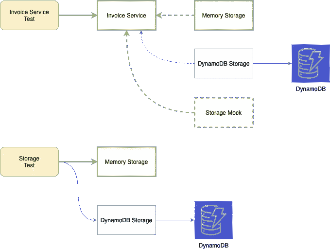
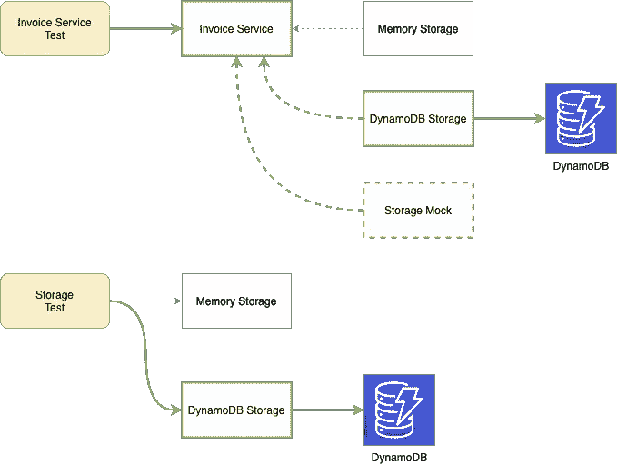

# 编写与数据库交互的 Go 应用程序

> 原文：<https://itnext.io/writing-go-application-that-interacts-with-db-f32cba93ce3b?source=collection_archive---------1----------------------->


[Zan](https://unsplash.com/@zanilic?utm_source=medium&utm_medium=referral) 在 [Unsplash](https://unsplash.com?utm_source=medium&utm_medium=referral) 上的照片

在本文中，我想分享我编写和测试与数据库交互的代码的方法。为了支持示例的编写，我将创建一个基本的发票管理应用程序。为简单起见，应用程序数据库中存储的所有数据都由一个用户拥有和维护。

为了提高可读性，提供的代码示例很简单。它们是对文本的补充，并侧重于特定的应用功能。在许多情况下，为了保持代码简短，有意省略了错误处理。完整的应用程序源代码可以在 [go-invoice](https://github.com/antklim/go-invoice) 库中找到。

# 用例

在编写解决方案之前，我需要定义应用程序的业务规则和操作。发票管理应用程序允许用户创建、更新、开具、支付和取消发票。发票记录包含 ID、客户名称、发行日期和商品列表。发票项目有其 ID 和产品信息，如产品名称、价格和数量。

图 1 说明了所有可能的发票状态和转换(分别是图的节点和边)。



图一。发票状态

创建发票后，可以进行以下更新:

*   用户可以更新客户名称
*   用户可以添加和删除发票项目(不支持项目更新)

只能查看已开具、已支付和已取消的发票(不允许更新)。下面的列表说明了发票应用程序的功能。

发票应用功能

由于应用程序功能依赖于存储，因此无论实施如何，都需要有一致的存储行为。以下是存储实施要求的列表。

存储实施要求

## 数据存储在哪里？

该应用程序处理发票数据，如发票和发票项目。数据的结构相对扁平。存储数据有很多选择——任何关系数据库或文档数据库都适合应用程序数据模型。然而，在初始阶段将重点放在开发应用程序功能而不是选择数据库上是至关重要的。这可以通过使用最简单、最快速的数据存储——应用程序运行时内存来实现。

从内存存储选择开始应用程序开发有多种好处。第一个好处是开发的简单性和速度。内存存储实现很简单。它是具有查找和写入功能的业务实体的集合；不需要数据库连接或数据结构映射。对于大多数用例来说，应用程序的功能是不需要模拟就可以测试的。它允许开发人员通过定期的展示来关注应用程序的特性实现和与产品所有者的交互。这个过程提供了对产品更好的理解，并开启了关于功能需求的对话——保留、更新、添加或删除什么特性。

另一个好处是更好的代码分离。一旦选择了数据库，业务逻辑代码很可能会与数据访问代码结合在一起。你见过嵌入业务逻辑代码的原始 SQL 查询吗？我做到了。这样的代码很难测试——通常，唯一的方法是启动一个 DB 实例，创建一个模式，并编写数据设备。当需要时，更新或切换到另一个数据库就更难了。

当然，凡事都有取舍。仅仅将应用程序数据保存在内存中是不够的。需要实施备份和恢复机制，以便在应用程序运行之间保存数据。应用程序数据应该持久化，以防止应用程序崩溃时数据丢失。虽然可以使用持久性机制来扩展内存存储，但是最好使用现有的数据库之一。

考虑到上面的论点，我从内存存储开始实现。

# 履行

首先，我将处理创建和查看操作。这些操作是应用程序的基础——用户在执行任何其他操作之前需要存储和查看发票的功能。从技术角度来说，这些操作的实现是应用的核心。其余的函数都基于它们。

## 第一步。实施创建和查看发票操作

我从编写创建发票操作的测试开始。

例 1。创建发票测试

为了通过测试，我定义了实现应用程序业务逻辑的发票实体和服务。

例 2。发票实体

例 3。发票服务—创建发票操作

在我确保测试通过之后，我可以继续查看发票实现。与上一步类似，我首先编写一个测试，然后编写代码实现。

例 4。查看发票测试

例 5。发票服务—查看发票操作

到目前为止，已经实现了两个服务操作。但是在继续之前，我需要重构代码。正如您在*示例 3* 和*示例 5*中看到的，两种方法都使用锁和映射操作复制数据访问逻辑。如果保持原样，剩余操作的实现将增加更多的代码重复。也有可能由于一个错误而遗漏了存储实现的一些关键部分，比如锁定。

因此，数据访问层和业务逻辑层应该分离。这种分离为数据库选择提供了灵活性—同一个应用程序可以使用不同的数据库来持久存储数据。它还提高了可测试性——两层都是独立可测试的。

## 第二步。将业务逻辑与数据访问分开

在这个阶段，存储接口应该支持两种操作——发票存储和查找。定义接口后，我更新服务代码——用存储接口方法替换直接数据访问代码。

例 6。发票服务器重构—使用存储界面访问数据

之后，我将数据访问逻辑移动到它的包中。

例 7。内存存储实现发票存储接口

最后，我更新了测试。invoice service bootstrap 流程现在稍微复杂一点——应该将一个存储实例注入到服务中。我在 *testSetup* 方法中包含了自举逻辑。

例 8。发票服务测试重组

*图 2* 展示了业务逻辑和数据访问层分离后的应用程序组件。



图二。发票应用组件

## 第三步。添加存储测试

之前，与应用程序功能定义一起，陈述了存储实施要求。在内存存储实现之后，是时候测试存储需求了。

例 9。发票存储要求测试

## 第四步。添加测试 API

在计划执行以下操作—更新客户名称的过程中，我注意到了一个重要的细节。创建和查看发票操作不依赖于发票状态。对于其余的操作，发票的状态决定了是否允许该操作。例如，只能更新处于*未结*状态的发票。因此，为了测试所有场景，我需要一种方法来创建和存储任意状态的发票。这个功能不是用例的一部分，测试是唯一的消费者。

因此，我创建了一个可以将应用程序数据设置为特定状态的测试 API。这带来了以下好处:

*   测试场景与存储实施无关，数据访问细节隐藏在 API 背后。
*   存储操作不需要模拟。
*   您不需要调用服务操作链来设置特定状态的发票。结果，测试场景没有与业务逻辑实现细节相结合。
*   减少样板代码。典型的测试场景如下——准备特定状态的发票，运行操作，断言结果。

例 10。测试 API 以任意状态创建和存储发票

可选参数允许在存储发票之前更新任何发票的字段。

## 第五步。实施剩余的服务操作

准备好测试 API 之后，我继续实现剩余的服务操作。

例 11。在更新客户测试中使用测试 API

以下是实体和服务代码的更改，以支持更新发票客户。

例 12。发票实体—处理客户名称更新的变更

例 13。发票服务-更新客户名称操作

使用类似的方法——编写测试，实现服务和实体功能，重构——我实现了剩余的发票服务功能。

以下是已完成步骤的摘要:

*   实现了创建和查看发票操作。
*   重构——创建存储接口，实现内存数据存储。
*   实现了一个测试 API，在测试其余操作之前将发票设置为所需状态。
*   已实施剩余操作。
*   测试 API 随着需求的增加而扩展。

*图 3* 展示了为验证发票应用功能而开发的测试组。



图 3。发票应用测试

*发票服务测试*保证服务的功能需求得到满足。*存储测试*验证是否满足存储实施要求。并且*存储器存储测试*验证存储器存储实现的细节。

现在是时候将发票应用程序与持久存储集成在一起了。如前所述，任何关系数据库或文档数据库都适合应用程序数据模型。作为一个实际的例子，我将与 AWS DynamoDB 集成。

## 第六步。添加 DynamoDB 存储

在我之前的[文章](https://antklim.medium.com/dynamodb-expressions-and-go-b8230c253e1f)中，我描述了使用 DynamoDB 的特性。在本文中，我主要关注与 DynamoDB 集成的细节。

DynamoDB 集成组件应该完成两大类任务:

*   与核心应用程序集成—该组件实现了一个存储接口
*   与 DynamoDB API 集成，以访问 DynamoDB 中存储的数据



图 4。集成组件

*例 14* 显示最新版本的存储接口。

实施例 14。存储接口

如您所见，接口方法接受或返回发票的实例。在 DynamoDB 中存储发票实体需要额外的字段标记/注释。这些标签有助于将任意数据实体与 AWS SDK 中定义的 DynamoDB 特定的实体进行映射。

尽管向发票字段添加标签是最简单的解决方案，但我更喜欢定义一组单独的实体。它使应用程序的核心包保持干净，并且独立于实现细节。创建不同实体数据结构的另一个论点是，这些结构之间的字段集可以不同。

**第 6.1 步。添加 DynamoDB 实体和编组器**

我在 DynamoDB 存储包中声明了发票和商品数据结构。

实施例 15。DynamoDB 发票实体

然后，应在 DynamoDB 存储包中实现以下转换:

*   核心发票实体的入库发票
*   存储发票项目至/自旧发票项目
*   原始 DynamoDB 输出到存储发票实体

Storage invoice 和 invoice item 是 DynamoDB 存储包中定义的数据结构，分别是 *dInvoice* 和 *dItem、*，例 15 中的。下面的示例显示了封送拆收器的实现摘要。

实施例 16。DynamoDB 实体编组器

**步骤 6.2 准备 DynamoDB 集成**

DynamoDB API 非常广泛，提供了几十种方法。对于用例，我只需要 *GetItem* 和 *PutItem* 方法。因此，我将 DynamoDB 客户端接口仅限于这两种方法。*实施例 17* 为 DynamoDB 存储组件支架。

实施例 17。Dynamo —DynamoDB 集成组件

有两种测试组件的方法，它们的操作会产生副作用。第一种方法是测量组件动作前后的状态——这是之前采用的方法。第二种方法是验证组件生成的外部系统的输入。这种方法需要使用各种[测试替身](https://martinfowler.com/bliki/TestDouble.html)——模仿、间谍、树桩。

不可否认，与真正的 DynamoDB 的集成需要测试，我是在更高的服务级别上做的。为了独立测试 DynamoDB 存储组件，我遵循第二种方法——验证外部 API 的输入并使用模拟。在这种情况下，在 Docker 中启动本地 DynamoDB 或连接到 AWS DynamoDB 是复杂、昂贵和耗时的。此外，当使用外部系统时，错误案例是有效的场景，应该进行测试。在 mock 中模拟错误更容易也更快。下图说明了 DynamoDB 存储实现测试套件的组件。



图 5。DynamoDB 存储实现测试组件

需要使用模拟也是减少 API 客户端接口的一个原因。当没有减少时，所有 API 的方法都应该被模仿以满足一个接口。例如，*例 17* 中*发电机*结构的*客户*字段将被定义为*发电机接口。DynamoDBAPI，*那么*例 18，*中的 API mock 将需要实现所有的 *dynamodbiface。DynamoDBAPI* 方法。因为 API 被简化为只有两个方法，所以模拟是紧凑和简单的。

实施例 18。迪纳摩客户端 API 模拟

**步骤 6.3 存储操作实现**

最后，在定义了实体和 DynamoDB API 客户端接口之后，我实现了存储方法。*例 19* 展示了*更新发票*的实现细节*。*

实施例 19。DynamoDB 存储实现部分

两种方法， *AddInvoice* 和 *UpdateInvoice* ，都使用 DynamoDB API 的方法 *PutItem。它用提供的有效载荷创建或更新一个旧记录。默认情况下，主键用于标识记录是否存在。我使用条件检查来防止覆盖现有记录(当调用 *AddInvoice* 时)或创建新记录(当调用 *UpdateInvoice 时)。**

```
// AddInvoice condition
expression.Name("id").NotEqual(expression.Value(inv.ID))// UpdateInvoice condition
expression.Name("id").Equal(expression.Value(inv.ID))
```

如*例 15 所示，**din voice*结构包含两个字段— *pk* (分区键)和 *id* (发票标识键)。 [DynamoDB 使用分区键](https://docs.aws.amazon.com/amazondynamodb/latest/developerguide/HowItWorks.Partitions.html)将相关记录放在同一个存储中，由 SSD 提供支持。分区键生成的逻辑属于数据访问层。另一方面，业务逻辑层构建业务实体并验证它们的正确性。它知道实体的结构并控制它们的唯一性。业务逻辑层不知道也不应该知道任何关于 DynamoDB 表分区或主键的信息。这就是为什么条件表达式包含发票 *id* 而不是 *pk* 的原因。

*示例 20* 显示了在测试 DynamoDB 存储实现的 *UpdateInvoice* 方法时 mock 的用法。该测试不能保证数据已经成功存储在 DynamoDB 中。该测试的主要目的是验证存储组件的行为，即 DynamoDB API 调用了多少次，以及向 API 发送了什么。

例 20。发电机存储实施—更新发票测试

数据完整性已经在服务测试中测试过了，稍后我会再回到服务测试中。

## 第七步。使用存储模拟测试存储错误场景

如您所见，为了与 DynamoDB 集成，我修改了一个存储接口，向输出参数添加了一个错误。DynamoDB 实现和任何其他外部存储实现增加了一组需要测试的新场景——错误情况场景。

同样，当我使用 DynamoDB 模拟来模拟错误情况场景时，我使用一个更高级的模拟——存储接口模拟来验证错误情况场景中的服务行为。以下示例说明了存储接口存根及其在测试中的使用。

例 21。存储接口存根

例 22。使用存储存根测试错误案例场景

## 第八步。使用本地 DynamoDB 进行测试

最后，我到了测试发票应用程序的最后一步。目前，我有以下测试:

*   服务逻辑测试—使用内存存储进行测试
*   记忆存储测试
*   存储要求测试—使用内存存储进行测试
*   DynamoDB 存储测试—通过模拟测试
*   服务中的存储级错误处理—通过模拟测试

我还没有检查的一件事是与 DynamoDB 的集成。两组测试已经完成了一半:服务逻辑和存储需求测试。他们只测试了内存存储——与 DynamoDB 的集成尚未得到验证。我要去修理它。

现在大多数服务都有 docker 图片。我将启动一个 DynamoDB 的本地实例，并将服务和存储测试配置为使用本地 DynamoDB 作为存储。[在这里](https://docs.aws.amazon.com/amazondynamodb/latest/developerguide/DynamoDBLocal.DownloadingAndRunning.html)你可以找到如何启动本地 DynamoDB 的指南。

例 23。docker-为本地 DynamoDB 编写

第一个服务— *dynamodb-local* —启动本地 DnamoDB。我使用 *inMemory* 选项来避免使用任何数据库文件。我不想在测试运行之间保存任何数据。我更喜欢使用测试 API 将数据设置为特定的状态，而不是管理数据夹具。

第二个服务—*dynamodb-local-create-table*—一直等到本地 dynamo db 启动并运行，然后创建一个*发票*表。

实施例 24。创建表格脚本

我使用 *AWS_ENDPOINT_URL* 环境变量在 DynamoDB 实例之间切换脚本目标——本地和远程。

**步骤 8.1。在存储实施之间切换**

我扩展了 *testSetup* 来支持额外的存储实现。因为服务和存储接口的测试是不同的，所以我将 *testSetup* 分成了更小的块。存储设置选择存储实现并用于存储测试。 *serviceSetup* 也使用 *storageSetup* 并准备维修测试所需的组件。此外，我添加了一个存储工厂来隐藏工厂接口后面的存储初始化过程。

例 25。更新的测试助手

在环境变量的帮助下，我可以在不更新测试场景的情况下为测试设置特定的存储。默认情况下，测试使用内存存储运行。



图 6。默认测试设置—使用内存存储

如果我想测试 DynamoDB 存储，我也可以这样做。我需要做的就是启动 docker-compose，并使用配置好的环境变量运行测试。

实施例 26。启动 docker-编写并运行测试

*瞧，*现在测试正在 DynamoDB 存储上运行。



图 7。更新测试设置—使用 DynamoDB 存储

技术说明。AWS SDK 使用 *AWS_PROFILE* 来访问创建 AWS 会话所需的用户凭证。我使用 [aws 配置](https://docs.aws.amazon.com/cli/latest/userguide/cli-configure-files.html)来设置*本地*配置文件，你可以在*示例 26* 中看到。以下是*本地*配置文件的配置方式:

实施例 27。本地配置文件配置

另一个技术说明。将访问键 id 和秘密访问键值与 docker-compose 文件中用于创建 DynamoDB 表的值相匹配是至关重要的。否则，可能会出现 AWS 会话初始化错误。

# 交互式 CLI

最后，我将一个发票应用程序包装到一个交互式 CLI 中。它支持多种数据存储:默认的内存和 DynamoDB(本地的和基于 AWS 的)。

实施例 28。使用不同存储运行发票应用程序

# 结果

应用程序已完成。在应用程序设计/开发过程中，需要回答以下问题:

*   应用程序的不同层是如何分离的。
*   每一层的职责是什么？
*   如何测试应用程序组件(单独测试和与其他组件一起测试)。
*   如何测试整个应用程序及其所有依赖项。

以下是重要发展阶段的回顾。

```
* Use case definition
* Service implementation
  * Storage interface definition
  * Memory storage implementation
  * Added test API to provide the ability to set set invoices state
  * Service functionality implementation with memory storage
* DynamoDB integration
  * DynamoDB implementation of storage interface
  * Integration with DynamoDB API
* Application testing with various storages - memory, DynamoDB
* Build application CLI
```

# 吸取的教训

## 内存存储优于存储接口模拟

根据我在各种项目中的经验，我可以说创建和维护一个简单的内存数据存储比模拟维护要小得多。最初，整个应用程序逻辑是用内存存储实现和测试的。它允许在多个级别上测试应用程序——单元和集成测试级别。

针对模拟的相反测试会产生一种虚假的安全感。模拟组件的实际行为可能会有所不同。因此，需要对真实组件进行额外的测试。

模拟将测试与被测组件的实现细节结合起来。结果，测试变得脆弱。不改变组件行为的实现修改会破坏测试。

当模拟被误用时，它会使项目维护过程变得复杂——模拟通常在大小和数量上都在增长。

大多数时候，错误的模拟使用的主要原因是测试已经实现的代码。通常，没有考虑测试而编写的代码界面很差。测试它的唯一方法是通过模拟。这就是测试与实现细节相结合的地方——模拟行为应该在每个相关的测试中定义。

但是嘲笑并不总是坏事。模拟在软件测试中占有一席之地。

## 嘲笑你不容易复制的东西

错误案例场景是应用程序逻辑的一部分，应该与快乐路径场景一起测试。例如，有许多应用程序应该优雅地处理各种连接错误。但是很难重现这样的错误。在这种情况下，存根是一个很好的选择。

## 模仿外部服务，但添加集成测试

习惯上，单元测试不应该与外部服务有任何连接。在这种情况下，模仿是好的。例如，为了测试具体的数据访问级别，使用了数据库客户机模拟。这种测试擅长于验证什么进入了客户端 API 以及它被调用了多少次。但是不能保证实际的数据库客户机行为相同(例如，由于不同的版本)。因此，需要进行集成测试。

感谢阅读。请👏如果你喜欢这篇文章。并在评论中分享你喜欢的与 DB 集成的方式。