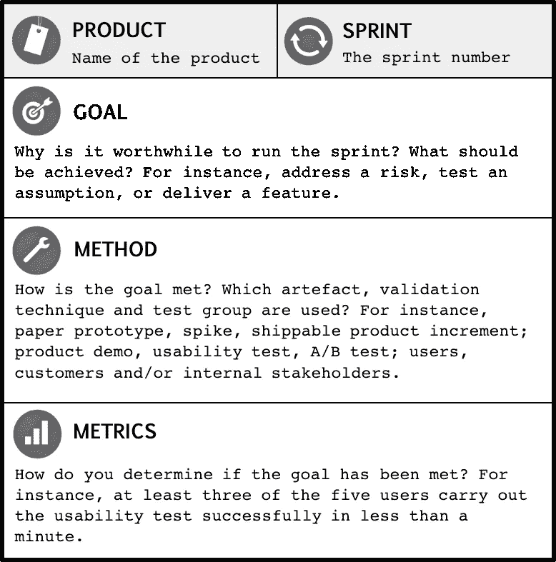

# 写好冲刺目标

> 原文：<https://itnext.io/writing-good-sprint-goals-3b92f955078f?source=collection_archive---------6----------------------->

***免责声明:*** *本文内容是从下面链接的参考资料和我的个人经历混合而成。这并不意味着是绝对的真理。它对我工作过的小队起了作用。考虑到我们的情况，这显然有失偏颇。期待阅读您对哪些方法对您有效的评论，以及是否有什么问题！*

# 冲刺目标

冲刺目标描述了冲刺的目的。它提供了一个共同的目标，并陈述了为什么进行 sprint 是值得的。示例 sprint 目标是“了解注册特性的正确用户交互”和“使报告特性对用户可用”。根据经验，团队应该带着**一个共同的目标**工作。这确保了每个人都朝着同一个方向前进。

冲刺目标有助于**将注意力**放在我们想要实现的目标上，并允许灵活地协商工作以实现该目标。

# 冲刺目标优势

1.  **支持优先级。**共享的 sprint 目标有助于区分优先次序:这使得确定下一个周期应该处理哪些故事变得更加容易。
2.  **集中注意力，促进团队合作。**冲刺目标创造焦点，促进团队合作，并为有效的冲刺规划会议提供基础。在 Scrum 中，团队不会致力于单独的故事；他们致力于冲刺目标。
3.  **帮助获得相关反馈。**如果目标是评估用户体验，那么用户代表应该参加 sprint 评审会议。但是如果目标是通过评估不同的对象关系映射工具来降低技术风险，那么邀请另一个团队中有经验的开发人员或架构师来讨论解决方案可能更合适。
4.  **更容易分析反馈。**制定 sprint 目标有助于分析获得的反馈。如果团队在同一个 sprint 中处理几个不相关的故事，那么将反馈与正确的用户故事联系起来可能会很棘手
5.  **支持利益相关方沟通。**使用 sprint 目标有助于你向利益相关者传达 sprint 的目标。这允许他们理解 sprint 是关于什么的，并决定他们是否应该参加下一次 sprint 回顾会议。

# 创建冲刺目标时最常见的问题

1.  冲刺目标**太大**或者**太多**。这会导致注意力不集中。
2.  冲刺目标**模糊。当团队发现很难就是否实现了冲刺目标达成一致时，就会出现这种情况。解决这个的小技巧:
    让冲刺目标可衡量。在冲刺计划期间，询问:“我们如何知道我们是否已经实现了冲刺目标”**
3.  **在冲刺过程中没有关注**冲刺目标。提示:
    让它可见。
    用单口相声的方式来说。
4.  这个冲刺目标**并不觉得有意义。**冲刺目标应该提供目的。人们想做有意义的工作。提示:
    尽可能以业务或用户为中心。使 it 专注于测试业务假设并获得反馈。使其专注于**降低风险**。

# 写下伟大的冲刺目标

像任何运营目标一样，冲刺目标应该是 **SMART:具体、可衡量、可实现、相关且有时限**。由于 sprint 是有时间限制的迭代，所以每个 sprint 目标自然都有时间限制:必须在 sprint 结束时达到。

早期 sprint 的一个示例目标是了解更多关于期望的用户体验(合意性方面)、软件架构(可行性)或定价模型(可行性)。为了选择正确的目标，**选择如果不立即解决可能对你伤害最大的风险**。

采用一个具体的、可衡量的冲刺目标可以让你决定成功。例如，不要只说“创建一个原型”作为你的冲刺目标。**明确**类型及其用途。相反，你可以说:“创建一个用户注册功能的纸质原型来测试我们的用户交互想法。”

Scrum 中决定成功的默认机制是分析涉众的反馈。Scrum 建议在 sprint 评审会议上通过展示产品增量来获得反馈。

# 如何选择一个好的冲刺目标？

这个模板是一个很好的人工制品，可以帮助团队专注于哪些方面使一个 sprint 目标成为一个好目标。我们的想法是填充模板中的所有字段。

# 参考

 [## 产品负责人的有效冲刺目标指南

### 带着 sprint 目标工作是一种强大的敏捷实践。这篇文章帮助你理解什么是短跑目标，为什么他们…

www.romanpichler.com](https://www.romanpichler.com/blog/effective-sprint-goals/)  [## 行动起来:创造好的冲刺目标——敏捷短袜

### 在之前一篇描述创建完成增量的挑战的文章中，我认为缺乏清晰的冲刺目标是一个…

www.agilesocks.com](https://www.agilesocks.com/creating-good-sprint-goals/)  [## 冲刺目标模板

### 与冲刺目标一起工作是一种强有力的实践。但是许多产品所有者和团队没有利用 sprint 目标或…

www.romanpichler.com](https://www.romanpichler.com/blog/sprint-goal-template/)