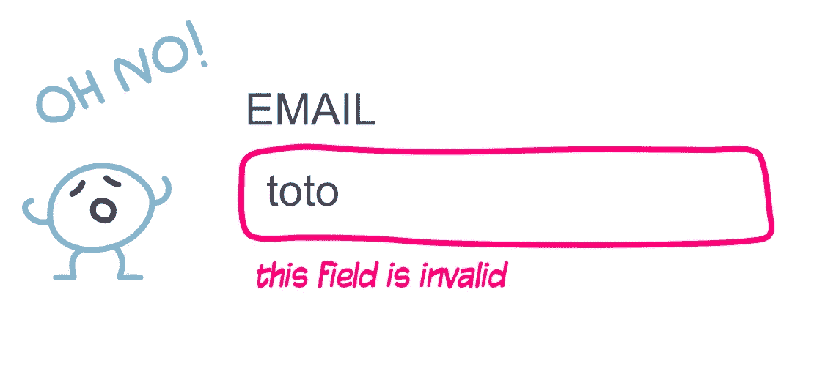
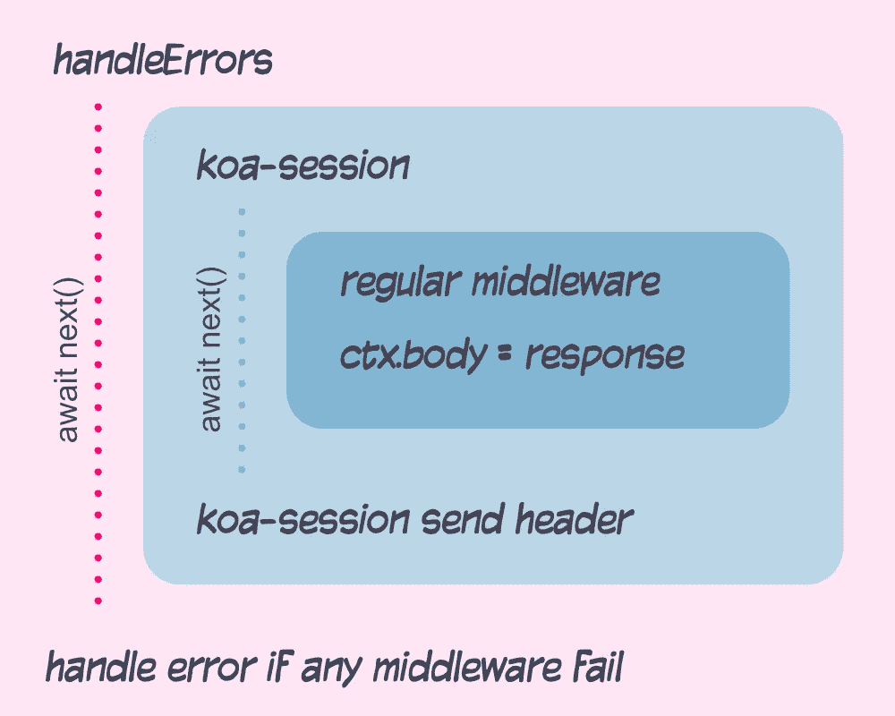
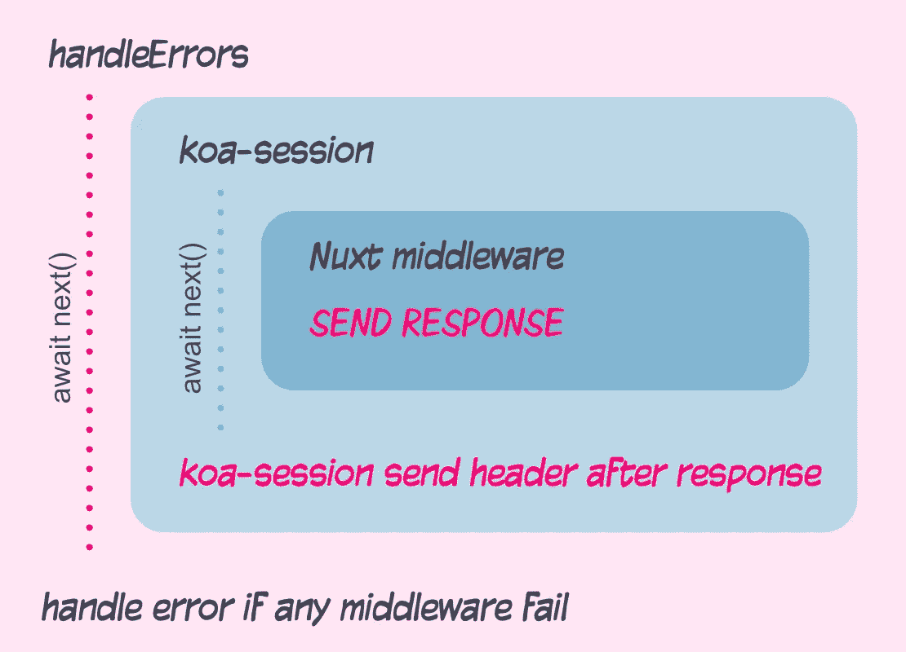

# 编写 koa/nuxt 应用程序

> 原文：<https://itnext.io/writing-koa-nuxt-applications-a2d6b73ecde5?source=collection_archive---------3----------------------->

您已经准备好创建新的应用程序了。你以 [Vue 2](https://vuejs.org/) 作为你的框架

但是您希望您的应用程序是:

所以你决定用[Nuxt 2](https://nuxtjs.org/)&[Koa 2](https://koajs.com/)
制作一个[通用 Web 应用程序](https://hiswe.github.io/2018/12-vue-with-nuxt/)，它将:

*   紧固第一次渲染
*   能够在客户端不激活 JS 的情况下运行

**备注:**

*   你需要熟悉 Koa/Nuxt。
*   要知道 Nuxt 和 Koa 都使用了`context (ctx)` & `middleware`的概念。在下面的帖子中，我已经尽我所能的将它们区分开来，但是如果你感到困惑，请仔细阅读，并尝试将它们分类😅
*   你可以在 [koa-nuxt-example 库](https://github.com/Hiswe/koa-nuxt-example)中找到我接下来要说的工作示例

# 为表达而塑造

因为 [express.js](https://expressjs.com/) 是最常用的 Node.js 服务器框架，大部分 UWA 框架`render function`都是为它塑造的。

这意味着在 express 中， [Nuxt 集成是开箱即用的](https://github.com/nuxt/create-nuxt-app/blob/master/template/server/index-express.js)。你只需要像任何快速中间件一样调用它:

既然我们想使用 Koa，我们将需要制作我们自己的中间件。
不需要考虑太多关于集成的问题，因为这个问题已经解决了，但是 [Nuxt 社区](https://github.com/nuxt/create-nuxt-app/blob/master/template/server/index-koa.js)

如果你只对服务器渲染感兴趣的话，这将会很完美。

# 搬运岗位

假设我们希望能够发布一个表单。

*   首先我们将安装/使用 [koa-router](https://www.npmjs.com/package/koa-router) 和 [koa-body](https://www.npmjs.com/package/koa-body)
*   然后有了这些，我们将能够处理我们的`POST`行动
*   我们可能想在它里面做一个数据库调用(例子中的`doSomethingAsync`)

这还不错:

*   我们现在可以发布一些数据
*   重定向到`/`，Nuxt 将处理标记

JSON 响应可以稍后由添加

*   正在检查请求是什么`Content-Type`头(`ctx.is('application/json')`
*   不要重定向
*   发回适当的响应

# 处理错误

我们应该写一个错误中间件。它将确保如果出现问题，我们的应用程序不会崩溃。

为了捕捉所有的东西，它将是我们的第一个中间件。

所以现在如果有任何东西抛出(DB 调用，JSON 解析…)，我们将呈现一个打印了错误的页面。

# 用 Nuxt 处理服务器数据

我们还应该将一些数据验证发送回用户表单。

为了在 Nuxt 应用程序中显示任何验证，我们需要:

*   在我们的发布路由和重定向之间保存数据
*   将这些数据传递给 Nuxt 应用程序
*   用它做点什么

## Koa 会话

在路由之间处理数据的最常见方式是使用会话。
为此，我们将使用 [koa-session](https://www.npmjs.com/package/koa-session) 。

[安装指南](https://www.npmjs.com/package/koa-session#example)非常简单明了。
这将添加一个`ctx.session`对象，我们可以在其中传递任何类型的信息。

下面是要遵循的不同步骤:

*   验证我们的表单
*   将验证添加到会话
*   将其传递给 Nuxt
    ——因为 Nuxt 不使用 Koa `ctx`而是使用`req` & `res`，将我们的会话信息复制到那些对象中。
    –这将在呈现 nuxt 的中间件之前的 Koa 中间件中完成
*   通过使用
    -一个 [Nuxt 中间件](https://nuxtjs.org/guide/routing#middleware)
    -用于 Vuex 集成的[nuxtServerInit](https://nuxtjs.org/guide/vuex-store#the-nuxtserverinit-action)
    将它集成到 Nuxt 应用程序中。
*   …既然现在都在 Vue 领域，就用我们的 Vue 组件吧。

在*商店/index.js*

就这样，我们现在有了一个更新了服务器验证的 Vuex 商店。使用 Vue 组件中的 mapState 助手来访问它。

## 无法在发送邮件头后设置它们

现在，我们在 POST 路径上设置验证，并且不再更新它。

这意味着验证将持续到用户发送一个好的表单。
因此，如果用户更改页面并返回到表单，**应用程序仍将显示最后的验证结果** *。*
这是不对的，我们应该清除曾经显示过的验证。

通过更新将我们的会话链接到 Nuxt 的 Koa 中间件，这应该很容易。

**⚠️但这没用**

你会在服务器日志中找到一个`Can't set headers after they are sent`。
问题来自于`nuxtMiddleware` &它是如何绕过常规 Koa 流的。

通常我们设置一个`ctx.body`，所有之前的中间件将继续工作。

但这就是这里发生事情

为了解决这个问题，我们需要确保在 Nuxt 中间件之前设置我们的头。

## 自动提交:错误的救援

Koa-session 允许我们使用[manually commit()方法](https://www.npmjs.com/package/koa-session#sessionmanuallycommit)手动发送报头

所以我们必须像这样重构我们的服务器代码:

这将解决我们的问题❤️
我们现在只需要记住每次更新会话时调用`manuallyCommit()`😶

# 用 Nuxt 显示所有错误

我们还有最后一件事要处理。现在我们的`handleError`中间件会让 Koa 显示错误。但是在 Nuxt 中支持一个[错误布局](https://nuxtjs.org/guide/views#error-page)，我们应该利用它。

为此，我们需要修改我们的`handleError`中间件:

*   将错误设置到`ctx.req`对象(记住，Nuxt 仍然只与`req` & `res`一起工作)
*   调用 Nuxt 来呈现我们的`handleError`中间件中的页面
*   [编写一个 Nuxt 中间件](https://nuxtjs.org/guide/routing#middleware)，通过调用 [nuxtContext.error](https://nuxtjs.org/api/context) 来呈现错误页面

对于 Nuxt 部分:

*   创建一个`middleware/handle-server-errors.js`文件
*   请参考`nuxt.config.js`

# 结论

让 Nuxt 和 Koa 一起工作并不像和 Express 一起工作那么顺利。我还是更喜欢和 Koa 一起工作，再多一点样板文件，一切都会好的。

我确信还有改进的空间，但它对我很有效。缺点主要是更多的样板代码和手动处理会话更新。

**这里的大部分代码是不必要的，如果**

*   你只是想要一些基本的服务器渲染
*   您不需要支持任何类型的会话

**支持异步代码应该很容易**

*   Koa 就是围绕这一点构建的
*   [nuxtServerInit](https://nuxtjs.org/guide/vuex-store#the-nuxtserverinit-action) 支持[异步功能](https://developer.mozilla.org/en-US/docs/Web/JavaScript/Reference/Statements/async_function)
*   同样的道理也适用于 [Nuxt 中间件](https://nuxtjs.org/guide/routing#middleware)

提醒一下，你可以在这里找到完整的例子

💚 **Nuxt💙KOA**

*最初发布于*[*hiswe . github . io*](https://hiswe.github.io/2018/13-koa-nuxt/)*。*