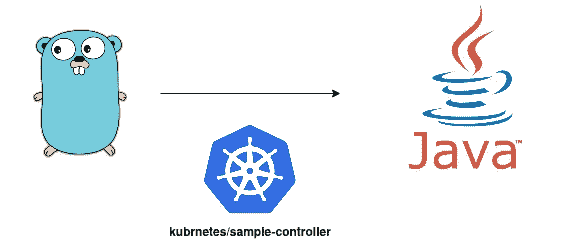
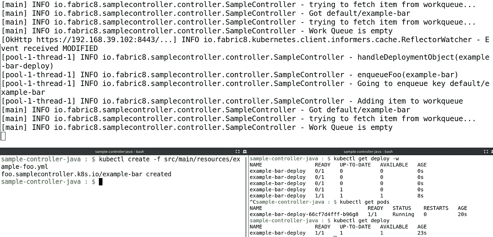
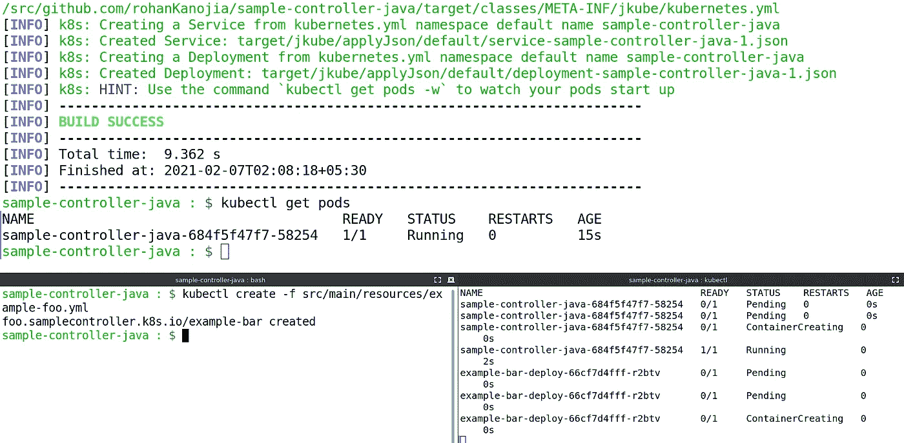

# 用 Java 编写 Kubernetes 示例控制器

> 原文：<https://itnext.io/writing-kubernetes-sample-controller-in-java-c8edc38f348f?source=collection_archive---------1----------------------->



用 Java 编写 Kubernetes 示例控制器

我最近在 kubernetes Github repository 上看到了这个示例控制器存储库。这只是实现了一个简单的控制器，用于监视 CustomResourceDefinition 中定义的名为`Foo`的 CustomResource。

[](https://github.com/kubernetes/sample-controller) [## kubernetes/样品控制器

### 这个库实现了一个简单的控制器，用于监视用 CustomResourceDefinition 定义的 Foo 资源…

github.com](https://github.com/kubernetes/sample-controller) 

我认为使用[fabric 8 Kubernetes Client](https://github.com/fabric8io/kubernetes-client)将这个用 GoLang 编写的示例移植到 Java 是一个好主意，以便了解如何用 Java 来执行这些操作:

*   如何使用 CustomResourceDefinition 注册一个类型为`Foo`的新定制资源(定制资源类型)。
*   如何创建/获取/列出新资源类型`Foo`的实例。
*   如何在处理创建/更新/删除事件的资源上设置控制器。

# 我们要建造什么？

如果你还不熟悉`kubernetes/sample-controller`；让我给你介绍一下它的功能。我们将为 CustomResource `Foo`构建一个简单的控制器，如下所示:

```
**apiVersion:** samplecontroller.k8s.io/v1alpha1
**kind:** Foo
**metadata:**
  **name:** example-bar
**spec:**
  **deploymentName:** example-bar-deploy
  **replicas:** 1
```

每当创建一个`Foo`资源时，它会在`Foo` CustomResource 的规范中创建一个子`Deployment.`,我们指定希望创建的子`Deployment`的名称以及这个`Deployment`应该拥有的副本数量。当我们删除资源`Foo`时，子资源`Deployment`也应该被删除。

每当`Foo`资源的规格发生变化，子`Deployment`就会相应地更新。

# 项目结构:

让我们看看我们的项目结构。你可以在[rohankanojia/sample-controller-Java](https://github.com/rohanKanojia/sample-controller-java)找到完整的源代码。这是它的样子:

```
**.** 
├── [pom.xml](https://github.com/rohanKanojia/sample-controller-java/blob/master/pom.xml) 
├── README.md 
└── **src** 
    ├── **main** 
    │   ├── **java** 
    │   │   └── **io** 
    │   │       └── **fabric8** 
    │   │           └── **samplecontroller** 
    │   │               ├── **api** 
    │   │               │   └── **model** 
    │   │               │       └── **v1alpha1** 
    │   │               │           ├── [Foo.java](https://github.com/rohanKanojia/sample-controller-java/blob/master/src/main/java/io/fabric8/samplecontroller/api/model/v1alpha1/Foo.java)
    │   │               │           ├── [FooSpec.java](https://github.com/rohanKanojia/sample-controller-java/blob/master/src/main/java/io/fabric8/samplecontroller/api/model/v1alpha1/FooSpec.java) 
    │   │               │           └── [FooStatus.java](https://github.com/rohanKanojia/sample-controller-java/blob/master/src/main/java/io/fabric8/samplecontroller/api/model/v1alpha1/FooStatus.java) 
    │   │               ├── **controller** 
    │   │               │   └── [SampleController.java](https://github.com/rohanKanojia/sample-controller-java/blob/master/src/main/java/io/fabric8/samplecontroller/controller/SampleController.java) 
    │   │               └── [SampleControllerMain.java](https://github.com/rohanKanojia/sample-controller-java/blob/master/src/main/java/io/fabric8/samplecontroller/SampleControllerMain.java) 
    │   └── **resources** 
    │       ├── crd.yaml 
    │       ├── cr.yaml 
    │       └── example-foo.yml 
    └── **test** 
        └── **java** 
            └── **io** 
                └── **fabric8** 
                    └── **samplecontroller** 
                        └── **controller** 
                            └── SampleControllerTest.java 

17 directories, 14 files
```

`Foo.java`、`FooList.java`、`FooSpec.java`和`FooStatus.java`是我们`Foo` CustomResource 的模型类。你唯一需要关心的类是`SampleController`，它包含了控制器的主要逻辑。`SampleControllerMain`是这个项目的驱动程序类，它初始化`KubernetesClient`并委托给`SampleController`。

让我们看一下 project 的`pom.xml`，看看我使用的依赖项和其他插件:

pom.xml for project

您可以看到我使用的唯一主要依赖项是 [Fabric8 Kubernetes 客户端](https://search.maven.org/artifact/io.fabric8/kubernetes-client/5.0.1/jar)和 slf4j-simple(用于日志记录)。其余的依赖项是 JUnit5 测试依赖项和 [Fabric8 Kubernetes 模拟服务器](https://search.maven.org/artifact/io.fabric8/kubernetes-server-mock/5.0.1/jar)，我在编写测试时用它来模拟 Kubernetes API。

我使用 Maven Assembly 插件来创建一个包含所有依赖项的可执行 jar。对于部署到 Kubernetes，我使用的是[Eclipse JKube](https://github.com/eclipse/jkube)Kubernetes Maven 插件。

# 正在为`Foo`资源编写 POJOs:

在编写控制器之前，我们需要有一个模型，控制器需要基于这个模型。在使用 Fabric8 Kubernetes 客户端时，我们需要为`Foo` CustomResource 提供 POJOs，用于 Kubernetes API 服务器请求和响应的序列化/反序列化。

让我们来看看它们，您可以看到使用 Fabric8 Kubernetes 客户端创建 CustomResource 模型是多么容易。我们正在通过注释提供`Foo`customresourcedinfinition 相关信息，如`apiGroup`、`apiVersion`、`plural`等。

*   `Foo.java`:

CustomResource 的 Foo 类

*   `FooSpec.java`:

代表 Foo CustomResource 规范的 FooSpec 类

*   `FooStatus.java`:

代表 Foo CustomResource 状态的 FooStatus 类

# 正在为应用程序编写主类以进行初始化:

我们将拥有`SampleControllerMain`，它将创建一个`KubernetesClient`的实例(为了与 Kubernetes API 交互)并为`Foo`和`Deployment`资源创建`SharedIndexInformer`实例。它还将为`Foo`资源设置专门的类型化客户端。

完成所有初始化后，它将创建一个`SampleController`类的实例，并调用`sampleController.create()`为`Foo` 或`Deployment` SharedIndexInformer 实例设置事件处理程序。然后它会调用`sampleController.run()`来启动控制器。

SampleControllerMain:我们的应用程序的驱动类

# 正在编写 SampleController 类:

现在我们来看看这个控制器的主类:`SampleController`。让我们来看一看，稍后我会解释重要的方法。它看起来是这样的:

SampleController:包含控制器逻辑的主类

好的，让我们试着理解这门课在做什么。我们有一个`BlockingQueue<String>`，它为控制器需要处理的所有项目维护一个队列。`SharedIndexInformer`方法中的事件处理程序在添加、更新或删除事件时填充该队列。

在`run()`方法中，我们检查队列是否包含一个条目。如果它包含一个项目，我们尝试获取与从队列中检索的项目相对应的`Foo`资源。如果项目似乎是有效的，它被发送到`reconcile()`方法进行处理。

`reconcile()`是这个类的核心方法，它基本上包含了这个控制器的核心逻辑。如果你浏览它，它似乎在做以下事情:

1.  检查`Deployment`名称并验证它是否为空
2.  从 Kubernetes APIServer 获取与该名称对应的`Deployment`。如果没有这样的`Deployment`；通过调用`createDeployments()`方法创建一个新的`Deployment`。
3.  检查从 Kubernetes APIServer 接收的`Deployment`是否实际上属于`Foo`资源。如果没有，抛出警告。
4.  检查收到的`Deployment`是否与`foo.getSpec().getReplicas()`中提供的副本数量相同。如果没有，更新`Deployment`以获得与`Foo`中提供的相同数量的副本
5.  一旦一切完成，更新`Foo`资源的`.status`域以反映当前状态。

其余的方法只是各种操作的辅助方法，比如创建子`Deployment`，更新`Foo`状态等等。

# 在 Kubernetes 外部运行样品控制器:

您可以用这个简单的命令编译这个项目:

```
***sample-controller-java : $*** mvn clean install
```

为了运行控制器，您需要能够访问 Kubernetes 集群。您既可以登录到您的 Kubernetes 集群，也可以使用一些本地的 Kubernetes 集群。我用的是[minikube；](https://minikube.sigs.k8s.io/docs/)我使用以下命令启动了 Kubernetes 集群:

```
***sample-controller-java : $*** minikube start 
  minikube v1.15.0 on Fedora 33 
✨  Using the kvm2 driver based on existing profile 
  Starting control plane node minikube in cluster minikube 
  Restarting existing kvm2 VM for "minikube" ... 
  Preparing Kubernetes v1.19.4 on Docker 19.03.13 ... 
  Verifying Kubernetes components... 
  Enabled addons: storage-provisioner, default-storageclass 
  Done! kubectl is now configured to use "minikube" cluster and "default" namespace by default
```

您需要将`Foo`CustomResourceDefinition(CRD)安装到您的 Kubernetes 集群中(您需要有 ClusterAdmin 特权来完成这项工作):

```
***sample-controller-java : $*** kubectl create -f src/main/resources/crd.yaml  
**Warning:** apiextensions.k8s.io/v1beta1 CustomResourceDefinition is deprecated in v1.16+, unavailable in v1.22+; 
use apiextensions.k8s.io/v1 CustomResourceDefinition 
customresourcedefinition.apiextensions.k8s.io/foos.samplecontroller.k8s.io created
```

一旦你创造了 CRD。您可以通过执行 jar 来简单地运行控制器:

```
***sample-controller-java : $*** java -jar target/sample-controller-java-1.0-SNAPSHOT-jar-with-dependencies.jar
[main] INFO io.fabric8.samplecontroller.SampleControllerMain - Using namespace : default 
[main] INFO io.fabric8.samplecontroller.SampleControllerMain - Starting Foo Controller 
[main] INFO io.fabric8.samplecontroller.controller.SampleController - Starting Foo controller 
[main] INFO io.fabric8.samplecontroller.controller.SampleController - Waiting for informer caches to sync 
[informer-controller-Foo] INFO io.fabric8.kubernetes.client.informers.cache.Controller - informer#Controller: ready to run resync and reflector runnable 
[informer-controller-Deployment] INFO io.fabric8.kubernetes.client.informers.cache.Controller - informer#Controller: ready to run resync and reflector runnable 
[informer-controller-Foo] INFO io.fabric8.kubernetes.client.informers.cache.Reflector - Started ReflectorRunnable watch for class io.fabric8.samplecontroller.api.model.v1alpha1.Foo 
[informer-controller-Deployment] INFO io.fabric8.kubernetes.client.informers.cache.Reflector - Started ReflectorRunnable watch for class io.fabric8.kubernetes.api.model.apps.Deployment 
[informer-controller-Foo] WARN io.fabric8.kubernetes.client.internal.VersionUsageUtils - The client is using resource type 'foos' with unstable version 'v1alpha1' 
[pool-1-thread-1] INFO io.fabric8.samplecontroller.controller.SampleController - handleDeploymentObject(coredns) 
[main] INFO io.fabric8.samplecontroller.controller.SampleController - trying to fetch item from workqueue... 
[main] INFO io.fabric8.samplecontroller.controller.SampleController - Work Queue is empty 
[pool-1-thread-1] ERROR io.fabric8.kubernetes.client.informers.cache.ProcessorListener - Failed invoking null event handler: null
```

尝试创建一个`Foo`资源，看看是否创建了一些部署:

```
***sample-controller-java : $*** kubectl create -f src/main/resources/ex
ample-foo.yml  
foo.samplecontroller.k8s.io/example-bar created
```

就我而言，我能够看到它。下面是我的结果截图:



创建 Foo CustomResource 的演示输出

# 将样品控制器作为 Kubernetes Pod 运行:

为了在一个容器里运行我们的控制器。我们将使用[Eclipse JKube；](https://www.eclipse.org/jkube/)它允许我们将应用程序封装到映像中，并允许根据项目的依赖关系或配置生成个性化的 Kubernetes 清单。

我们将使用`default` `ServiceAccount`从 Pod 内部与 Kubernetes API 进行交互。我们需要为`ServiceAccount`提供必要的特权。我只是用这个命令给`ServiceAccount`授予集群管理员权限:

```
***sample-controller-java : $*** kubectl create clusterrolebinding default-pod --clusterrole cluster-admin --servicea
ccount=default:default 
clusterrolebinding.rbac.authorization.k8s.io/default-pod created
```

如果您想使用自己的`ServiceAccount`，您可能需要配置 Eclipse JKube 来使用不同的`ServiceAccount`，方法是提供一个部署[资源片段](https://www.eclipse.org/jkube/docs/kubernetes-maven-plugin#_resource_fragments)，并根据您的用例为这个不同的`ServiceAccount`编写`Role` / `RoleBinding`或`ClusterRole` / `ClusterRoleBinding`。

因为，我用的是 minikube。我将在 minikube 的本地 docker 守护进程中创建一个 docker 映像。我将公开本地 docker 守护进程，并发布 Eclipse JKube 将应用程序部署到 minikube 的目标:

```
***sample-controller-java : $*** eval $(minikube -p minikube docker-env) 
***sample-controller-java : $*** mvn k8s:build k8s:resource k8s:apply
```

如果你没有使用 minikube，你可能需要做一些额外的步骤来把这个图像推送到一些外部注册表。您需要根据注册表和您在 maven 属性中的用户名来更改图像名称，如下所示:

```
**<jkube.generator.name>**
  quay.io/rohankanojia/sample-controller-java:${project.version}**</jkube.generator.name>**
```

然后使用以下目标构建映像并将其推送到注册表:

```
mvn k8s:build k8s:push
```

一旦构建并推送映像，您就可以简单地发布资源并应用目标来部署应用程序:

```
mvn k8s:resource k8s:apply
```

然后你可以用`kubectl get pods -w`检查你的控制器是否在运行。如果一切正常，它将处于运行状态。之后，您可以尝试创建一个`Foo` CustomResource 实例，就像我们在上面的外部 Kubernetes 小节中所做的那样。对我来说，一切都如预期的那样:



使用[Eclipse jbuibe](https://github.com/eclipse/jkube)将样本控制器部署到 Kubernetes

# 结论:

再次感谢你花时间阅读这篇博客！我希望我能够帮助您了解如何使用 Fabric8 Kubernetes 客户端用 Java 编写 Kubernetes 控制器。您可以在这个资源库中找到关于这个博客的所有源代码:

[](https://github.com/rohanKanojia/sample-controller-java) [## rohanKanojia/sample-controller-Java

### 这个库实现了一个简单的控制器，用于监视用 CustomResourceDefinition 定义的 Foo 资源…

github.com](https://github.com/rohanKanojia/sample-controller-java) 

## 加入我们:

如果您喜欢我们的项目，请随时通过以下渠道加入我们，成为我们不断发展的社区中的一员:

*   当某些东西不能按预期工作时，创建 [Github 问题](https://github.com/fabric8io/kubernetes-client/issues)
*   向我们发送[拉请求](https://github.com/fabric8io/kubernetes-client/pulls)以修复错误/添加增强功能
*   如有疑问，请通过我们的 [Gitter 频道](https://gitter.im/fabric8io/kubernetes-client?utm_source=badge&utm_medium=badge&utm_campaign=pr-badge&utm_content=badge)与我们聊天
*   在 [Twitter](https://twitter.com/fabric8io/) 上关注我们