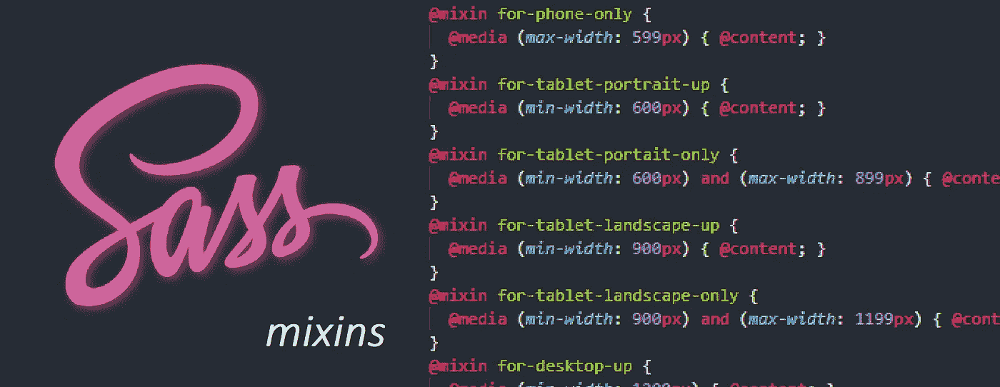

# 用 Sass Mixins 编写媒体查询

> 原文：<https://itnext.io/writing-media-queries-with-sass-mixins-3ea591ea3ea4?source=collection_archive---------0----------------------->



响应式设计在今天的网络中至关重要。越来越多的设备被用来访问我们的网站和应用程序。我们需要确保我们的所有用户在使用我们的产品时都能得到满足。媒体查询是我们可以用来帮助确保我们的布局适应不同设备的技术之一。

🤓想要了解最新的 web 开发吗？
🚀*想要将最新消息直接发送到您的收件箱吗？
🎉加入一个不断壮大的设计师&开发者社区！*

**在这里订阅我的简讯→**[**https://ease out . EO . page**](https://easeout.eo.page/)

## 媒体查询

媒体查询是一个 CSS3 模块，它允许内容呈现并适应屏幕分辨率等条件。例如:

```
@media (max-width: 599px) {
 font-size: 1rem;
}
```

这里我们将视窗尺寸设为<= 599px.

Simple enough, and of course we’ll need multiple media queries to have a fully responsive site. However, inevitably the time will come where we’ll need to edit the rules for the actual breakpoints. And searching through all of your code to change every line effected by a rule change is far from ideal. There has to be a better way!

Modern layout specifications have improved greatly over the past few years, Grid and Flexbox are responsive by default. This helps us to cut down on the amount of media queries required in our projects & makes for cleaner code. However, media queries still have a place in modern web development. And as our projects grow bigger, we need a method to manage them. Enter Sass mixins!

## Mixins

Sass mixins give us the ability to create reusable chunks of code — they reduce repetition, promote [干](https://dzone.com/articles/is-your-code-dry-or-wet)码&时的字体大小设为 1，以方便维护。将媒体查询编写为 mixins，在需要的地方注入到样式表中——这很有意义！让我们看一个例子..

**设置你的混音**

```
[@mixin](http://twitter.com/mixin) for-phone-only {
  [@media](http://twitter.com/media) (max-width: 599px) { [@content](http://twitter.com/content); }
}[@mixin](http://twitter.com/mixin) for-tablet-portrait-up {
  [@media](http://twitter.com/media) (min-width: 600px) { [@content](http://twitter.com/content); }
}[@mixin](http://twitter.com/mixin) for-tablet-landscape-up {
  [@media](http://twitter.com/media) (min-width: 900px) { [@content](http://twitter.com/content); }
}[@mixin](http://twitter.com/mixin) for-desktop-up {
  [@media](http://twitter.com/media) (min-width: 1200px) { [@content](http://twitter.com/content); }
}[@mixin](http://twitter.com/mixin) for-big-desktop-up {
  [@media](http://twitter.com/media) (min-width: 1800px) { [@content](http://twitter.com/content); }
}
```

这里我们在@mixin 块中写了 5 个常见的断点。注意@content 是 Sass 的一个指令，它允许以后插入内容。如果您不确定将这段代码放在文件夹结构中的什么位置，请参见[构建您的 Sass 项目](https://medium.com/@timothyrobards/structuring-your-sass-projects-c8d41fa55ed4)。

**使用混音**

假设我们想使用 mixin 来减小移动设备上标题文本的字体大小。我们将 mixin 作为 include 添加，就像这样:

```
.header-title {  
   font-size: 2rem;  

   @include for-phone-only {    
      font-size: 1rem; 
   }
}
```

当我们编译我们的项目时，我们的@include 将转化为:

```
@media (max-width: 599px) {
   font-size: 1rem;
}
```

现在，我们能够轻松地在整个项目中的任何地方插入我们的媒体查询。我们不需要记住断点，因为我们已经预先定义了它们。如果我们需要改变它们，我们可以简单地编辑混音。

**另一种设置混音的方法**

如果你想更进一步，你可以使用条件来设置你的混音。您只需创建一个@mixin 块并设置要传入的参数——我们用它来选择断点，如下所示:

```
[@mixin](http://twitter.com/mixin) for-size($size) {
  [@if](http://twitter.com/if) $size == phone-only {
    [@media](http://twitter.com/media) (max-width: 599px) { [@content](http://twitter.com/content); }
  } [@else](http://twitter.com/else) if $size == tablet-portrait-up {
    [@media](http://twitter.com/media) (min-width: 600px) { [@content](http://twitter.com/content); }
  } [@else](http://twitter.com/else) if $size == tablet-landscape-up {
    [@media](http://twitter.com/media) (min-width: 900px) { [@content](http://twitter.com/content); }
  } [@else](http://twitter.com/else) if $size == desktop-up {
    [@media](http://twitter.com/media) (min-width: 1200px) { [@content](http://twitter.com/content); }
  } [@else](http://twitter.com/else) if $size == big-desktop-up {
    [@media](http://twitter.com/media) (min-width: 1800px) { [@content](http://twitter.com/content); }
  }
}
```

然后以这种方式使用我们的 mixins，我们应该像这样选择它:

```
.header-title {  
   font-size: 2rem;  

   @include **for-size(phone-only)** {    
      font-size: 1rem; 
   }
}
```

如果您准备好提高您的前端技能并构建更快、更有组织和可维护的代码。查看[变得时髦:时髦实用指南](https://gum.co/getting-sassy)。

我的交互式初学者友好指南将带您了解 SASS 的所有重要信息，包括:

*   从变量、嵌套、混合到 for/each 循环等所有基础知识！
*   深入了解如何构建您的 SASS 项目
*   如何创建生产就绪的构建过程

最后，您将能够迁移现有的 CSS 代码库，并从头开始建立整个项目！


*现已上市！👉*[gum.co/getting-sassy](https://gum.co/getting-sassy)。

# 结论

就这么简单！编写媒体查询不一定是一件令人头痛的事情。通过使用 Sass mixins，我们有了一个集中的位置来管理我们的媒体查询。处理我们项目的责任变得简单多了！

我希望这篇文章对你有用！你可以[跟着我](https://medium.com/@timothyrobards)上媒。我也在[推特](https://twitter.com/easeoutco)上。欢迎在下面的评论中留下任何问题。我很乐意帮忙！

# 关于我的一点点..

嘿，我是提姆！👋我是一名开发人员、技术作家和作家。如果你想看我所有的教程，可以在我的个人博客上找到。

我目前正在构建我的[自由职业者完整指南](http://www.easeout.co/freelance)。坏消息是它还不可用！但是如果这是你可能感兴趣的东西，你可以[注册，当它可用时会通知你](https://easeout.eo.page/news)👍

感谢阅读🎉