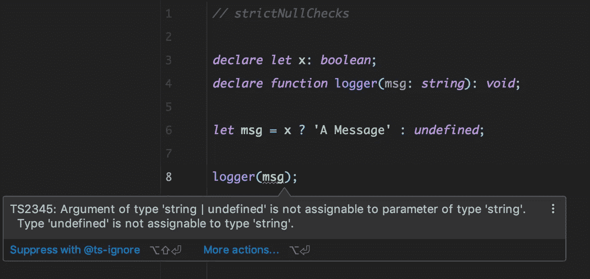
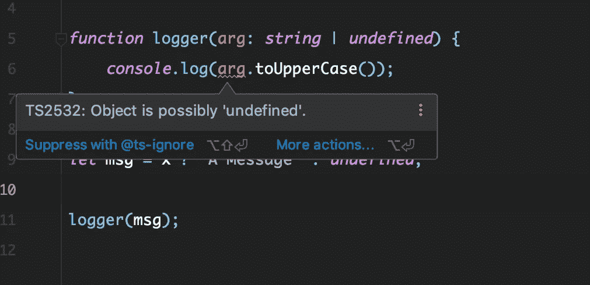
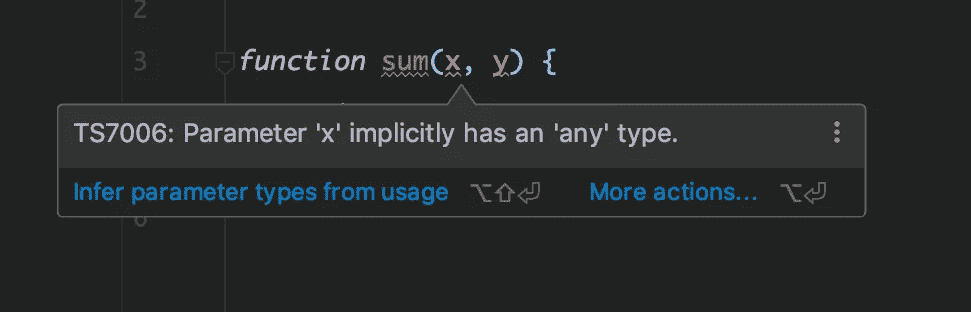
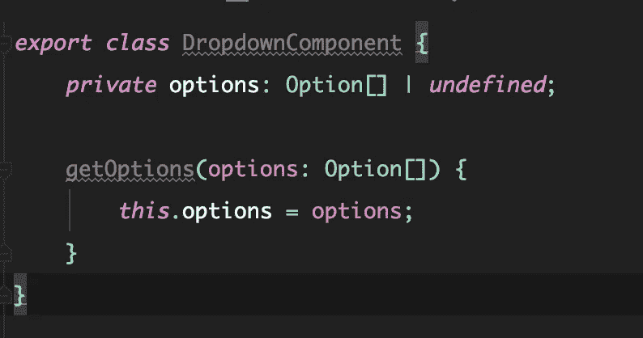
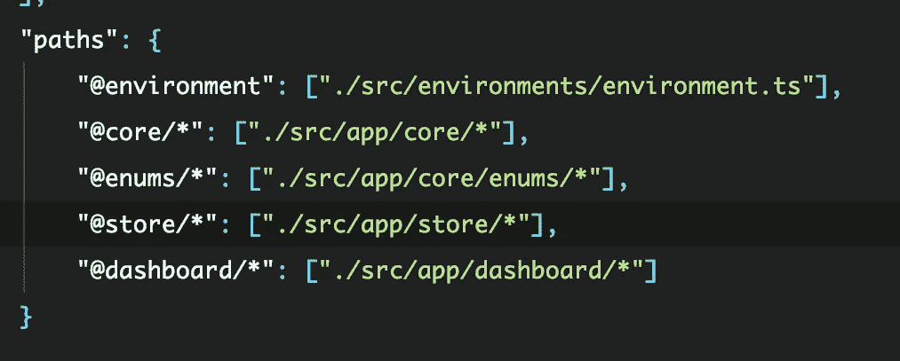
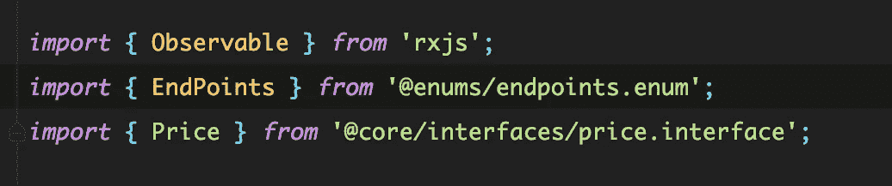
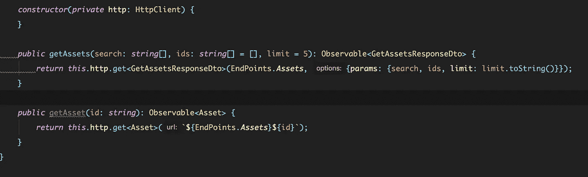
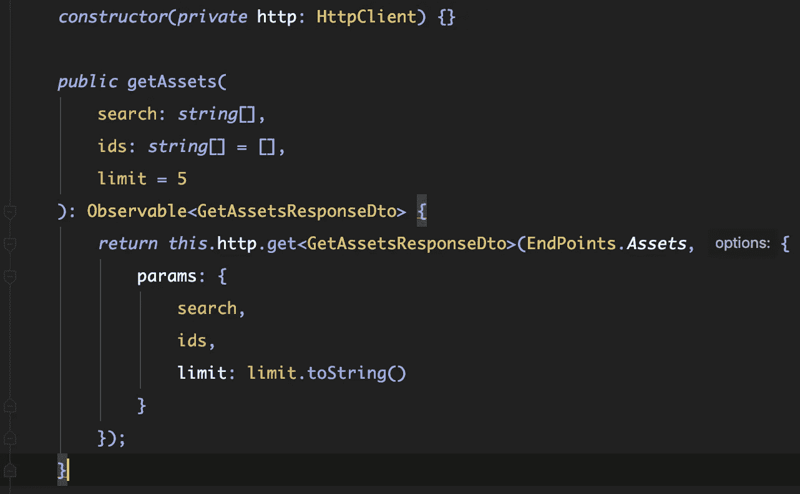
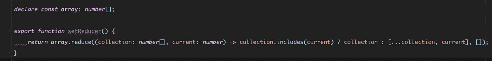
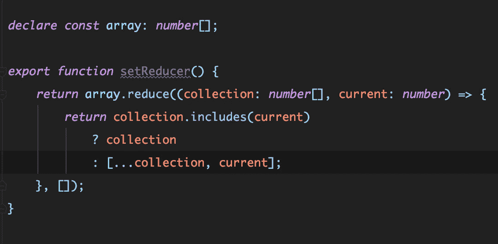

# 编写可伸缩的类型脚本

> 原文：<https://itnext.io/writing-scalable-typescript-e62e1f24a013?source=collection_archive---------1----------------------->

## 让我们详细探讨如何编写干净、安全的企业级类型脚本代码


在我们开始之前，我想给出我的“可伸缩代码”清单；在本文中，键入脚本代码:

*   它是干净的、格式良好的、可读的代码
*   它是精心设计的、一致的和可预测的
*   它很容易扩展
*   最后但并非最不重要的是，它是无 bug 的

自从引入以来，Typescript 凭借其工具和强大的静态分析帮助我们解决了 Javascript 生态系统中的一些最大问题。

然而，根据我的经验，许多团队只利用了 Typescript 提供给我们的一小部分特性。

有人认为:

*   这很费时间
*   键入我们的代码不会减少它的错误
*   初级开发者入门越来越难

我不是来证明他们是错的。因为事实是，他们可能是对的。

但是 Typescript 并不一定是可怕的，在我看来，正确使用它编写代码在很大程度上超过了上面提到的缺点。

在这篇文章中，我想讨论和探索最好的工具和实践，让**让 Typescript 值得我们花时间**。

# 使用棉绒和格式化程序

如上所述，我们希望我们的类型脚本代码是干净的、格式良好的和可读的。

在我以前的文章中的一篇[中，我写了一篇关于设置*beautiful*和 *TsLint* 的指南，以便让我们的代码在整个团队中保持一致。由于我可能重复得太多了，所以我不会太详细地解释为什么以及如何设置这些工具。](/enforce-your-team-coding-style-with-prettier-and-tslint-9faac5016ce7)

相反，我想把重点放在使用这些工具给你的团队带来的好处上。

无论你使用的是 EsLint、TsLint、Prettier 还是所有这些工具，我都不会过分强调为我们的代码库提供一致性对于一个高效团队的生产力来说是最有影响力的事情之一。

熟悉的代码库:

*   更容易阅读和使用
*   更容易理解和开始使用
*   更容易修改
*   更容易复习
*   减少团队内部的摩擦

任何在这个行业工作足够长时间的人都非常清楚最后一点有多重要。

对于一个企业来说，同事之间的摩擦和误解比糟糕的代码更糟糕，比错误更糟糕。

程序员碰巧非常关心格式。

通过将花费在代码评审、会议和电话讨论上的时间减到最少，我们使业务更有效率。

花在检查分号位置上的时间被用来检查代码的业务逻辑是否正确，或者函数的性能是否最佳。这就是代码审查应该做的。

> 快乐的团队是高效的团队。保持你的打字稿整洁。

# 使用严格的编译器选项

Typescript 最大的好处之一来自于启用它的严格模式编译器。为了启用严格模式，您只需要更改位于您的`*tsconfig.json*` *:* 中的编译器选项文件

```
"compilerOptions": {
    ... // more
    "strict": true
}
```

通过启用此选项，所有其他严格选项也将默认启用。

## 严格的空检查

严格的编译器将帮助我们捕捉运行时可能发生的错误。

在我看来,`*strictNullChecks*`是让你的编译器帮助你防止这种错误的最重要的选择。

结合正确键入，当我们试图访问可能的`null`或`undefined`值时，该选项将警告我们。

这可能是我们的应用程序中运行时错误的最常见原因之一，我们最终可以获得帮助来尽可能地避免它们。

如果您在阅读本文之前已经是一名超过 2 小时的 Javascript 开发人员，那么您可能已经在您的控制台上看到了这个消息:

> *未捕获的类型错误:无法读取未定义的属性“property”*

哦，我有。**千次**。

但是…最近没那么多了，多亏了打字稿。

那么`*strictNullChecks*`到底如何帮助我们呢？



让我们来分解一下这个例子:

*   我们有一些布尔叫做`*x*`
*   我们有一个声明的函数`*logger*`
*   我们想用一个叫做`*msg*` 的变量来调用`*logger*`，这个变量也可能是未定义的

编译器正确而温和地让我知道，如果 *logger* 接受我作为字符串输入的参数，那么我只能传递一个唯一且始终是字符串的参数。

如果我将*记录器的消息*参数输入为字符串，那么我就不能调用字符串的方法。



这些例子看起来微不足道，而且极其简单，但是在专业代码库中发现类似的情况却非常普遍。

好的一面是， *strictNullChecks* 在更多人为的场景中帮助了我们。

# 打得好，经常打

## 诚实打字

你们中的一些人可能会想,“诚实”这个词是因为我有限的英语技能还是有更多的原因。什么是诚实打字？

*   假设我们有一个后端 API，它返回一个金融产品的价格对象
*   并非所有回复都包含*要价*或*出价*

```
{
    "correlationId": "123",
    "askPrice": 1213.45,
    "bidPrice": undefined
}
```

让我们为此创建一个 Typescript 接口:

```
interface Price {
    correlationId: string;
    askPrice: number;
    bidPrice: number;
}
```

对吗？当然不是。

我听说过程序员不完全键入可空值的几个原因:

> 我很懒，编译器会抱怨
> 
> 98%的情况下它不是未定义的
> 
> “我不知道那有什么用”

我们想告诉编译器`askPrice`和`bidPrice`可能是`undefined`。因此，当我们试图访问这些属性而没有检查类型或者它们是否预先存在时，编译器会警告我们。

```
interface Price {
    correlationId: string;
    askPrice?: number;
    bidPrice?: number;
}// orinterface Price {
    correlationId: string;
    askPrice: number | undefined;
    bidPrice: number | undefined;
}
```

这意味着**编译器帮助我们避免运行时错误**当那 2%的时候发生。

诚实的类型化还有助于我们的新同事或我们库的用户完全理解应用程序的领域实体。

从字面上看，没有理由不将客户端实体完全严格地类型化为后端实体。

## 没有隐含的任何

正如我们在上一段中看到的，诚实和严格的类型在确保我们的代码以正确的方式运行方面起着重要的作用。

诚实输入与选项*无插入相关。*

让我们考虑下面的片段:



编译器不知道`x`和`y`是什么，在某些情况下，它自己也搞不清楚。

> 不要偷懒，把你的代码打出来。

有些情况下，编译器不需要我们显式添加类型就能判断出来，但是在这些情况下，您需要考虑添加类型是增加还是降低了代码的可读性。

# 干净的打字稿代码

## 使用可预测的命名约定

虽然 linters 和 formatters 在确保我们代码库的一致性方面是很好的盟友，但有些事情他们仍然无能为力:命名。

使用您团队能够理解的可预测的命名约定是确保整洁、一致和清晰的基础。

考虑下面的片段，这是我经常遇到的场景:



显然，**我不是说命名很容易**。不是的。

但是如果你遵循最基本的原则，你仍然领先于许多人。我想建议的一些事情是:

*   如果你的方法不返回任何东西，不要在它前面加上前缀 *get*
*   如果你的方法返回一些东西，不要在前面加上 *set*
*   理想情况下，不要用同样的方法设置和获取…
*   如果你的方法返回一个布尔值，考虑在它前面加上 *is* 或者*should(is thingvisible，shouldShowError，等等)。)*
*   不要用变量的类型来命名变量
*   如果您使用的 DSL 来自不同的库或框架，请遵循它们的约定。例如，如果你用 *RxJS* 声明一个可观察对象，确保在它后面加上美元符号($)

## 使用别名

老实说，没有人喜欢在我们的类型脚本代码中到处看到相对导入。使用 Typescript 中的路径别名功能是使导入更好、更短的一个好方法。

别名是如何工作的？

我们在`tsconfig.json`中定义了`paths`配置。请参见下面的示例:



然后，我可以从`@core/interfaces`访问我的所有界面，从`enums.`访问我的所有枚举



## 喜欢垂直阅读

不是每个人都同意我的观点，但我非常相信这会影响代码的整体可读性。

我喜欢将我的代码行保持在 80 到 120 列之间，这取决于我的团队对此的看法。但我倾向于将其设置为 80。

让我们来看看我的一个项目片段的不同之处。在下图中，水平长度设置为 120。



在下一个示例中，它被设置为 80。



你说哪个更容易阅读和修改？

> 💡**专业提示**:使用 beauty 为你自动换行

## 箭头功能很酷，但不要滥用它们

我喜欢箭头函数。我也经常使用它们。但我不时看到他们被虐待。

箭头函数非常适合小的表达式，但是对于更长更复杂的表达式，我宁愿创建一个函数块。

有时我会看到非常复杂的表达式，只是为了使用一个箭头函数。

让我们来看看一个长表达式和一个单行的箭头函数之间的区别:



和带有块的箭头函数:



仍然使用箭头函数并将表达式放在下一行是完全可能的，但是当我碰巧重构代码时，我觉得这会增加复杂性，例如，如果我需要在表达式中添加一个变量。

如果你用一个箭头函数来包装它，这是非常好的，确保这段代码不会很快被修改。

## 使用逻辑间距

就像在 Medium 中一样，空白虽然不太多，但会影响可读性。

我们的代码也是如此:我们希望在有意义的地方增加间距。

有些代码感觉就像一堵没有任何逻辑分隔的文本墙。这不是一个简单的任务，因为每个人对它的感觉可能不同，而且很大程度上可能取决于每个人的偏好。

我认为添加空格有两个主要原因:

*   逻辑原因，因为它涉及到我们代码背后的逻辑
*   设计原因，因为它关系到代码的易读性

我不会谈论它背后的设计原因，因为这感觉太主观了。就我个人而言，我只是试着遵循这些简单的准则:

*   逻辑分组变量声明
*   在返回语句和函数体之间保留一个空格

如果我们用两组不同的常量构建两个不同的对象，我们很可能想要在它们之间添加一个空格。例如:

```
const name = "..";
const surname = "..";
const player = { name, surname };// logical break
const teamName = "..";
const teamId = "..";
const team = { teamName, teamId };return { player, team };
```

## 分解复杂的表达式

在我们的代码中，很容易出现各种又长又复杂的表达式。

我建议将长表达式分解成变量组和独立的方法。

*   如果一个条件有 2 或 3 个以上的表达式，您应该考虑将其分解
*   如果条件包含神奇的字符串和数字，您应该考虑将表达式提取到一个方法中

让我们看一个场景，我们有两个可能未定义的对象，我相信你每天都会看到:

```
execute() {
    if (price && price.canExecute && user && user.hasPermissions && service.status === 1) {
    return priceService.execute(price);
    }
}
```

可能是我视力不好，但我看不懂那个！让我们来重构一下:

```
execute() {
    const STATUS_CODE_UP = 1;
    const isServiceDown = service.status !== STATUS_CODE_UP;if (isServiceDown) {
        return;
    }if (!price.canExecute || !user.hasPermissions) {
        return;
    }return priceService.execute(price);
}
```

好吧，我可以读这个，但现在只是觉得太长了。让我们再次重构:

```
const STATUS_CODE_UP = 1; // ideally imported from another fileget isServiceUp() {
    return service.status === STATUS_CODE_UP;
}get canExecute() {
    if (!price || !user) {
        return;
    }return price.canExecute && user.hasPermissions;
}execute() {
   const canExecute = this.isServiceUp && this.canExecute;
   return canExecute && priceService.execute(price);
}
```

那感觉好多了！

# 外卖食品

*   Lint 并格式化你的代码
*   对你的代码要严谨，启用`strict`模式
*   打得好，经常打。不要用 *any、*用泛型和*未知的*代替
*   遵循行业标准，确保您的代码尽可能具有可读性

*如果你喜欢这篇文章，请关注我的* [*Medium*](https://medium.com/@.gc) *或*[*Twitter*](https://twitter.com/home)*以获取更多关于 Angular、RxJS、Typescript 等的文章！*

*原载于*[*https://frontend . consulting*](https://frontend.consulting/writing-scalable-typescript)*。*