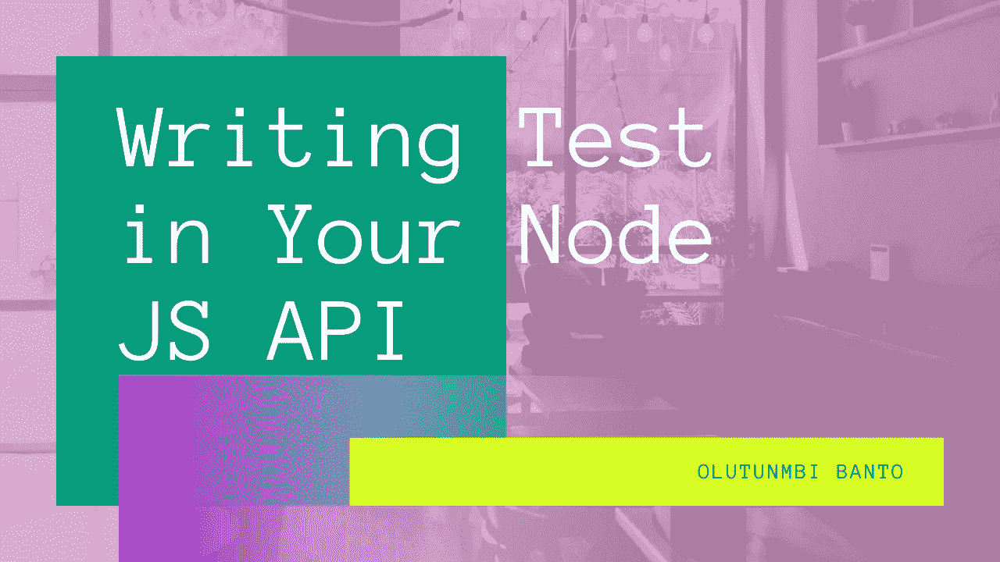
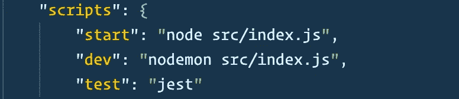
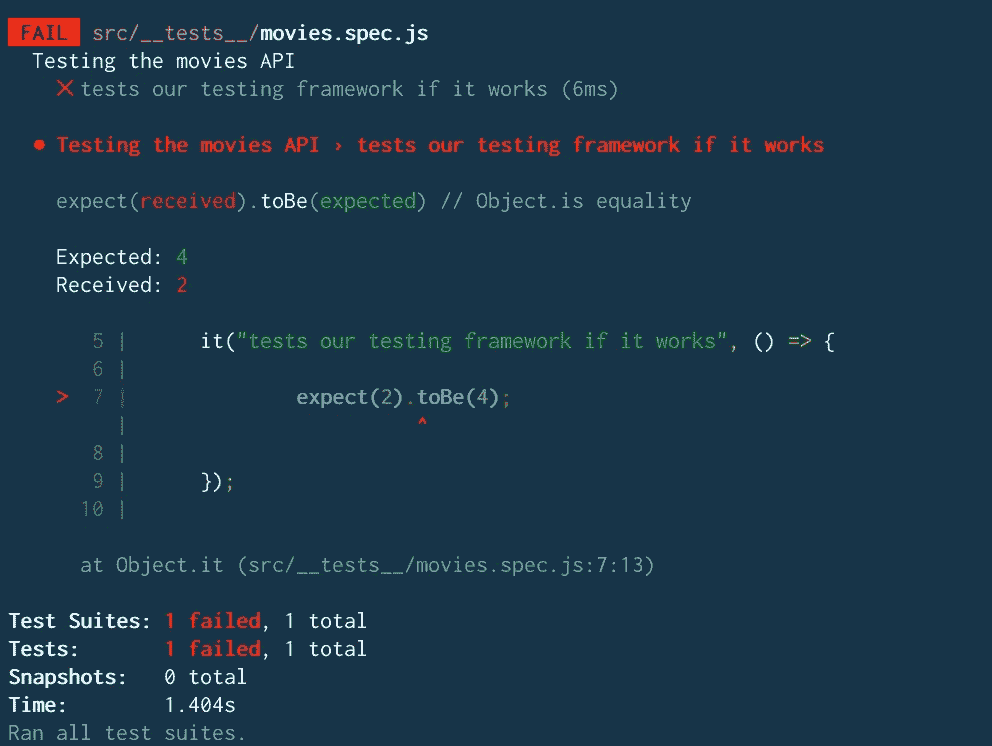
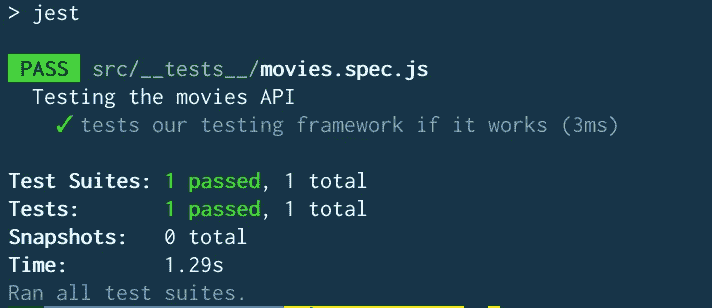
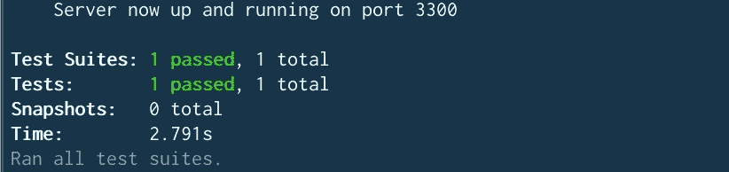
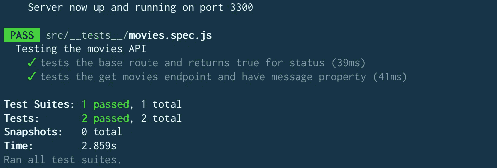
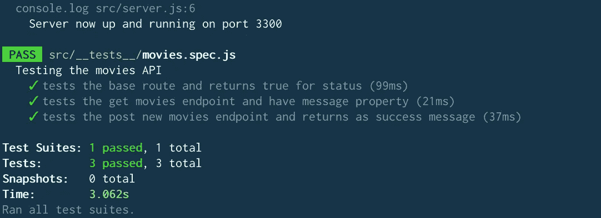

# 在节点 JS API 应用程序中编写测试

> 原文：<https://itnext.io/writing-tests-in-your-node-js-api-application-cfb5592df466?source=collection_archive---------1----------------------->



在我学习编写更好的代码的过程中，我开始学习测试，并将与您分享向您的应用程序添加测试是多么容易(在这种情况下是 Node API)。

在本文结束时，您将能够编写一个端到端的测试，它可以调用 API，测试 API 的 GET 和 POST 请求，测试您的插入和搜索功能、数据库连接以及数据是否被检索。

在本教程中，我准备了一个简单的 Node JS API，它从 MongoDB 数据库中获取记录。然后，我们将编写测试，以确保它按预期工作。

## 本教程的堆栈:

*   带有节点 JS 和 Express 的简单 API
*   MongoDB 作为数据库。我们会用 mlab.com
*   我们测试的 Jest 测试框架

作为目录，下面是我们将采取的步骤。随意跳到你想要的任何部分。您也可以从这里下载 API 源代码，并跳转到测试部分。

*   克隆启动节点 JS API
*   测试简介
*   编写您的测试
*   我们来编码吧！

## 入门指南

注意，接下来，克隆[主分支](https://github.com/hellotunmbi/movies-api/tree/master)。它包含带有`GET /movies`和`POST /movies`端点的 starter movies API，分别用于检索所有电影和发布新电影。

完整的代码可以在资源库的 [Completed](https://github.com/hellotunmbi/movies-api/tree/completed) 分支中找到。

## 测试简介

很快，让我们复习一下测试的类型。基本上有 3 种类型的测试，即:

**(一)单元测试:**顾名思义，这是对你的代码的最小可测试单元的测试。例如，测试代码中的函数或模块。您可以测试函数的返回类型或值、函数的参数或函数执行的逻辑。

**(b)集成测试:**在这里，你测试 2 个或者更多功能之间的交互。也就是说，测试两个或更多的单元如何一起工作。

**(c .)端到端测试:**这是对多个集成组合的测试。它可能包括连接到数据库并保存/检索数据的 API 的测试。这项测试包括许多集成。

## 设置测试环境

我们将使用 Jest 作为我们首选的测试框架。将 Jest，`cd`安装到 movies-api 目录并运行

`npm install jest --save-dev`

Jest 要查看我们的测试文件，必须满足以下三个条件中的任何一个:

1.  测试文件必须放在名为`__test__`的文件夹中
2.  文件名应该有`.test.js`后缀。例如`movies.test.js`或`user.test.js`
3.  文件名应该有`.spec.js`后缀。例如`movies.spec.js`或`user.spec.js`

## 编写您的测试

在`src`文件夹中，创建另一个名为`__test__`的文件夹，创建名为`movies.spec.js`的新文件

因此，您应该有这样的结构:

```
|- src
   |- __test__
      |- movies.spec.js
```

Jest 在其框架中使用了`describe`、`expect`和`it`。

`describe`让你在里面编写多个测试用例。它接受用户可读的文本和一个回调函数。

`expect`让你写下你期望测试用例做什么。

`it`告诉用户到底应该执行什么，否则称为断言。

**我们来码吧！**

首先，我们将通过编写一个失败的测试来测试我们的测试框架是否有效，然后编写一个可以通过的测试。

在您的`movies.spec.js`中，编写代码:

```
// movies.spec.jsdescribe("Testing the movies API", () => { it("tests our testing framework if it works", () => { expect(2).toBe(4); });});
```

在您的 package.json 中，将' test '的值更改为:" jest "，如下所示:



然后运行`npm run test`

上面是为了测试我们的 Jest 框架而写的。我们预计 2 等于 4，这将失败。



我们预料会失败的测试

让我们纠正它，看看会发生什么:

```
// movies.spec.jsdescribe("Testing the movies API", () => { it("tests our testing framework if it works", () => { expect(2).toBe(2); });});
```



我们通过了测试

## 测试基本 API 端点

首先我们将安装`supertest`来进行 API 调用。然后我们进行异步调用，因为我们正在进行 API 调用，可能需要几秒钟才能返回值。让我们继续编码:

运行`npm install supertest --save-dev`安装 supertest，以便可以进行呼叫。

运行`npm run test`，你将有一个通过的测试用例。在上面的例子中，我们期望响应是 OK(状态 200 ),并返回我们的身体状态“true”



值得注意的是，你使用`.toBe`来检查精确的相等，就像`expect(2 + 2).toBe(4)`

但是你使用`.toEqual`来检查一个对象的值。它对对象进行深度检查。例如

```
let info = {one: 1}
info['two'] = 2;expect(info).toEqual({one: 1, two: 2}
```

## 测试`GET /movies`端点

现在，让我们测试 GET /movies 端点，并确定它是否将返回一个数组。像这样更新你的`movies.spec.js`:

再次运行`npm run test`，看到两个断言通过:



我们的两个测试案例都通过了

## 测试 POST /movies 端点

在这一部分，我将介绍一些重要的概念:

1.  当在数据库上运行 API 测试时，不要像我们在本教程中使用的那样使用生产数据库。
2.  一个测试包含三个部分:准备、动作、断言
3.  `beforeEach` `afterEach`

`beforeEach`在每次测试前运行，这可能包括清除数据库或在数据库中输入数据。例如，如果您想测试 GET 方法，您可能需要用现有数据预加载表。

`afterEach`在测试用例执行后运行。它可能包括删除测试过程中添加的数据。

在我们的例子中，我们将使用`afterEach`。我们将添加一个电影对象，运行测试并在测试后删除它。让我们编码:

像往常一样，运行`npm run test`来运行我们的测试。



耶！！我们所有的测试都通过了。

# 结论

我们已经使用 Jest 和 Supertest 在我们的节点 JS API 中成功地实现了测试。这个概念适用于几乎所有的测试框架。

编写测试可以提高代码的质量。我恳求你把它添加到你的代码中，看着你写出更好的代码。

这个教程对你有帮助吗？给我发微博或者发表一个很棒的评论。

我在 [Github](https://www.github.com/hellotunmbi) 和 [Twitter](https://twitter.com/hellotunmbi) 上

如果你觉得这篇文章很有帮助，并且想阅读更多，知道我什么时候发表相关文章，请[订阅我的时事通讯](https://tinyletter.com/hellotunmbi)。我保证不会给你发垃圾邮件。

[](https://www.buymeacoffee.com/hellotunmbi)