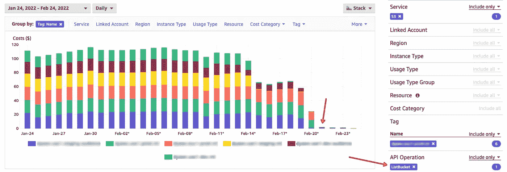
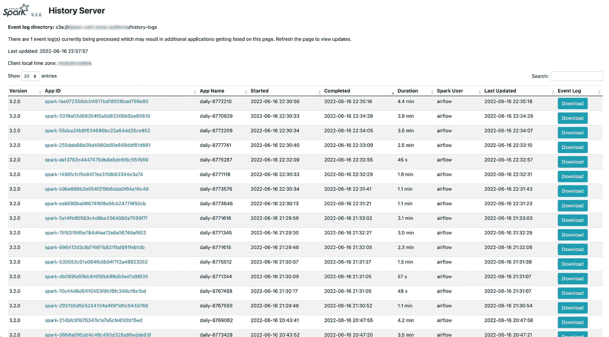
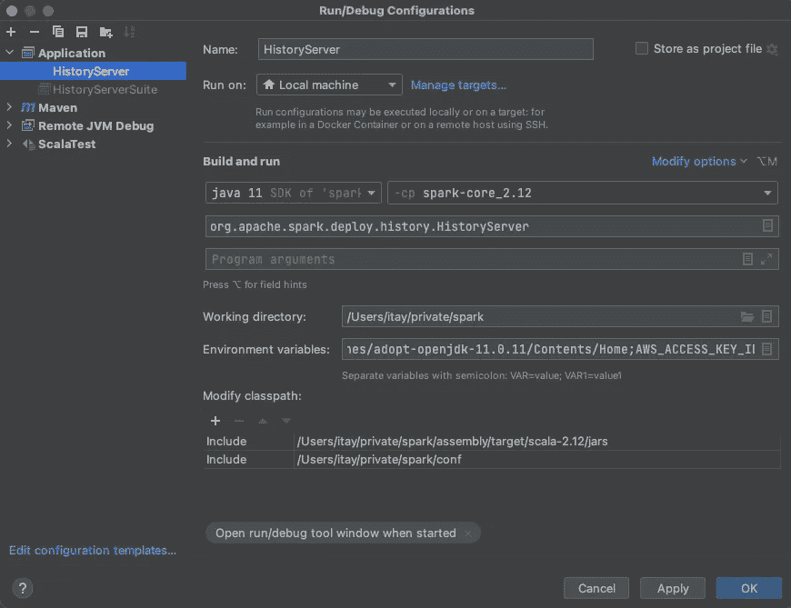

# 每月花费 3000 美元的错误火花配置

> 原文：<https://itnext.io/wrong-spark-configuration-that-cost-us-3k-month-dc21f2a0a113?source=collection_archive---------2----------------------->


由[乔希·阿佩尔](https://unsplash.com/@joshappel?utm_source=medium&utm_medium=referral)在 [Unsplash](https://unsplash.com?utm_source=medium&utm_medium=referral) 上拍摄的照片

Spark 版本:3.2.0

在这里的 [Dynamic Yield](https://www.dynamicyield.com/) ，我们每天运行数千个 [Spark](https://spark.apache.org/) 应用。在过去的两年里，我们努力升级我们的基础设施，以便在 Kubernetes 上运行这些工作，并且我们不断改进我们的系统。

几个月前我们添加的一个简单配置是:

```
spark.eventLog.rolling.enabled: true
spark.eventLog.rolling.maxFileSize: 16m
```

就是这样。两条线路，每月 3000 多美元:



滚动标记前后的 AWS 成本浏览器(图片由作者提供)

假设您正在使用 Spark 历史服务器来监控您的 Spark 应用程序，请确保它不会花费您过多的成本。

## 火花历史配置

Spark history server 是监控应用程序的一个非常有用的工具。通过在`spark-submit`命令中添加一些配置行，应用程序日志保存在您的首选存储中(在我们的例子中是 AWS S3 ),并可用于以后的探索。最基本的配置是:

```
spark.eventLog.enabled: true
spark.eventLog.dir: s3a://a-team-bucket/history-logs
```

这将确保应用程序可用于未来的探索。

在阅读文档时，[对滚动事件日志文件](https://spark.apache.org/docs/latest/monitoring.html#spark-history-server-configuration-options)应用压缩看起来很有希望，尤其是在过去监控极其缓慢的应用程序时遭受了 UI 无响应的痛苦之后。没有暗示这个[新功能](https://docs.google.com/document/d/12bdCC4nA58uveRxpeo8k7kGOI2NRTXmXyBOweSi4YcY/edit#heading=h.7bmfccqq7ozy)的价格。

## 实施细节

历史服务器的刷新间隔默认为 10 秒，可以通过`spark.history.fs.update.interval`进行调整。现在，假设我们将最后 50k 个应用程序存储在一个 S3 存储桶中，每个应用程序由一个文件表示。在这种情况下，每 10 秒钟就有 50 个 ListBucket 后台操作(每个操作返回多达 1，000 个对象):

```
.
├── spark-00079d419d924b4d900a0a27cd6a9ae0
├── spark-000af08856194e6e82046bc65237bc78
├── ...
├── ...
└── spark-z01051c66d93409583b17001c34fc21c
```

另一方面，使用滚动日志将为每个应用程序创建一个文件夹，如下所示:

```
.
├── eventlog_v2_spark-00079d419d924b4d900a0a27cd6a9ae0
|   ├── appstatus_spark-00079d419d924b4d900a0a27cd6a9ae0
│   └── events_1_spark-00079d419d924b4d900a0a27cd6a9ae0
├── eventlog_v2_spark-000af08856194e6e82046bc65237bc78
|   ├── appstatus_spark-000af08856194e6e82046bc65237bc78
│   └── events_1_spark-000af08856194e6e82046bc65237bc78
├── ...
├── ...
└── eventlog_v2_spark-z01051c66d93409583b17001c34fc21c
    ├── appstatus_spark-z01051c66d93409583b17001c34fc21c
    └── events_1_spark-z01051c66d93409583b17001c34fc21c
```

这个时间历史服务器执行相同的 50 个 ListBucket 操作来获取所有文件夹，然后执行另外的 **50，000 个 ListBucket 操作来获取每个文件夹的内容！**换句话说，每 10s 进行 50050 次 ListBucket 操作。

调试完源代码后，我发现对于文件系统抽象，日志既可以存储在本地文件系统中，也可以存储在像 S3 这样的 hdfs 中——使用了树遍历(列出所有文件夹，然后列出每个文件夹的文件),尽管深度树扫描是可用的。

# 结论

*   调整适合您的更新间隔。如果您每天监控一次应用程序，1 分钟、1 小时或每天更新一次可能就足够了。
*   没有问题就不要急着加配置。Rotate 可能有助于监控大型/重型应用程序。如果你在使用你的历史服务器时没有感到痛苦，你可能不需要它。
*   你可以把它们混合在一起。同一历史服务器路径支持文件夹(循环日志)和文件的混合。如果您使用循环日志配置，请仅将它们添加到您最大的应用程序中。
*   别忘了监控你的储物价格。虽然与计算资源相比，它被认为是廉价的，但您不希望将预算浪费在多余的操作上。



Spark 历史服务器(图片由作者提供)

# 附录

如果您有兴趣在本地运行 Spark 历史服务器并了解发生了什么，您可能会发现本指南很有用。

## 在 IntelliJ 中运行 spark 历史服务器

1.  从 Github 克隆 spark 库。
2.  打开 IntelliJ。
3.  搜索`org.apache.spark.deploy.history.HistoryServer`并运行(很可能会失败)。
4.  编辑运行配置:



选择模块。我选择了`spark-core_2.12`模块，我们将立即扩展它。

提示:如果您尝试从脚本(`/bin/start-history-server.sh`)运行，您会看到运行命令打印在日志的第一行。

5.进入项目结构→项目设置→模块，选择 spark-core_2.12。点击 Dependencies 选项卡，添加 assembly/target/Scala-2.12/jars 中的所有 jar。如果您正在测试 AWS/Hadoop jar，也要添加它们。

6.在`conf`文件夹中，添加`spark-defaults.conf`文件并添加您的自定义配置，例如:

```
spark.history.fs.logDirectory   s3a://logs-bucket/history
spark.hadoop.fs.s3a.aws.credentials.provider    org.apache.hadoop.fs.s3a.SimpleAWSCredentialsProvider
spark.hadoop.fs.s3a.endpoint    http://localhost:9000
spark.hadoop.fs.s3a.connection.ssl.enabled  false
spark.hadoop.fs.s3a.path.style.access   true
spark.history.fs.update.interval    30s
```

如果您正在使用 [minio](https://min.io/) (带有 docker)来模拟 S3，您可以通过环境变量在运行配置(步骤 4)中添加凭证。

7.如果您想查看调试日志，将`log4j2.properties.template`文件从`conf`目录复制到`log4j2.properties`，并更改`rootLogger.level`严重性。