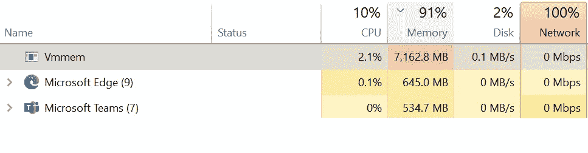
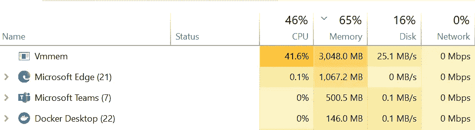

# WSL2 提示:使用 Docker 时限制 CPU/内存

> 原文：<https://itnext.io/wsl2-tips-limit-cpu-memory-when-using-docker-c022535faf6f?source=collection_archive---------0----------------------->

Windows Subsystem for Linux (WSL)是微软的一项终极功能，它使开发人员能够直接在 Windows 上运行 GNU/Linux 环境，无需修改，没有传统虚拟机或双引导设置的开销。

在 WSL2 中，他们在添加新特性的同时[做了大量的性能改进，比如托管虚拟机、完整的 Linux 内核和完整的系统调用兼容性。](https://docs.microsoft.com/en-us/windows/wsl/compare-versions#comparing-features)

如果您在 Windows 上启用并安装了 WSL-2，Docker-desktop 可以使用基于 WSL-2 的引擎来获得更好的性能。


> Docker Desktop 使用 WSL 2 中的动态内存分配特性来大大改善资源消耗。这意味着，Docker Desktop 只使用所需数量的 CPU 和内存资源，同时使 CPU 和内存密集型任务(如构建容器)运行得更快。
> 
> ——[https://docs.docker.com/docker-for-windows/wsl/](https://docs.docker.com/docker-for-windows/wsl/)

动态内存分配和更多的 CPU 能力！看起来棒极了！但是看看下面的图片:



疯狂的内存消耗:WSL2 上的 Docker

WSL-2 上的 Docker 可能会分配所有可用的内存，最终导致操作系统和其他应用程序的内存不足。

## 内存/CPU 限制设置

在传统的 Hyper-V 后端引擎上，内存和 CPU 分配很容易管理，这在 WSL-2 中也是可能的，但有点复杂！

在我的场景中，我更喜欢只分配**四个 CPU 内核**和最大**三 GB 内存**。

打开 Windows 终端/CMD/PowerShell 并运行以下命令:

```
# turn off all wsl instances such as docker-desktop
wsl --shutdownnotepad "$env:USERPROFILE/.wslconfig"
```

用记事本编辑`.wslconfig`文件，并记下这些设置:

```
[wsl2]
memory=3GB   # Limits VM memory in WSL 2 up to 3GB
processors=4 # Makes the WSL 2 VM use two virtual processors
```

保存文件并重新启动 docker-desktop 服务！



内存分配上限为 3GB！🤘

## 结论

WSL-2 设置不仅限于 CPU 和内存；您可以应用更多其他设置。点击阅读更多相关信息[。](https://docs.microsoft.com/en-us/windows/wsl/wsl-config#wsl-2-settings)