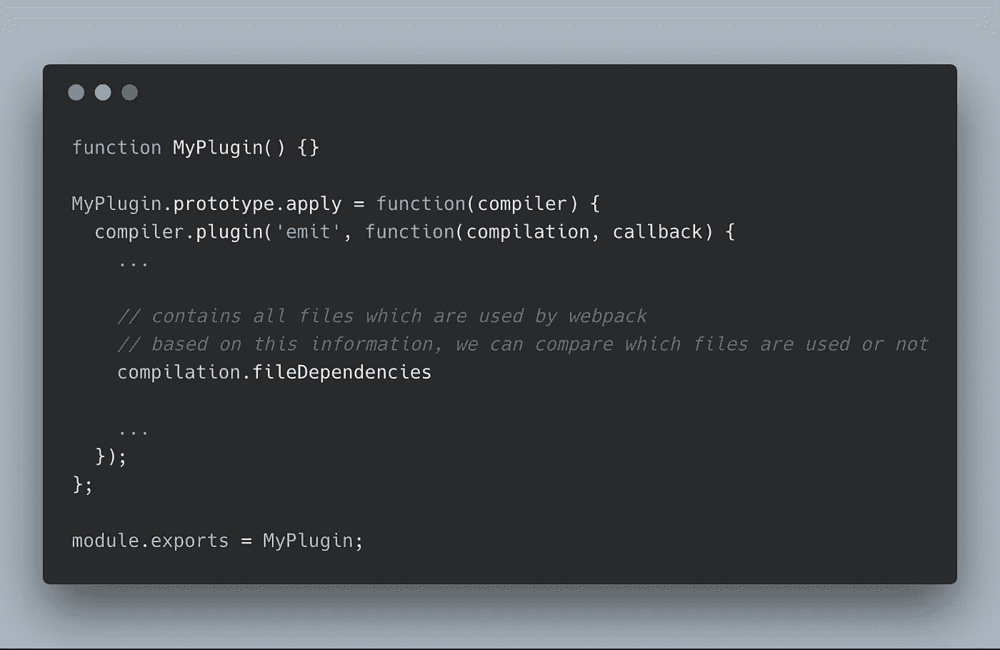
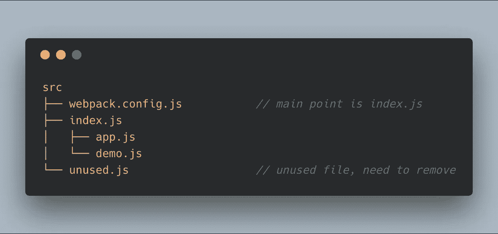
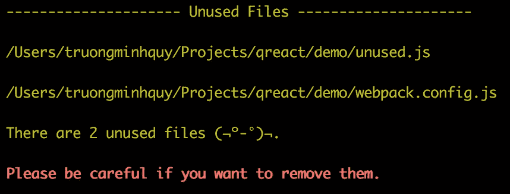
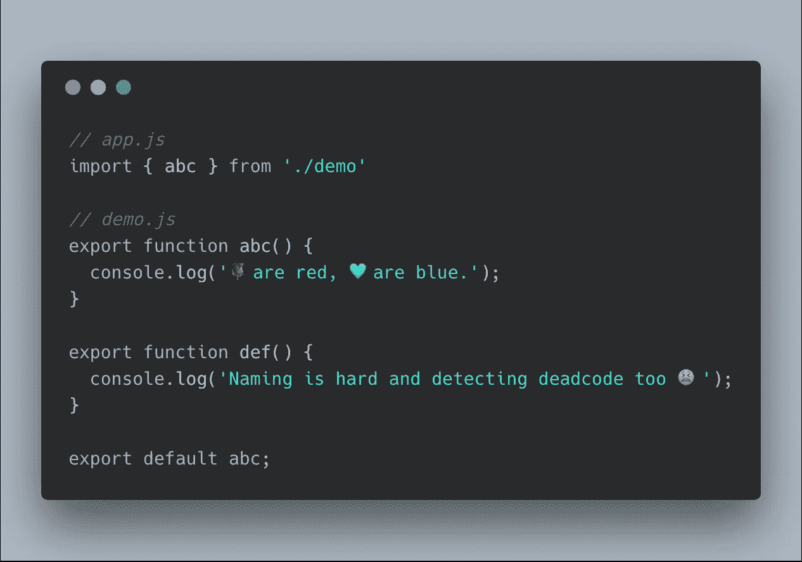
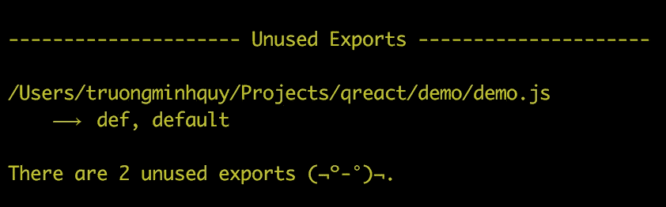

# WTF 是死码消除？？自己怎么做

> 原文：<https://itnext.io/wtf-is-deadcode-elimination-how-to-do-it-by-yourself-d1e1e26b0ed0?source=collection_archive---------1----------------------->

# 方案

根据[维基](https://en.wikipedia.org/wiki/Dead_code_elimination)

> *死码消除是一种编译器优化，用于删除不影响程序结果的代码。*

*   ***前世的我*** :🤩消除死代码是编译器的工作，而我们，开发者，不需要关心任何事情。
*   ***Me*** :🙅🏼作为开发者，我们也有责任清理自己的问题💩。

那么我们该怎么做呢？

*   ***过去的我*** :不，我知道哪些部分用了，哪些没用，我们有良好的代码审查流程，因此，一切都在我们的控制之下。
*   ***我*** :闭上你的鸟嘴 ***过去的我*** ，你怎么能记住那些部分，而仅仅几个月后，你甚至不能认出它们是你自己写的🤦。

假设你还记得，当你的团队变大时，这个问题仍然会发生。

照片由 [Max Lakutin](https://unsplash.com/photos/UTT39aMPxwg?utm_source=unsplash&utm_medium=referral&utm_content=creditCopyText) 在 [Unsplash](https://unsplash.com/search/photos/garbage?utm_source=unsplash&utm_medium=referral&utm_content=creditCopyText) 上拍摄

同样，我们如何检测死代码，这篇文章是我自动消除和报告死代码的方法，这样我就可以花更多的时间来喝酒🍺。

最近，我的主要焦点是 javascript，所以我将解释如何用 javascript 做，但我认为在高层次上，你可以做一些类似的事情(不要相信我👅).

# 自动移除死代码

为了自动删除死码，解决方案是:

*   你的代码编辑器。
*   提交代码后运行的工具，合并程序…

## 代码编辑器

我的代码编辑器现在是 [Visual Studio Code](https://code.visualstudio.com/) ，它有很多扩展，帮助我们实现我们需要的东西。下面的列表是我正在使用的:

*   https://marketplace.visualstudio.com/items?itemName=eg2.tslint (或 [eslint](https://marketplace.visualstudio.com/items?itemName=dbaeumer.vscode-eslint) ) **启用 autoFixOnSave。**
*   打字稿英雄:[https://marketplace.visualstudio.com/items?itemName = Rb bit . typescript-hero](https://marketplace.visualstudio.com/items?itemName=rbbit.typescript-hero)。

✍🏻之前用 vim，决定用 Visual Studio 代码来编码 javascript。Vim 是最具生产力的编辑器之一，因此，为了结合两个世界的优点，我在 [vim 模式](https://marketplace.visualstudio.com/items?itemName=vscodevim.vim)下使用 Visual Studio 代码。

## CI 工具

我还没有尝试过很多工具，我唯一使用的脚本是在提交代码之前，运行得更漂亮。您可以点击查看更多[详情。](https://prettier.io/docs/en/precommit.html)

# 报告死亡代码

✍🏻您仍然可以使用代码编辑器和我上面提到的扩展来警告您未使用的变量、未使用的函数/方法( [tslint](https://marketplace.visualstudio.com/items?itemName=eg2.tslint) 、 [stylelint](https://marketplace.visualstudio.com/items?itemName=shinnn.stylelint) …)。另一方面，我们可以利用模块捆绑器来报告死代码。

在过去的几年里，有很多模块捆绑器帮助我们将代码库分割成小部分，然后再进行捆绑(例如 webpack、rollup、brunch……)。我使用 webpack 作为我的模块捆绑器，webpack 没有正式支持我们检测死代码的方法，但提供了基于此的信息，我们可以检查我们的代码是否死了。下一节我将描述如何使用这些信息来实现我们所需要的(如果你只是想使用[死代码插件](https://github.com/MQuy/webpack-deadcode-plugin)，我创建了这个插件)🙋).

在我看来，有两种类型的死代码，对于每种类型的死代码，我将演示如何在 webpack 中进行检测:

*   未使用的文件。
*   已用文件中未使用的导出。

**未使用的文件**

Webpack 有一个很棒的教程，它向我们介绍了如何编写插件。

下图是使用 webpack 的死简单项目🐤。

下图是它将通过 [webpack deadcode 插件](https://github.com/MQuy/webpack-deadcode-plugin)输出到控制台的内容。

**已用文件中未使用的导出**

起初，我不知道如何解决这个问题😳当你不知道的时候就问。webpack 核心团队真的很了不起，他们指导我怎么做。

同样，使用`import`、`export`非常简单🐣。

下图是它将通过 [webpack deadcode 插件](https://github.com/MQuy/webpack-deadcode-plugin)输出到控制台的内容。

# 结论

这就是我目前所知道的靠我们自己清理我们的代码库。如果你知道其他方法，请分享🙇所以尽可能少我们自己的💩。

感谢阅读！！🙏