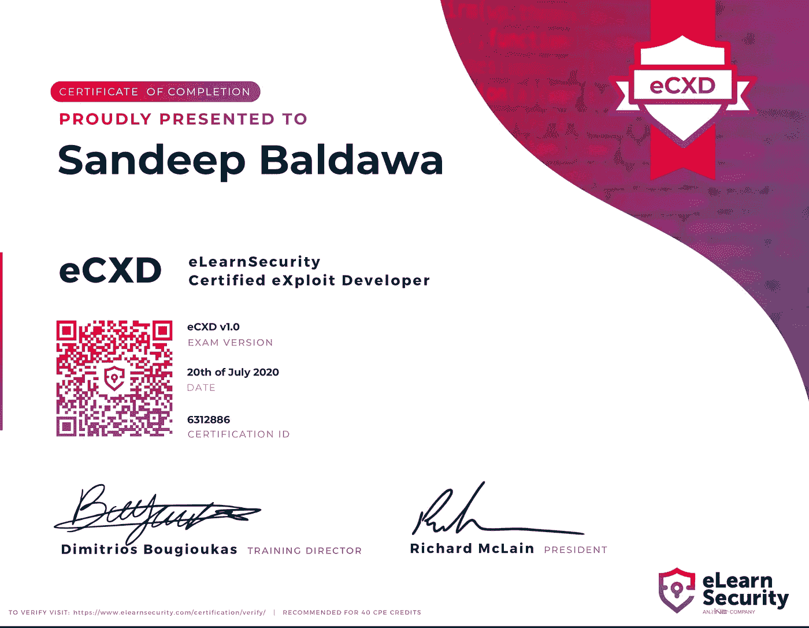

# eCXD 认证——给忙碌新手的 20 个建议

> 原文：<https://itnext.io/xds-v1-elearnsecurity-course-review-cda5bb12f95b?source=collection_archive---------1----------------------->

我的电子安全认证漏洞开发者之旅

> ***背景***

在通过我的 [eJPT](https://www.elearnsecurity.com/certification/ejpt/) 考试后，我对二进制开发和逆向工程很好奇。我想在不知道源代码的情况下理解二进制文件做什么。我完全不知道从哪里开始我的旅程，我开始在网上探索和研究。我最终敲定了 eCXD 认证(主要是因为 elearnSecurity 的课程质量)。

在这篇博客中，我不会解释 eCXD 课程的内容，因为其他博客在这方面做得很好。相反，我将分享 20 条对我最有效的建议

**管理全职工作、家庭和道德黑客**

我有两个孩子，白天的工作让我很忙，所以我的可用时间有限。eJPT 考试一周后，我报名参加了这个课程。由于严重的时间短缺(考虑到我的工作和对两个小孩的家庭承诺)，以下是帮助我的训练方法:

1.  留出清晨/深夜学习，花 1 小时/工作日，8 小时/周末
2.  我会利用任何可以利用的时间来学习(午休，给我蹒跚学步的孩子喂食/洗澡)。

> ***谁应该参加本课程***

我不是这方面的专家，在安全领域也完全是个新手，我唯一的建议是尝试一下 elearnSecurity 为本课程提供的免费模块，看看您是否感兴趣。

这个课程 IMHO 是给喜欢接触低级代码(大部分是汇编)的人准备的。对汇编代码的基本理解肯定会使本课程变得更容易。

# **👉🏽开始前的准备技巧**

为了让您的时间投资获得最大回报，请确保您:

*   理解 Linux+Windows 命令(+其内部)
*   了解 gdb 调试器(可选)
*   汇编代码的高级理解(强烈推荐本课程[https://www.pentesteracademy.com/course?id=3](https://www.pentesteracademy.com/course?id=3)
*   基本的 Python 技能

# **👉🏽时间紧迫时学习课程材料的小贴士**

课程材料棒极了！你需要的一切都在一个地方。然而，有些章节太长了(特别是 [*模块 2: Linux 漏洞利用对策&绕过*](https://www.elearnsecurity.com/course/exploit_development_student/#) )，但那是因为这一章在一个地方解释了不同的对策和绕过。

以下是一些让我快速掌握课程材料的技巧:

*   制定完成计划—设定完成本课程的日期。由于我的孩子和工作，这个计划改变了几次，我也相应地调整了我的计划。我花了 1.5 个月完成课程+实验
*   我接受了 60 小时的实验包，结果用了大约 40 小时。
*   以快节奏的方式从高层次浏览该模块，并尝试理解该模块的要点，而不是深入学习某个模块
*   做完以上👆🏼，跳转到相关实验室
*   完成每个实验后，跳回理论，现在彻底完成它，这也有助于你与实验的联系。冲洗并重复不同的模块
*   混合 Linux 和 Windows 开发模块进行学习，以确保您保持敏锐🤜🏽
*   解答理论幻灯片中的例子，注意小细节
*   购买 VMware Fusion(如果在 Mac 上)或 VMware workstation 并获得 pro 许可证，这完全值得，因为它的性能非常棒(快得多)
*   Elearnsecurity 有一个很棒的论坛，不要犹豫问任何问题(如果还没有问的话)，那里有很多友好的人
*   有两套笔记(一套详细的)和一套便签，便签对考试来说非常方便
*   在尝试实验时，请将脚本放在手边
*   我并不精通 Windows 开发，所以我在这方面花了更多的时间，但这可能因人而异
*   多休息，好好睡觉。

# 👉🏽登陆日小贴士

这次考试相当具有挑战性。你有三天时间实习，两天时间写报告。该考试完全实用，就像人们在现实世界中看到的那样(并非 CTF 本身)。

它是 32/64 位 Windows/Linux 漏洞的混合体。考试中不应该有任何课程以外的内容，只是要确保注意所有的细节。

以下是考试的一些小技巧:

*   开始前仔细阅读问题并彻底理解它们
*   准备好所有的备忘单笔记
*   经常休息(这是你说“找到了”并得到答案/替代解决方案的时候)
*   如果可能的话，准备好你的讲稿，以便在考试中重复使用，从而节省你的时间
*   考试考验你的耐心，所以保持冷静，慢慢地就会有答案的
*   不要试图使用 latex 和其他工具(如 OSCP)创建花哨的报告，报告的目标更多的是清楚地解释考试期间遵循的所有步骤
*   最后但同样重要的是，试着享受考试

> **特别感谢**

感谢[@ elearns security](https://twitter.com/elearnsecurity)打造了这么牛逼的课程。此外，感谢这些课程评论和渠道激励我参加本课程:

1.  [回顾 1](https://medium.com/bugbountywriteup/my-journey-into-elearnsecurity-certified-exploit-developer-ecxd-da9d01060305)
2.  [回顾 2](https://www.youtube.com/watch?v=Q0gAB1dJ31c&t=1403s)
3.  [频道 1](https://www.youtube.com/user/RootOfTheNull)
4.  [通道 2](https://www.youtube.com/channel/UC0ArlFuFYMpEewyRBzdLHiw)
5.  [通道 3](https://www.youtube.com/channel/UCoyOsfy3RqPftYNvgNAeJ5g)