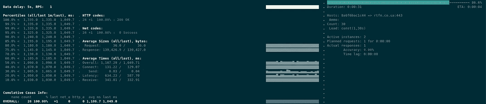
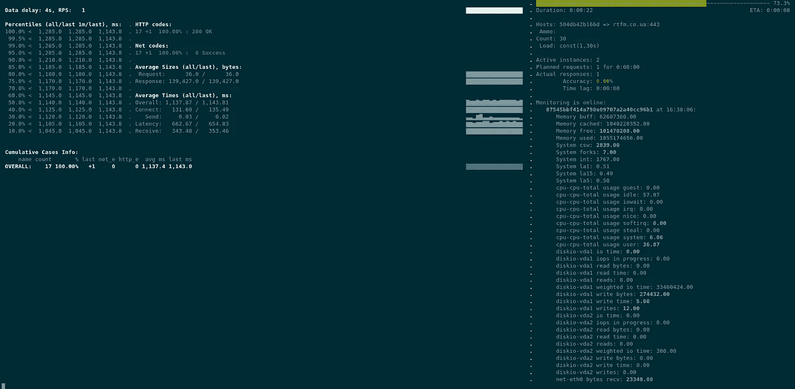

# Yandex。Tank:负载测试工具——概述、配置和示例

> 原文：<https://itnext.io/yandex-tank-load-testing-tool-an-overview-configuration-and-examples-2b0d64295f55?source=collection_archive---------2----------------------->


除了[阿帕奇工作台](https://rtfm.co.ua/apache-bench-testiruem-rabotu-veb-servera/)和 [JMeter](https://rtfm.co.ua/apache-jmeter-nagruzochnoe-testirovanie-veb-servera/) 之外，还有另一个实用工具——Yandex 坦克。

它被我们的 QA 团队使用，现在是时候让我仔细看看它了，来测试我们的应用程序在 Kubernetes 集群上运行的一个问题。

在这篇文章中，我们将简要介绍它的功能和配置。

对比[阿帕奇板凳](https://rtfm.co.ua/apache-bench-testiruem-rabotu-veb-servera/)，Yandex。Tank 显示响应代码统计数据，并且在运行和配置 JMeter 时更加简单，此外，它还有一个很好的[自动停止](https://rtfm.co.ua/?p=25456#Autostop)功能，用于“ *Huston，我们遇到问题*”(с)的情况

# 成分

参见[模块](https://yandextank.readthedocs.io/en/latest/core_and_modules.html)。

Yandex 坦克核心是用 Python 写的。

对于负载测试，它有几个模块— [负载生成器](https://yandextank.readthedocs.io/en/latest/core_and_modules.html#load-generators)，默认情况下它使用在с++上编写的 Phantom，所以它真的很快。

[Telegraf](https://yandextank.readthedocs.io/en/latest/core_and_modules.html#telegraf) 工具是一个监控模块，它可以通过 SSH 连接到测试主机，运行自己的代理来收集有关 CPU/mem/etc 的指标，这些指标将显示在 Yandex 中。实时负载测试期间的油箱。

Overloader 是一个将结果上传到 [Yandex Overloader](https://overload.yandex.net/) 或 InfluxDB 的模块，但我们不会在这里使用它。不过，请看[工件上传者](https://yandextank.readthedocs.io/en/latest/core_and_modules.html#artifact-uploaders)。

此外，在下面的例子中，我不会涉及“弹药”主题来创建更复杂的 POST 等请求测试，因为对我来说，现在简单的 GET 请求已经足够了。但是您可以在[准备请求](https://yandextank.readthedocs.io/en/latest/tutorial.html#preparing-requests)中找到它的文档。

# 运行 Yandex。带码头的油罐

为幻影创建最小配置:

```
phantom:
  address: rtfm.co.ua:443
  header_http: "1.1"
  headers:
    - "[Host: rtfm.co.ua]"
  uris:
    - /
  load_profile:
    load_type: rps
    schedule: const(1,30s)
  ssl: true
console:
  enabled: true
telegraf:
  enabled: false
```

这里:

*   `phantom`:
*   `address`:目标的地址和端口
*   `header_http`:用于请求的 HTTP 版本，将其设置为 1.1 以使用持久连接(参见 [HTTP 持久连接](https://en.wikipedia.org/wiki/HTTP_persistent_connection))
*   `headers`:要传递给目标服务器的一组头
*   `uris`:可拨打电话的 URIs 列表
*   `load_profile`:
*   `load_type`:可设置为`rps`或`instances`:
*   `rps` : *每秒请求数*——设置发送给测试主机的每秒请求数
*   `instances`:或者设置想要的活动线程数，这将执行尽可能多的 RPS，参见[动态线程限制](https://yandextank.readthedocs.io/en/latest/tutorial.html?highlight=load_type#dynamic-thread-limit)
*   `schedule`:可设置为`const`、`line`或`step`(或全部)——定义负载测试概要，参见[教程](https://yandextank.readthedocs.io/en/latest/tutorial.html?highlight=load_type#tutorials):
*   `const`:设置为 *(load，dur)* ，分别为 *load* - RPS 编号， *dur* -负载测试持续时间，如上例 Yandex。Tank 将每秒运行一个请求，持续 30 秒
*   `line`:设置为 *(a，b，dur)* ，其中*a*-RPS 开始数， *b* -最终数， *dur* -负载测试持续时间，因此 RPS 将从 *a* 线性增加到 *b* 值
*   `step`:设置为 *(a，b，step，dur)* ，其中*a*-RPS 的起始数， *b* -最终数， *step* -在 *dur* 秒后每一步会增加多少请求
*   `ssl`:为 HTTPS 请求启用 SSL 支持(向`address`添加 443 端口)
*   `console`:将结果显示到控制台
*   `telegraf`:监控代理配置，将在[监控(Telegraf)](https://rtfm.co.ua/en/yandex-tank-load-testing-tool-an-overview-configuration-and-examples/#Monitoring_Telegraf) 中介绍

运行 Yandex。带码头的储罐:

```
$ docker run — rm -v $(pwd):/var/loadtest -it direvius/yandex-tank
```

和结果:



# 监控(Telegraf)

使用 [Telegraf](https://github.com/influxdata/telegraf) Yandex。Tank 可以通过 SSH 连接到测试主机来获取资源指标。

在`load.yaml`文件中启用它:

```
...
telegraf:
  enabled: true
  package: yandextank.plugins.Telegraf
```

要收集的指标在专用文件中描述，将其创建为`monitoring.xml`，详见[配置文件格式](https://yandextank.readthedocs.io/en/latest/core_and_modules.html#configuration-file-format):

```
<Monitoring>
  <Host address="rtfm.co.ua" interval="1" username="root">
    <CPU />
    <Kernel />
    <Net />
    <System />
    <Memory />
    <Disk />
    <Netstat/>
  </Host>
</Monitoring>
```

在这里的`address`中，设置测试目标以从`interval` -获取指标的频率，`username`-Telegraf 模块在连接期间使用的 SSH 用户收集指标。

目标主机中的这个用户必须有一个 SSH 密钥的公共部分才能添加到`~/.ssh/authorized_keys.`

这个密钥的私有部分将被安装到 Yandex 上。Tank Docker 容器为`/root/.ssh/id_rsa`，因为容器中的所有进程都在`root`用户下运行:

```
$ docker run — rm -v $(pwd):/var/loadtest -v /home/setevoy/.ssh/setevoy-do-nextcloud-production-d10–03–11:/root/.ssh/id_rsa -it direvius/yandex-tank
```

## Paramiko: SSHException:不是有效的 RSA 私钥文件

第一次运行时，Telegraf 失败，出现 Paramiko 错误:

```
16:32:54 [ERROR] Failed to install monitoring agent to rtfm.co.ua
Traceback (most recent call last):
File “/usr/local/lib/python2.7/dist-packages/yandextank/plugins/Telegraf/client.py”, line 209, in install out, errors, err_code = self.ssh.execute(cmd)
File “/usr/local/lib/python2.7/dist-packages/yandextank/common/util.py”, line 72, in execute
with self.connect() as client:
File “/usr/local/lib/python2.7/dist-packages/yandextank/common/util.py”, line 42, in connect
timeout=self.timeout, )
File “/usr/local/lib/python2.7/dist-packages/paramiko/client.py”, line 437, in connect
passphrase,
File “/usr/local/lib/python2.7/dist-packages/paramiko/client.py”, line 749, in _auth
raise saved_exception
SSHException: not a valid RSA private key file
```

因为 DigitalOcean 上的 RSA 密钥是以 PEM/OpenSSH 格式发布的:

```
$ file /home/setevoy/.ssh/setevoy-do-nextcloud-production-d10–03–11
/home/setevoy/.ssh/setevoy-do-nextcloud-production-d10–03–11: OpenSSH private key
```

将其转换为 RSA:

```
$ ssh-keygen -p -m PEM -f /home/setevoy/.ssh/setevoy-do-nextcloud-production-d10–03–11
```

并再次检查:

```
$ file /home/setevoy/.ssh/setevoy-do-nextcloud-production-d10–03–11
/home/setevoy/.ssh/setevoy-do-nextcloud-production-d10–03–11: PEM RSA private key
```

再次运行测试，Telegraf 将打印其配置和要使用的指标:

```
$ docker run — rm -v $(pwd):/var/loadtest -v /home/setevoy/.ssh/setevoy-do-nextcloud-production-d10–03–11:/root/.ssh/id_rsa -it direvius/yandex-tank
…
16:36:38 [INFO] Detected monitoring configuration: telegraf
16:36:38 [INFO] Preparing test…
16:36:38 [INFO] Telegraf Result config {‘username’: ‘root’, ‘comment’: ‘’, ‘telegraf’: ‘/usr/bin/telegraf’, ‘python’: ‘/usr/bin/env python2’, ‘host_config’: {‘Kernel’: {‘fielddrop’: ‘[“boot_time”]’, ‘name’: ‘[inputs.kernel]’}, ‘Netstat’: {‘name’: ‘[inputs.netstat]’}, ‘System’: {‘fielddrop’: ‘[“n_users”, “n_cpus”, “uptime*”]’, ‘name’: ‘[inputs.system]’}, ‘Memory’: {‘fielddrop’: ‘[“active”, “inactive”, “total”, “used_per*”, “avail*”]’, ‘name’: ‘[inputs.mem]’}, ‘Net’: {‘interfaces’: ‘[“eth0”,”eth1",”eth2",”eth3",”eth4",”eth5"]’, ‘fielddrop’: ‘[“icmp*”, “ip*”, “udplite*”, “tcp*”, “udp*”, “drop*”, “err*”]’, ‘name’: ‘[inputs.net]’}, ‘Disk’: {‘name’: ‘[inputs.diskio]’, ‘devices’: ‘[“vda0”,”sda0",”vda1",”sda1",”vda2",”sda2",”vda3",”sda3",”vda4",”sda4",”vda5",”sda5"]’}, ‘CPU’: {‘fielddrop’: ‘[“time_*”, “usage_guest_nice”]’, ‘name’: ‘[inputs.cpu]’, ‘percpu’: ‘false’}}, ‘startup’: [], ‘host’: ‘rtfm.co.ua’, ‘telegrafraw’: [], ‘shutdown’: [], ‘port’: 22, ‘interval’: ‘1’, ‘custom’: [], ‘source’: []}
16:36:38 [INFO] Installing monitoring agent at root@rtfm.co.ua…
16:36:38 [INFO] Creating temp dir on rtfm.co.ua
16:36:38 [INFO] Execute on rtfm.co.ua: /usr/bin/env python2 -c “import tempfile; print tempfile.mkdtemp();”
…
```

在此之后，负载测试将会启动，在右侧您将会看到目标服务器上使用的资源:



服务器上运行的代理:

```
$ root@rtfm-do-production-d10:~# ps aux | grep tele
root 4580 0.5 0.4 309992 9436 pts/1 Ssl+ 15:38 0:00 python2 /tmp/tmpZez6yJ/agent.py — telegraf /tmp/telegraf — host rtfm.co.ua
root 4582 7.1 1.5 851256 31896 ? Ssl 15:38 0:01 /tmp/telegraf -config /tmp/tmpZez6yJ/agent.cfg
```

# 自动停止

自动停止模块用于在出现问题时终止测试。

例如，您可以将其配置为在 5[[响应率将高于 10%，或者响应时间将大于指定值时停止测试。

添加以下内容进行检查:

```
...
autostop:
  autostop:
    - http(2xx,100%,1s)
```

例如，这里测试将停止一次，将在 1 秒内获得 2xx 响应。

运行测试，并:

```
$ docker run — rm -v $(pwd):/var/loadtest -v /home/setevoy/.ssh/setevoy-do-nextcloud-production-d10–03–11:/root/.ssh/id_rsa -it direvius/yandex-tank
…
16:56:24 [INFO] Monitoring received first data.
16:56:24 [WARNING] Autostop criterion requested test stop: http(2xx,100%,1s)
16:56:24 [WARNING] Autostop criterion requested test stop: 2xx codes count higher than 100.0% for 1s, since 1612889780
16:56:24 [INFO] Finishing test…
16:56:24 [INFO] Stopping load generator and aggregator
…
```

马上就被制止了。

更多选项参见[文档> > >](https://yandextank.readthedocs.io/en/latest/tutorial.html?highlight=autostop#autostop) 。

整个`load.yaml`现在是:

```
phantom:
  address: rtfm.co.ua:443
  header_http: "1.1"
  headers:
    - "[Host: rtfm.co.ua]"
  uris:
    - /
  load_profile:
    load_type: rps
    schedule: const(1,30s)
  ssl: true
console:
  enabled: true
telegraf:
  enabled: true
  package: yandextank.plugins.Telegraf
  config: monitoring.xml
autostop:
  autostop:
    - http(2xx,100%,1s)
```

# 有用的链接

很不幸，都是俄语。

*   автоматизациянагрузочноготестирования·помощи·яндекс.танк
*   [нагрузочное。储罐压力计](https://gist.github.com/sameoldmadness/9abeef4c2125bc760ba2f09ee1150330)
*   [http 服务器负载测试(nginx),205k+ RPS](https://medium.com/@k0st1an/%D0%BD%D0%B0%D0%B3%D1%80%D1%83%D0%B7%D0%BE%D1%87%D0%BD%D0%BE%D0%B5-%D1%82%D0%B5%D1%81%D1%82%D0%B8%D1%80%D0%BE%D0%B2%D0%B0%D0%BD%D0%B8%D0%B5-http-%D1%81%D0%B5%D1%80%D0%B2%D0%B5%D1%80%D0%B0-nginx-205k-rps-6a6a5bfa20cb)
*   [Yandex 测试:建立你的月球公园(T3)](https://habr.com/ru/company/yandex/blog/202446/)
*   [使用 Yandex 的网站负载测试示例。坦克(T5)](https://serveradmin.ru/primer-nagruzochnogo-testirovaniya-sajta-s-yandex-tank/)

*RTFM: Linux、DevOps 和系统管理* *(T13 )*