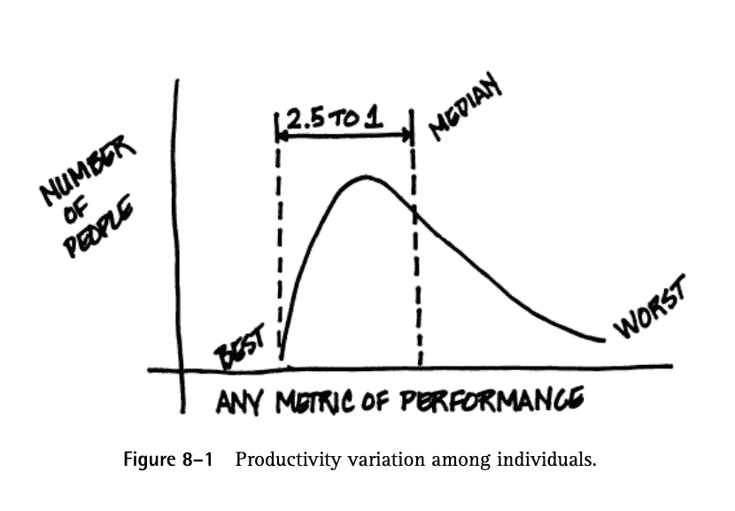

# 是的，10 倍编码器存在。不，他们的工作效率并不比大多数程序员高 10 倍。

> 原文：<https://itnext.io/yes-10x-coders-exist-no-they-arent-10x-more-productive-than-most-coders-84f7e6b1ee90?source=collection_archive---------0----------------------->

## 哦，顺便说一下，这也适用于软件组织。

神话般的 10x 编码器。一个被过度使用的术语和一场频繁的争论。最近流行的结论是，他们不存在，或者他们实际上是那些授权和领导他人的人。或者是团队和管理团队比个人更重要。有些人甚至谈到有害的“英雄编码员”。虽然这些讨论有他们的观点，但我认为事实上有 10 倍的编码者。然而，人们确实容易误解 X 的意思，所以让我们来解决这个问题。

10x 编码器的起源可能是在 1987 年的书 [Peopleware](https://en.wikipedia.org/wiki/Peopleware:_Productive_Projects_and_Teams) 中。作者谈到了“从 1984 年到 1986 年在 T2”、“T3”和“来自 92 家公司的 600 多名开发人员参加了”的一系列“生产力竞赛”。他们发现，个人表现差异很大，而且几乎在任何可感知的表现指标上都出现了类似的分布。让我们来看看结果:

Peopleware，第 8 章，生产率的个体差异。

作者声明*“每当你测量个体样本的表现变化时，三条经验法则似乎都适用”。*它们在上图中可见，可总结如下:

*   指望最优秀的人以大约 10:1 的比例胜过最差的人。
*   指望表现最好的**比表现中等的**好大约 2.5 倍。
*   指望那一半表现好于中值的人以 2:1 的比例超过另一半。

因此，X 指的是表现最差的人，而不是表现一般的人。我认为，如果我们谈论生活在我们中间的 2.5x 编码员，关于这个话题的争论就会少得多。总之，更有趣的是，分析并没有到此为止。

# 10 倍的软件组织

作者还了解到，巨大的生产率差异与你的合作伙伴有很大关系。他们发现，表现优秀的人倾向于聚集在特定的组织中，这些组织确实比表现最差的组织好 10 倍。

这也意味着一个组织内的差异可能没有群体水平上的差异大。如此多的程序员可能在他们的工作场所看不到这些 10 倍或 2.5 倍的差异。也许他们只雇佣优秀或不优秀的员工。也许俗话说的好*“一个玩家吸引一个玩家。b 玩家吸引 C 玩家。”*有一定的可取之处。

这对招聘、建立伟大的文化和维持一个健康良好运行的软件组织的重要性有着明显的影响。人们可以很容易地证明，所有这些都与编码人员处于最佳性能群有关。也许伟大的人在伟大的环境中不断提升自己和他们的同龄人。

# 结论

我不认为 Peopleware 是强大的科学。然而，有趣的是，我也不反对这样一种观点，即有些人实际上比其他人更有生产力，比如作为编码员，或者作为其他复杂领域如艺术的从业者。例如，开发 Linux、libcurl 等工具的人，或者决定使用 merkle 树来创造新货币的人；)

不过，最大的“那又怎样”是关于 10 倍的组织。尤其是对科技公司而言，你不会希望自己从表现较差的组织中脱颖而出，却发现自己的竞争对手表现更好。这一切又让我们回到了起点。最好专注于建立伟大的团队。甚至 Peopleware 的研究也表明了这一点:和优秀的同事在一起，你会表现得更好。