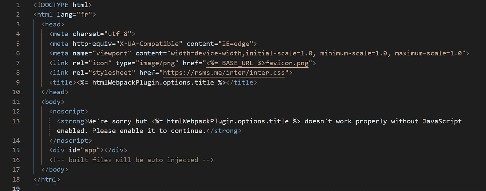
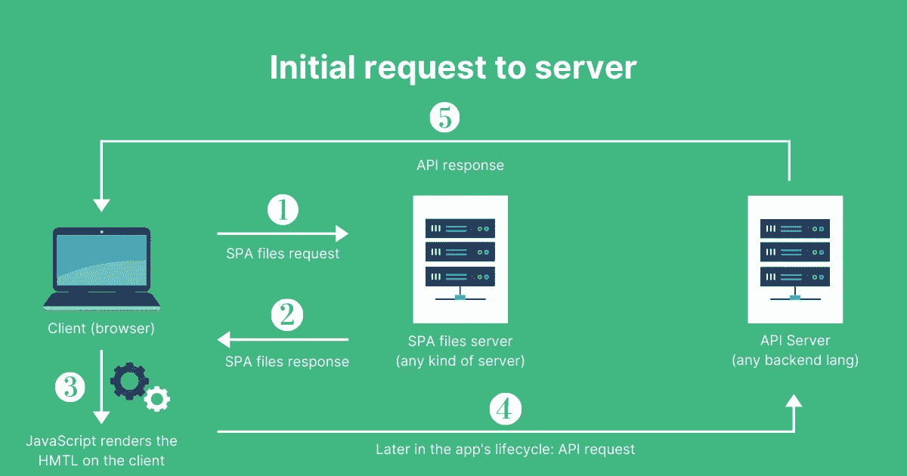
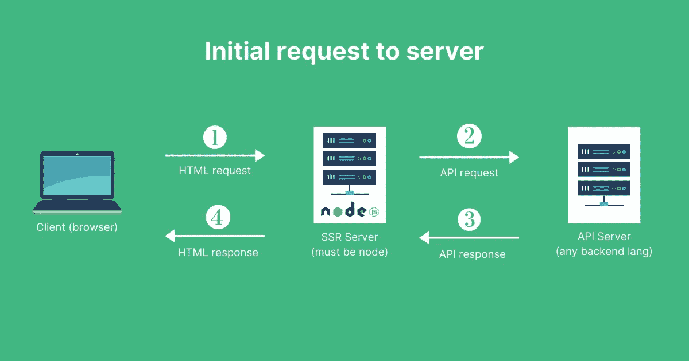
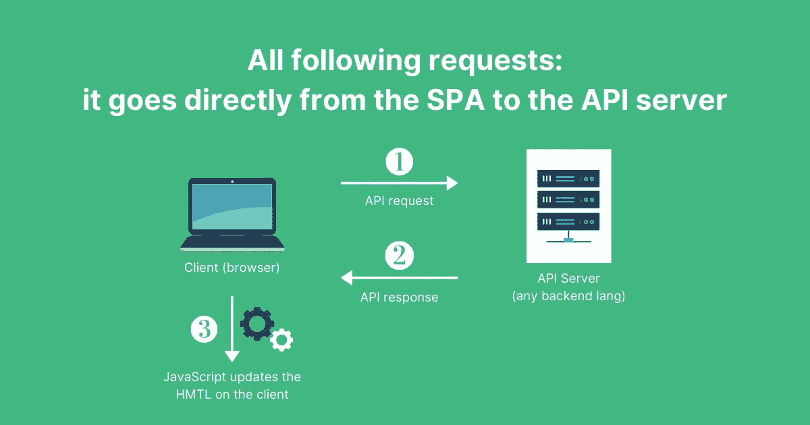
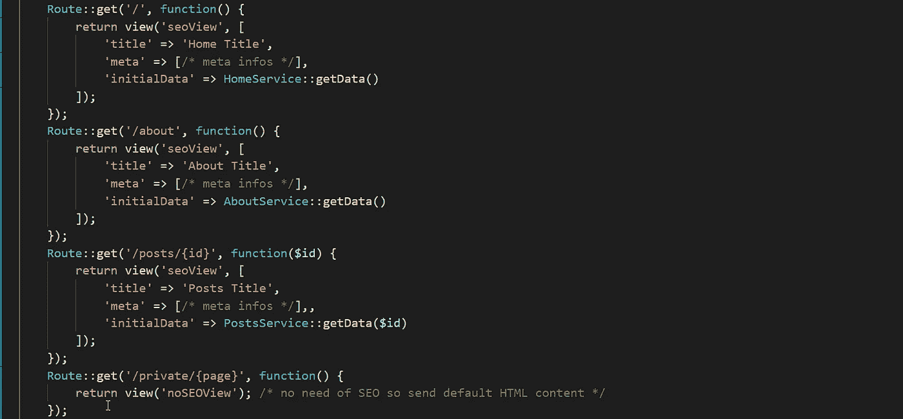
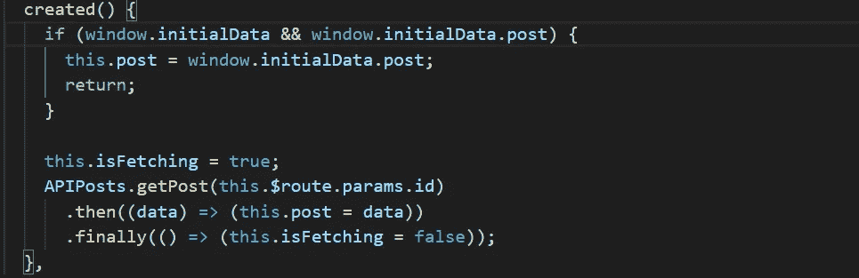
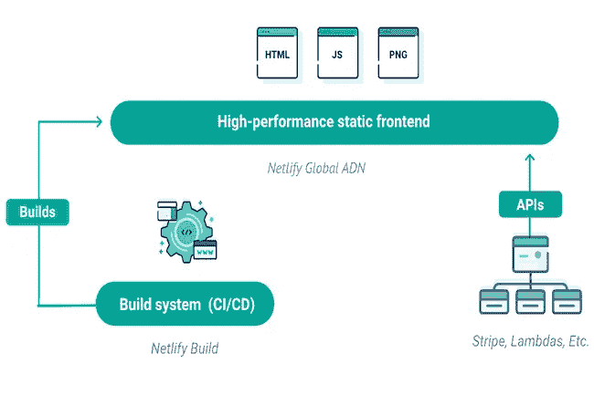

# 是的，这里有 4 种用 Vue 处理 SEO 的方法(即使没有节点 SSR)

> 原文：<https://itnext.io/yes-here-are-4-ways-to-handle-seo-with-vue-even-without-node-ssr-719f7d8b02bb?source=collection_archive---------0----------------------->

当涉及到前端框架的 SEO 时，为什么每个人都认为带节点的 SSR 是唯一的解决方案？

早在 2014 年 SSR 还不存在的时候，人们就已经在问"**如何用 AngularJS 处理 SEO？**”。

现在，我经常看到的是“**如何用 Vue 处理 SEO？**”，答案永远是:“用 Nuxt”或者“用 SSR”。

不是每个人都能为他们的项目拥有一个节点服务器。可能有很多原因:共享网站主机，没有根访问权限…

但是更好的问题是“**如何在一个 SPA** (单页应用)中处理 SEO”，我的回答是: **SSR 不是唯一的解决方案**。

因此，这里有 4 种方法可以在 2021 年用 SPA 来处理 SEO。

PS:我用 Vue 举例，但是**它们都适用于大多数框架**。

# 1.在客户端搜索引擎优化与谷歌爬虫

React、Vue、Svelte…所有这些都是最初用于创建 spa 的前端框架，也称为**带有 CSR(客户端渲染)**的网站/web app。

这是什么意思？这意味着渲染是在浏览器中完成的。因此，发送到浏览器&搜索引擎爬虫的 HTML 是空的！

> 没有 HTML 内容=没有 SEO。

通常，你有一个基本的**index.html**文件，带有硬编码的标题和元标签。

基本 SPA 入口点(index.html 文件)

**SPA/CSR 通常是这样运作的:**

1.  向任何服务器发出初始请求以获取上面的 HTML 文件
2.  服务器返回静态 HTML 文件
3.  浏览器加载、执行和呈现 CSS 和 JS
4.  在客户端导航期间，AJAX 请求是向 API 服务器发出的
5.  API 服务器返回数据(通常是 JSON)
6.  **浏览器更新当前页面**

SPA/CSR 渲染生命周期

**2015 年**谷歌称**他们可以解析 JS** ，霍雷🎉(或者不是)。**[https://developers . Google . com/search/blog/2015/10/depreciated-our-Ajax-crawling-scheme](https://developers.google.com/search/blog/2015/10/deprecating-our-ajax-crawling-scheme)。**

****客户端渲染的 SEO 有它的缺点:****

*   **目前看来，只有谷歌做得对**
*   **不适用于社交媒体爬虫(脸书、Twitter、LinkedIn……)**
*   **UX:对用户来说渲染速度较慢，因为初始数据是在客户端获取的**
*   **基于一些“严格”的规则**

**以下是谷歌对此的说法:[https://developers . Google . com/search/docs/guides/JavaScript-SEO-basics](https://developers.google.com/search/docs/guides/javascript-seo-basics)**

**记住，你需要在客户端处理 SEO 标签(标题，meta…)！你可以用 [vue-meta](https://vue-meta.nuxtjs.org/) 或者 [vue-head](https://github.com/ktquez/vue-head) 来做那个(个人比较喜欢 [vue-meta](https://vue-meta.nuxtjs.org/) )。**

**如你所见，**很容易设置**。**

**你不需要特定的服务器或任何东西，但这不是最好的方式，也不是针对社交媒体优化的(SMO)。**

****尤其是如果你的内容必须是可共享的**。所以才发明了 SSR！**

# **2.基于节点的服务器端渲染(SSR)SEO**

**所以 SSR 也叫服务器端渲染，是前端框架带来的一个“新”概念。它基于同构编程，这意味着**相同的应用和代码在后端上下文和前端上下文上执行**。**

**是流星 JS 带来的。这是唯一可能的，因为 Node 使用 JS。**

> **但是 SSR 并不新鲜。**

**这实际上是一个糟糕的名字，因为服务器端渲染是经典后端语言从第一天开始做的。**

**任何呈现 HTML 以响应浏览器请求的后端语言**都是服务器端呈现**。**

**但是这种“新”SSR 是基于水合作用，这就是它的特别之处:[https://ssr.vuejs.org/guide/hydration.html](https://ssr.vuejs.org/guide/hydration.html)。**

**无论如何，在这个方法中，我们将讨论为前端框架创建的“新”SSR。**

**因为您的应用程序是在后端执行的，所以服务器会将您的组件树作为 HTML 字符串返回给浏览器。**

****这只发生在第一次装载时**。加载后，SPA 进入，导航将像往常一样只在客户端进行。**

**这是什么意思？由于每个初始请求都是由发送 HTML 的节点服务器完成的，这甚至适用于社交媒体爬虫或任何其他爬虫。**

**就像一个普通的带有 PHP/Python/Ruby On Rails 等的单片应用程序。**

****

**对基于节点的 SSR 服务器的初始浏览器请求**

**在那之后，它就像我之前提到的水合作用后的常规 SPA 一样工作。**

****

**初始加载后，所有请求都直接从客户端发送到 API 服务器，无需再次通过渲染服务器**

**使用 Vue 的 SSR 可以通过两种方式完成，DIY 或使用 Vue 上的框架:**

*   **DIY:[https://ssr.vuejs.org](https://ssr.vuejs.org/)**
*   **同 Nuxt:[https://nuxtjs.org](https://nuxtjs.org/)**
*   **与 Vapper:[https://vapperjs.org](https://vapperjs.org/)**
*   **有了 Quasar:[https://Quasar . dev](https://quasar.dev/)**
*   **带 UVue:【https://universal-vue.github.io/docs】T4**
*   **带 Ream(实验用): [https://ream.de](https://ream.dev/) v**

> **React & Svelte 上也有类似的东西。**

## **当然，基于节点的 SSR SEO 也有它的缺点:**

**你需要…一个节点服务器！不要担心，您只需要在最初的 HTML 呈现中使用它，而不是在您的 API 中使用它。**

**您的 API 可以由任何其他服务器/后端语言处理。**

**但是，如果我告诉你**你可以使用“常规”服务器端渲染(使用 PHP/Python/Ruby on Rails 等)获得类似的结果**会怎么样呢？**

****是的，有可能，我们看看如何！****

# **3.使用“经典”服务器端渲染(SSR)的 SEO**

**因此，基于我们在 1 & 2 中学到的，我们可以用任何后端语言获得类似的东西。**

****我们学到了什么？****

*   **谷歌爬虫可以解析 JavaScript**
*   **社交媒体爬虫不能，因此它们不能读取标题和元标签**
*   **我们在初始请求中需要数据以加快渲染速度**

****为了解决这个问题，我们需要对任何类型的后端执行 4 个操作:****

1.  **使用镜像前端路由器的后端路由器，以便初始响应可以基于所请求的 url 呈现内容**
2.  **在后端响应中，我们将只生成标题和元标签，因为我们的后端不能执行前端代码**
3.  **我们将把一些初始数据存储在 window 对象的一个变量中，以便 SPA 可以在客户机上运行时访问它**
4.  **在客户机上，检查窗口对象上是否有数据。如果有，你也没事干。如果没有，就向 API 服务器发出请求。**

****例如:假设我有一个 Vue 应用程序，有 4 条路线:****

*   **首页:/**
*   **关于:/关于**
*   **帖子:/帖子/:id**
*   **私人页面:/private/:page**

**在我的后端(本例中是 Laravel)，我将拥有相同的路由。**

****

**后端路由镜像**

****记住，这只是一个例子。在现实生活中，我当然会有控制器😅**，这只是给大家展示一下概念。******

**让我们看看视图“seoView”包含了什么。**

****

**用作初始请求响应的后端视图**

**后端就这么多了，仅此而已。你只需要一个单一的“查看”文件，标题，元，初始数据或任何参数，你需要搜索引擎优化/SMO，就是这样。**

**这里的“**window . initial data = @ JSON($ state)**也很重要，但是**对于 SEO** 来说并不是强制的。这是为了性能/UX 的目的。它只是让你在前端有初始数据，以避免对你的 API 服务器的初始 AJAX 请求。**

**下面以 **/posts/:id** 路线为例介绍如何使用:**

****

**简而言之:检查 initialData 是否存在，如果存在就使用它，如果不存在就从 API 服务器获取它。**

**这可以在任何其他生命周期挂钩或方法中完成。使用它的另一种方法是将初始数据存储在 Vuex 状态中。**

**在大多数情况下，**标题和 meta 标签是从后端**呈现的最重要的内容，至于其他的，Google 可以解析和抓取您的 JavaScript。**

## **当然，经典 SSR 的 SEO 也有它的缺点:**

*   **你必须镜像每条路线，你需要在后端搜索引擎优化**
*   **你必须将“相同的数据”传递给前端和 API，有时感觉像是复制东西**

****但是考虑到所有的事情**，这项技术非常有效，我在一个非常大的应用程序的生产中使用了它。实际上，法国一家财富 40 强的公司 carrefour.fr 也在 Vue JS 和 symfony(PHP)中使用了这种技术。**

****在某些情况下，您不需要为每个请求从服务器进行“动态”呈现。这就是詹姆斯塔克的用武之地。****

# **4.JAMStack 又名静态站点生成又名预呈现**

**这是我最喜欢的**方法，但它并不适合所有情况。****

**那么什么是 JAMStack 呢？这是一个奇特的词，指的是我们之前称之为**静态网站**的东西。**

**当网站创建时，我们只做纯 HTML 文件，这些文件总是返回相同的内容。这就是我们所说的**静态内容**。**

**这有点麻烦，那时他们发明了“**动态网站**”，也就是我们之前所说的:服务器端渲染。**

****但是！在 2008/2009 年的某个时候，一些东西出现了，并在 2011/2012 年流行起来:Jekyll，静态站点生成器。****

**基本上，它是一个 Ruby 应用程序，可以从你在**构建时给它的路径定义和数据中生成静态文件。****

**这就是我们所说的:预渲染。**

> **它只是静态文件，所以…它很快。非常快。**

**这意味着，每次你需要用新的内容更新你的网站时，你必须重新下载网站。**

> **没什么大不了的。CI/CD 是你的朋友。**

**那 JAMStack 是什么？ **JavaScript API 标记**。**

**JAMStack 是预渲染的概念，但是是自动化和现代化的。**

****这是一个架构**完全基于这样一个事实，即**你将预呈现带有初始数据的标记**，该标记将**使用 JavaScript 带来交互，并最终从 API**(你的和/或其他的)获得更多数据。**

**在 JAMStack 架构中，您通常会使用一个前端框架来预呈现静态文件，这些文件随后会转到 SPA。**

**这主要是基于这样一个事实，即通过带有 CI/CD 的 webhooks，您可以在 API 中的任何数据变化时动态地重建页面。**

**所以这真的很好，但是对于每天都有很多页面更新的网站/应用来说就不太好了。**

**为什么？因为每次都会重新生成所有页面。**

****

> **这是最快的，最友好的搜索引擎优化和“最便宜”的方法。**

**您只需要您的 API 服务器、一个静态主机(Netlify、Vercel、S3、Firebase Hosting 等)和一个用于重建的 CI/CD 系统，您很可能已经处理了测试或部署。**

## **预渲染工具**

*   **Nuxt(是的，他们有一个选项):[https://nuxtjs.org](https://nuxtjs.org/)**
*   **Gridesome(纯静态 IMO 最佳):[https://gridsome.org](https://gridsome.org/)**
*   **vue press/vite press:[vuepress.vuejs.org](https://vuepress.vuejs.org/)/[vitepress.vuejs.org](https://vitepress.vuejs.org/)**
*   **Poi +静态插件:[https://poi.js.org/guide/plugin-vue-static.html](https://poi.js.org/guide/plugin-vue-static.html)**

**任何其他 SSG(静态网站生成器)将是好的，但是，你不会与那些不是 Vue 驱动的水化。**

**API:你可以创建你自己的 API，但是，通常当你做 JAMStack 的时候，是为内容驱动的网站/webapps。这就是为什么我们经常使用我们所说的:**无头 CMSs。****

**headless CMS 是一个可以将 HTTP APIs 呈现为响应的 CMS。**

**有很多:Strapi，Directus (Node)，WordPress (yep it can)，Cockpit CMS (PHP)，Contentful，Dato，Prismic (hosted)…**

**你可以在这里找到更多:[https://jamstack.org/headless-cms](https://jamstack.org/headless-cms/)**

# **结论:那么什么是最好的 SEO 方法呢？**

**没有灵丹妙药。这取决于你的堆栈，预算，团队，应用程序的类型和其他一些参数。**

**简单地说，我会说:**

*   **如果你不太在乎:一个优化的水疗中心和 Vue meta 就可以了**
*   **如果可以使用 Node:做基于节点的 SSR**
*   **如果你不能使用 Node:用初始数据渲染做经典 SSR**
*   **如果你没有每日页面更新或者页面太多:JAMStack**

**就是这样。记住:做一件事从来没有唯一的方法。**

**坦克阅读。**

**PS:如果你想要一些实时的 Vue/前端新闻，注册我的时事通讯:[https://courses.maisonfutari.com](https://courses.maisonfutari.com)**