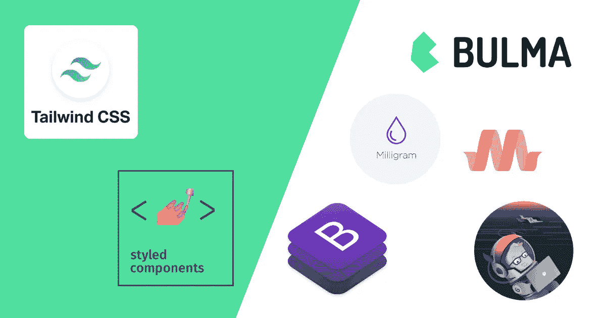

# 是的，这是 2021 年最好的 CSS 框架

> 原文：<https://itnext.io/yes-heres-the-best-css-framework-in-2021-2c9eb2ced678?source=collection_archive---------0----------------------->

我从 2007 年开始学习 CSS。是的，从那以后我们已经走了很长一段路了！

2021 年，前端增长过快。为每个项目从零开始做 CSS 很难，也很耗时。更不用说，选择正确的 CSS 框架也不是一件容易的事情。

我经常看到初级前端或后端开发人员问:**最好的 CSS 框架是什么？**

所以在多年来学习和使用了大量 CSS 技术之后，我想和你分享我认为**当今最好的 CSS UI 框架**。

2021 年的 CSS UI 框架

# 有 3 种 CSS 框架

在我们开始之前，你需要理解 3 种不同的 CSS 框架。做出正确的选择很重要。

## 1)预处理器和 CSS 变压器

这些是构建时框架，**它们默认不输出 CSS**。

**他们增加了不存在的功能，用来更快的写 CSS。**

我用过的比较有名的有:SASS，Less，Stylus，PostCSS。

**每个都有基于它们的其他框架或插件**。例如，用 SASS 编写的 Susy 可以更快地创建网格布局。

您将经常看到它们包含在前端框架或样板文件中。

**它们不是 CSS UI 框架**。

## 2) UI 套件&基于组件的 CSS 框架

这些是最常用的 CSS 框架。

它们带有一个预建的、自以为是的用户界面。这是我所知道的用 CSS 创建界面最快的方法。

但是他们也有他们的缺点。HTML 结构大多是预定义的，设计并不总是容易定制。

一言以蔽之:他们非常固执己见。

我从 2011 年开始用的:**自举**、**基础**、**骨骼**、**物化**、**毫克**、**布尔玛**。

## 3)原子/实用优先的 CSS 框架

原子 CSS 和实用优先 CSS 是非常相似的概念，我甚至可以说是相同的，并且它在最近 3~4 年变得非常流行。

两个主要原因是:**与样式组件**和**顺风 CSS** 反应。

简单地说:这两个概念都包括直接在 HTML 上编写 CSS 类或属性。

**所以它非常灵活**，你可以创建你想要的 HTML 结构，**但是用它来构建 UI 要比用基于组件的 CSS 框架慢得多**。

**如果你读过我的其他文章，你就会知道我的方向。**

# 好吧，那么什么是最好的 CSS 框架呢？

对我来说，最好的框架取决于 3 件事:**设计**、**时间**、**团队**。

*   如果设计是普通/无设计:**布尔玛**或**自举**
*   如果设计很复杂&我有时间:**顺风 CSS**
*   如果设计很复杂&我没有时间:**布尔玛** +很多自定义 CSS
*   如果我需要创建一个设计系统:**顺风 CSS**

根据我的团队的规模和技能，我不会选择相同的工具，在一些非常罕见的情况下，我会从头开始做 CSS。

如你所见:没有在所有情况下都完美的框架。

对于 webapps、管理仪表板和公共登录页面等大多数场景来说，**像布尔玛这样基于组件的框架是完美的**。

对于特定的登陆页面或非常注重设计的页面/网络应用，**像 Tailwind 这样的实用优先框架是完美的**。

## 好吧，为什么布尔玛超过了 Bootstrap 和其他人？

*   **基础**老旧，默认设计难以定制
*   Bootstrap 4 的 JS 部分依赖于 jQuery，但是 v5 似乎很有前途
*   对于大多数项目来说，骨架和毫克都太基本了
*   在我看来,太固执己见，有点过时了

**布尔玛优点**:

*   在大多数情况下，它有很多组件
*   默认情况下它是干净的&用 SASS 很容易定制
*   它有自己的一套实用程序类，因此两全其美
*   你只加载你需要的，tt 很容易扩展
*   文档清晰易读(重要)

布尔玛 CONS :

*   并非一切都是可定制的，在某些情况下，您需要进行 CSS 覆盖

## 为什么要像风格化组件这样的东西呢？

顺风 CSS 有一个很棒的 doc，并且一直在改进！

他们将 CSS 渐变、原生网格和变换添加到工具类中，由于可能组合的数量，这起初似乎是不可能的。

Tailwind CSS 也有很多基于它的预建模板，比如官方的 **Tailwind UI** 等等。

CSS-in-JS 或原子 CSS 框架，如 [Styled-components](https://styled-components.com/) 和 [ACSS.io](https://acss.io/) ，看起来一点也不像 CSS。不过性能稍微好一点，因为它会根据您写的内容动态创建样式表。

**但我更喜欢关注点的分离，而不是稍微好一点的表现。**

我尝试过的其他效用第一的框架，比如超光速粒子，我们也不够自然。顺风看起来是最自然和对开发者友好的。

**顺风弊**:

*   当您的项目增长时，编译可能会很慢，但是新的 JIT 编译器将会很好地解决这个问题。
*   如果你创建的应用程序必须生成定制的 CSS，比如 [Canva](https://www.canva.com/) 或者 [Webflow](https://webflow.com/) 这样的粒度模板构建器，这根本不合适。

# 结论

对我来说，布尔玛是最好的基于组件的 CSS 框架，但是我不会用它来做特定的设计或者创建我自己的 UI 套件或者设计系统。

如果你需要创建自己的 UI 套件、设计系统或特定页面，Tailwind 对我来说是最好的原子/实用优先 CSS 框架。

在这两种情况下，**您仍然需要为中大型项目编写一点 CSS** 。没有灵丹妙药。

目前处于测试阶段的 Bootstrap v5 似乎很有希望拥有自己的 SVG 图标集，

**我希望这能让你对 CSS 世界更清楚一点。**

PS:如果你是 Vue 开发人员，想学习如何创建高级组件，可以查看我的课程:[https://courses . maison futari . com/mastering-Vue-components-creating-a-ui-library-from scratch？优惠券=M](https://courses.maisonfutari.com/mastering-vue-components-creating-a-ui-library-from-scratch?coupon=PRESALE) EDIUM

有 50%的折扣，因为你来自这个故事。