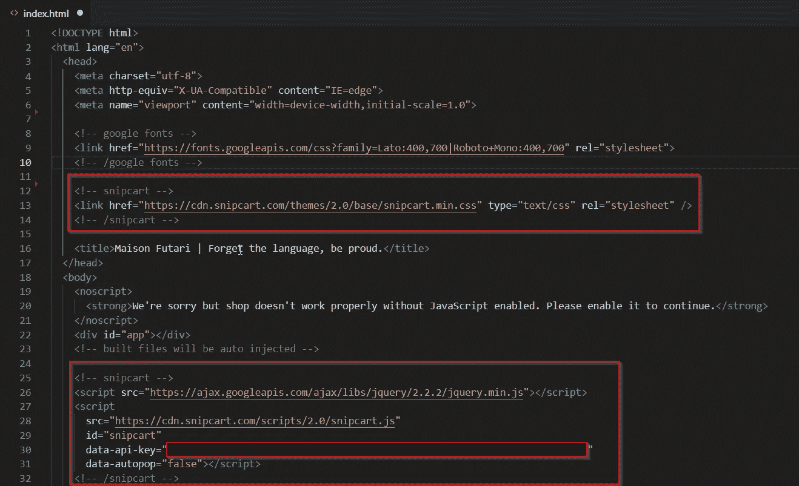
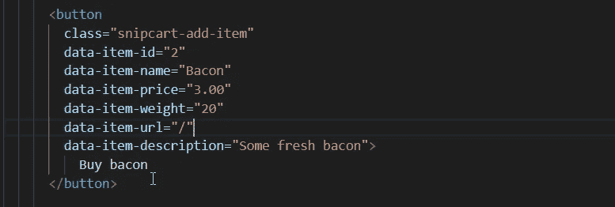
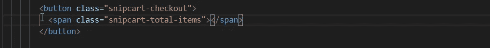
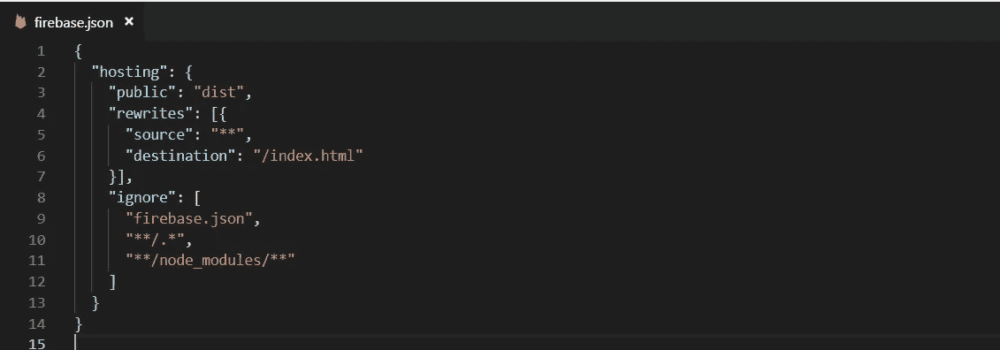

# 是的，我创建了一个没有后台的电子商务商店(无服务器，HTML，CSS & JS 而已)

> 原文：<https://itnext.io/yes-i-created-an-e-commerce-shop-with-no-backend-serverless-html-css-js-only-d62df47f4d99?source=collection_archive---------1----------------------->

是的，你没看错！我创建了一个电子商务(或电子商店)网站**，没有一行后端**编程语言。

在我的职业生涯中，我是一名前端开发人员(虽然我知道后端)。

因此，对于我最近的项目，也就是创建一个电子商务网站，
，我不想使用我常用的工具，因为它们都涉及到后端。

**/！\** 你可以在网站[这里](https://maisonfutari.com)看到它的运行。

## 有哪些工具可以用来创建一个电子商务网站？

作为一个从 PHP 起步的 web 开发者，我所知道的创建电子商店的工具是开源的 CMS，比如:Magento，Prestashop，WooCommerce，T10。

**问题**:它们涉及后端编程(这里我想避免)。

有一些替代的托管平台，比如: **Shopify，SquareSpace & Wix** 。

**问题**:如果你添加 CSS & JS 库，主题化**有时**会很痛苦。

我在想:是否有某种与平台相关联的 **API 来为我处理这件事？这样，我可以专注于前端(我想使用 Vue)。**

我就是这样遇到了**条纹结账**和**条纹订单**。

问题:结账很容易，但是处理库存和其他东西却很麻烦。

你可能会问，我最后做了什么？

## 完全随机地，我在脸书发现了 Snipcart

经过一番搜索和思考，我打算使用 Stripe，因为他们有很好的文档。幸运的是，当我在一个开发小组上阅读一些脸书的帖子时，我偶然发现了 Snipcart。

> 在 WordPress 博客、现有网站、SPA、JAMstack 项目上实现电子商务……任何东西！
> -snip cart 主页上的句子

这句话充满了承诺，填补了我的空白。

简而言之，Snipcart 有一个你可以添加的 SDK，就像任何其他 JS SDK 或库一样。这个 SDK 链接到你的 **Snipcart 账户**的 ID，在那里你可以管理订单、产品和其他东西(运费、税……！).

你只需要三样东西就能运转起来:

1.  注册并将 SDK 添加到您的网站。
2.  他们的爬虫必须在你的页面上找到产品定义
    (不是用 JS 动态地，静态地或者从服务器动态地)。
3.  在你的网站上任何你想要的地方添加一些“添加到购物车”按钮！

我决定用 Vue 做一个 **SPA，在 **Firebase hosting** 上托管(免费！).**

在那里，**我得到了我的第一个问题**。如果我使用 SPA，我的产品将不会在页面加载中呈现，除非**在标记中静态添加**我的产品。

从那里，3 个选项:静态 HTML 文件，SSR 或预渲染。
我决定使用 web pack**prerender-spa-plugin**进行**预渲染**。

*   对于**原生 JS** :你可以使用任何静态站点生成器，比如 **Jekyll** 、 **Hugo** …
*   对于**任何 JS SPA** :你可以使用 web pack**prerender-SPA-plugin**。
*   对于 **Vue，如果你知道 Nuxt** :你可以使用 **nuxt 生成** CLI 命令。

## 好吧，我们如何建立一个无服务的，只有前端的电子商务？

/!\ **重要的**，我在我的项目中使用了 Vue，但是它可以与任何框架一起工作**，甚至可以在没有框架**的情况下工作**。**

*   首先，在[https://snipcart.com](https://snipcart.com/)报名。
*   然后，在你的账户上，进入 **profile - > api keys** 或者跟随这个链接:[https://app.snipcart.com/dashboard/account/credentials](https://app.snipcart.com/dashboard/account/credentials)。
*   从那里，你会看到一段代码片段，基本上，只是一些链接到 **jquery 的**脚本标签**(耶…)&Snipcart SDK**和你的 **api 键**。
*   现在，使用 CLI 3 创建您的 Vue 项目(推荐)。
*   在 HTML 中，粘贴如下代码片段(CSS 也是)。

*   创建您的 Vue 实例并将其链接到路由器(vue-router)。
*   添加您的产品定义(id、价格、名称和 url 是必填项):[https://docs.snipcart.com/configuration/product-definition](https://docs.snipcart.com/configuration/product-definition)。

*   **数据项 url** 用于定位该产品定义呈现的位置。在订单的最后一步， **Snipcart** 将验证购物车中的产品是否与定义的产品相匹配。这是为了确保没有人**用 JS 更改价格**。
*   添加[**prerender-spa-plugin**](https://github.com/chrisvfritz/prerender-spa-plugin)以及要生成/渲染的 URL。
*   如果您想显示购物车中的**商品数量**，请添加以下内容:

*   这两个 CSS 类是强制性的，它们被 Snipcart 用来注入相应的数据:[https://docs.snipcart.com/getting-started/the-cart](https://docs.snipcart.com/getting-started/the-cart)。
*   现在，一切看起来都很好，用 **npm run serve** 测试一下，如果一切正常，用 **npm run build** 或 **yarn build** 构建。
*   主持！ [**在**](https://console.firebase.google.com)**[console.firebase.google.com](https://console.firebase.google.com)上创建一个 Firebase 项目** 。
*   进入菜单中的**主机**并按照说明进行操作。
*   当所有指令完成后，编辑 **firebase.json** 。

*   我们将 **public** 目录更改为 **dist** ，但是，如果您的 **build** 文件夹的名称不同，请将其重命名为您命名的 build 文件夹。
*   我们添加了一些重写以允许使用 SPA(除了现有文件或文件夹之外的所有 URL 都被重定向到 index.html，类似于 Apache 重写)。

就是这样！这就是我如何制作这个电子商务网站的。

我没有写一行后端，只使用了静态文件托管服务(它将与 AWS S3 一样，而不是 Firebase 托管)。

## 但是如果我需要添加一些后端第三方呢？

Snipcart 的界面让你可以**添加 web hooks**:[https://docs.snipcart.com/webhooks/introduction](https://docs.snipcart.com/webhooks/introduction)。

## 为什么我要这样做而不是常规工具？

一切都取决于上下文。

这个项目是:小，我没有太多的时间，我有很少的产品。

我只是想**使用我想要的前端技术**并专注于它，在这个 sens 中，Snipcart 真的是一个游戏改变者。

我的项目太大而不能只用 Stripe &太小而不能用 Woocommerce。

如果我只有**一个单品**、[、**条纹结账**、](https://stripe.com/checkout)或[、**购物按钮**、](https://fr.shopify.com/buy-button)就能很好地完成工作。反正都不是免费的。

我们在这里讨论的都是 [**JAMStack**](https://jamstack.org/) 哲学的一部分。我可能很快会写一整篇文章。

如果你喜欢会见国际/外国开发商，你会喜欢我做的产品:【https://maisonfutari.com】T4。