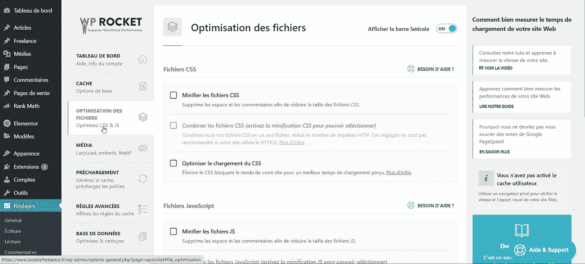
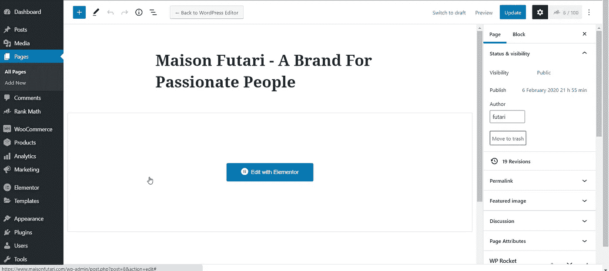
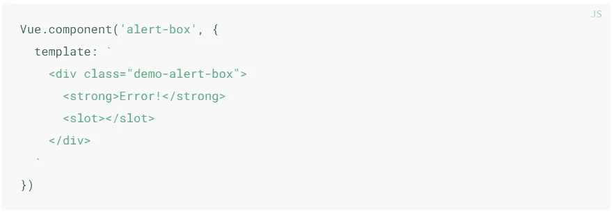
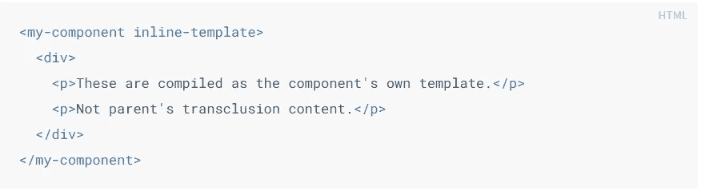
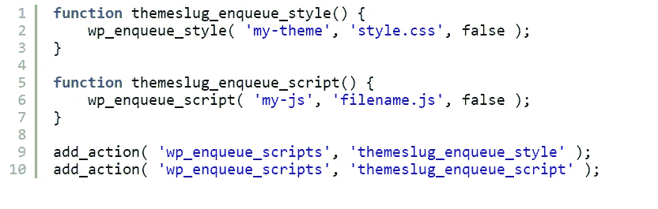
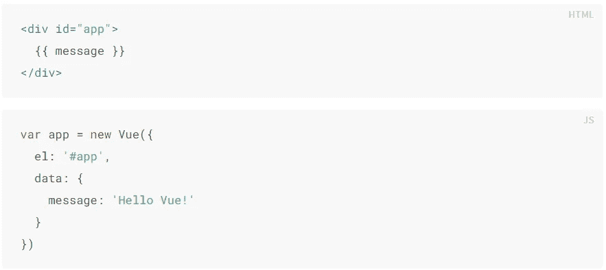
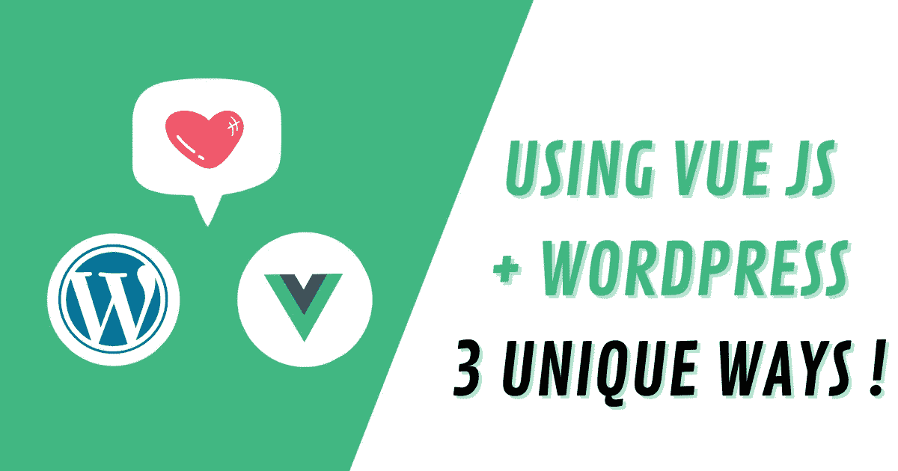

# 是的，这就是如何以 3 种独特的方式使用 Vue JS 和 WordPress

> 原文：<https://itnext.io/yes-this-is-how-to-use-vue-js-with-wordpress-in-3-unique-ways-7a676c085bfe?source=collection_archive---------0----------------------->

嗨！好久不见了对吗？

2021 年了，祝你新年快乐！

希望今年我能在媒体上写更多的故事。

既然闲聊已经结束，让我们开始讨论我的最新发现吧。

和我的大多数文章一样，**我的灵感来自我在 Vue JS 脸书小组**看到的一些东西。(*如果还没加入，* [*就这么做*](https://www.facebook.com/groups/vuejsdevelopers) *！).*

群里有人问: ***如何在 WordPress 中使用 Vue？***

**这里的“in”而不是“with”这个词很有意思，因为在 WP 中其实也有使用 Vue 的方法，也有使用 WP 的方法。**

作为一名高级前端开发人员和前 WordPress 开发人员，我对这个问题有点惊讶，因为答案对我来说似乎很明显。

**但是后来，我想起了一件事**。

前端世界发展如此之快，以至于对每个人来说都不是那么明显！

所以现在，我将向你展示在 Wordpress 中使用 Vue JS 和&的 **3 种清理方法**。

这些方法有不同的目标和不同的实现。

我将解释每一个在什么环境下有用，在什么环境下没用。

# 等等，为什么 Vue dev 会用 WordPress？

WordPress 代表了超过 25%的已知网络。

无论如何，你都有可能(或者已经)拥有它。

## 前端开发人员使用 WordPress 有两个主要原因

*   你没有后端技能，需要一个数据源+管理面板
*   你有一个已经在 WordPress 上的客户想要改变前端

# 为什么 WordPress dev 会使用 Vue？

最终原因是， **Vue 简单易学！**

其他实际原因是:

*   jQuery 不容易扩展，而且在很多情况下[会产生冲突](https://stackoverflow.com/search?q=jquery+conflict+wordpress)
*   使用一个独立的前端与可湿性粉剂作为 API 可以加快网站
*   Vue 是可组合的，会使插件、管理等的 UI 更容易

使用 Vue 意味着在 WP 生态系统中引入现代堆栈的优势。

但是，它可以是任何其他现代组件驱动的框架。

# 那么使用 WordPress 和 Vue 的三大方法是什么呢？

## 1.使用 Vue 在 WP 管理中创建一个 SPA 作为子网站/应用程序

你没想到会这样，对吗？

是的，你可以使用 Vue 在 WordPress 管理面板中创建一个“子网站”。

你可能会问，你为什么要这么做？

嗯，有时当创建复杂的插件或自定义管理页面时，你需要在管理面板中创建一个标签系统或多个页面系统。

使用常规的 WordPress 方法，每个管理页面都会重新加载，因此用户体验不会很好。

此外，当使用常规的 WP UI 元素时，它并不总是优雅的。

这是一个自定义管理页面的例子。

这是 WordPress 管理面板中 **WP Rocket** 插件的 UI。

正如你所看到的，用户界面是完全定制的，并且有自己的选项卡子页面。
每个标签匹配一个子 URL，这样就可以很容易地分享给其他人。

**这有点像 WP 管理面板中的一个迷你网站。**

您可以通过 Vue 和 Vue-router 轻松实现这一点。

只有一个棘手的部分:处理 URL。

是的，让两个“网站”共存是很棘手的。您可能会遇到 URL 冲突。

别担心，我会支持你的。

**您只需要在 Vue 路由器实例中更改两个选项:**

*   [base](https://router.vuejs.org/api/#base) 选项:用你自定义的 WP 页面路由设置值
*   [模式](https://router.vuejs.org/api/#mode)选项:设置值为“**哈希**

“**哈希**”模式将使用哈希，而不是更改完整的 URL。

**例如，也可以替换内容编辑器页面。**

这就是**元素或编辑器**的作用。

这个常规的 WP 编辑器转向…(带有子 URL 的散列)

基本上，你可以在管理面板中为任何东西创建一个子网站:**插件页面**，**编辑器**，**仪表板，中间办公室** …

简而言之，你可以使用 Vue CLI 或任何其他工具创建一个**独立的 Vue SPA** ，将路由器的 base + mode 选项设置为我之前说过的，导出它，**将它加载到右边的 WordPress** 中 [**WP 钩子**](https://developer.wordpress.org/reference/hooks/admin_enqueue_scripts/) 。

## 2.使用 Vue 在前端或管理上创建可重用的组件

更多的时候，在一个网站上，你会有一些微互动。

比如:菜单**切换**、**下拉**、**折叠**、**旋转木马** …

这就是我们所说的 UI 套件！

但是你也可以有一些 UI 与**数据异步交互** : **喜欢/投票按钮**，**表单**，**自定义媒体播放器** …

**/！\在 WP 或其他任何后端模板中使用 Vue 作为组件时，可能需要使用 Vue 的** [**运行时+编译器**](https://vuejs.org/v2/guide/installation.html#Runtime-Compiler-vs-Runtime-only) **版本。**

 [## 安装- Vue.js

### vue . js——渐进式 JavaScript 框架

vuejs.org](https://vuejs.org/v2/guide/installation.html#Runtime-Compiler-vs-Runtime-only) 

有些组件会与**渲染数据**交互，有些则不会。

根据这一点，您将不会创建相同类型的组件。

有些会有**自己的模板**，有些会使用**生成的标记**。

自己的模板

[使用现有标记](https://vuejs.org/v2/guide/components-edge-cases.html#Inline-Templates)

你甚至可以使用 Vue 生成本地 Web 组件**，你可以**跨项目重用这些组件**比如 ionicons(它是用 Stencil JS 制作的，但是你明白我的意思)。**

**这些组件既可以用在 WP PHP 模板中，也可以用在返回 HTML 的函数中。**

**通过将数据字符串化到一个全局变量或直接到组件属性，你可以将数据从 WP 传递到实例或组件。**

**想法是[加载 Vue](https://developer.wordpress.org/themes/basics/including-css-javascript/) 并将你的 Vue 实例链接到 html IDs。**

****

**加载您的 vue 组件 JS 和/或样式**

****

**上半部分在 WP 模板中，下半部分是用 wp_enqueue 加载的脚本**

## **3.使用 Vue 创建一个独立的前端网站和 WP 作为数据源**

**最后但同样重要的是。**

**这对你们中的一些人来说似乎是显而易见的，但并不是对所有人都是如此。**

**从 4.7 版本开始，WordPress 有了 REST API，所以你可以调用一些端点，获取数据(帖子、页面、借助插件的自定义字段……)。**

**这就是我们所说的**无头 CMS** 。**

**实际上，这些方法比你想象的更有效。**

**使用 WP REST API 的独立前端可能是:**

*   **水疗应用/网站**
*   **SSR 应用程序/网站**
*   **静态生成的网站(JAMStack)**
*   **一个 PWA**
*   **移动应用程序**
*   **另一个使用更简单/更快速的模板引擎的整体后端**

**简而言之，可以使用 API 的任何其他客户端，并且您可以完全控制前端。**

**基本上，WordPress 只是像后端 API 一样被用作数据源。像 ACF 或 Pods 这样的插件也可以在 API 中公开自定义字段。**

**你也可以在 WordPress API 中添加自定义端点，并使用 auth 系统生成 nonce 和其他东西。**

# ****有没有不使用 Vue + WP 的语境？****

**虽然知道你现在所知道的可能很有诱惑力，但是尝试使用 WP 来运行繁重的应用程序将是一个糟糕的决定。**

## ****你说的“重度应用”是什么意思？****

**我说的不是高流量的网站或类似的东西。**

**我说的是 SaaS，比如社交网络应用。**

**WordPress 是一个用于内容创作的 CMS。**

**当然，你可以用一堆插件创建一个社交网络，但我不建议你也这样做。**

## **对我来说，WordPress 和 WordPress + Vue 非常适合:**

*   **内容驱动的网站**
*   **内容驱动的网络应用**
*   **博客/新闻网站**
*   **电子商务(Woocommerce 也有 REST API)**
*   **投资组合/展示网站**
*   **公司/商业网站**
*   **私人内容网站(类似于 medium 的付费墙)**
*   **简单的 SaaS 应用程序(简单版本的 onlyfans 或 patreon)**

**简而言之:任何可以托管公共或私有内容的东西。**

# **我希望你喜欢这个… VUE！**

**如你所见，在 WordPress 中有 2 种方法使用 **Vue，在 WordPress** 中有 1 种方法使用 **Vue。****

**尽管实现是“无止境的”。**

**看利弊就看你自己了。**

**也就是说，我有更多的实际例子给你看，但是这个中等的故事会更长。**

****我反而做的，是准备一个完整的课程去** [**掌握 Vue + WordPress 组合**](https://courses.maisonfutari.com/how-to-use-vue-js-in-wordpress?coupon=PRESALE) **。****

**你会看到 [**7 种不同的实现**](https://courses.maisonfutari.com/how-to-use-vue-js-in-wordpress?coupon=PRESALE) 会让你爱上 WordPress 对于常用网站和 web apps 的应用。**

****现实生活中的 10 个循序渐进的项目实例，让你充分利用它。****

**这是预售，所以 2010 年 2 月之前的所有订单都有 30%的折扣。
[https://courses . maisonfutari . com/how-to-use-vue-js-in-WordPress？优惠券=预售](https://courses.maisonfutari.com/how-to-use-vue-js-in-wordpress?coupon=PRESALE)**

**不管你是否参加这个课程，我希望你能在这里学到一些东西！**

**再次祝新年快乐。**

****