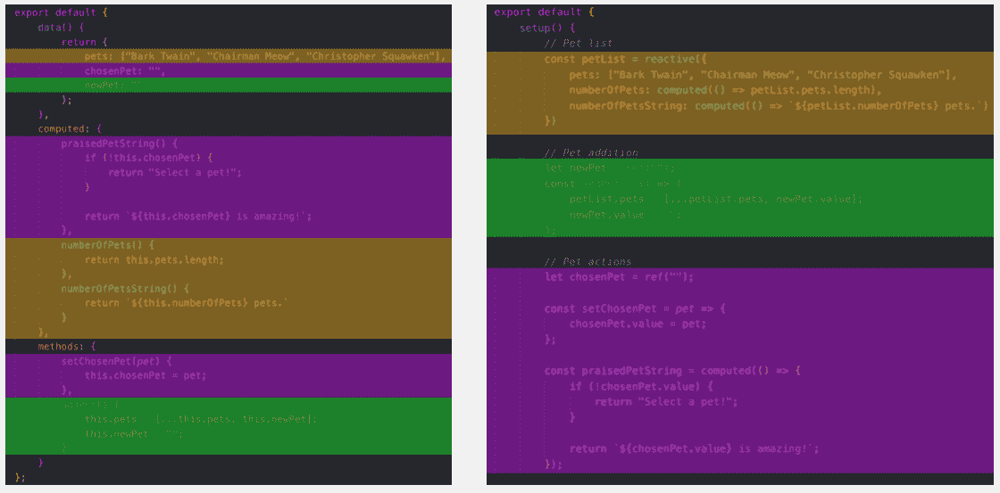
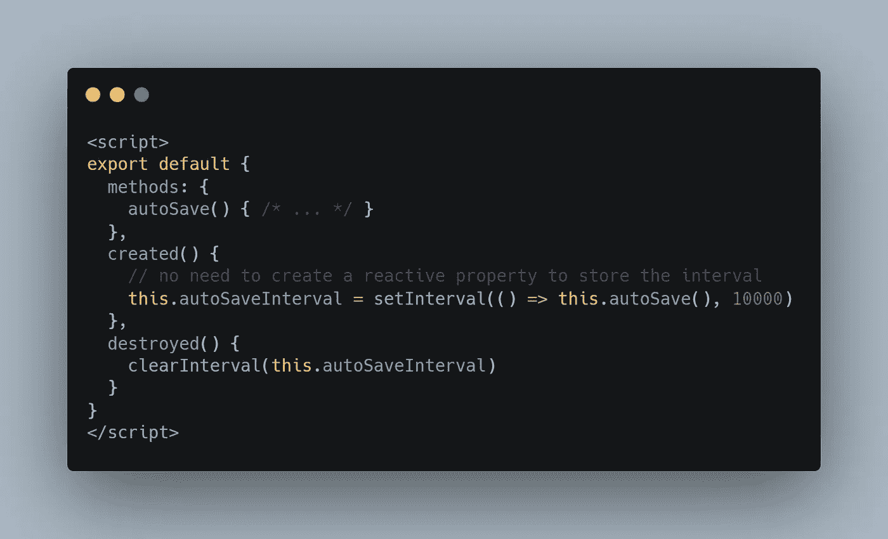
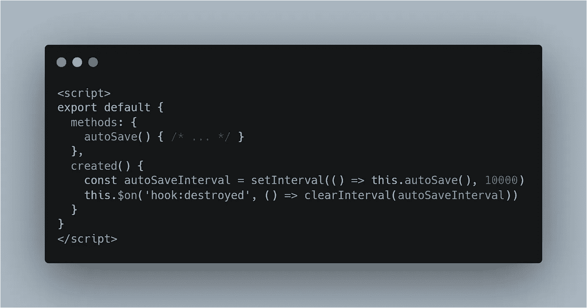
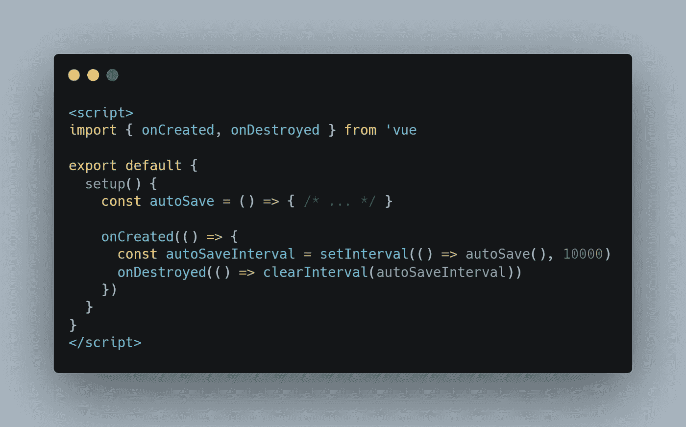
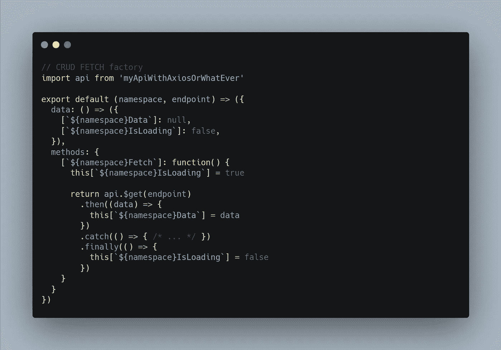
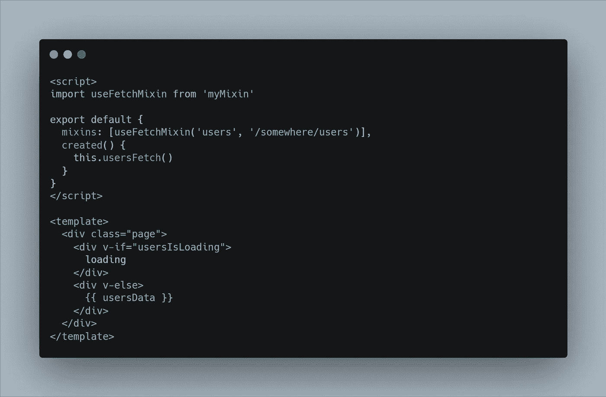
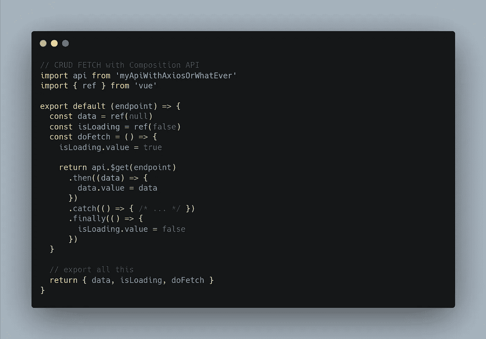
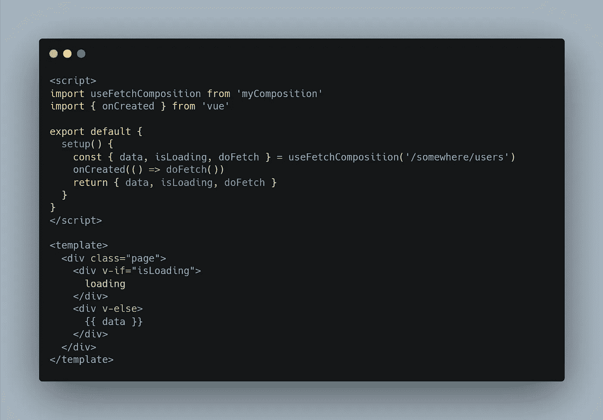
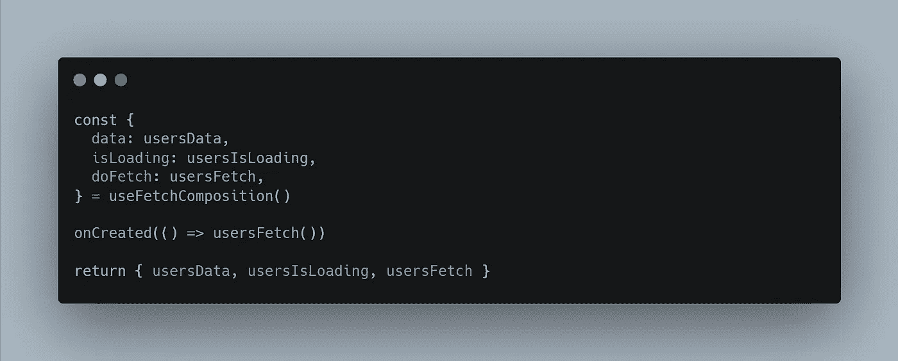

# 是的，Vue 3 出来了，但你可能不需要它🤷‍♂️

> 原文：<https://itnext.io/yes-vue-3-is-out-but-you-probably-dont-need-it-%EF%B8%8F-3e60634991b4?source=collection_archive---------1----------------------->

**我知道我知道**，这篇文章可能会引起一些热议🔥

为什么会有人说“你不需要 Vue 3”？

你甚至可能在想:又一篇关于 Vue 3 的文章。
是的，没错！**同中有异**。

别急，看完这个你就看清楚了。

**在本文中，我将并排比较如何用 Vue 2 API 实现 Vue 3，以及基本的 JavaScript 设计模式。**

为什么？因为有时候，你不能直接把项目迁移到 Vue 3，但还是希望自己的代码更好。

***如果你想要“长话短说”——跳到下一个粗体标题***

2020 年 9 月 18 日， **Vue 3.0.0 海贼王**问世🎉

这个版本带来了很多改进，在引擎盖下，也在它的 API。

**尤雨溪自己说 Vue 3 会:**更快，更小，更易维护，更本地友好，更容易使用。

最显著的变化毫无疑问是:**组合 API** 。

在 2019 年&到 2020 年之间的 **Vue 3 最终开发期间，已经有很多文章、视频和教程**在称赞合成 API** ，而对我来说，**觉得有些不对劲**。**

使用 Vue 2 和一些 JavaScript 设计模式，大多数支持组合 API 的观点都可以很容易地实现。

听我说完！我不是说 Vue 3 没用，我是说想换是因为它新，没有一个有意义的理由是没用的。

如果你读过我的其他故事，你就会知道我袖手旁观的 2 条简单规则:

*   关注概念和方法，而不是技术
*   为正确的任务使用正确的工具

**看什么时候用什么时候不用 Vue 3 依我拙见。**

# 何时使用 Vue 3，何时不使用

1.  如果你需要 IE11 支持:不要使用它，支持还没有到位
2.  如果您正在进行一个大型的现有项目:不要使用它，这取决于您的代码，迁移时间和性能收益可能不值得
3.  如果在一些优化之后，您还有性能问题:使用它
4.  如果您需要更好的 TypeScript 支持:使用它，它比以前好得多！
5.  如果你的依赖支持 Vue 3:使用它(队长明显说话👨‍✈️)

**最后，我鼓励任何不需要 IE11 支持的新项目使用 Vue 3。**

现在，让我们看看你认为你可能需要 Vue 3，但实际上不一定需要的特性。

# 简单来说，组合 API 是如何工作的？

所以基本上 Vue 2 中当前的**选项 API** 有一个很大的问题:它将**数据**、**方法**、**计算的**和**观察的**跨组件拆分。

它混合了各种担忧，也让推理变得更加困难。

**组合 API** 使得分组变得容易，因为**组件不再负责反应**。

这里有一个图像来说明。

选项 API vs 组合 API(来源:【www.infoq.com】T4)

但问题是…在 Vue 2 中也有这样做的方法(这里有点双关)。

# 以更聪明的方式使用 Vue 2 挂钩

所以基本上在 Vue 2 中，钩子是选项，所以它们在组件中也是分开的，但是有一个方法可以克服这个问题！

假设你有一个**自动保存**方法，你**每 10 秒**执行一次。您希望**间隔在组件被**创建**时开始**，在组件被**销毁**时**清除**。

通常您会这样做:

具有常规生命周期挂钩的选项 API

更好的集中方法是使用 **$on('hook:event '，func)**

带有生命周期挂钩事件的选项 API

这为您提供了与组合 API 相同的能力。

组合 API

# 使用工厂设计模式提取行为

新的 Composition API 的另一个重要特性是提取逻辑的能力。

Components 可以很好地用模板提取逻辑，但是在 Vue 2 中没有“好”的方法做到这一点…也许有！

**Mixins** 和 **Renderless 组件**来拯救！

假设我正在构建一个管理面板。在这个管理面板中，我在很多地方都有一个基本的 crud，但是有一个不同的 UI。我该怎么做？

用一个 mixin！但是 **mixins 合并了素材**，所以它可以创建**名称冲突**。我们该如何解决这个问题？有了工厂！

创建命名空间混合的工厂

使用提取逻辑的 Mixin 工厂的组件

正如你所看到的，我们刚刚创建了一个基于参数返回动态对象的函数。

这里的关键是**名称空间参数**。因为 ES6 可以基于变量动态创建对象键，所以我们可以为我们的**数据**、**方法**和**选择一个**前缀**，以避免名称冲突。**

我们来看一下与 Composition API 的区别。

返回正确数据的函数+一个函数

使用组合 API 提取逻辑的组件

当然**组合 API 更干净**，在简单的场景中你不需要名称空间。

但是**在更复杂的场景中**在同一个组件中有多个逻辑重用，**你也可能以名字冲突而告终**。

解决方案是重命名导出的变量，如下所示:

具有名称冲突预防的组合 API

最终，域名冲突是很容易避免的。

Vue 3 更好的地方是，Vue 3 中增强的 TypeScript 支持使得记录每个可重用函数对编辑器自动完成的作用变得更加容易。

Mixins 不容易记录为自动完成，因为它们在运行时由选项 API 查找来处理。

**重用逻辑的另一个好方法是使用无渲染组件！**

“那些是什么？”—我可以解释，但很长一段时间以来，这里有一篇关于顺风 CSS 的创造者亚当·瓦森的很好的深入文章:[https://adamwathan.me/renderless-components-in-vuejs/](https://adamwathan.me/renderless-components-in-vuejs/)

简而言之，无呈现组件是一个使用[作用域插槽](https://vuejs.org/v2/api/#vm-scopedSlots)向父插槽公开数据和方法的组件，不呈现任何模板，同时保持自己的作用域。

这是一种非常干净的创建逻辑重用的方式！

# 需要 Vue 3 的“参考”还是“反应”？用 Vue.observable！

在组合 API 中,“ref”和“reactive”方法使得任何值都是反应性的，有些人将其视为 Vuex 的替代。

虽然在很多情况下不是这样，但它可以用于简单的场景，Vue 2 也有类似的东西:Vue.observable( …)。

这里有一个关于 JSfiddle 和 Vue doc 的实际例子:[https://jsfiddle.net/darkylmnx/eL64o5x7/](https://jsfiddle.net/darkylmnx/eL64o5x7/)&&[https://vuejs.org/v2/api/#Vue-observable](https://vuejs.org/v2/api/#Vue-observable)

# 多重虚拟模型

在 Vue 3 中，你可以在同一个组件上使用多个 v-model，这实际上是 Vue 2 已经有的双向数据绑定的语法糖:[https://Vue js . org/v2/guide/components-custom-events . html # sync-Modifier](https://vuejs.org/v2/guide/components-custom-events.html#sync-Modifier)

# 在 Vue 2 中不能做的事情

## 一个组件中有多个 DOM 根

这是 Vue 3 的新特性之一，在 V2 不可能做到这一点，除非使用带有“渲染”选项的[功能组件。](https://vuejs.org/v2/guide/render-function#Functional-Components)

## Vue 传送

标签<teleport>是 Vue 3 中的一个新的本地组件，在 Vue 2 中没有，但是你可以使用做同样事情的 [portal-vue](https://github.com/LinusBorg/portal-vue) 插件。</teleport>

## 悬疑成分

这实际上取决于每个用户的界面，但是做一个“暂停”行为来缩小到“正在加载”状态是非常简单的。

# 结论:能坚持用 Vue 2 吗？

是的。

是不是意味着永远不要用 Vue 3？不要！

**正如我所说，没有必要将你的整个项目切换和迁移到 Vue 3，除非它足够小或有很大的性能问题，但除此之外，我鼓励你在 IE 11 不存在的项目中使用 Vue 3。**

这篇文章只是让你意识到，为了炒作而炒作并不总是必要的。做一个好的开发者就是知道如何适应。

希望你喜欢这篇文章。我试图使它简短，并以这种形式给你尽可能多的知识。

PS:如果你想学习如何创建高级组件，请查看我的课程:[https://courses . maisonfutari . com/mastering-vue-components-creating-a-ui-library-from-scratch？优惠券=M](https://courses.maisonfutari.com/mastering-vue-components-creating-a-ui-library-from-scratch?coupon=PRESALE) EDIUM

有 50%的折扣，因为你来自这个故事。