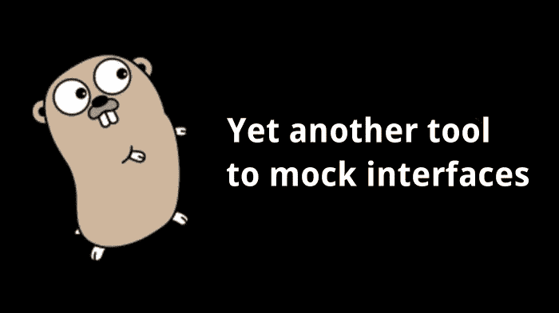
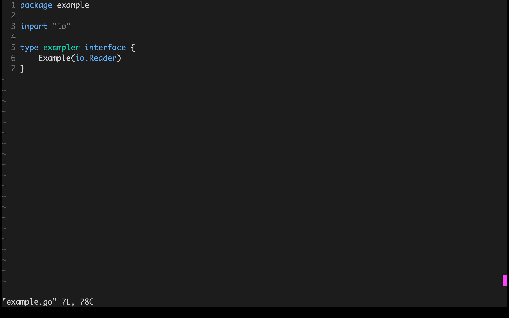

# 又一个模仿 Go 接口的工具

> 原文：<https://itnext.io/yet-another-tool-to-mock-interfaces-in-go-73de1b02c041?source=collection_archive---------0----------------------->



作为一个强大的工具，单元测试能够检查代码行为的每个方面。如果你记住了代码测试的需求，你将会写出可持续和可维护的代码。依赖于抽象的设计良好的代码易于测试，因此代码的可测试性也可以作为其质量的指标。

如果你已经尝试过在 Go 中测试代码，你可能知道接口有多有用。Go 标准库为你提供了一系列接口，你可以在你的代码中使用这些接口，其中大多数只包含一个方法。

Go 还有一个补充的[框架](https://github.com/golang/mock)，用来帮助模仿界面和一堆共享类似功能的其他社区驱动的包。它们中的大多数提供了生成实现给定接口的结构的能力；如果一个接口很大或者它嵌入了其他接口，这是非常有用的。但是一个接口只有一个方法是不是太多了？

关于 Go 中的接口，最令人惊奇的部分是它们被隐含地满足了。任何类型只要提供签名与接口声明匹配的方法，就能满足接口的要求。这种类型甚至可以是一个函数，如果你熟悉包`net/http`，你可能已经见过其中一个类型，也叫做`adapters`。

正如您所看到的，`adapter`本身是一个函数类型，具有与接口方法声明相同的签名，它通过在相应的方法中调用自己来实现一个接口。这个`adapter`允许通过具有适当签名的任何函数来实现`Handler`。它是模拟接口的通用工具，在表驱动测试中看起来非常方便。例如，下面是应该测试的代码:

随着`adapter`的使用，单元测试可能看起来像这样:

编写这样的`adapters`真的很烦人，所以我决定为它们的自动生成编写一个工具，并将其命名为 [adapt](https://github.com/romanyx/adapt) ，这个工具为指定的接口生成一个`adapter`并将其打印在输出中。您只需要传递一个包名和一个接口名来生成它。

```
$ adapt io Reader
type readerFunc func([]byte) (int, error)

func (f readerFunc) Read(p []byte) (int, error) {
	return f(p)
}
```

您还可以在包文件夹中调用`adapt`来为一些包接口生成适配器。

```
$ cd $GOPATH/src/github.com/x/execute Doer
$ adapt Doer
type doerFunc func() (int, error)

func (f doerFunc) Do() (int, error) {
	return f()
}
```

它附带了一个方便的 [vim 插件](https://github.com/romanyx/vim-go-adapt)，可以在 vim 中生成一个`adapter`。



希望你会发现它很有用。