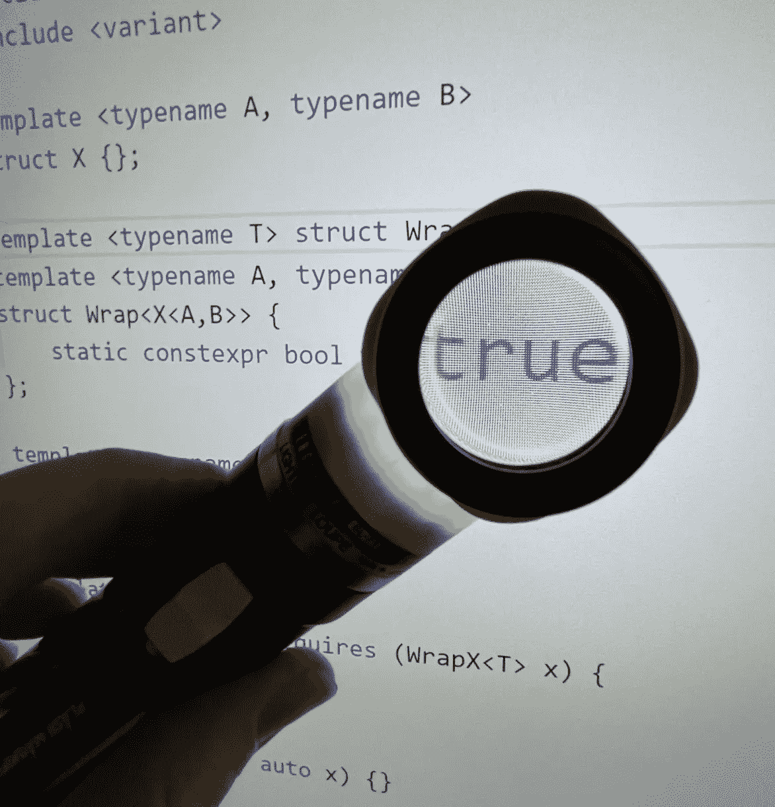

# 你做代码审查是错误的

> 原文：<https://itnext.io/you-are-doing-code-reviews-wrong-e0b16ce8812b?source=collection_archive---------0----------------------->

正确地进行代码审查是困难的。在这篇短文中，我将引导您完成代码评审的目标，并讨论在您的组织中实现代码评审的增量层次。



# 代码评审的非目标

我将从什么是代码评审开始。

代码评审不是设计评审。如果您经常在代码评审期间讨论设计，那么您的团队流程中的某个地方就会出现系统故障。编写代码就是实现一个达成一致的设计。因此，在审查代码时，设计不应该成为争论的焦点。

代码审查不是测试。如果您花费时间来确定代码更改是否如预期的那样工作，这是一个明确的信号，表明您的测试覆盖范围不够，您正在浪费宝贵的开发人员时间。

代码评审的主要目标是加速开发、改善知识分布、更好地利用领域专家和消除摩擦。我们将在经历不同级别的代码评审时讨论这些目标。

# 提升您的代码评审水平

如果你没有进行代码评审，或者觉得你没有从代码评审中获得很大的价值，下面的级别将允许你建立你的评审管道。

## 0 级—全自动审查

0 级代码评审更多的是一种门控技术，因为没有人参与评审过程。

*   检查和实施代码格式化
*   检查代码样式冲突
*   检查失败的测试
*   检查静态检查工具报告的错误

研究哪些工具可以为你的语言自动运行，并设置它们。花时间设置这些检查几乎总是值得的，因为好处是倍增的(开发人员的数量)和复合的。我还建议花时间建立一种在本地运行这些检查的方法，这样每个开发人员甚至可以在将代码更改发送给代码评审之前检查他们的代码更改是否符合规范。如果你使用的是 *git* ，看看*预提交*框架作为起点。

**审稿:**自动化

**目标:**速度，通过统一减少摩擦

成本:可以忽略不计

## 0.5 级—人工判断的自动审查

在一些自动化检查上设置一个硬阈值可能会对代码质量有害。

例如，如果代码更改引入了一个新特性，如果它也降低了性能，这可能是没问题的。无论哪种方式，自动运行性能测试是值得的，但是需要人工批准或请求更改。

**评审员:**自动化，由高级团队成员批准，最好是做产品级决策的人

**目标:**速度，更好地利用领域专家

**成本:**可忽略不计

## 级别 1 —纯可读性审查

如果你想做一个精益版本的代码审查，这就是它。纯粹的可读性检查是在回答一个简单的问题。代码可读吗？这里我指的是一个特定的属性:“代码在做什么很明显吗？”。这里有两个可能会被混淆为相反的代码片段。

下面是一个不可读代码的示例:

```
int Update(vector<User>& users) {
    int sum = 0;
    for (auto &user : users) {
        sum += Calculate(user);
    }
    return sum;
}
```

这个片段不可读，因为不清楚这里发生了什么。我们到底在计算什么？为什么函数叫`Update`，是在更新什么东西吗？或许`Calculate`会改变`user`的状态？

以下是可读代码的示例:

```
float sin_taylor(float x) {
    // Taylor series approximation for sinus function:
    // [https://en.wikipedia.org/wiki/Taylor_series#Approximation_error_and_convergence](https://en.wikipedia.org/wiki/Taylor_series#Approximation_error_and_convergence)
    assert(x > -1 && x < 1); // only precise for (-1,1)
    return x - (x*x*x)/(3*2) + (x*x*x*x*x)/(5*4*3*2*1) - (x*x*x*x*x*x*x)/(7*6*5*4*3*2);
}
```

这里发生的事情很清楚。更多关于公式的信息被链接，代码只是维基百科上列出的数学公式的扩展。

可读性检查可以让初级开发人员更加熟悉代码库，从而达到双重目的。幸运的是，初级开发人员也能很好地判断哪些代码是可读的。

**评审:**初级团队成员

**目标:**速度，分享知识

**成本:**小

## 1.5 级—语言可读性审查

语言可读性在大组织中变得很重要。它的作用与 linters 相似，但是在 linters 有限的地方，人们可以检查代码的风格和语言的习惯用法，即使是在复杂的情况下。但很明显，成本要高得多。

语言可读性审查的主要目标是减少摩擦，增加整个组织的语言知识。它确保一个团队不会以与另一个团队完全不同的方式使用特定的语言或库或服务。通过这个回顾，开发人员将随着时间的推移学习使用语言、库或服务的惯用方式。

这个审查应该完全集中在语言(或库等)的正确使用上。)并应依赖批准的指南(而非主观偏好)。

**审核者:**基于既定准则的语言/库专家

**目标:**通过统一减少摩擦，分享知识

**成本:**重大

## 第 2 级—所有权审查

所有权审查的目的是让维护者确认他们接受这段代码的所有权。但是，当然，这到底意味着什么将根据上下文，尤其是维护者而有所不同。

这次审查的典型重点领域是:

*   地方风格的考虑
*   本地专家知识(例如正确使用内部库)
*   维护负担

在团队可以为彼此的项目交叉贡献以交付他们需要的特性的环境中，这种审查变得非常重要。这同样适用于许多开源项目，因为它们从外部贡献接收代码变更。

**审核人:**项目/库维护人员或高级开发人员

**目标:**速度，更好的利用领域专家

**成本:**显著

# 挑什么

呈现的级别建立在彼此之上。因此，举例来说，如果 0 级评审不完整，那么进行 1 级评审是没有意义的。然而，你不一定要使用所有的水平。

以下是基于您的项目的一些建议:

*   **小型开源项目:**0 级+2 级
*   **中型开源项目:**0 级+1 级+2 级
*   **大开源项目:**0 级+0.5 级+1 级+2 级
*   **单队公司:**0 级(+0.5 级)+1 级
*   **多团队公司:**0 级+0.5 级+1 级+1.5 级+2 级

# 感谢您的阅读

感谢您阅读这篇文章。你喜欢吗？

我也在 YouTube 上发布视频。你有问题吗？在推特[或 LinkedIn](https://twitter.com/SimonToth83) 上联系我。