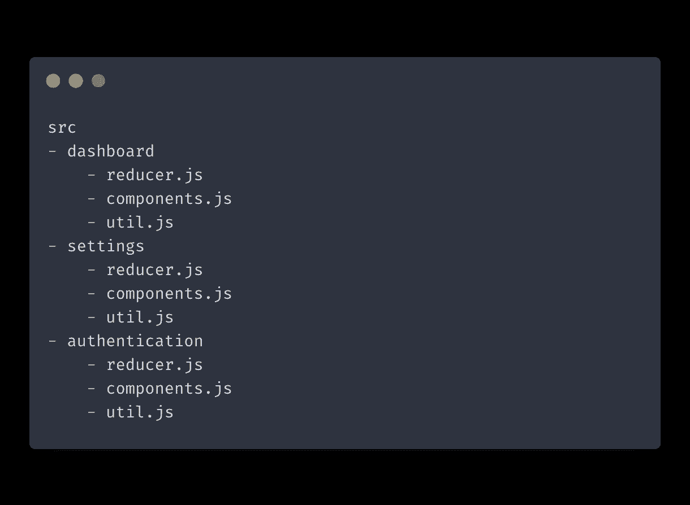

# 你重构代码完全错了

> 原文：<https://itnext.io/you-are-refactoring-code-all-wrong-6fbace36afba?source=collection_archive---------1----------------------->

作为一名软件开发人员，你很早就知道重构的重要性。你经常会听到“降低代码复杂度”和“增加可用性”这样的时髦词。但是什么是正确的方法呢？

虽然重构显然很重要，但最终目标可能是模糊的。你需要知道你为什么要这么做，并且在执行任务时有一个清晰的策略。

# 重构的错误理由

首先，让我们掩盖错误的重构理由。

## 为了分解而分解

一开始，我认为重构主要是为了保持我的函数和类小。我相信这就是让我的代码变得更好所需要的一切。

但事实并非如此。

这叫做为分解而分解，对改进代码没有任何帮助。让我们来看看这个例子:

这是一个巨大的函数，当然我可以通过拆分它来改进它。对吗？让我们试试:

`processInventory`现在更小了，代码第一眼看上去确实更干净了。然而，就解耦而言，它并不比我们以前的产品好多少。你不能轻易重用这些代码。

我们的类仍然缺少好代码的基本属性:**可预测、可重用和可测试。**我们将分解这些属性，然后回来以正确的方式重构上面的代码。

## 壁橱类比

你也可能在重构工作中走得太远。您可能最终会创建不必要的抽象层，这实际上会损害代码的可读性。

一个很好的类比就是整理一个壁橱。如果你把所有的衣服都扔在地板上，那会很乱。如果你花时间把你的衬衫、裤子和鞋子整齐地分开，你的衣柜会变得更整洁，你会发现事情变得更容易。

但是，如果你继续努力，试图为你衣柜里的每一件物品找到一个独特的位置，你会花几个小时清理你的衣柜，结果不会比你开始时的混乱好多少。

所以尽量避免仅仅为了保持代码小而抽象和拆分代码。

那么问题是，你为什么要重构？我认为实用重构有两个目标:

*   去耦码
*   代码内聚性

# 去耦码

如前所述，解耦代码有三个主要属性:

*   这是可以预见的
*   这是可以测试的
*   它是可重复使用的

## 可预测代码

给定相同的输入，可预测的代码将总是返回相同的输出。它对任何外部变化都是不可知的。如果我们专门谈论函数，可预测函数也被称为[纯函数。](https://en.wikipedia.org/wiki/Pure_function)

一个简单的使函数纯净的方法是使用[依赖注入移除任何内部状态突变。](https://en.wikipedia.org/wiki/Dependency_injection)让我们来看看我们之前写的`requestInventory`方法:

在我们的函数中，我们通过重新分配`this.inventoryItems`来改变外部状态。这是一个副作用，应该避免，因为它使我们的功能更难预测。让我们通过提供`inventoryItems`作为参数来简化这个函数:

修复是琐碎的，但仍然是重要的——最糟糕的代码味道通常是最容易修复的。

要了解更多关于节点应用程序上下文中的依赖注入，请查看我的[帖子。](https://isamatov.com/node-js-dependency-injection-container/)

## 可测试代码

这个属性伴随着可预测性，因为您不能测试不可预测的代码。

对于任何项目，重要的是要有强大的测试用例作为后盾。然而人们经常避免这样做，通常是因为他们意识到他们的代码很难测试。

这就是为什么当你写你的代码时，你应该问你自己:“写这个代码的测试用例有多容易？”如果你认为测试你写的函数会很难，重构它。

## 可重用代码

现在我们来谈谈可重用性。

编写可重用代码的北极星是[单一责任原则](https://en.wikipedia.org/wiki/Single-responsibility_principle)。这仅仅意味着你的函数应该被设计成做一件事。这里有一个例子:

`processInventory`目前正在做两件事:显示加载器和处理请求。在当前状态下，这个函数不太可重用。所以让我们把它分开:

这样更好。`processInventory`的重要棋子现在在`updateInventories`方法中，可以重用。

# 代码内聚性

现在让我们来看看项目中的[代码内聚](https://en.wikipedia.org/wiki/Cohesion_%28computer_science%29)。

## 特征内聚性

从高层次来看，任何应用程序都只是一组独特功能的集合。并不是所有的人都有联系。事实上，很多人都不知道。

这就是为什么我认为在按功能分组之前，最好围绕特定特性对代码进行分组。让我解释一下我的意思。

假设您正在开发包含三个不同页面的 React 应用程序:仪表板、设置和身份验证。每个页面都有缩减器、动作、组件、容器和实用方法。

我建议您首先围绕主页面构建代码和文件。因此，项目结构可能是这样的:

特征优先的项目结构

以这种方式构建代码的好处是它适合您的典型工作流。你很少会发现自己同时处理多个不同的特性。通常，我们一次只关注一个。如果这些文件都在同一个文件夹中，那么在它们之间切换就不那么费力了。

## 功能衔接

在按特性对代码进行分组后，可以开始按功能对部分代码进行分组。

并不是所有的代码都需要这样分组。这种分组的候选者是在多个地方使用的代码片段，并且不依赖于特定的特性。这是一个你有信心会继续重用的代码。一些例子是应用程序范围的实用程序方法、API 请求客户端和接口。

如果从头开始一个项目，您可以同时根据特性和功能对代码进行分组。

希望这篇文章能对重构背后的最终目标有所启发。

如果做得正确，重构是一个很好的练习，将有助于扩展您的代码库并保持其质量。

*原载于 2021 年 5 月 31 日 https://isamatov.com***。**