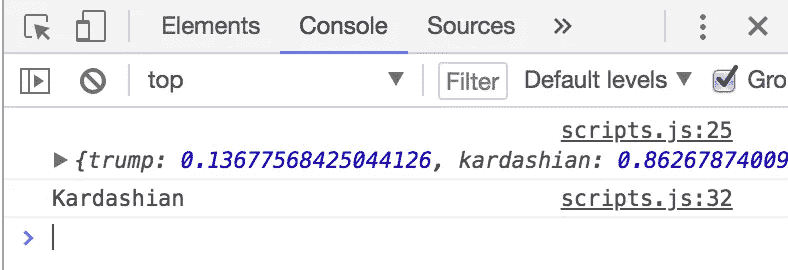
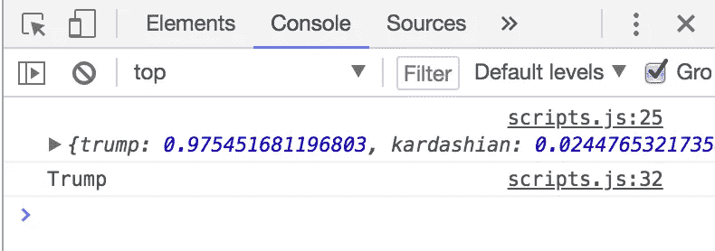

# 即使你并不真正理解神经网络，你也可以用 JavaScript 构建一个神经网络

> 原文：<https://itnext.io/you-can-build-a-neural-network-in-javascript-even-if-you-dont-really-understand-neural-networks-e63e12713a3?source=collection_archive---------1----------------------->


# **设定期望值……**

(如果你只是想继续，跳过这一部分……)

我真的应该从承认我不是神经网络或机器学习方面的专家开始。老实说，大部分内容仍然让我困惑。但希望这能鼓励任何可能正在阅读这篇文章的非专家同事，他们渴望涉足磁共振成像。

机器学习是不时会出现的事情之一，我会对自己说“是的，那会很酷…但我不确定我是否想在接下来的几个月里学习线性代数和微积分。”

然而，像许多开发人员一样，我非常擅长 JavaScript，偶尔会寻找用 JS 实现的机器学习的例子，结果却发现了大量关于 JS 对于 M.L .来说是一种多么糟糕的语言的文章和 StackOverflow 帖子，的确如此。然后我会分心，继续前进，认为他们是对的，我应该继续验证表单输入，等待 CSS 网格起飞。

但是后来发现 Brain.js 我就被震住了。这只藏在了*的哪里？！文档写得很好，很容易理解，在开始的大约 30 分钟内，我就建立并训练了一个神经网络。事实上，如果你想跳过整篇文章，只看 GitHub 上的[自述](https://github.com/BrainJS/brain.js)，请便。真的很棒。*

也就是说，接下来的不是关于神经网络的深入教程，而是深入研究隐藏的输入层、激活函数或如何使用 Tensorflow。相反，这是一个关于如何实现 Brain.js 的非常简单的初级解释，有点超出了文档的范围。

# **好吧，让我们做点什么…**

这是我们将要做的事情的概要:

1.  创建您的起始文件
2.  决定你想要你的神经网络做什么
3.  建立 Brain.js 并弄清楚如何处理训练数据和用户输入
4.  收集一些训练数据
5.  运行神经网络
6.  利润？

如果你更喜欢下载这个项目的工作版本，而不是跟随文章，那么你可以在这里克隆 GitHub 库。

## **1 —起始文件**

创建一个新目录，并在其中放入一个好的 ol '*index.html*样板文件。然后创建三个 js 文件: *brain.js* 、 *training-data.js* 和 *scripts.js* (或者您为您的默认 JS 文件使用的任何通用术语)，当然，在您的 index.html 文件的底部导入所有这些文件。


看看文件结构不会有什么坏处

到目前为止很简单。

现在到[这里](https://raw.githubusercontent.com/harthur-org/brain.js/master/browser.js)获取 Brain.js 的源代码，复制&粘贴**整个东西**到你的空 *brain.js* 文件，点击保存，嘭:4 个文件中有 2 个完成了。

## 2 —“我的目标是什么？”

接下来是有趣的部分:决定你的机器将学习什么。有无数的实际问题，你可以用这样的东西来解决；例如情感分析或图像分类。我碰巧认为将文本作为输入进行处理的 M.L .应用程序特别有趣，因为你几乎可以在任何地方找到训练数据，它们有各种各样的潜在用例，所以我们在这里使用的例子将是一个处理分类文本的例子:

我们将确定一条推文是由唐纳德·特朗普还是金·卡戴珊写的。

好吧，所以这可能不是最有用的应用。但是 Twitter *是*机器学习素材的宝库，尽管它可能毫无用处，但我们的 tweet-author-identifier 将说明一个非常强大的观点。一旦经过训练，我们的神经网络将能够查看以前从未见过的推文**然后能够通过识别他们所写内容的模式来确定它是由唐纳德·特朗普还是由金·卡戴珊写的。为了做到这一点，我们需要向它提供尽可能多的训练数据，以复制/粘贴到我们的 *training-data.js* 文件中，然后我们可以看看我们是否能找到一些 tweet 作者。**

## **3 —设置&数据处理**

现在剩下要做的就是在我们的 *scripts.js* 文件中设置 Brain.js，并在我们的 *training-data.js* 文件中输入一些训练数据。但是在我们做任何事情之前，让我们从 30，000 英尺的高度来看所有这些是如何工作的。

设置 Brain.js 非常简单，所以我们不会在这上面花太多时间，但是有一些关于它将如何期望其输入数据被格式化的细节，我们应该先看一下。让我们先来看一下文档中包含的设置示例(我在这里稍微修改了一下),它很好地说明了这一切:

首先，上面的例子实际上是一个工作的人工智能(它会查看给定的颜色，并告诉你黑色文本或白色文本在上面会更易读)。这很有希望说明 Brain.js 是多么容易使用。只要实例化它，训练它，运行它。就是这样。我的意思是，如果你内联训练数据，这将是 3 行代码。相当酷。

现在让我们花一分钟来谈谈训练数据。在上面的例子中，除了训练数据的整体`input: {}, output: {}`格式之外，还有两件重要的事情需要注意。

首先，数据不需要完全相同的长度。正如您在上面第 11 行看到的，只有一个 **R** 和一个 **B** 值被传递，而其他两个输入传递一个 **R** 、 **G** 和 **B** 值。此外，尽管上面的示例将输入显示为对象，但值得一提的是，您也可以使用数组。我提到这一点主要是因为我们将在项目中传递不同长度的数组。

其次，这些不是有效的 RGB 值。如果你真的使用它，它们中的每一个都会变成黑色。这是因为**输入值必须在 0 和 1 之间，Brain.js 才能使用它们。**因此，在上面的例子中，每种颜色都必须经过处理(可能只是通过一个将它除以 255(RGB 的最大值)的函数)才能工作。我们也会做同样的事情。

## 3.1 —编码()

因此，如果我们希望我们的神经网络接受 tweets(即字符串)作为输入，我们需要通过一个类似的函数(下面称为`encode()`)来运行它们，该函数会将字符串中的每个字符转换为 0 到 1 之间的值，并将其存储在一个数组中。幸运的是，Javascript 有一个将任何字符转换成 ASCII 代码的本地方法，叫做`charCodeAt()`。因此，我们将使用它，并将结果除以[扩展 ASCII](http://www.theasciicode.com.ar/) 字符的最大值:255(我们使用**扩展的** ASCII，以防我们遇到任何类似**或的意外情况)，这将确保我们得到值< 1。**

## **3.2 —处理培训数据()**

**此外，我们将把我们的训练数据存储为纯文本，而不是最终将输入我们人工智能的编码数据。-你以后会为此感谢我的。因此，我们需要另一个函数(下面称为`processTrainingData()`)将前面提到的编码函数应用于我们的训练数据，有选择地将文本转换为编码字符，并返回一组训练数据，这将很好地与 Brain.js 一起使用**

**下面是所有代码的样子(这将放入您的“scripts.js”文件中):**

**31 行。差不多就是这样。**

**您会注意到，在前面显示的文档示例中没有出现的内容(除了我们已经讨论过的两个帮助函数)出现在第 20 行的`train()`函数中，该函数将训练好的神经网络保存到一个名为`trainedNet`的全局变量中。这使我们不必每次使用神经网络时都要重新训练它。一旦网络被训练并保存到变量中，我们就可以像调用函数一样调用它，并传入我们的编码输入(如`execute()`函数中第 25 行所示)来使用我们的人工智能**

**好了，现在你的 index.html、 *brain.js* 和 *scripts.js* 文件已经完成了。现在我们只需要在 training-data.js 中放些东西，就可以开始了。**

## ****4 —列车****

**最后但同样重要的是，我们的训练数据。正如我提到的，我们将所有的推文存储为文本，并动态地将它们编码为数值，当您实际需要复制/粘贴训练数据时，这将使您的生活更加轻松。不需要格式化。只需粘贴文本并添加一个新行。**

**将它添加到您的“training-data.js”文件中，您就完成了！**

***注意:虽然上面的例子只显示了每个人的 3 个样本，但是我每个人用了 10 个；我只是不想让这个样本占用太多空间。当然，你的神经网络的准确性会随着你给它的训练数据量成比例增加，所以你可以随意使用比我多或少的数据，看看它如何影响你的结果***

## ****5 —执行****

**现在，要运行你新训练的神经网络，只需在你的“script.js”文件底部添加一行代码，调用`execute()`函数，传入特朗普或卡戴珊的推文；确保 console.log 它，因为我们还没有构建 UI。这是金·卡戴珊的一条推文，它不在我的训练数据中(也就是说，该网络以前从未遇到过这条推文):**

```
console.log(execute("These aren't real. Kanye would never write Yeezy on the side"));
```

**然后在本地主机上打开你的 index.html 页面，查看控制台，然后…**

****

**在那里！该网络正确地识别出一条从未见过的推文来自金·卡戴珊，确定性为 86%。**

**现在让我们用特朗普的推文再试一次:**

```
console.log(execute("Whether we are Republican or Democrat, we must now focus on strengthening Background Checks!"));
```

**而结果…**

****

**又是一条前所未见的推文。再次，正确识别！这次有 97%的把握。**

## ****6 —利润？****

**现在你有了一个神经网络，可以对你想要的任何文本进行训练！你可以很容易地利用它来识别电子邮件或公司在线评论的情绪，识别垃圾邮件，对博客文章进行分类，确定一条消息是否紧急，或者数千种不同的应用程序中的任何一种。尽管我们的 tweet 标识符毫无用处，但它仍然说明了一个非常有趣的问题:像这样的神经网络可以执行像根据某人的写作方式来识别他们这样细微的任务。**

**因此，即使你不去创建一个由机器学习驱动的创新或有用的工具，这仍然是你的开发人员工具带中的一个很好的体验。你永远不知道它什么时候会派上用场，或者甚至在未来开辟新的机会。**

***同样，所有这些都可以在 GitHub repo 中找到:***

**[](https://github.com/lordpoint/neural-network-author-classifier.git) [## 脊柱点/神经网络作者分类器

### 这是 Brain.js 神经网络的一个实现，可以区分…

github.com](https://github.com/lordpoint/neural-network-author-classifier.git)**