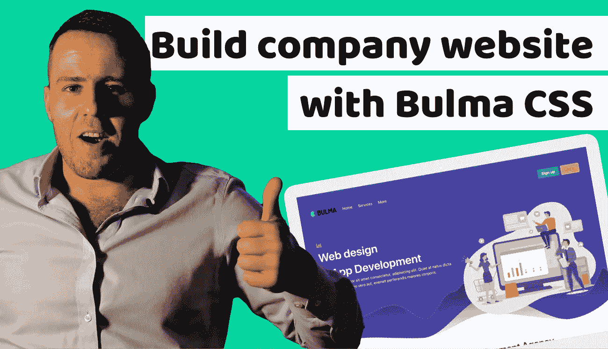

# 在你建立你的公司网站之前，看看这个布尔玛 CSS 教程

> 原文：<https://itnext.io/you-definitely-need-to-do-this-awesome-bulma-css-tutorial-until-start-building-a-company-website-2321fe89ebe2?source=collection_archive---------5----------------------->



[如何用布尔玛 CSS 建立公司网站](https://www.blog.duomly.com/how-to-build-company-website-with-bulma-css/)

本文原载:
[https://www . blog . duomly . com/how-to-build-company-website-with-bulma-CSS/](https://www.blog.duomly.com/how-to-build-company-website-with-bulma-css/)

# 介绍如何用布尔玛 CSS 建立公司网站

今天你将学习如何用布尔玛 CSS 建立公司网站。

在前几集里，你已经学会了如何用 Bootstrap 5:
[https://www . blog . duomly . com/how-to-crate-simple-web-page-using-Bootstrap-5/](https://www.blog.duomly.com/how-to-crate-simple-web-page-using-bootstrap-5/)

并且，你已经学会了如何用 Bootstrap 5 构建管理模板:
[https://www . blog . duomly . com/how-to-build-Bootstrap-admin-template-tutorial/](https://www.blog.duomly.com/how-to-build-bootstrap-admin-template-tutorial/)

现在，是时候做一些同样奇妙的事情了，也许对 UI 来说更好。

布尔玛 CSS 框架是一个非常受欢迎的，非常好用的，漂亮的 CSS 框架，你可以用它来构建很棒的 UI。

有了布尔玛 CSS，你可以快速建立漂亮的网站，电子商务，应用程序，甚至管理面板。

在今天的节目中，我们将关注如何用布尔玛 CSS 建立一个公司网站，作为一个公司网站，我们将建立一个响应式网络发展机构网站。

开始吧！

如果你喜欢视频，这是 youtube 的版本:

[如何用布尔玛 CSS 建立公司网站](https://www.youtube.com/watch?v=hiTxsjxHIMY&feature=youtu.be)

# 如何创建标题

作为第一步，我们需要创建项目的结构。

我们需要做第一件事是创建一个名为 index.html 的文件。接下来要创建样式，命名为 style.css(在同一个目录下)，最后一个要命名为“img”的目录。

在 img 目录中，我们将处理所有的图像。

因此，如果我们有结构，我们可以进入 index.html 文件，创建一个简单的 HTML 模板，第一个标题元素。

```
<!DOCTYPE html>
<html lang="en">
  <head>
    <meta charset="UTF-8" />
    <meta name="viewport" content="width=device-width, initial-scale=1.0" />
    <title>Company website with Bulma</title>
    <link
      rel="stylesheet"
      href="https://cdn.jsdelivr.net/npm/bulma@0.9.0/css/bulma.min.css"
    />
    <link rel="stylesheet" href="style.css" />
    <script
      defer
      src="https://use.fontawesome.com/releases/v5.3.1/js/all.js"
    ></script>
  </head>
  <body>
    <header class="section has-background-link py-4 has-text-white"> </header>
    <script>
      document.addEventListener('DOMContentLoaded', () => {
        // Get all "navbar-burger" elements
        const $navbarBurgers = Array.prototype.slice.call(
          document.querySelectorAll('.navbar-burger'),
          0
        ); // Check if there are any navbar burgers
        if ($navbarBurgers.length > 0) {
          // Add a click event on each of them
          $navbarBurgers.forEach((el) => {
            el.addEventListener('click', () => {
              // Get the target from the "data-target" attribute
              const target = el.dataset.target;
              const $target = document.getElementById(target); // Toggle the "is-active" class on both the "navbar-burger" and the "navbar-menu"
              el.classList.toggle('is-active');
              $target.classList.toggle('is-active');
            });
          });
        }
      });
    </script>
  </body>
</html>
```

# 如何在标题中添加列和图标

在下一步中，我们应该创建“header”元素中缺少的元素。

为此，我们需要创建几个列，并在那里放置带有图标的文本。

您可以在下面的示例中看到它应该是什么样子:

```
<header class="section has-background-link py-4 has-text-white">
  <div class="container">
    <div class="columns">
      <div class="column">
        <span class="icon">
          <i class="far fa-envelope"></i>
        </span>
        email@company.com
      </div>
      <div class="column">
        <i class="fas fa-phone-volume"></i>
        +44-754-443-222
      </div>
      <div class="column has-text-right-tablet">
        <i class="fas fa-headphones-alt"></i>
        Support
      </div>
    </div>
  </div>
</header>
```

# 如何创建节

太好了！我们的骨架差不多准备好了。

现在，我们必须添加将创建模板结构的所有部分(连同标题)。

让我们看看下面的例子:

```
<section class="section" id="hero"></section>
<section class="section"></section>
<section class="section" id="contact"></section>
```

# 如何在英雄区创建菜单

下一件事，我们需要创建的是英雄部分的顶部菜单。

为了做到这一点，我们可以从布尔玛网站上复制整个菜单，或者如果你想练习的话，重新输入。

菜单应该包含三个主要部分。第一个是应该放在左边的 logo。

下一个是合适的菜单，应该在 logo 之后。

最后一个是注册/登录按钮组，我们应该把它放在顶部菜单部分的右边。

```
<section class="section" id="hero">
  <div class="container">
    <nav
      class="navbar is-transparent"
      role="navigation"
      aria-label="main navigation"
    >
      <div class="navbar-brand">
        <a class="navbar-item" href="https://bulma.io">
          
        </a> <a
          role="button"
          class="navbar-burger burger has-text-white"
          aria-label="menu"
          aria-expanded="false"
          data-target="navbarBasicExample"
        >
          <span aria-hidden="true"></span>
          <span aria-hidden="true"></span>
          <span aria-hidden="true"></span>
        </a>
      </div> <div id="navbarBasicExample" class="navbar-menu">
        <div class="navbar-start">
          <a class="navbar-item has-text-white">
            Home
          </a> <a class="navbar-item has-text-white">
            Services
          </a> <div class="navbar-item has-dropdown is-hoverable">
            <a class="navbar-link has-text-white">
              More
            </a> <div class="navbar-dropdown">
              <a class="navbar-item">
                About
              </a>
              <a class="navbar-item">
                Jobs
              </a>
              <a class="navbar-item">
                Contact
              </a>
              <hr class="navbar-divider" />
              <a class="navbar-item">
                Report an issue
              </a>
            </div>
          </div>
        </div> <div class="navbar-end">
          <div class="navbar-item">
            <div class="buttons">
              <a class="button is-info">
                <strong>Sign up</strong>
              </a>
              <a class="button is-warning">
                Log in
              </a>
            </div>
          </div>
        </div>
      </div>
    </nav>
  </div>
</section>
```

# 如何在英雄中创建列

我们的英雄正在慢慢变得更好。

现在我们可以把重点放在顶部菜单下面应该添加的两列，但仍然在“hero”部分。

在接下来的步骤中，我们将在这些列中添加内容。

让我们看看下面的例子。

```
<div class="columns pt-6">
  <div class="column mt-6"> </div>
  <div class="column mt-6"> </div>
</dev>
```

# 如何在英雄中创建左栏内容

是时候用必要的内容充实“英雄”专栏了。

在这一步中，我们将关注左边的一列。我们需要几个元素，我们应该添加的第一个是大图标。

接下来，我们需要添加一个 h1 大小的标题和一些文字。

作为最后一个元素，我们应该添加黄色按钮。

让我们看看下面的代码示例:

```
<span class="icon has-text-warning">
  <i class="far fa-chart-bar fa-lg"></i>
</span>
<h1 class="is-size-1 has-text-white has-text-weight-semibold">
  Web design<br />
  & App Development
</h1>
<p class="has-text-white">
  Lorem ipsum dolor sit amet consectetur, adipisicing elit. Quae at
  natus dicta tempora? Distinctio vero aut, eveniet perferendis
  maiores corporis.
</p>
<button class="button is-warning mt-4">
  Learn more
</button>
```

# 给英雄添加图像

这是最后一步，非常简单，因为我们只需要在这里添加一个元素。

在右栏中，您需要添加来自“img”目录的图像。

我们使用的是购买的图片，但是你可以访问任何像 freepic 这样的网站，或者你可以在其他地方找到免费的图片。

让我们看看下面的代码示例:

```

```

# 如何创建服务标题

我们现在可以进入下一部分，展示我们的代理机构可以提供哪些服务。

作为服务部分的第一步，我们需要添加部分标题。

要创建这样的标题，我们可以只使用标题和副标题的组合。

为此，您需要向第一个元素添加一个类“title ”,向第二个元素添加一个类“subtitle”。

```
<section class="section" id="services">
  <div class="container">
    <div class="has-text-centered">
      <h2 class="title is-2">Full Service Web Development Agency</h2>
      <h6 class="subtitle is-6 has-text-grey">
        Lorem ipsum dolor sit amet, consectetur adipisicing elit. Nobis
      </h6>
    </div>
  </dev>
</section>
```

# 如何创建卡片

现在，我们可以进入服务，重点关注名为“card”的元素。

首先，我们需要添加 div“列”,以及其中的 div“列”。

接下来，我们应该创建一个带有图标、标题、内容和页脚的卡片。

让我们看看下面的例子。

```
<div class="columns pt-6">
  <div class="column">
    <div class="card">
      <div class="card-content">
        <div class="has-text-centered">
          <span class="icon is-size-1 py-6 my-3">
            <i class="fas fa-code"></i>
          </span>
        </div>
        <p class="title is-4">
          Web development
        </p>
        <div class="content">
          Lorem ipsum dolor sit amet, consectetur adipisicing elit.
          Laborum necessitatibus veritatis ullam ratione
        </div>
      </div>
      <footer class="card-footer">
        <a href="#" class="card-footer-item">Learn more</a>
      </footer>
    </div>
  </div>
</dev>
```

# 如何创建带服务的卡片

现在你知道如何创建一张卡片，但是一张是不够的。

我们需要八张卡片，每张都有不同的图标和标题，但是不要担心。

你不需要一个接一个地写它们。

我们可以复制整列 div，改变图标和标题，但是记住，关于双“列”div，不要在一行中有 8 张卡片。

让我们看看下面的代码示例:

```
<div class="columns pt-6">
  <div class="column">
    <div class="card">
      <div class="card-content">
        <div class="has-text-centered">
          <span class="icon is-size-1 py-6 my-3">
            <i class="fas fa-code"></i>
          </span>
        </div>
        <p class="title is-4">
          Web development
        </p>
        <div class="content">
          Lorem ipsum dolor sit amet, consectetur adipisicing elit.
          Laborum necessitatibus veritatis ullam ratione
        </div>
      </div>
      <footer class="card-footer">
        <a href="#" class="card-footer-item">Learn more</a>
      </footer>
    </div>
  </div>
  <div class="column">
    <div class="card">
      <div class="card-content">
        <div class="has-text-centered">
          <span class="icon is-size-1 py-6 my-3">
            <i class="fas fa-paint-brush"></i>
          </span>
        </div>
        <p class="title is-4">
          Web design
        </p>
        <div class="content">
          Lorem ipsum dolor sit amet, consectetur adipisicing elit.
          Laborum necessitatibus veritatis ullam ratione
        </div>
      </div>
      <footer class="card-footer">
        <a href="#" class="card-footer-item">Learn more</a>
      </footer>
    </div>
  </div>
  <div class="column">
    <div class="card">
      <div class="card-content">
        <div class="has-text-centered">
          <span class="icon is-size-1 py-6 my-3">
            <i class="fas fa-server"></i>
          </span>
        </div>
        <p class="title is-4">
          Web hosting
        </p>
        <div class="content">
          Lorem ipsum dolor sit amet, consectetur adipisicing elit.
          Laborum necessitatibus veritatis ullam ratione
        </div>
      </div>
      <footer class="card-footer">
        <a href="#" class="card-footer-item">Learn more</a>
      </footer>
    </div>
  </div>
  <div class="column">
    <div class="card">
      <div class="card-content">
        <div class="has-text-centered">
          <span class="icon is-size-1 py-6 my-3">
            <i class="fas fa-mobile-alt"></i>
          </span>
        </div>
        <p class="title is-4">
          Mobile development
        </p>
        <div class="content">
          Lorem ipsum dolor sit amet, consectetur adipisicing elit.
          Laborum necessitatibus veritatis ullam ratione
        </div>
      </div>
      <footer class="card-footer">
        <a href="#" class="card-footer-item">Learn more</a>
      </footer>
    </div>
  </div>
</div>
<div class="columns pt-6">
  <div class="column">
    <div class="card">
      <div class="card-content">
        <div class="has-text-centered">
          <span class="icon is-size-1 py-6 my-3">
            <i class="far fa-chart-bar"></i>
          </span>
        </div>
        <p class="title is-4">
          SEO Boost
        </p>
        <div class="content">
          Lorem ipsum dolor sit amet, consectetur adipisicing elit.
          Laborum necessitatibus veritatis ullam ratione
        </div>
      </div>
      <footer class="card-footer">
        <a href="#" class="card-footer-item">Learn more</a>
      </footer>
    </div>
  </div>
  <div class="column">
    <div class="card">
      <div class="card-content">
        <div class="has-text-centered">
          <span class="icon is-size-1 py-6 my-3">
            <i class="fas fa-ad"></i>
          </span>
        </div>
        <p class="title is-4">
          Marketing
        </p>
        <div class="content">
          Lorem ipsum dolor sit amet, consectetur adipisicing elit.
          Laborum necessitatibus veritatis ullam ratione
        </div>
      </div>
      <footer class="card-footer">
        <a href="#" class="card-footer-item">Learn more</a>
      </footer>
    </div>
  </div>
  <div class="column">
    <div class="card">
      <div class="card-content">
        <div class="has-text-centered">
          <span class="icon is-size-1 py-6 my-3">
            <i class="fas fa-funnel-dollar"></i>
          </span>
        </div>
        <p class="title is-4">
          Sales funnels
        </p>
        <div class="content">
          Lorem ipsum dolor sit amet, consectetur adipisicing elit.
          Laborum necessitatibus veritatis ullam ratione
        </div>
      </div>
      <footer class="card-footer">
        <a href="#" class="card-footer-item">Learn more</a>
      </footer>
    </div>
  </div>
  <div class="column">
    <div class="card">
      <div class="card-content">
        <div class="has-text-centered">
          <span class="icon is-size-1 py-6 my-3">
            <i class="fas fa-cog"></i>
          </span>
        </div>
        <p class="title is-4">
          Maintenance
        </p>
        <div class="content">
          Lorem ipsum dolor sit amet, consectetur adipisicing elit.
          Laborum necessitatibus veritatis ullam ratione
        </div>
      </div>
      <footer class="card-footer">
        <a href="#" class="card-footer-item">Learn more</a>
      </footer>
    </div>
  </div>
</div>
```

# 如何添加按钮组

在卡片下面，我们应该添加两个按钮。

第一个应该是黄色的，第二个应该是蓝色的。

为了让它们在一个组中，我们需要使用类“is-grouped ”,并在“style.css”中对它们进行一点样式化，以使它们居中。

样式，我们将在接下来的步骤中添加，现在让我们只添加 HTML。

让我们看一下代码示例:

```
<div class="field is-grouped mt-6 is-flex service-buttons">
  <p class="control">
    <button class="button is-warning">
      Free consultation
    </button>
  </p>
  <p class="control">
    <button class="button is-info">
      Request pricing
    </button>
  </p>
</div>
```

# 如何在布尔玛 CSS 中创建分隔线

不幸的是，在布尔玛 CSS 中没有分隔线组件。

我们可以安装 npm 包来实现它，或者在样式中添加几行来创建它。

我们稍后会将它添加到样式中，但是看一下下面的代码示例，这样你就会知道如何在几秒钟内创建一个分隔线。

```
.logos:before {
  content: '';
  position: absolute;
  width: 50%;
  left: 25%;
  top: 0;
  border-top: 1px solid #ebebeb;
}
```

# 如何添加客户徽标

这是服务部分的最后一步。恭喜你！

在这一步，我们需要添加我们为之努力的客户标志。

要做到这一点，我们只需要创建一个简单的网格，并添加四个带有类“列”的 div，并在其中放置图像。

```
<div class="columns mt-6 pt-5 logos is-relative">
  <div class="column">
    
  </div>
  <div class="column">
    
  </div>
  <div class="column">
    
  </div>
  <div class="column">
    
  </div>
</div>
```

# 如何创建联系人表单

呜哇！我们现在进入最后一部分，你的网站开发代理网站将很快为客户准备好！

作为第一步，我们需要在最后一部分创建两列。

接下来，在第一(左)列中，我们应该创建一个简单的卡片，其主体为空，标题为黄色。

在下一步中，我们应该添加一个输入很少的表单，以及 submit 按钮。

让我们看看下面的例子:

```
<section class="section" id="contact">
  <div class="container">
    <div class="columns">
      <div class="column">
        <div class="card">
          <header class="card-header has-background-warning">
            <p class="card-header-title">
              Free Consultation
            </p>
          </header>
          <div class="card-content">
            <div class="field">
              <label class="label">Name</label>
              <p class="control">
                <input class="input" type="text" placeholder="Name">
              </p>
            </div>
            <div class="field">
              <label class="label">Phone number</label>
              <p class="control">
                <input class="input" type="text" placeholder="Phone number">
              </p>
            </div>
            <div class="field">
              <label class="label">Email</label>
              <p class="control">
                <input class="input" type="email" placeholder="Email">
              </p>
            </div>
            <div class="field">
              <p class="control">
                <button class="button is-warning">
                  Submit
                </button>
              </p>
            </div>
          </div>
        </div>
      </div>
    </div>
  </div>
</section>
```

# 如何添加推荐

作为下一步，我们可以添加客户给我们的评价。

为此，我们只需要在右栏中创建两个大的报价图标。

接下来，您需要在它们之间添加一个白色文本。

```
<div class="column has-text-white pt-6 pl-6">
  <span class="icon is-size-1 pb-6 my-3 has-text-grey-lighter">
    <i class="fas fa-quote-left"></i>
  </span>
  <p>Lorem, ipsum dolor sit amet consectetur adipisicing elit. Maxime placeat, dolorem, quam expedita deleniti accusantium animi adipisci neque rem nobis at necessitatibus iusto vero exercitationem illum amet hic eligendi sapiente!</p>
  <p class="has-text-weight-bold pt-3 is-size-4">John Doe</p>
  <span class="icon is-size-1 pt-6 pr-3 my-3 has-text-grey-lighter is-pulled-right">
    <i class="fas fa-quote-right"></i>
  </span>
</div>
```

# 添加自定义样式

这是我们公司网站的最后一步，也是最关键的一步。

在这一步中，我们需要移动到 style.css 并对一些元素进行样式化。

记得带上你自己需要用作背景的照片。

你可以很容易地在网上找到免费的照片。

让我们来看看我们在下面的代码示例中添加的样式:

```
#hero {
  background: url('img/hero-bg.png');
  height: 1079px;
  background-position-x: center;
  background-size: cover;
}#hero .navbar.is-transparent {
  background-color: transparent;
}.service-buttons {
  justify-content: center !important;
}.logos:before {
  content: '';
  position: absolute;
  width: 50%;
  left: 25%;
  top: 0;
  border-top: 1px solid #ebebeb;
}#contact {
  background: url('img/contact-bg.png');
  background-size: cover;
}@media screen and (max-width: 1023px) {
  .navbar-menu a.has-text-white {
    color: #4a4a4a !important;
  }
  .navbar-menu a.has-text-white:hover {
    color: #3273dc !important;
  }
}
```

# 总结如何用布尔玛 CSS 建立公司网站

恭喜你，你的网络开发代理网站已经为第一批客户准备好了！

今天，你已经学会了如何用布尔玛 CSS 建立一个公司网站，我希望你离自己的在线业务更近一步。

在 AWS 课程第 1 课:如何使用 Cloudflare 在 S3 上托管网站中，您可以找到如何托管自己的网站的分步教程，因此，在您构建好网站后，请继续托管您的网站。

以下是 AWS 课程第 1 课的网址:
[https://www . blog . duomly . com/AWS-course-lesson-1-how-to-host-website-on-S3-with-cloud flare/](https://www.blog.duomly.com/aws-course-lesson-1-how-to-host-website-on-s3-with-cloudflare/)

不要忘记给我们看你的网站后，它将准备就绪，并在 S3 托管！


[多美滋促销代码](https://www.duomly.com?code=lifetime-80)

感谢阅读，
来自 Duomly 的 Radek