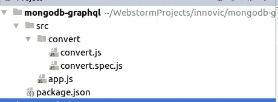

# 你不(总是)需要笑话、摩卡、茶…来进行 TDD

> 原文：<https://itnext.io/you-dont-always-need-jest-mocha-chai-for-tdd-27e6b2a8c5fb?source=collection_archive---------2----------------------->


> [点击这里在 LinkedIn 上分享这篇文章](https://www.linkedin.com/cws/share?url=https%3A%2F%2Fitnext.io%2Fyou-dont-always-need-jest-mocha-chai-for-tdd-27e6b2a8c5fb)

如果你想成为一名更好的软件开发人员，从编写单元测试开始。他们会给你一个不同的代码视图，大多数时候他们会显示你的代码有外部依赖，如果不嘲笑他们你就无法测试。重构之后，你应该得到单元可测试的纯函数。

每当你写一个函数或者方法的时候，问问你自己你是否能为它写测试。如果答案是否定的，那你就做错了。

你不需要用单元测试覆盖整个应用，因为你不能测试外部依赖，也不需要测试从外部库生成的样板文件。这毫无意义。说到这里，我们只需要关注我们的业务逻辑和为应用程序编写的定制代码。

在很多情况下，我们使用 Jest 或 Mocha 这样的库。然而，尽管它们非常方便，我们并不总是需要它们。

我们可以使用本机断言库表单节点，并遵循一些标准。

# 将您的测试文件放在您的特征文件旁边

在本例中，我们将制作一个小脚本，将 MongoDB 集合模式转换为 GraphQL 模式。

我们的文件夹结构看起来像:



# 编写只做一件事的函数

接下来，我们将在 convert.js 文件中添加几个函数，第一个函数接受 MongoDB find()函数的结果，并返回所有不同的键及其类型。

```
**function** *filterOutDistinctKeys*(data) {

    **const** items = data || [];
    **const** distinctItems = [];

    **for** (**const** item **of** items) {

        **for** (**const** key **of *Object***.keys(item)) {

            **const** dataKey = *toCamelCase*(key);
            **const** dataType = *capitilize*(**typeof** item[key]);

            **if** (distinctItems.findIndex((item) => item.**dataKey** === dataKey) < 0) {
                distinctItems.push({ dataKey, dataType });
            }
        }
    }

    **return** distinctItems;
}
```

我们要添加的第二、第三和第四个函数更简单。他们的名字暗示了他们的目的。

```
**function** *capitilize*(name) {
    **return** name[0].toUpperCase() + name.slice(1).toLowerCase();
}**function** *toCamelCase*(name) {
    **const** fragmented = name.split(**' '**);

    **if** (fragmented.length === 1) {
        **return** *fistSmallLetter*(name);
    }

    **const** uppercase = fragmented.map((piece) => *capitilize*(piece));
    uppercase[0] = uppercase[0].toLowerCase();

    **return** uppercase.join(**''**);
}**function** *fistSmallLetter*(name) {
    **return** name[0].toLowerCase() + name.slice(1);
}
```

一旦我们有了合适的函数，正如你所看到的，它们有干净的输入和干净的输出，我们可以在 convert.spec.js 文件中添加一些测试来测试它们的功能。

```
**const convert** = *require*(**'./convert'**);
**const** *assert* = *require*(**'assert'**);

(**function** testCapitilize() {

    **const** name = **convert**.*capitilize*(**'Jobs'**);
    *assert*.equal(**'Jobs'**, name);

})();

(**function** testDistinct() {

    **const** mockData = [{
        **'Name'**: **'John'**,
        **'Age'**: 22,
        **'Married'**: **true** }, {
        **'Name'**: **'Alan'**,
        **'Age'**: 21,
        **'Married'**: **false** }];

    **const** distinct = **convert**.*filterOutDistinctKeys*(mockData);

    *assert*.equal(3, distinct.**length**);
    *assert*.deepEqual({ **dataKey**: **'name'**, **dataType**: **'String'**}, distinct[0]);

    **const** emptyCollection = **convert**.*filterOutDistinctKeys*([]);
    *assert*.equal(0, emptyCollection.**length**);
})();

(**function** testFistSmallLetter() {

    *assert*.equal(**'myName'**, **convert**.*fistSmallLetter*(**'MyName'**));
    *assert*.equal(**'myname'**, **convert**.*fistSmallLetter*(**'myname'**));
    *assert*.equal(**'tEST'**, **convert**.*fistSmallLetter*(**'TEST'**));
    *assert*.equal(**'two Words'**, **convert**.*fistSmallLetter*(**'Two Words'**));
})();

(**function** testToCamelCase() {

    *assert*.equal(**'myName'**, **convert**.*toCamelCase*(**'MyName'**));
    *assert*.equal(**'twoWords'**, **convert**.*toCamelCase*(**'Two Words'**));
    *assert*.equal(**'threeDistinctWords'**, **convert**.*toCamelCase*(**'Three Distinct Words'**));
})();
```

注意，我们使用本地节点断言库来检查函数的结果，并且我们用前缀 test 和我们将要测试的函数名来命名我们的测试函数。

接下来，让我们在 package.json 中注册我们的测试脚本，并使用 **npm 运行测试**来运行它

```
**"scripts"**: {
  **"test"**: **"node ./src/**/*.spec.js"** },
```

如果一切正常，我们的脚本将返回**退出代码 0** ，这意味着所有测试都已通过。

现在我们可以将我们的库附加到 CI 系统。