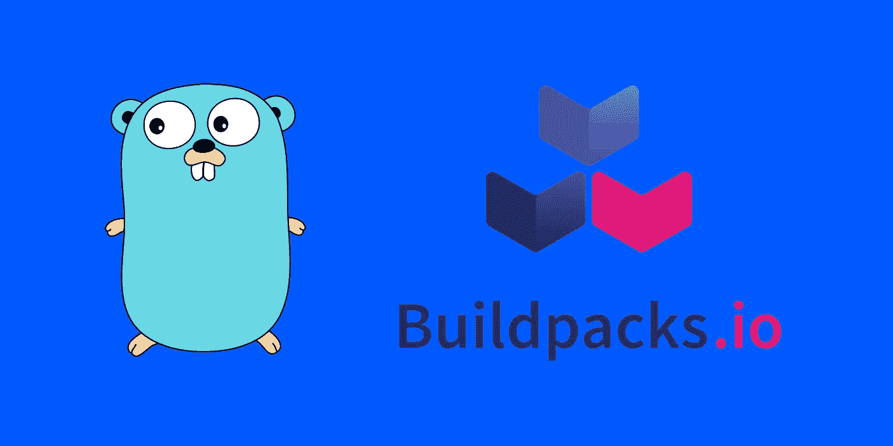

# 构建 Go 容器不需要 docker 文件

> 原文：<https://itnext.io/you-dont-need-a-dockerfile-to-build-a-go-container-a511617235bf?source=collection_archive---------1----------------------->



当在 [FlowUp](https://flowup.cz/en/homepage) 入职并培训新工程师时，我开始意识到深入理解 Dockerfiles 如何工作需要花费多少时间。同时，我们总是为我们所有的项目维护单一的“最佳实践”docker 文件。在可能的情况下清除 docker 文件突然变得有意义了。

我们仍然使用 **Dockerfiles 用于特定案例**。然而，我想确定的是，部署到云环境(Kubernetes、 [Cloud Run](https://cloud.google.com/run) 或其他容器环境)不需要高深的知识作为基础知识。

# 🐋使 Dockerfiles 文件变得多余

有几个项目提供了从语言或语言框架构建容器的标准方法。基本上，**你不需要知道引擎盖下发生了什么**。如果你使用语言或框架的标准方式，你就可以开始了。最值得注意的是:

*   [ko](https://github.com/google/ko) ，由谷歌开发维护。它有助于构建和无缝部署到 Kubernetes 环境。
*   [Buildpacks](https://buildpacks.io/) ，一个现在位于 CNCF 名下的项目，有多种 Go 实现，如 [heroku-buildpack-go](https://github.com/heroku/heroku-buildpack-go) 或[Google cloud platform/build packs](https://github.com/GoogleCloudPlatform/buildpacks)

我已经写了一篇关于 NoOps Go on Cloud Run 的文章，你可以在下面查看。它展示了我们如何用 *ko 构建容器。*

[](https://medium.com/@peter.malina/noops-go-on-cloud-run-689d92215c5c) [## 🔧NoOps 上云运行

### 每隔一段时间，就有一件简单的事情(然后变得很可怕，完全消耗了我两天的工作…

medium.com](https://medium.com/@peter.malina/noops-go-on-cloud-run-689d92215c5c) 

# 🔧使用构建包

这次我将重点介绍如何使用**构建包**，准确地说，是使用[谷歌云构建包](https://github.com/GoogleCloudPlatform/buildpacks)。首先，您需要安装`pack`实用程序。然后，该实用程序可以使用与标准兼容的构建包。

如果你是一个自制软件用户:

```
brew install buildpacks/tap/pack
```

对于不使用自制软件的 Arch Linux 用户，请使用以下方法之一:

```
pack-cli
pack-cli-bin
```

如果以上都不行，进入 [**安装页面，安装**](https://buildpacks.io/docs/tools/pack/) 。有更多的安装选项。

# 📦构建 Go 应用程序

现在到了有趣的部分。让我们构建我们的应用程序。如果您正在使用 Go 模块(我相信每个人都应该这样做)，buildpack 将在您的目录中搜索模块，**下载依赖项，并编译它**。此外，它使用根证书构建**最小映像。**

```
pack build <app-name> --builder gcr.io/buildpacks/builder:v1
```

然后可以在上面命令中提供的`<app-name>`下找到结果容器。您可以像运行任何 Docker 图像一样运行它。

**如果我在一个存储库/目录中有多个目标怎么办？**

您可以将一个环境变量`GOOGLE_BUILDABLE`直接传递给您想要构建的 main。如果您不这样做(并使用多目标源)，构建将会失败，并告诉您可以构建多个源。

```
pack build
  --env GOOGLE_BUILDABLE=./cmd/service
  --builder gcr.io/buildpacks/builder:v1
  <app-name>
```

上面的命令将告诉 buildpack，即使您的目录中有多个目标，您也希望在`./cmd/service`中构建一个。

**我可以将图像直接发布到容器注册表中吗？**

这个很简单。只要确保您提供了`<app-name>`作为您想要发布的图像的名称。接下来，您只需添加`--publish`标志，buildpack 就会自动为您推送图像。例如，如果我想发布到`gcr`，我会使用这个:

```
pack build
  --env GOOGLE_BUILDABLE=./cmd/service
  --builder gcr.io/buildpacks/builder:v1
  --publish
  gcr.io/<my-project>/<app-name>
```

该命令将构建和发布容器，并使其在您的机器上可用。

# 🚀额外收获:在[云构建](https://cloud.google.com/cloud-build)配置项中使用相同的代码

我附上一个简单的构建和发布脚本，如果你在 Google Cloud 上构建 Go 应用程序，你可以直接在 Cloud Build 中使用。

```
steps:
  - name: 'gcr.io/k8s-skaffold/pack'
    entrypoint: 'pack'
    dir: 'user'
    args: [
        'build',
        '--builder=gcr.io/buildpacks/builder',
        '--env', 'GOOGLE_BUILDABLE=./cmd/service',
        '--publish',
        'gcr.io/<project>/<image>'
    ]
```

# 就是这样！

我希望我让你的围棋冒险变得更简单了。如果你有任何问题，请在这里留言，给我发消息[🐦Twitter](https://twitter.com/petomalina) ，或 ping 我[🔗领英](https://www.linkedin.com/in/petomalina/)。

干杯，