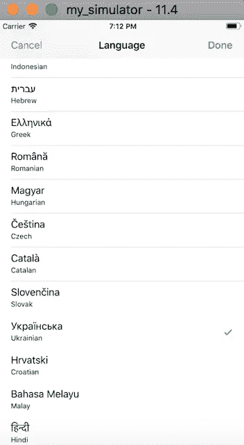
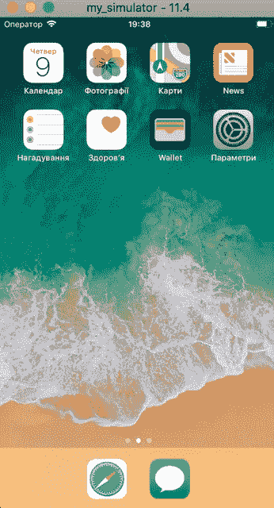

# 你不需要图形用户界面——如何从命令行控制 iOS 模拟器

> 原文：<https://itnext.io/you-dont-need-gui-or-how-to-control-ios-simulator-from-command-line-bf5cfa60aed2?source=collection_archive---------0----------------------->


回到过去，如果你使用计算机，你通常使用命令行用户界面。今天的开发使用 GUI (Xcode，Simulator 等)。)而且非常容易使用。但是，如果您需要使用 CI 或想要自动执行一些流程，如创建/删除特定的模拟器、更改一些设置，该怎么办呢？在这种情况下，您可以使用 Xcode 的 simctl 实用程序和 bash 脚本。下面你会看到一个如何编写 bash 脚本的手册，它将使用 CLI 简化 iOS 模拟器的工作。

该脚本应该能够管理以下操作:

*   `getuid`
*   `create`
*   `delete`
*   `boot`
*   `open`
*   `shutdown`

将要实施的另一个操作是使用配置文件更改模拟器的语言设置(可以是任何其他设置)。

对于所有这些动作，将使用强制的`name`参数。

# Bash 脚本，初始设置

创建 bash 文件并使其可执行:

```
$ touch ios_simulator_cli.sh
$ chmod +x ios_simulator_cli.sh
```

在编辑器中打开它，并添加以下内容:

```
#!/bin/bash
SIMULATOR_NAME="$1"
COMMAND="$2"print_params () {
  echo "print_params"
}get_uid() {
  echo "get_uid"
}create () {
  echo "create"
}delete () {
  echo "delete"
}boot () {
  echo "boot"
}open () {
  echo "open"
}shutdown () {
  echo "shutdown"
}locale () {
  echo "locale"
}if [ -z $SIMULATOR_NAME ] || [ -z $COMMAND ]
then
  print_params "Simulator name and COMMAND has to be specified"
  exit 1
ficase $COMMAND in
  ("getuid") get_uid ;;
  ("create") create $3 $4 ;;
  ("delete") delete ;;
  ("boot") boot ;;
  ("open") open_simulator ;;

  ("shutdown") shutdown ;;

  ("locale") set_locale $3 ;;
  (*)
    print_params "Unknown COMMAND [$COMMAND]"
    exit 1
    ;;
esac
```

现在让我们实现所有这些功能:

## 打印参数

这是一个助手，可以用来定义脚本支持哪些参数以及如何使用它。内容将是:

```
print_params () {
  echo "$1\. Example:
    ./scripts/ios_simulator_cli.sh SIMULATOR_NAME COMMAND
  Where COMMAND can be:
    create - create new simulator
    shutdown - shutdown simulator
    delete - delete simulator
    boot - boot simulator
    open - open simulator
    locale - set locale
    getuid - get simulator uid"
}
```

## 获取 _uid

所有带有`simctl`的动作都需要模拟器 uid。要获得它，需要执行以下操作:

*   使用`xcrun simctl list`获取所有设备的列表
*   使用`grep`按名称过滤结果
*   和一点神奇的`awk`来解析结果并得到`uid`

结果你会得到一个函数:

```
get_uid() {
  echo $( xcrun simctl list | grep -w $SIMULATOR_NAME | awk 'match($0, /\(([-0-9A-F]+)\)/) { print substr( $0, RSTART + 1, RLENGTH - 2 )}' )
}
```

执行脚本:

```
$ ./ios_simulator_cli.sh my_simulator getuid
```

如果模拟器存在，脚本将打印 uid，否则输出空结果。

## 创造

创建新的模拟器`simctl`需要以下参数:

*   `name` -可以是任何名称，例如“我的模拟器”
*   `device type` -使用`xcrun simctl list devicetypes`命令获取设备的完整列表
*   `runtime` -使用`xcrun simctl list runtimes`命令获取完整列表

`create`功能的内容为:

```
create () {
  TYPE=$1
  RUNTIME=$2
  SIMULATOR_ID=$( xcrun simctl create $SIMULATOR_NAME com.apple.CoreSimulator.SimDeviceType.$TYPE com.apple.CoreSimulator.SimRuntime.$RUNTIME )
  echo $SIMULATOR_ID
}
```

现在您可以运行脚本来创建新的模拟器:

```
./ios_simulator_cli.sh my_simulator create iPhone-7-Plus iOS-11-4
```

## 删除/启动

删除或启动模拟器`simctl`只需要模拟器 uid 和相应的命令。因此，这些功能的内容是:

```
delete () {
  SIMULATOR_ID=$( get_uid )
  xcrun simctl delete $SIMULATOR_ID
}boot () {
  SIMULATOR_ID=$( get_uid )
  xcrun simctl boot $SIMULATOR_ID
}
```

## 打开

要打开模拟器，可以使用`open`命令:

```
open_simulator () {
  SIMULATOR_ID=$( get_uid )
  open -a Simulator --args -CurrentDeviceUDID $SIMULATOR_ID
}
```

## 关机

最后一步是关闭模拟器。该功能需要检查当前状态，其实现类似于`get_uid`功能:

```
get_status () {
  echo $(xcrun simctl list | grep -w $SIMULATOR_NAME | awk 'match($0, /\(([a-zA-Z]+)\)/) { print substr( $0, RSTART + 1, RLENGTH - 2 )}')
}
```

并将使用一个循环来检查状态:

```
shutdown () {
  SIMULATOR_ID=$( get_uid )
  RETRY_DELAY=5
  retry_cnt=10 for (( ; ; ))
  do
    SIMULATOR_STATUS=$(get_status) if [ $SIMULATOR_STATUS = "Shutdown" ]
    then
      break
    elif [ $SIMULATOR_STATUS = "Booted" ]
    then
      xcrun simctl shutdown $SIMULATOR_ID
    else
      echo "Retrying in $RETRY_DELAY seconds, status is [$SIMULATOR_STATUS]"
    fi if [ $retry_cnt = 0 ]
    then
      echo "Cannot shutdown simulator $SIMULATOR_ID"
      exit -1
    fi
    retry_cnt=$((retry_cnt - 1))
    sleep $RETRY_DELAY
  done
}
```

仅此而已！使用`xcrun simctl`的基本功能已经实现，可能足以满足您的需求，否则您可以继续扩展脚本。

## 扩展设置

如果您想更改模拟器中的一些设置，例如语言/区域设置，您可以修改位于以下位置的配置文件`.GlobalPreferences.plist` :

```
"$HOME/Library/Developer/CoreSimulator/Devices/$SIMULATOR_ID/data/Library/Preferences/
```

这是一个二进制文件，有一些不同的方法可以修改它。最简单的方法是使用 Xcode 或者像 TextWrangler 这样的编辑器，但是因为我们只使用 CLI 做所有的事情，所以我们将使用另一种方法。有一个叫做`plutil`的工具，它允许在 Mac OS 中将 plist 文件转换为 XML 或二进制，替换设置中的属性，等等。

导航到`$HOME/Library/Developer/CoreSimulator/Devices/$SIMULATOR_ID/data/Library/Preferences/`文件夹(在我的例子中，我有 04 babe1a-7398-47AE-99 F2-165 AC 642 f 578 uid)并将`.GlobalPreferences.plist`转换为 XML(在您还可以复制这个文件之前):

```
$ cd $HOME/Library/Developer/CoreSimulator/Devices/04BABE1A-7398-47AE-99F2-165AC642F578/data/Library/Preferences/
$ cp .GlobalPreferences.plist .GlobalPreferences.plist.orig
$ plutil -convert xml1 .GlobalPreferences.plist
```

现在检查文件的内容:

```
$ cat .GlobalPreferences.plist
<?xml version="1.0" encoding="UTF-8"?>
<!DOCTYPE plist PUBLIC "-//Apple//DTD PLIST 1.0//EN" "http://www.apple.com/DTDs/PropertyList-1.0.dtd">
<plist version="1.0">
<dict>
    <key>AppleLanguages</key>
    <array>
        <string>en</string>
    </array>
    <key>AppleLocale</key>
    <string>en_US</string>
</dict>
</plist>
```

定义了一些属性。不要忘记将文件转换回二进制文件:

```
$ plutil -convert binary1 .GlobalPreferences.plist
```

现在，使用刚刚创建的脚本打开模拟器:

```
$ ./ios_simulator_cli.sh my_simulator boot
$ ./ios_simulator_cli.sh my_simulator open
```

在模拟器中导航到设置->通用，并更改一些设置。例如，从语言和地区到乌克兰语



关闭模拟器，再次将`.GlobalPreferences.plist`转换为 xml 以检查差异。将会有一些变化，包括:

*   `AppleKeyboards`键，其值为`<string>uk_UA@sw=Ukrainian;hw=Automatic</string>`
*   `AppleLanguages`键，带有`<string>uk-US</string>`值
*   等等。

这正是我们所需要的，也是可以使用命令行和`plutil`来改变的。恢复对设置文件的更改，并在 bash 脚本中定义`locale`函数:

```
set_locale () {
  LOCALE=$1
  SIMULATOR_ID=$( get_uid )
  PLIST_FILE="$HOME/Library/Developer/CoreSimulator/Devices/$SIMULATOR_ID/data/Library/Preferences/.GlobalPreferences.plist"
  plutil -replace AppleLocale -string $LOCALE $PLIST_FILE
  plutil -replace AppleLanguages -json "[ \"$LOCALE\" ]" $PLIST_FILE
  plutil -replace AppleKeyboards -json '[ "uk_UA@sw=Ukrainian;hw=Automatic" ]' $PLIST_FILE
}
```

该功能检查模拟器，并使用`plutil`替换设置文件中的`AppleLocale`、`AppleLanguages`和`AppleKeyboards`键。现在，您可以运行脚本来更改语言并启动模拟器:

```
$ ./ios_simulator_cli.sh my_simulator locale uk_UA
$ ./ios_simulator_cli.sh my_simulator boot
$ ./ios_simulator_cli.sh my_simulator open
```

您将获得具有您刚刚定义的语言的模拟器:



同样，您可以尝试更改其他设置，并为此编写 bash 脚本函数。

# 结论

使用 CLI、`bash`脚本或`simctl`、`plutil`等实用程序并不复杂。这样的 bash 脚本可以简化您的日常工作，特别是如果您想自动化一些流程或使用 CI(可以是另一个 bash 脚本):

```
./ios_simulator_cli.sh my_simulator create iPhone-X iOS-11-4
./ios_simulator_cli.sh my_simulator locale uk_UA
....
# do some tests
...
./ios_simulator_cli.sh my_simulator delete
```

你也可以下载[整个剧本](https://gist.github.com/rumax/2470ec2fcc3ef84420542f049589407e)并尝试一下。该脚本是用 Xcode 9.4 编写和测试的。