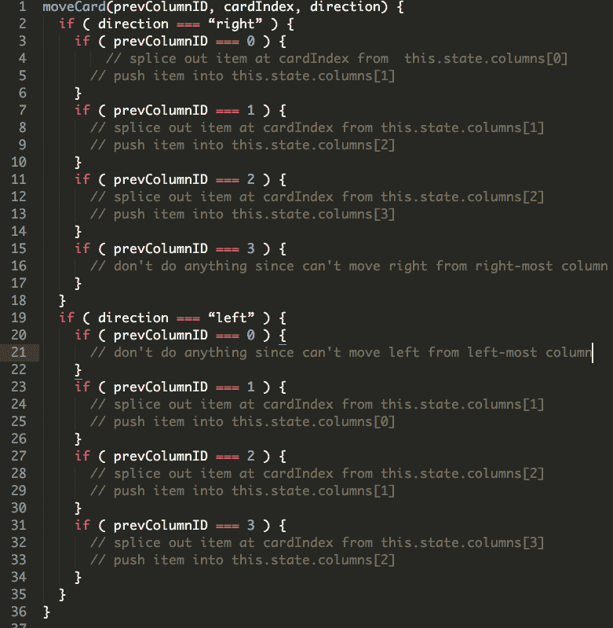
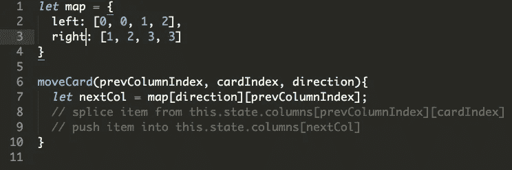

# 不需要 If/Else

> 原文：<https://itnext.io/you-dont-need-if-else-2f5707a9276d?source=collection_archive---------3----------------------->

**TL；你能用 if/else 块做的任何事情，你都可以用一个对象来做。**

在我的三字节面试中，我被要求构建一个 Trello 克隆——一个简单的 React 应用程序，它有四列，你可以在其中添加任务卡，并将其从一列移动到另一列。我有一个小时的时间来建立它，同时与面试官分享屏幕。不用说，我感到非常匆忙和紧张——这是我从 Hack Reactor 毕业后的第一次技术面试，相当紧张。我的主要焦点是完成应用程序的构建，不管我的代码看起来有多难看。**这是一个至关重要的错误。**

最难看的代码部分是将卡片从一列移动到另一列的逻辑。我的设置非常简单——四个 div 表示列，四个相应的数组表示“卡片”。在每个列 div 中，我将通过映射 state 中对应的数组来呈现卡片。

每个卡片组件都有两个按钮，一个用于将卡片从当前列移动到右边的相邻列，另一个用于将卡片从当前列移动到左边的相邻列。这些按钮的点击处理程序会将卡片从其当前状态的数组中移除，并将其推入下一个数组——它看起来像这样**(畏缩警告——这是所有出错的地方**):

我从采访者那里得到的反馈明确表示，让两个代码分支做同样的事情是不好的做法。经过一番思考，我意识到更好的方法应该是这样的:

因此，在我赶着写代码在时间用完之前控制卡片的移动时，我最终浪费了大量的时间写出了这个本可以用三行代码完成的庞大方法。**关键外卖:** **对象是你的朋友！在这些情况下，充分利用它们，你的代码将会更加整洁、可读性更强、可扩展性更强。现在前进，粉碎你所有的编码挑战！**