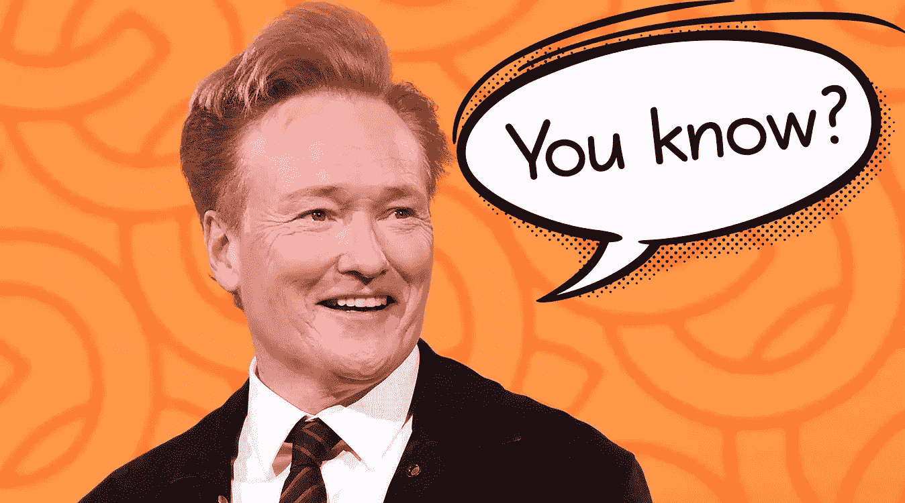

# 你知道吗？—语音分析和视频摘要

> 原文：<https://itnext.io/you-know-speech-analysis-and-video-summarization-69b400b2ac70?source=collection_archive---------2----------------------->

在我的[系列](https://blog.usejournal.com/minecraft-as-a-k8s-admin-tool-cf16f890de42)“没人需要的工具”的第二部分，我向你展示我的“你知道”项目。

借助云的力量，我们可以得出结论，柯南·奥布莱恩说“你知道吗？”很多。

几个月前，我的一个同事想知道“你知道吗？”是在一次视频会议上说的。作为一个极客，我的第一想法是这不会太难实现，几周后我有了我的第一个原型。

该原型可以将一个随机的 YouTube 视频作为输入，它将扫描音频中的话语“你知道”。接下来，它将剪切出包含该短语的所有剪辑，并将它们拼接在一起，形成输出视频。

上面你可以看到一个以柯南·奥布莱恩和他的客人为特色的输出视频示例。

该项目依靠 [Azure 认知服务](https://azure.microsoft.com/en-us/services/cognitive-services/speech-to-text/)进行实际的语音分析，并利用 [FFMPEG](https://ffmpeg.org/) 进行视频处理，利用 [Youtube-DL](https://youtube-dl.org/) 下载视频。

这个原型已经被打包成一个 Docker 容器，所以任何拥有 Linux Docker 环境和 Azure 认知服务的人都可以自己运行它。

从很高的层面来看，该流程可以分为以下几个步骤:

1.下载 mp4 格式的 YouTube 视频。
2。提取音频并将其切成 10 秒的片段。
3。将 10 秒钟的音频片段并行输入 Azure Speech Services，获取每个单词的时间戳。
4。标记单词“你”和“知道”的所有后续实例，并生成一个带有时间戳的完整列表，列出要进行的切割。
5。最后，剪下所有有标记的片段，把它们放回一个文件中。

对于有技术倾向的人:我已经在 GitHub 上开源了这个项目，在那里你可以找到关于原型如何工作以及如何使用它的更深入的技术解释。

所以，你知道，玩得开心点！