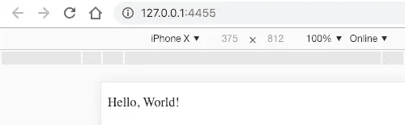
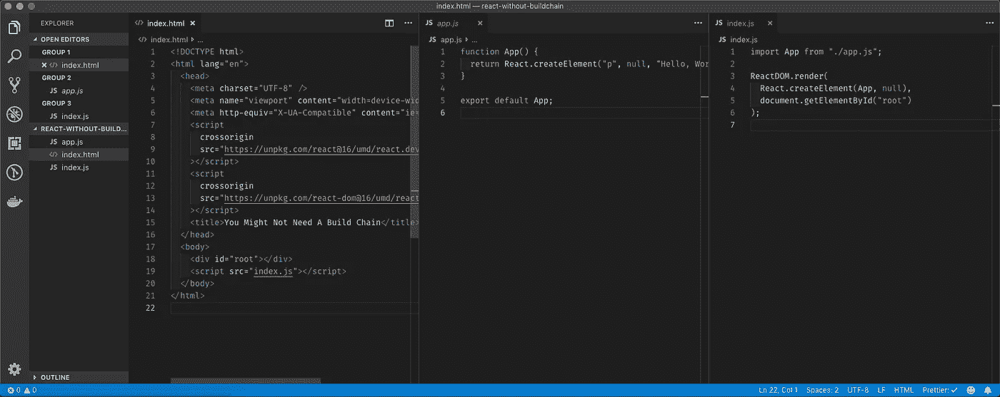
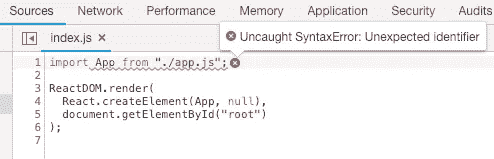
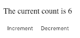
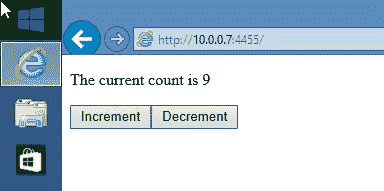

# 您可能不需要构建工具链

> 原文：<https://itnext.io/you-might-not-need-a-build-toolchain-324edcef7f9a?source=collection_archive---------0----------------------->

自从 ES6 推出以来，前端开发领域已经见证了构建工具和任务运行器的爆炸式增长。从咕噜咕噜，到狼吞虎咽，到网袋，到包裹，到卷起来……清单还在继续。构建工具链越来越受欢迎，因为它们可以被配置为编译/传输代码，优化资产，并最大限度地提高网站的跨浏览器兼容性。

然而，你意识到没有构建工具链你也可以用 React 构建一个网站吗？我知道，对！

如今，您可以构建一个网站并跨浏览器(包括传统浏览器)运行，而无需额外的构建步骤。

这篇文章着眼于如何在实践中做到这一点，以及构建无工具链方法的利与弊。


照片由[卡斯帕·卡米尔·鲁宾](https://unsplash.com/@casparrubin?utm_source=medium&utm_medium=referral)在 [Unsplash](https://unsplash.com?utm_source=medium&utm_medium=referral) 上拍摄

## 我不用的是

我没有使用以下工具；

*   Webpack 或 30 万亿插件或加载程序中的任何一个。
*   巴别。
*   SCSS。CSS 现在其实挺好的。
*   盖茨比或其他静态网站建设者

## **我用的是什么**

我用的是下面的:

*   React，从 CDN 中 ReactDOM
*   一个 http 服务器，方便地称为“http 服务器”
*   最新的谷歌浏览器
*   Traceur，最大限度地支持传统浏览器

## **“你好，世界！”**

我们必须从义务性的“你好，世界！”例如，作为整个行业的要求。

我首先创建一个空文件夹，然后是一个包含以下内容的`index.html`文件；

我添加了 React 的开发版本，这些版本未经优化，可以帮助我们调试可能遇到的任何错误。

现在我们在页面上有了 React，让我们定义一个组件并渲染它。

注意，我们必须在这里编写纯 React 代码，因为编写 JSX 需要一个构建步骤，而我们没有。

为了保持简单，我在我们的`<div id="root"></div>`元素下直接添加了上面的脚本块。我们很快会整理好的。

现在我已经在全球范围内安装了`http-server`(你可以在你的终端上运行`npm i -g http-server`来完成这个任务)，我只需运行下面的命令来启动我的服务器；

```
http-server -o -p 4455
```

这将在端口“4455”上启动一个新的 web 服务器实例，并自动打开浏览器。



“你好，世界！”…我们现在已经在浏览器中运行了

现在我们有了它，我们的 React 应用程序在浏览器中运行，没有预先构建步骤。

我们能走多远？让我们找出答案。

## **ES6 JavaScript 模块**

Google Chrome 对 ES6 模块的支持非常棒，尽管很少被利用。让我们花点时间整理一下我们的代码。

我现在添加一个名为`index.js`的新文件，并将我们的 ReactDOM 渲染逻辑移到其中。

然后将我们的`App`功能组件移动到一个名为`app.js`的新文件中。

我更新我的`app.js`文件如下:

这是我们的项目现在的样子；



到目前为止，我们的项目结构

返回浏览器，并刷新。您可能会看到一个空白屏幕和一个控制台错误



Chrome 不理解“导入”语法

> 未捕获的语法错误:意外的标识符

该错误表明 Chrome 遇到了它不理解的语言。但是，嘿，等等，我刚刚说 Chrome 对 ES6 模块有很好的支持！？我们必须做一个小小的改变来打开这个功能。

返回`index.html`，更新`script`标签如下:

```
<script type="module" src="index.js"></script>
```

`type=module`属性告诉 Chrome 这个脚本是一个 ES6 模块。

刷新页面，一切都将恢复正常。

## 走远一点

我们现在已经有了一个尝试，所以我们给页面增加一点交互性怎么样？

让我们构建一个带有递增和递减按钮的简单计数器。这要求我们使用本地状态，并要求我们将事件附加到 DOM 以响应用户输入。



一个简单的计数器应用

定义一个叫做`Counter`的`class`，如下；

上面的代码应该是非常熟悉的，因为我写它的方式与我使用构建工具链的方式完全相同。由于 Google Chrome 几乎完全支持 ES6 语言特性，如`class`、析构和箭头功能，我们不必以任何特别的方式编写代码来让事情正常运行。

**注意:**有一个新的语言特性，目前是 TC39 发布过程的第三阶段(因此我们可以期待很快得到广泛的支持和采用),称为 JavaScript 的[类字段声明](https://github.com/tc39/proposal-class-fields),这将使我们能够以更简洁的方式重新编写它。但是现在，我们不得不`bind`我们的函数上下文，并在`constructor`中定义我们的`state`。

## 式样

这里没有什么突破性的东西。CSS 基本上从一开始就已经是 web 浏览器的一部分，所以我们拥有全面的优秀浏览器支持。

我们不会在这里详细讨论，但是人们通常使用 SCSS 是因为；

*   SCSS 有编译时间变量
*   SCSS 允许筑巢
*   SCSS 支持函数/混合

我说:

*   CSS 有可以动态更新的运行时变量(更好)
*   筑巢是可怕的，你可能不应该筑巢(大部分时间！)
*   CSS 有许多内置的[函数](https://www.quackit.com/css/functions/)，但是我承认，你不能创建自己的函数(还不行！)

您可以使用`<style>`标签直接在标题中添加样式，或者使用`<link>`标签引用外部样式表。

## **那么像 Internet Explorer 这样的传统浏览器呢？**

Internet Explorer？没听说过。

呃，那好吧。

IE 是一个糟糕的浏览器，对任何东西都有糟糕的支持，尤其是 ES6。微软正在尽最大努力彻底消灭 IE，但许多人和公司会坚持到底。根据 w3counter 的数据，IE11 目前拥有大约 3.5%的全球市场份额，因此在这一点上不容忽视。

使用 [Traceur](https://github.com/google/traceur-compiler/wiki/Getting-Started) 可以实现对 IE 11 的支持。Traceur 是一个运行中的 transpiler，它使您能够在不支持 ES6 的浏览器中运行 ES6 代码。

为了最大化跨浏览器兼容性，您可以将 Traceur CDN 脚本添加到您的标题中，如下所示；

现在，当你在 IE11 中打开你的页面时，应用程序应该仍然像在谷歌浏览器中一样工作。



在 IE11 中运行的 React 应用程序

## **老实说，我需要一个构建工具链吗？**

没有构建工具链，你也可以构建一个网站。Evergreen 浏览器对 ES6+有极好的支持，并且支持一直在变得更好。使用像 Traceur 这样的浏览器内编译器，您可以极大地增加跨浏览器支持，并在传统浏览器中更好地工作。

**利:你的代码将会更小，性能可能会更好。当使用 ES6+ to ES5 编译器(如 Babel 或 TypeScript)时，polyfills 会自动注入到您的包中，以确保跨浏览器支持。聚合填充通常很重，浏览器执行起来很费时间。无论浏览器本身是否支持您正在使用的特征，都将使用聚合填充。当不使用构建工具链时，在浏览器中运行的唯一代码是您编写的代码和您的库代码(React)。**

**缺点:你不能使用 JSX** 。这是巨大的。JSX 极大地简化了我们的代码，使它更容易阅读和理解。不能在浏览器中使用 JSX 是一个巨大的损失。

Kinda-a-con-kinda-a-pro:你不能捆绑和缩小你的代码。您让浏览器决定何时下载您的 JavaScript 文件。浏览器将为应用程序中的每个 JavaScript 模块发出一个新的 HTTP 请求，因为它们没有捆绑在一起成为一个大文件。这既是有利的一面，也是不利的一面。HTTP 协议的旧版本(1.1 版)最多支持同时与 web 服务器建立 7 个连接，这意味着一旦所有 7 个连接都打开，浏览器就必须等待请求解析后才能继续。当同时加载许多资源时，这会导致渲染阻塞，并导致网页加载速度变慢。然而，HTTP 的版本 2(它有很好的支持)对同时连接的数量没有限制，这意味着这个限制应该被取消。与下载许多更小的碎片文件相比，捆绑资产的旧技术是否更快还没有定论。

## 摘要

得益于浏览器技术的进步和 JavaScript 标准(ECMAScript)的标准化，今天在没有构建工具链的情况下构建 React 应用程序是可能的和可行的。当不使用构建工具链时，可以避免将运行应用程序不必要的代码发送到浏览器。使用动态编译器 Traceur 可以极大地改善跨浏览器支持，它会在运行时将 ES6 转换为 ES5。

## 最后

实际上，大多数时候你可能想要使用一个构建工具链，因为你想要利用最新的语言特性，而不是每个 evergreen 浏览器都支持这些特性。

这个项目的代码可以在 [GitHub](https://github.com/jpreecedev/react-without-build-pipeline) 上找到。

## 取得联系

你喜欢这个故事还是想和我进一步讨论？为什么不在 Twitter 上给我发消息呢！

[](https://twitter.com/jpreecedev) [## 乔恩·普利斯(@jpreecedev) |推特

### Jon Preece 的最新推文(@jpreecedev)。合同网页开发商，设计师和软件开发商。沃林顿…

twitter.com](https://twitter.com/jpreecedev) 

或者看看我的个人博客

[](https://developerhandbook.com/) [## DeveloperHandbook.com-更干净的代码，更好的代码。

### 这里通过全面有趣的教程来帮助你写更干净的代码，更好的代码

developerhandbook.com](https://developerhandbook.com/) 

谢谢大家！