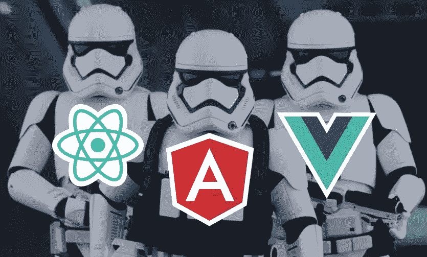

# 你可能不需要框架

> 原文：<https://itnext.io/you-might-not-need-a-framework-79444bda50d2?source=collection_archive---------4----------------------->

我应该澄清一些事情——我不是提倡你永远不要使用框架。我只是认为，在深入框架之前，理解 JavaScript 本身如何工作的基本概念以及可以用它做什么是非常重要的。

我想展示 JavaScript 已经发展了多少，并指出可能存在一些简单的用例，在这些用例中，使用框架可能是多余的。请不要把你的 200 组件的带有复杂状态管理的 React 应用移植到原生 JavaScript 应用上。这只会让每个人的生活更加艰难。🙂

随着前端生态系统每天都在增长，我们有了前所未有的更多选择。大球员已经有一段时间没有改变了(角度，反应，Vue)，也没有迹象表明他们会很快改变。因此，当开始一个新项目时，人们经常会问自己“好吧，我应该使用这些框架/库的哪一个？”。

但是也许你应该使用普通的 JavaScript。

不要误解我的意思，所有这些工具都非常酷，并为开发人员提供了很多东西。它们各自的生态系统都很大，我相信它们在一个项目中都有自己的位置。但我也相信人们对他们真的很严厉。

这可能有很大的局限性，尤其是对于刚刚接触 JavaScript 的人来说。如果你只是专注于将自己限制在这些工具中的一个，当你达到它们的极限时，或者当你不得不切换到另一个堆栈完全不同的项目时，你将会非常困难。

[我们的小语种](http://vanilla-js.com/)已经有了长足的进步。而且，随着浏览器的巨大飞跃和进步，今天仅仅使用 JavaScript 就有很多可能，我想强调这一点。

所以如果你想在你的项目上创建一个基于组件的架构，你会怎么做呢？

好吧，假设你有一些静态的 HTML 在你的【index.html】*中，就像这样:*

*而且你想用 ***js-app*** div 做东西。您可以使用查询选择器获取它，并手动更改它。但是，假设您想要使用一种更加基于组件的方法(因为组件现在非常流行)。您可以在您的 ***index.js*** 文件中编写如下内容:*

*我们创建一个 JavaScript 类，并将 ***js-app*** 类名传递给它的构造函数。这将使用第 3 行的查询选择器获取正确的元素，并将其保存在类实例的 ***上下文*** 变量中。这里有一个代码沙箱上这个例子的链接。*

*那么我们为什么要这样做呢？仅仅改变一个 div 的内部 HTML 似乎有些过火。嗯，如果我们像这样构造代码，我们可以很容易地组合组件。假设我们有一个用户名/密码表单，如下所示:*

*假设我们想给这些输入添加一些验证，那么当字段为空时，它们会变成红色。我们可以添加下面的 **css** 和 **js** 代码使其工作，与前面的例子一致:*

*css 只是改变背景颜色，所以它指出哪个输入是错误的。
**js**包含一个类，它在文件底部被实例化两次。一次用于**登录输入**元素，一次用于**密码输入**元素。所以这两个实例是相互独立的，并且有自己的事件处理程序。
我们添加了几个事件处理程序——一个在用户开始输入时触发( ***onChange*** )，另一个在用户离开输入时触发( ***onBlur*** )。如果用户不关注输入元素，并且元素的内容为空，我们只显示错误背景。这是代码沙箱中的例子的链接。*

*因此，我们有一个简单的表单，上面有一些验证，只使用原生 JavaScript。我们还以更加面向组件的方式构建了代码。我们还可以更进一步，将***required input***类提取到它自己的文件中，并根据需要导入、实例化或扩展它，因此这种方法非常灵活。*