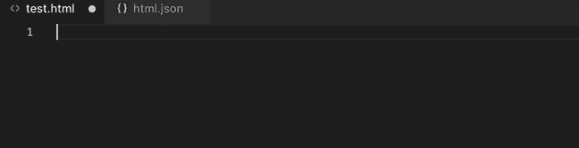
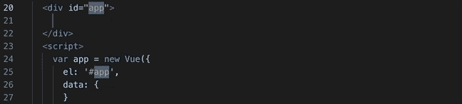
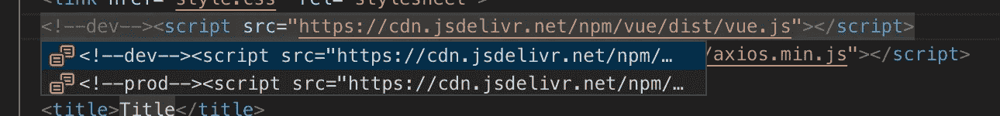
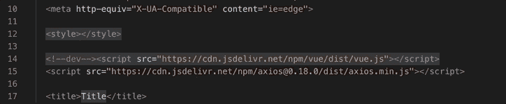

# 你必须摘录

> 原文：<https://itnext.io/you-must-snippet-d211c05ff3d6?source=collection_archive---------1----------------------->

为 VS 代码编写和使用 Vue scaffold 片段。


沿着康涅狄格河，冰面上有一个枫叶形状的洞。

我经常想开发一个非常简单的 Vue 应用程序来测试一些东西，构建一个演示，或者只是探索一个想法。如果你需要所有的东西——web pack、单个文件组件、CSS 预处理 Vue CLI 是很棒的，但是当你需要的只是一个 html 文件，并在某个 CDN 上有指向 Vue 的链接时，这就像是一个很大的承诺。

在研究了如何为 Visual Studio 代码创建一个新的片段来输出这个以 Vue 为中心的样板文件之后，我懊恼地发现我必须将整个东西格式化为一个 Javascript 字符串数组，同时避开所有的引号。恶。然后我遇到了 Pawel Grzybek 开发的[这个隐藏在](https://snippet-generator.app)[堆栈溢出答案](https://stackoverflow.com/questions/29995863/how-to-add-custom-code-snippets-in-vscode)中的可怕工具，它为你做了所有这些讨厌的事情！您只需编写代码片段，给它一个名称和一个前缀(您输入的用于访问代码片段的位)，它就会为 VS 代码生成格式正确的 JSON 文件(以及 Atom 和 Sublime 文本的格式)。

我的看起来像这样:

它使用了我在 [VS 代码片段文档](https://code.visualstudio.com/docs/editor/userdefinedsnippets)中发现的一些特性。

# 片段变量

为你未来的自己留下一些关于这个文件的线索总是好的，所以你可以从在评论中添加日期开始，就像这样:

```
"$BLOCK_COMMENT_START",
"  $CURRENT_MONTH/$CURRENT_DATE/$CURRENT_YEAR",
"$BLOCK_COMMENT_END",
```

通过使用`$BLOCK_COMMENT_START`和`$BLOCK_COMMENT_END`,您可以使您的代码片段更加语言无关，以防您想要使它成为一个全局代码片段，或者一个可用于多种文件类型的代码片段。

除了许多时间和日期变量，还有文件相关变量和选择变量，比如`TM_SELECTED_TEXT`，用于需要环绕选择的片段。[检查所有选项的文档](https://code.visualstudio.com/docs/editor/userdefinedsnippets)。

# 占位符和制表位

关于创建这个文件时你到底在想什么的一点小笔记也是有帮助的。您可以为此使用一个占位符。占位符看起来像:

```
{$1:Description}
```

代码片段展开后，光标会停在每个占位符上，默认文本(在本例中为“描述”)会高亮显示，以便于替换。



VS 代码片段中的占位符

占位符只是稍微加强了一下 **tabstop** 。如果您只想在代码片段中创建一个插入点，您可以使用一个 tabstop，比如`$1`。

数字决定了 tab 键的顺序。

## 链接占位符

任何具有相同制表位编号的占位符都会一起更新。因此，例如，如果我们不总是想使用`#app`作为 Vue 的基本元素，我们可以这样做:

```
"  <div id=\"${5:app}\">",
"  </div>",
"  <script>",
"    var app = new Vue({",
"      el: '#${5:app}',",
"      data: {",
"      }",
"    })",
"  </script>",
```



使用相同的制表位编号链接占位符

# 片段选择

当链接到 CDN 上的 Vue 时，你有一个选择——开发版本更大，但显示有用的警告，或者生产版本更小。您可以在代码片段中构建这样的选择:

```
{$1|'Option one','Option 2\, with a comma','Option 3'|}
```

或者，对于我们的 CDN 链接:

```
"<script src=\"${3|https://cdn.jsdelivr.net/npm/vue/dist/vue.js,https://cdn.jsdelivr.net/npm/vue|}\"></script>",
```

不幸的是，没有办法为每个选项提供一个*标签*，而且我知道我不会记住哪个是哪个，所以我把它写成:

```
"${3|<!--dev--><script src=\"https://cdn.jsdelivr.net/npm/vue/dist/vue.js\"></script>,<!--prod--><script src=\"https://cdn.jsdelivr.net/npm/vue/\"></script>|} ",
```

最终看起来像是:



在 VS 代码片段选择中选择 dev 还是 production Vue.js。

我还添加了一个选项，既可以链接到样式表，也可以只在头部使用 style 部分:

```
"  ${2|<style></style>,<link href=\"style.css\" rel=\"stylesheet\">|}",
```



在新生成的代码片段中做出选择

# 最终安息之地

一旦您完成了代码片段中所有的制表位、占位符和选项，您就可以开始编码了。您可以使用 tabstop `$0`将光标放在您想要开始编写非样板代码的地方:

```
"  <div id=\"${5:app}\">",
"    $0",
"  </div>",
```

# 在 VS 代码中使用代码片段

## 保存在用户片段中

要开始使用您的代码片段，请转到“首选项”>“用户代码片段”,然后选择代码片段应该可用的文件类型。对于这个例子，我选择 html，它会打开一个`html.json`文件。将代码段粘贴到左花括号和右花括号之间，保存，然后您的 gtg！

打开“设置”>“文本编辑器”>“制表符补全”,只需在 html 文件中键入前缀，然后轻按 Tab 键，它就会输出到文件中。

## 共享代码片段和版本控制

现在您已经掌握了 VS 代码的定制代码片段，您可能想要创建特定于项目的代码片段，并开始与您的团队共享它们。正如吕鹏在《T10》中所写的，你现在可以在任何你喜欢的地方保存片段。而且，他[写了一个扩展](https://marketplace.visualstudio.com/items?itemName=rebornix.project-snippets)，允许你将它们保存在你的项目中(如果你愿意，也可以在版本控制之下)。你需要做的就是安装扩展，创建一个`.vscode`文件夹(如果还没有的话)，在里面添加一个`snippets`文件夹，然后开始在特定语言的文件中添加你的代码片段。在本例中，文件路径是:

```
/a-project/.vscode/snippets/html.json
```

现在它们可以被签入和签出，并像项目中的任何其他代码一样得到改进。

下面是完整代码片段的用法。几秒钟后，您就可以开始构建您的 Vue 应用程序了:

带有 Vue 样板文件和代码片段的 HTML，用于快速演示和构思

你为什么做了自定义片段？下面留言评论！

## 进一步阅读和资源

*   [snippet-generator . app 上的这个片段](https://snippet-generator.app/?description=HTML%2FVue+Boilerplate&tabtrigger=%21v&snippet=%24BLOCK_COMMENT_START%0A++%24CURRENT_MONTH%2F%24CURRENT_DATE%2F%24CURRENT_YEAR%0A++%24%7B1%3ADescription%7D%0A%24BLOCK_COMMENT_END%0A%3C%21DOCTYPE+html%3E%0A%3Chtml+lang%3D%22en%22%3E%0A%3Chead%3E%0A++%3Cmeta+charset%3D%22UTF-8%22%3E%0A++%3Cmeta+name%3D%22viewport%22+content%3D%22width%3Ddevice-width%2C+initial-scale%3D1.0%22%3E%0A++%3Cmeta+http-equiv%3D%22X-UA-Compatible%22+content%3D%22ie%3Dedge%22%3E%0A++%0A++%24%7B2%7C%3Cstyle%3E%3C%2Fstyle%3E%2C%3Clink+href%3D%22style.css%22+rel%3D%22stylesheet%22%3E%7C%7D++%0A%0A++%3Cscript+src%3D%22https%3A%2F%2Fcdn.jsdelivr.net%2Fnpm%2Fvue%2Fdist%2Fvue.js%22%3E%3C%2Fscript%3E+%3C%21--+dev+--%3E%0A++%24%7B3%7C%3C%21--dev--%3E%3Cscript+src%3D%22https%3A%2F%2Fcdn.jsdelivr.net%2Fnpm%2Fvue%2Fdist%2Fvue.js%22%3E%3C%2Fscript%3E%2C%3C%21--prod--%3E%3Cscript+src%3D%22https%3A%2F%2Fcdn.jsdelivr.net%2Fnpm%2Fvue%2F%22%3E%3C%2Fscript%3E%7C%7D%0A++%3Cscript+src%3D%22https%3A%2F%2Fcdn.jsdelivr.net%2Fnpm%2Faxios%400.18.0%2Fdist%2Faxios.min.js%22%3E%3C%2Fscript%3E++%0A++%0A++%3Ctitle%3E%24%7B4%3ATitle%7D%3C%2Ftitle%3E%0A%3C%2Fhead%3E%0A%3Cbody%3E%0A++%3Cdiv+id%3D%22%24%7B5%3Aapp%7D%22%3E%0A++++%240%0A++%3C%2Fdiv%3E%0A++%3Cscript%3E%0A++++var+app+%3D+new+Vue%28%7B%0A++++++el%3A+%27%23%24%7B5%3Aapp%7D%27%2C%0A++++++data%3A+%7B%0A++++++%7D%0A++++%7D%29%0A++%3C%2Fscript%3E%0A%3C%2Fbody%3E%0A%3C%2Fhtml%3E&mode=vscode)
*   [VS 代码用户片段文档](https://code.visualstudio.com/docs/editor/userdefinedsnippets)
*   [VS 代码的项目片段扩展](https://marketplace.visualstudio.com/items?itemName=rebornix.project-snippets)