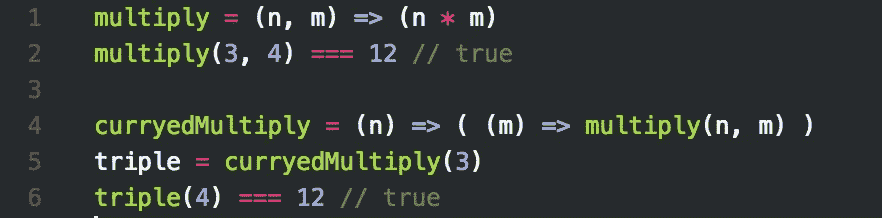

# 你需要了解库里

> 原文：<https://itnext.io/you-need-to-know-curry-8822772a1fab?source=collection_archive---------10----------------------->



图像可能受版权保护

# 职能是一等公民

函数在 JavaScript 中是一等公民，与其他类型(如数字、数组、对象)一样。它们可以用作参数，也可以作为其他函数的返回值。

举个简单的例子，如果我们的目标是打印出一个数组中的所有元素，大多数人可能会这样做:

```
function printWithLoop(arr) {
    for (let i = 0, len = arr.length; i < len; i++) {
        console.log(arr[i]);
    }
}
```

如果你对高阶函数有点熟悉，你可能会倾向于使用 [Array.prototype.forEach](https://developer.mozilla.org/en-US/docs/Web/JavaScript/Reference/Global_Objects/Array/forEach) :

```
function printWithIterator(arr) {
    (arr || []).forEach(it => {
        console.log(it);
    });
}
```

然后，我们可以通过以下方式进一步简化代码:

```
function simplePrint(arr) {
    (arr || []).forEach(console.log);
}
```

**这里再想一想， *simplePrint* 的输出与 *printWithIterator* 的输出是否完全相同？如果不是，你能解释一下有什么不同吗？**

# 函数重载

函数重载使函数能够根据分段的数量或类型表现出不同的行为。例如 [Array.from](https://developer.mozilla.org/en-US/docs/Web/JavaScript/Reference/Global_Objects/Array/from) 。

*   当给定一个参数时，它简单地从一个类似数组或可迭代的对象创建一个新的数组实例

```
let set = new Set(['foo', 'bar', 'foo']);
console.log(Array.from(set)); //["foo", "bar"]
```

*   当给定可选的第二个参数 *mapFn* 时，它将在创建新数组时将 *mapFn* 应用于每个元素。

```
console.log(Array.from([1, 2, 3], x => x + x)); // [2, 4, 6]
```

# 咖喱菜肴

库里，也叫局部应用。Currying 一个函数基本上意味着一个函数将吸收一些参数并返回另一个函数供以后调用。返回函数可以通过[闭包](https://developer.mozilla.org/en-US/docs/Web/JavaScript/Closures)访问已经被吸收的参数。

# 参数与自变量

首先我们需要理解函数中的两个基本概念。

*   参数:函数声明中的占位符。我们可以使用 *function.length* 来获取参数的个数。

```
function A(a, b) {}
// a and b are parameters
console.log(A.length); //2
```

*   参数:应用函数时传递给函数的值。我们可以使用*参数*来获得参数列表。

```
function B(a, b) {
    console.log(arguments);
}B(1,2,3); // 1,2,3
```

总而言之，参数是你*期望的*，而参数是你*得到的*。

# 咖喱的例子

假设我们有一个函数来计算三个数的和。

```
function sum(x, y, z) {
    console.log(x + y + z);
}sum(1,2,3); //6
```

如果我们想达到以下结果:

```
sum(1,2,3); //6
sum(1)(2,3); //6
sum(1,2)(3); //6
```

深看一下，我们想要实现的是，当函数 *sum* 收到它所期望的自变量(即三个数)时，它会计算它们的和并返回值。否则，它将继续返回另一个函数(例如 sum(1)和 sum(1，2)都返回另一个函数)，该函数可以用更多的数字调用。这是咖喱！

```
function curry(fn) { //Let's ignore the function context for simplicity
    return function f(...args) {
        /**
         * if the number of passed in arguments is more than what we expect
         * invoke the function and return the result
         */
        if(args.length >= fn.length) { 
            return fn.apply(this, args);
        } else {
            //return another function which can access to the passed arguments through closure
            return function(...arr) { 
                return f.apply(this, args.concat(arr));
            }
        }
    }
}let sumWithCurry = curry(sum);
sumWithCurry(1,2,3); //6
sumWithCurry(1)(2,3); //6
sumWithCurry(1,2)(3); //6
```

# [函数.原型.绑定](https://developer.mozilla.org/en-US/docs/Web/JavaScript/Reference/Global_Objects/Function/bind)

[Function.prototype.bind](https://developer.mozilla.org/en-US/docs/Web/JavaScript/Reference/Global_Objects/Function/bind) 有两个主要功能:

*   绑定函数上下文*这个*
*   咖喱菜肴

```
function sayHi(greeting, ending) {
    console.log(`My name is ${this.name}, ${greeting}. ${ending}!`);
}let fn = sayHi.bind({name: 'mike'}, 'Love you'); // greeting is absorded
fn('Thanks!'); // My name is mike, Love you. Thanks!!
```

在开发中，我们可以使用 curry 编写更优雅的代码:

```
function print(arr) {
    console.log(arr.join('|'));
}let arr = [1,2,3];
setTimeout(function(){
    print([1,2,3]);
}, 1000);
// 1|2|3
```

相当于

```
function print(arr) {
    console.log(arr.join('|'));
}let arr = [1,2,3];
setTimeout(print.bind(null, arr), 1000);
// 1|2|3
```

# 参考

*   [有效的 JavaScript](https://www.amazon.com/Effective-JavaScript-Specific-Software-Development/dp/0321812182/ref=sr_1_3?s=books&ie=UTF8&qid=1521248523&sr=1-3&keywords=Effective+JavaScript)

# 通知；注意

*   读书笔记系列如果想关注最新的新闻/文章，请[【观看】](https://github.com/n0ruSh/the-art-of-reading)订阅。