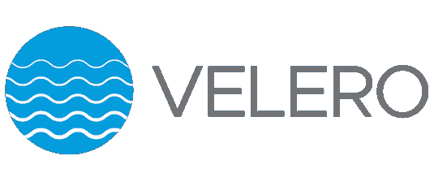

# 在备份您的 Kubernetes 集群之前，您需要阅读这篇文章

> 原文：<https://itnext.io/you-need-to-read-this-before-backuping-your-kubernetes-cluster-9a673f1151af?source=collection_archive---------2----------------------->

欢迎来到我的 Kubernetes 博客。这些博客旨在为您提供有效的 Kubernetes 知识和工具，提高效率，同时减少压力和交付高质量解决方案的时间。点按“关注”按钮，以便在新故事发布时得到通知。

**让我们开始吧……**

我们只需要看看每日新闻，就可以了解日益增长的网络攻击威胁，5g、AI 等新兴技术可能带来的威胁，以及网络犯罪集团之间日益增长的协调。无论你认同什么理由，数据备份对任何公司来说都是必不可少的，这一点很清楚。

如果一家企业因违规或任何其他原因遭受数据丢失，该公司能多快恢复？虽然数据备份不能保护您免受网络攻击，但它可以帮助您快速恢复。

在 Kubernetes 的早期，驻留在 Kubernetes 集群上的大多数应用程序都是无状态的。将这些应用程序打包在 helm charts 中，使 Kubernetes 管理员能够通过将应用程序 helm charts 重新部署到新的集群来快速从集群故障中恢复。

需要注意的是，在 on-permiss 场景中，更常见的是备份您的 etcd 和集群证书，以恢复集群中出现故障的控制平面节点。

今天，Kubernetes 社区和生态系统已经显著增长，有状态应用程序的使用已经变得更加普遍，因此需要一个集中的备份系统。

**那么让我们来回顾一下下面的话题。**

*   备份和恢复 Kubernetes 集群的挑战
*   备份系统工作的最佳时机
*   velero——面向 Kubernetes 生态系统的开源备份解决方案

**备份和恢复 Kubernetes 集群的挑战**

如简介中所述，在 Kubernetes 集群中使用有状态应用程序比以往更加普遍。掌舵图和操作符的使用使集群管理员能够轻松部署这些应用程序并有效地管理它们。

随着有状态应用程序在 Kubernetes 集群中的普遍使用，我们面临着更多需要定制备份和恢复操作的组件。

我们会发现自己在为集群状态备份 etcd，为不同的有状态应用程序数据定制备份和恢复操作，以及维护不同的脚本来解决我们的备份和恢复需求，这些脚本可能会变得复杂且容易出现故障。

**备份系统工作的最佳时机**

虽然这可能是一个有争议的话题，因为每个集群管理员对于何时应该有一个备份系统都有不同的观点。我认为 Kubernetes 集群上的备份工作可以推迟，特别是在初创公司，如果满足以下条件。

1.  您的集群只包含无状态的应用程序。
2.  这些应用程序作为 helm 存储在打包工具中，可以在几秒钟内部署到不同的集群。
3.  您正在使用云提供商或任何其他能够在可接受的时间内提供新的 Kubernetes 集群的平台。
4.  您的公司可以承受长时间的停机。

请注意，一些有状态的应用程序正与备份和恢复工具打包在一起，这些工具可以轻松配置为 [thanos](https://bitnami.com/stack/thanos/helm) 和 [zalando postgres](https://github.com/zalando/postgres-operator) ，不需要您准备一个强大的备份解决方案。

**Velero —面向 Kubernetes 生态系统的开源备份解决方案**

虽然市场上有许多备份解决方案，但用于备份、恢复、迁移和复制 Kubernetes 集群的领先开源工具是 [Velero](https://velero.io/) 。

Velero 是一个开源解决方案，用于集中式备份和恢复操作、集群迁移和集群复制。Velero 通过利用自定义资源定义(CRD)和实现处理 CRD 以执行备份、恢复和所有相关操作的自定义控制器来扩展 Kubernetes API。

Velero 可用于备份您的洞群资源，或者您可以筛选和决定特定的资源。

Velero 使用 object storage bucket 作为 s3、google cloud storage 和类似的对象存储解决方案来备份包含 Kubernetes 资源的 tarballs。Velero 还使用 cloud-api 为集群中的持久性卷执行磁盘卷快照。

如果您的 Kubernetes 集群没有位于受支持的提供者上来执行磁盘备份，Velero 通过实现文件系统备份来解决这个问题。

**结论**
保持数据的安全性和弹性是每个公司努力追求的目标，尤其是在当前由黑客、数据丢失风险和数据损坏构成的全球形势下。在 Kubernetes 中，虽然备份解决方案可以推迟，但我们可以使用 Velero 等工具来集中 Kubernetes 集群的备份、恢复、迁移和复制操作。

谢谢，如果您有任何问题或需要任何帮助，您可以通过 [LinkedIn](https://www.linkedin.com/in/dekel-malul/) 联系我。如果你想深入了解 Velero，请在下面的评论中或者通过直接留言告诉我。

***********************************************************************

链接:

[www.devunet.com](http://www.devunet.com)(访问我公司网站)

[https://www.linkedin.com/in/dekel-malul/](https://www.linkedin.com/in/dekel-malul/)(在 Linkedin 联系我)

[https://www.linkedin.com/company/devunet/](https://www.linkedin.com/company/devunet/)(在 Linkedin 上关注我们的独家视频)