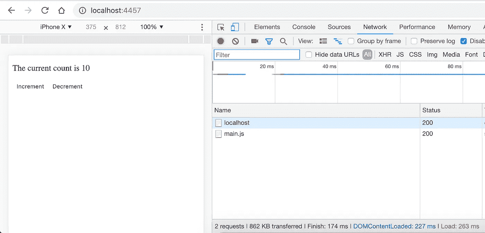
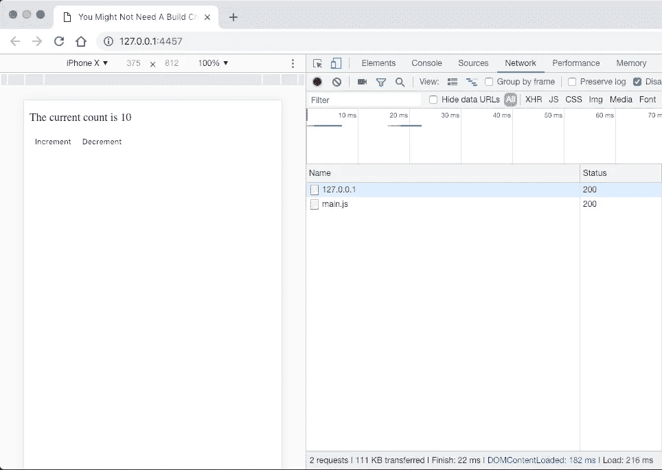
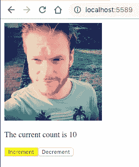

# 您可能需要一个构建工具链

> 原文：<https://itnext.io/you-probably-need-a-build-toolchain-88ed311c3476?source=collection_archive---------3----------------------->

## 假设您想使用最新的语言功能

## TL；速度三角形定位法(dead reckoning)

*   您可能希望使用新的 JavaScript 语言特性
*   你可能想要支持传统的浏览器，比如 IE11，和古怪的 Android/IOS 浏览器
*   你可能希望你的网站是高性能的(CSS/JavaScript 的捆绑)
*   通过使用像热模块重装(HMR)这样的插件，你可以成为一个更有效率的开发者
*   我们将讨论如何在零配置的情况下使用 Webpack 和 Webpack 开发服务器
*   我们支持使用 Babel 进行编译，增加了对 HMR、SCSS、图像处理和开发/生产版本的支持


马克斯·尼尔森在 [Unsplash](https://unsplash.com?utm_source=medium&utm_medium=referral) 上拍摄的照片

## **需要构建工具链的主要原因是什么？**

在之前的一篇文章中，我们讨论了如何使用 React 构建一个 web 应用程序，使用当前的 JavaScript 语法和功能，而不必编译/传输代码，即使对于遗留浏览器也是如此(这是在运行时而不是在构建时完成的)。

然而，实际上，您可能想要使用某种类型的构建工具链。

让我们讨论一下拥有构建工具链的一些好处。

**新的语言语法/功能**

您可能希望使用 JavaScript 的新语法/功能，这还不是规范的正式部分。官方的 ECMAScript 标准通常远远落后于开发人员在该领域中可以使用的标准。这是由设计决定的，因为在一个新兴标准被批准之前，它必须首先被多个供应商(例如 Node、Chromium)积极使用和实现。目前有许多流行的插件正在使用，它们还没有成为 ECMAScript 标准的正式组成部分，但是随着时间的推移，它们可以显著提高代码的可读性/可维护性。

**对传统浏览器的最大支持**

你可能想要最大化跨浏览器支持。浏览器是古怪的，尤其是 IE 和其他老浏览器。虽然我们能够相对容易地在 IE11 中运行简单的计数器应用程序(使用 Traceur ),但我们不可避免地会遇到这种情况。当我们遇到问题时，我们可以自己实现一个多填充或某种解决方法，但是为什么要将这个不必要的任务添加到我们已经繁忙的工作量中呢？开源社区已经用(优雅的)解决方案解决了这些问题，那么为什么不利用这一点，让我们自己省心呢？

**性能是您网站的核心**

你可能希望性能成为你网站的核心。网络用户是一群善变的人，如果你的网站需要一段时间来加载，流量会很快下降，导致可能的业务损失。如果你的网站加载速度慢，特别是在移动设备上，你的网站也会在搜索引擎结果中被扣分。如前所述，当前确保网站加载更快的最佳实践是将相关资源捆绑到单个文件中(例如，将所有 JavaScript 模块合并到单个 JavaScript 文件中)。这是一个令人惊讶的复杂过程，可能不是您想要手动完成的事情。像这样重复而复杂的任务非常适合构建工具。

**你想成为一名高效的开发人员**

你可能需要效率工具，比如热模块重装(HMR)。HMR 使您无需刷新页面就能实时看到代码的变化。在我们的无构建工具链的例子中，每次我们对代码进行修改时，我们都必须刷新页面。这对于我们简单的应用程序来说没问题，但是随着应用程序变得越来越复杂，这将变得更有问题。在我们的例子中，我们可以增加和减少一个计数器，并立即看到效果。在我们的代码中，我们使用本地状态来保存计数器的当前值。如果我们更改代码并刷新页面，本地状态将会丢失并重置为默认值(当然，除非我们将它存储在数据库或本地存储或其他地方！).HMR 通过根据需要动态“刷新”我们的组件来解决这个问题。状态通常可以为我们维护，以便我们可以从停止的地方继续。整洁吧？我现在还不知道没有某种构建工具的 HMR(如果我错了，请纠正我！).

## **使用 Webpack 从头开始构建一个简单的 React 工具链**

Webpack 是我最喜欢的工具之一，用来建立一个生产就绪的网站。Webpack 在配置方面可能会有复杂性，但是只要稍加小心和预先规划，这些复杂性通常是可以减轻的。

Webpack 有一个零配置模式，我们可以利用它来开始，我们可以使用命令行参数和插件来进一步增强它。

我们将很快触及这种方法的一些限制，但是我们将在本系列的后续文章中探索一个更复杂的基于配置的 Webpack 工具链。

**为什么是 Webpack？**

多年来，已经有许多工具可以用来建立网站。我最近最喜欢的是 [Gulp](https://gulpjs.com/) ，一个流构建系统。Gulp 失去了开源社区的青睐，因为调试、文档以及启动和运行基本功能所需的大量代码和第三方插件非常复杂。

坦率地说，在我看来，Webpack 没有解决这些问题。Webpack 运行起来很棒，但调试可能是一场噩梦，文档是我见过的最糟糕的。我迫切需要一个像样的工具来代替它。手指交叉，2019 年将产生替代。

那么，为什么选择 Webpack 呢？简短的回答很简单，每个人都使用它。我工作的每家公司都使用 Webpack，所以定期使用 Webpack 非常重要，这样我就可以帮助解决出现的问题。当我工作的公司开始使用不同的工具时，我也会开始使用它们。这是今天作为一名开发人员的现实，你并不总是能够使用你想要使用的工具，你也几乎从来没有在绿地项目上工作过，所以你必须处理已经存在的东西。

**安装和配置 Webpack**

我们将利用 Webpack 的零配置模式快速入门，然后添加配置以增强构建的有用性。

新建一个文件夹，添加一个`package.json`文件，如下:

我们将使用 React 和 ReactDOM，因此我们将在这里将它们添加为`dependencies`。

要使用 Webpack，我们只需要将`webpack`和`webpack-cli`列为`devDependencies`。

我加了两个脚本，`build:dev`和`build:prod`。区别很简单，`build:prod`脚本将*丑化*代码(缩小它)。

创建一个新文件，名为`index.html`。添加以下内容；

当我们很快运行 Webpack 时，它将捆绑我们所有的 JavaScript 并将其转储到一个名为`main.js`的文件夹`dist`中。我们可以使用一个配置文件来覆盖它，但是这超出了本文的范围。

现在让我们继续创建我们的应用程序，一个简单的带有递增和递减按钮的计数器应用程序。

创建一个名为`src`的新文件夹和一个名为`index.js`的新文件，并添加以下内容:

创建`app.js`并添加以下内容:

最后，创建`counter.js`并添加以下内容；

这是我们的基本应用程序编码和准备就绪。

从命令行运行以下命令；

```
npm run build:dev && npm start
```

我们没有讨论`npm start`。运行`npm start`将运行一个非常基本的 web 服务器，这样我们可以在浏览器中看到我们的应用程序运行。



如果你打开开发者工具，看看网络选项卡，你可能会看到一些令人惊讶的东西，可能相当令人震惊。我们的小应用程序重达 862KB。那么是哪里出了问题呢？

当我们使用`npm run build:dev`运行开发构建时，我们的包包含以下所有内容(以及我们的代码)；

*   空白。
*   评论。
*   长变量名。
*   重复代码/没有树抖动。
*   以上都是 React & ReactDOM 的。

当我们运行`npm run build:prod`时，我们获得了上述所有好处，并且我们的包大小下降到了 **111KB** 。



仍然很大，但明显比以前好。

**添加巴别塔以增加跨浏览器支持并启用 JSX**

现在，我们没有编译/传输任何代码。我们写的代码包含了析构，新的 ES6 关键字，类等等。在不支持 ES6 的浏览器中运行代码会导致很多问题。

同时，代码又长又难看，因为我们还没有 JSX 的支持。

让我们同时解决这两个问题。

使用此命令添加下列包；

```
npm install --save-dev @babel/core @babel/preset-env @babel/preset-react babel-loader
```

这些包裹是干什么用的？

*   `@babel/core`是巴别塔编译器的核心。
*   `@babel/preset-env`是一个预置，允许您使用最新的 JavaScript，而无需担心浏览器支持需要什么转换/聚合填充。
*   `@babel/preset-react`是几个转换的包装器，支持 JSX 等等。
*   `babel-loader`是 Webpack 的一个插件。我们将需要指示网络包使用巴别塔不久。

要使 Webpack 能够使用 Babel，请如下更新您的构建脚本(添加`— module-bind`标志)；

```
"build:dev": "webpack --mode development --module-bind js=babel-loader","build:prod": "webpack --mode production --module-bind js=babel-loader",
```

最后一件事，我们需要告诉巴贝尔使用我们的预置。创建一个名为`.babelrc`的新文件，并添加以下代码；

```
{"presets": ["@babel/preset-env", "@babel/preset-react"]}
```

Babel 运行时会寻找`.babelrc`并自动使用它们。

现在有了这些变化，我们可以如下更新我们的`counter.js`;

这样就减少了 18 行代码，这是一个不错的胜利。我们也可以高枕无忧，因为我们知道坚持使用传统浏览器的用户在使用我们的网站时也会得到全面支持。赢赢。

**使用 Webpack 重新加载热模块**

使用 Webpack 这样的工具的一个致命原因是热模块重载(HMR)。HMR 使您能够在做出更改时几乎立即在浏览器中看到这些更改，通常不需要刷新页面或丢失应用程序状态。

要配置 HMR，我们必须执行以下操作:

*   切换到 Webpack 开发服务器(`http-server`在这里没有用)
*   安装`react-hot-loader`，并在我们的应用程序中使用它
*   配置我们的脚本，使它们在运行时注入到我们的 HTML 中，并解决 Webpack 零配置模式的一些限制

我们有很多事要做，让我们开始吧。

我们需要更多的包，所以运行下面的命令；

```
npm install --save-dev common-config-webpack-plugin html-webpack-plugin react-hot-loader webpack-dev-server
```

这些包裹是干什么用的？

*   `common-config-webpack-plugin`包含了一堆*标准的* Webpack 配置，这样我们就不必编写自己的配置了(这样我们就可以在零配置的列车上多待一会儿了！)
*   `html-webpack-plugin`我们将使用它来生成一个 HTML 文件，并将我们的资产注入其中
*   `react-hot-loader`允许用户修改我们的 React 组件并实时查看变化
*   `webpack-dev-server`是一个类似`http-server`的网络服务器，但是它也支持 HMR

我们首先将`react-hot-loader`作为插件添加到 Babel 中。如下更新`.babelrc`(添加`plugins`键/值)；

```
{"presets": ["@babel/preset-env", "@babel/preset-react"],"plugins": ["react-hot-loader/babel"]}
```

然后，让我们更新我们的应用程序，以利用 HMR。打开`app.js`，按如下方式更改代码；

我们使用`hot`高阶函数来启用 HMR。

现在我们遇到了一点麻烦。我们不再能控制我们的 HTML 文件了。事实上，我们在根文件夹中的那个将不再被使用。由于我们使用 HMR，我们需要在运行时注入我们的脚本，这将是`html-webpack-plugin`的工作。

打开`index.js`，更新代码如下:

请注意，我们现在不再以 id 为`root`的`div`为目标。我们现在改为瞄准`body`。这是因为，据我所知，使用这种零配置方法，没有办法在构建时注入容器`div`(如果我错了，请在下面的评论中纠正我！).

React 在浏览器控制台中会有一点抱怨，但一切仍将正常工作。我们将在后续文章中解决这个问题(**剧透**:你需要一个配置文件)。

最后，我们必须更新我们的 NPM 脚本来使用`webpack-dev-server`。打开`package.json`并添加以下脚本(保留原来的脚本):

```
"start:hmr": "webpack-dev-server --hot --mode=development --module-bind js=babel-loader --port=5589 --plugin common-config-webpack-plugin --plugin html-webpack-plugin"
```

这里发生了很多事情，但应该是不言自明的；

*   在开发模式下，在端口`5589`上运行 Webpack Dev Server，并启用 HMR
*   使用巴别塔
*   使用已经讨论过的`common-config-webpack-plugin`和`html-webpack-plugin`

现在所有的部分都应该就位了。如果您运行`npm run start:hmr`并打开浏览器到`[http://localhost:5589](http://localhost:5589)`，您应该看到您的应用程序正在运行。前往`counter.js`，进行更改，您应该会立即看到屏幕上反映的更改。

**增加对 SCSS 和图像的支持**

由于我们正在使用`common-config-webpack-plugin`，我们已经支持 SCSS 文件和 SCSS 模块，以及图像，所以不需要进一步的配置。

要为我们的`Counter`组件使用 SCSS 模块，只需创建一个名为`counter.module.scss`的新文件并添加一个样式；

```
.button {background-color: yellow;}
```

并将文件直接导入`counter.js`如下:

```
import styles from "./counter.module.scss";
```

我们称我们的样式为`.button`，所以我们用`styles.button`来引用它。

当我们回到浏览器时，按钮现在应该有一个黄色的背景。

对于图像来说，过程是相同的。

在`src`中创建一个名为`img`的新文件夹，并在其中添加一张图片。

现在转到`app.js`导入图像；

```
import img from "./img/jonpreece-square.png";
```

然后，您可以通过设置`img`标签的`src`来使用图像，如下所示:

这是我们完成的应用程序；



使用零配置 webpack 完成应用程序

这个项目的代码可以在 [GitHub](https://github.com/jpreecedev/simple-react-pipeline-webpack) 上找到。

## 摘要

您可能需要一个构建工具链，因为您可能希望支持最新的语言特性、传统浏览器、拥有一个高性能的网站，并使用热模块重装(HMR)等工具来减少开发时间。Webpack 是现在快速启动和运行的最佳选择。更复杂的构建需要一个配置文件，这可能很难管理。

## 取得联系

你喜欢这个故事还是想和我进一步讨论？为什么不在 Twitter 上给我发消息呢！

[](https://twitter.com/jpreecedev) [## 乔恩·普利斯(@jpreecedev) |推特

### Jon Preece 的最新推文(@jpreecedev)。合同网页开发商，设计师和软件开发商。沃林顿…

twitter.com](https://twitter.com/jpreecedev) 

或者看看我的个人博客

[](https://developerhandbook.com/) [## DeveloperHandbook.com-更干净的代码，更好的代码。

### 这里通过全面有趣的教程来帮助你写更干净的代码，更好的代码

developerhandbook.com](https://developerhandbook.com/) 

谢谢大家！