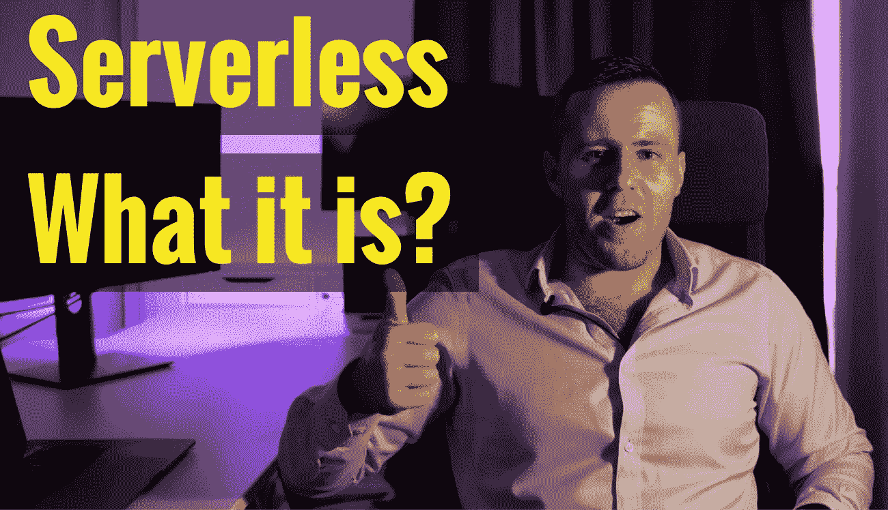

# 在你花几个月的时间在 IT 项目上之前，你应该知道这 8 件关于无服务器的事情

> 原文：<https://itnext.io/you-should-know-these-8-things-about-serverless-before-youll-spend-months-on-the-it-project-6319b35f0668?source=collection_archive---------4----------------------->



[AWS 无服务器 Web 应用教程](https://www.blog.duomly.com/aws-serverless-web-application-tutorial/)

本文原载于[https://www . blog . duomly . com/AWS-server less-we B- application-tutorial](https://www.blog.duomly.com//aws-serverless-web-application-tutorial)/

# AWS 无服务器 Web 应用程序教程简介

今天我们将浏览 AWS 无服务器 Web 应用程序教程。

现在几乎每个行业都在积极使用它。

我们构建网络和移动应用程序、制造应用程序、电子商务，甚至处理工厂的软件。

开发不是一个简单的过程，需要花费大量的金钱，经常会有压力，但这并不是我们需要处理的全部。

我们的大多数 IT 解决方案需要维护，并且需要 IT 基础设施来处理我们的软件。

这一点，在许多情况下，是非常痛苦的，创造了永无止境的费用和风险。

但是，如果我告诉您，IT 基础架构的成本甚至可以降低 90%呢？

如果我告诉你，现代建筑也能降低风险，你会相信吗？

我们感谢一位英雄，无服务器计算。

无服务器是一个相对较新的事物，没有多少公司每天都在使用它，但是很多公司已经开始了重要的迁移。

迁移的规模可能没有那么大，比如从 monoliths 到微服务的迁移，或者从 100%的服务器端应用到 Angular 或 React.JS 等前端框架的迁移。

但这只是因为不是每个公司都知道无服务器计算的巨大好处。

今天，我将向您介绍该主题的一些知识，我将回答最受欢迎的问题，并告诉您无服务器使用中的流行解决方案。

开始吧！

如果你喜欢视频，这是 youtube 的版本:

[AWS 无服务器 Web 应用初学者教程](https://youtu.be/hCaCfV81pwM)

# 什么是无服务器计算

无服务器计算是后端类型服务的 FAAS(功能即服务)模型，在云中按需提供。

这意味着，从心理上来说，仍然有后端的使用，但你不需要购买整个服务器，整个月，配置，并负责服务器的安全。

相反，你可以只上传写好的代码给你的后端，并且只为代码的功能被执行的时间付费。

# 什么是无服务器架构

无服务器架构是一种软件或架构设计模式，其中我们在无服务器计算上中继我们项目的部分。

在这种情况下，我们不需要维护整个 IT 基础架构。

我们不需要维护服务器和数据库，因为理论上，我们没有它们，我们只是使用打包到 AWS 服务中的维护解决方案。

我们不需要手动扩展我们的项目，比如购买更多的实例或者迁移到更大的实例(AWS 可以提供自动可伸缩性)。

我们 IT 基础架构的每一部分都可以是可扩展的、安全的、易于维护的。当我们需要更多功能时，我们可以开发和部署下一项服务。

# 无服务器更便宜吗

无服务器计算的工作方式与我们过去用于后端的标准服务器略有不同。

当使用常规服务器时，我们租用实例，如果我们希望我们的服务始终可用，我们需要支付整个月的费用，每天 24 小时。

我们是否使用它并不重要。

有了无服务器，我们只为执行代码的时间付费。

如果我们在 x 天只有几个访问者，我们只为他们使用我们服务的 x 分钟/小时付费。

在许多项目中，成本降低甚至可以达到 90%。

但是，我们仍然需要知道，在某些情况下，当我们有非常稳定的流量时，我们可以精确地预测整个月，无服务器可能会更昂贵。

无论如何，当我们每分钟都有类似数量的用户时，这并不常见，而且大多数项目在某个小时都有流量高峰，所以我们需要购买更大的服务器来处理流量高峰。

# 为什么使用无服务器

当然，当我们规划 IT 项目时，成本是一个关键指标，但是当我们谈论无服务器时，金钱并不是唯一的优势。

当我们考虑这种类型的架构时，安全性是我们应该看到的下一个好处。

尽管如此，我们在安全性方面仍有很多工作要做，但当我们使用标准服务器时，就要少得多了。

例如，使用无服务器，系统的安全性取决于服务提供商，而不是我们。这是一个巨大的工作量，我们可以解决。

我想告诉您的下一件事是部署的可伸缩性和简单性(关于部署，我将在接下来的小节中讲述更多)。

有了无服务器，我们不需要那么关心可扩展性，因为如果我们有更多的流量，我们只需要支付更大的发票。

我们不需要关心购买更多、更大的实例，并配置它们。

# 什么是 AWS CloudFormation，为什么您应该关注它

您是否认为为公司建立一个完整的 IT 基础架构很困难，并且需要大量的工作？

不再是了！

认识一下现代 IT 的真正英雄，AWS CloudFormation。

AWS CloudFormation 是一项服务，允许您生成整个 IT 基础架构(是的，所有后端、服务、数据库、文件存储、API，甚至防火墙)，甚至通过几次点击就可以在那里部署您的软件。

您可以使用无服务器框架或 AWS SAM 来生成 AWS CloudFormation 模板(只需一个 YAML 配置文件)，您可以在其中放置所有配置，仅此而已。

而基础架构将自动为您生成，因此您不需要在高级开发运营上花费金钱和时间。

# 什么是无服务器框架

无服务器框架是开源框架，由 Austen Collins 在 Node 中编写。

它帮助您模板化、开发、构建和部署整个无服务器基础架构。

使用无服务器框架，您不仅可以构建 AWS 无服务器应用程序，还可以使用其他服务提供商，如 Google Cloud、Oracle 或 Microsoft Azure。

为了用无服务器框架定义基础设施，我们使用 YAML(。yml)模板并定义结构，如下例所示。

这是一个节点的例子。JS GraphQL API 和 PostgreSQL 数据库:

```
service: ${file(./keys.json):ApiName}provider:
  name: aws
  region: us-east-1
  stage: dev
  memorySize: 256
  runtime: nodejs12.x
  role: LambdaRole
  environment:
    #aurora
    AURORA_HOST: ${self:custom.AURORA.HOST}
    AURORA_PORT: ${self:custom.AURORA.PORT}
    #mysql
    MYSQL_HOST: ${self:custom.MYSQL.HOST}
    MYSQL_PORT: ${self:custom.MYSQL.PORT}
    #postgresql
    POSTGRESQL_HOST: ${self:custom.POSTGRESQL.HOST}
    POSTGRESQL_PORT: ${self:custom.POSTGRESQL.PORT}
    #common
    DB_NAME: ${self:custom.DB_NAME}
    USERNAME: ${self:custom.USERNAME}
    PASSWORD: ${self:custom.PASSWORD}
custom:
  DB_NAME: graphql
  USERNAME: master
  PASSWORD: password
  AURORA:
    HOST:
      Fn::GetAtt: [AuroraRDSCluster, Endpoint.Address]
    PORT:
      Fn::GetAtt: [AuroraRDSCluster, Endpoint.Port]
    VPC_CIDR: 10
  MYSQL:
    HOST:
      Fn::GetAtt: [MySqlRDSInstance, Endpoint.Address]
    PORT:
      Fn::GetAtt: [MySqlRDSInstance, Endpoint.Port]
  POSTGRESQL:
    HOST:
      Fn::GetAtt: [PostgreSqlRDSInstance, Endpoint.Address]
    PORT:
      Fn::GetAtt: [PostgreSqlRDSInstance, Endpoint.Port]plugins:
  - serverless-pseudo-parameters
resources:
  Resources:
    LambdaRole: ${file(./resource/LambdaRole.yml)}
    ServerlessInternetGateway: ${file(./resource/ServerlessInternetGateway.yml)}
    ServerlessVPC: ${file(./resource/ServerlessVPC.yml)}
    ServerlessVPCGA: ${file(./resource/ServerlessVPCGA.yml)}
    ServerlessSubnetA: ${file(./resource/ServerlessSubnetA.yml)}
    ServerlessSubnetB: ${file(./resource/ServerlessSubnetB.yml)}
    ServerlessSubnetC: ${file(./resource/ServerlessSubnetC.yml)}
    ServerlessSubnetGroup: ${file(./resource/ServerlessSubnetGroup.yml)}
    ServerlessSecurityGroup: ${file(./resource/ServerlessSecurityGroup.yml)}
    RouteTablePublic: ${file(./resource/RouteTablePublic.yml)}
    RoutePublic: ${file(./resource/RoutePublic.yml)}
    RouteTableAssociationSubnetA: ${file(./resource/RouteTableAssociationSubnetA.yml)}
    RouteTableAssociationSubnetB: ${file(./resource/RouteTableAssociationSubnetB.yml)}
    RouteTableAssociationSubnetC: ${file(./resource/RouteTableAssociationSubnetC.yml)} AuroraRDSClusterParameter: ${file(./resource/AuroraRDSClusterParameter.yml)}
    AuroraRDSInstanceParameter: ${file(./resource/AuroraRDSInstanceParameter.yml)}
    AuroraRDSCluster: ${file(./resource/AuroraRDSCluster.yml)}
    AuroraRDSInstance: ${file(./resource/AuroraRDSInstance.yml)} MySqlRDSInstance: ${file(./resource/MySqlRDSInstance.yml)} PostgreSqlRDSInstance: ${file(./resource/PostgreSqlRDSInstance.yml)}functions:
  graphql:
    handler: handler.server
    events:
      - http:
          path: /
          method: post
          cors: true
  playground:
    handler: handler.playground
    events:
      - http:
          path: /
          method: get
          cors: true
```

# 什么是 AWS SAM

AWS SAM，无服务器应用程序模型，是一个非常类似于无服务器框架的工具。

像无服务器框架一样，无服务器应用程序模型是一个开源框架，可以让我们构建无服务器基础设施。

和无服务器框架一样，SAM 使用 YAML 模板系统。

他们之间有一些不同。

最重要的是，无服务器框架旨在部署 FaaS(功能即服务)，而 AWS SAM 旨在帮助构建整个基础架构。

下面是节点的 SAM 模板示例。带有 DynamoDB 的 JS REST API:

```
AWSTemplateFormatVersion: 2010-09-09
Description: >-
  Your serviceTransform: AWS::Serverless-2016-10-31Globals:
  Function:
    PermissionsBoundary: !Sub 'arn:${AWS::Partition}:iam::${AWS::AccountId}:policy/${AppId}-${AWS::Region}-PermissionsBoundary'Parameters:
  AppId:
    Type: StringResources:
  getAllItemsFunction:
    Type: AWS::Serverless::Function
    Properties:
      CodeUri: ./
      Handler: src/handlers/get-all-items.getAllItemsHandler
      Runtime: nodejs10.x
      MemorySize: 128
      Timeout: 60
      Description: A simple example includes a HTTP get method to get all items from a DynamoDB table.
      Policies:
        - DynamoDBCrudPolicy:
            TableName: !Ref SampleTable
      Environment:
        Variables:
          SAMPLE_TABLE: !Ref SampleTable
      Events:
        Api:
          Type: Api
          Properties:
            Path: /
            Method: GET
  getByIdFunction:
    Type: AWS::Serverless::Function
    Properties:
      CodeUri: ./
      Handler: src/handlers/get-by-id.getByIdHandler
      Runtime: nodejs10.x
      MemorySize: 128
      Timeout: 60
      Description: A simple example includes a HTTP get method to get one item by id from a DynamoDB table.
      Policies:
        # Give Create/Read/Update/Delete Permissions to the SampleTable
        - DynamoDBCrudPolicy:
            TableName: !Ref SampleTable
      Environment:
        Variables:
          # Make table name accessible as environment variable from function code during execution
          SAMPLE_TABLE: !Ref SampleTable
      Events:
        Api:
          Type: Api
          Properties:
            Path: /{id}
            Method: GET
  putItemFunction:
    Type: AWS::Serverless::Function
    Properties:
      CodeUri: ./
      Handler: src/handlers/put-item.putItemHandler
      Runtime: nodejs10.x
      MemorySize: 128
      Timeout: 60
      Description: A simple example includes a HTTP post method to add one item to a DynamoDB table.
      Policies:
        - DynamoDBCrudPolicy:
            TableName: !Ref SampleTable
      Environment:
        Variables:
          SAMPLE_TABLE: !Ref SampleTable
      Events:
        Api:
          Type: Api
          Properties:
            Path: /
            Method: POST
  SampleTable:
    Type: AWS::Serverless::SimpleTable
    Properties:
      PrimaryKey:
        Name: id
        Type: String
      ProvisionedThroughput:
        ReadCapacityUnits: 2
        WriteCapacityUnits: 2
```

# 无服务器的缺点

我们知道无服务器的许多好处，但是有什么限制吗？

是的，有几个。

第一个需要知道的是初始延迟(冷启动)，它会影响冷启动的性能。

第二个是整个基础设施的安全性如果许多组件相互依赖，您需要注意不要增加安全漏洞。

我们依赖服务提供商。这意味着我们的整个基础设施是基于 AWS，MS，或谷歌，没有太多的选择。

# AWS 无服务器 Web 应用程序教程总结

恭喜你，现在，你知道什么是无服务器，以及为什么值得使用它！

我希望我已经解释了关于无服务器架构的最流行的问题，并且你将能够知道它是否适合你的项目。

如果您需要一些关于您未来或当前项目架构的建议，请随时联系我。

咨询我会很开心的。


[Duomly —编程在线课程](https://www.duomly.com/?code=lifetime-80)

感谢阅读，

拉德克