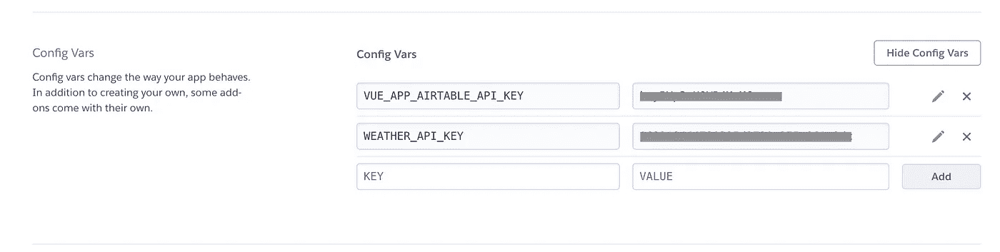
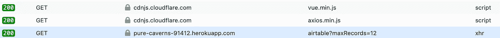
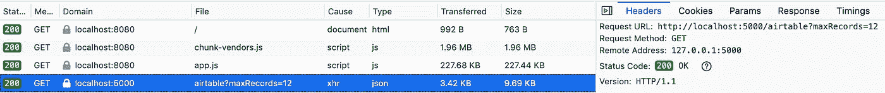

# 您的 API 密钥:像保密一样保密

> 原文：<https://itnext.io/your-api-key-keep-it-like-a-secret-d41e6971d172?source=collection_archive---------2----------------------->

当在来自前端的请求中使用 API 密钥时，使用一个简单的代理服务器来保证它们的安全。


白松鼠。卡罗莱纳松鼠。版权所有诺拉布朗。

根据互联网的说法，你不应该将你的私有 API 密钥存储在前端代码中。当您这样做时，您可能会以三种方式暴露它们:

*   在代码中——任何一个浏览你网站源代码的人都可能会发现它们。
*   在您的请求中——有人可以在开发工具的“网络”标签中看到它与您的 API 请求一起被传递。
*   在 Github 上——如果你的代码在公共存储库中，很容易扫描到 API 密钥。

# 为什么要保密？

如果你的 API 密匙是公开的、免费的、无配额的、只读的 API，那么你的 API 密匙是否是秘密的就没那么重要了。如果有人能拿到自己的钥匙，他们为什么要偷你的呢？如果他们做了又怎么样？

而且，许多服务允许您将呼叫限制到特定的域，或者对允许的请求数量设置上限。这有助于减少有人偷你钥匙的影响。

然而，在其他情况下，您可能需要一种更好的方法来保护您的 API 密钥。例如，我在一个 Airtable 数据库中保存时间跟踪和发票数据。我写了一个 Vue 应用程序来创建和记录发票。因为 API 键允许读写轻度敏感的数据，所以我不希望它只是挂在我的前端 Javascript 中。

那么我们能做些什么呢？创建代理服务器！

# WTF 是代理服务器？

是的——这也是我的第一个想法。想象一个代理服务器，就像 X 档案里的深喉角色。当莫特需要一些黑暗政府的信息时，他会和深喉说话。如果一切按计划进行，深喉与他的秘密来源对话，得到信息，然后传给莫特。穆德从不直接与这些隐藏的人物对话；都是通过他的*代理*深喉完成的。

感谢[毛里西奥·罗瓦约](https://github.com/MauricioRobayo/api-key-proxy-server)的这个项目(我肯定还有其他项目)，在 Heroku 上建立你自己的代理服务器并不太难。


代理服务器作为来自前端 Javascript 的 API 请求的中间人

# WTF 是 Heroku？

好问题。Heroku 是一个“平台即服务”。它允许任何人(甚至是对 PaaS 这种烦人的缩写过敏的人)通过最少的设置和配置来部署应用程序。它位于亚马逊网络服务之上。

# 该过程

这篇文章很大程度上基于[这个指南](https://blog.mauriciorobayo.com/how-to-hide-your-front-end-api-keys-ck6jqvll900y3dfs11u3x96tn)，为我们这些更倾向于前端的人提供了额外的细节。该方法的概要是:

1.  注册一个免费的 Heroku 帐户。
2.  在本地设置 Heroku 命令行界面(CLI)用于开发。
3.  创建您自己的代理服务器副本。
4.  用您特定的 API 服务来配置它。
5.  推给赫罗库。
6.  将您的 API 密钥添加为 Heroku“配置变量”。
7.  测试一下。

让我们为上述步骤添加一些细节。

## 报名参加 Heroku。

可以[注册一个免费账号](https://signup.heroku.com/)，非常适合尝试。[在免费账户](https://www.heroku.com/dynos)中，你的 Heroku 应用程序会在 30 分钟不活动后“休眠”，因此你对它的第一次请求会比平时多花一点时间。

## 安装 Heroku CLI

要安装 Heroku CLI，请遵循 Heroku 上优秀的[node . js 入门指南中的步骤。按照您的操作系统的说明进行操作。](https://devcenter.heroku.com/articles/getting-started-with-nodejs#set-up)

## 创建代理服务器应用程序

我们将克隆 [API 密钥代理服务器报告](https://github.com/MauricioRobayo/api-key-proxy-server)，而不是继续使用 Heroku 的“入门”应用程序。打开一个终端，进入你想保存项目文件的任何地方。运行以下命令来克隆存储库:

```
git clone [https://github.com/MauricioRobayo/api-key-proxy-heroku.git](https://github.com/MauricioRobayo/api-key-proxy-heroku.git)
```

然后`cd`进入新目录:

```
cd api-key-proxy-heroku
```

并运行 Heroku 提供的`create`命令:

```
heroku create your-app-name
```

如果你在没有提供 name 参数的情况下运行`heroku create`，Heroku 会给你的应用分配一个随机的、有点诗意的名字，比如“evening-rain-34589”，这可能会让你在 Heroku 账户中很难区分不同的应用。`create`命令“准备 Heroku 接收你的源代码”。来自指南:

> 当您创建一个应用程序时，还会创建一个 git remote(名为`heroku`)并与您的本地 git 存储库相关联。

## 配置代理服务器

大多数配置发生在名副其实的`config.js`文件中。这个文件的核心是一个代理数组，您将在其中设置您的最终用户应用程序将使用的每个服务。以下是 Airtable 的设置示例:

```
module.exports = {
  proxies: [
    {
      route: '/airtable',
      allowedMethods: ['GET'],
      allowedDomains: ['[http://localhost:8080'](http://localhost:8080'), '[https://www.norabrowndesign.com'](https://www.norabrowndesign.com')],
      target: '[https://api.airtable.com/v0/baseid/Table'](https://api.airtable.com/v0/appm4dAJr6GpPWKt0/Sightings'),
      headers: {
        Authorization: `Bearer ${process.env.VUE_APP_AIRTABLE_API_KEY}`,
      },
    },
    ...
  ]
}
```

以上意思是:

1.  当您想要向 Airtable 发出 API 请求时，您将改为向端点“/airtable”处的代理应用程序发出请求。
2.  代理应用程序将只接受`GET`请求。
3.  它将只接受来自本地开发服务器的请求，或者在本例中，来自我的网站的请求。
4.  它将向`target`(实际的 API 端点)'https://api.airtable.com/v0/baseid/Table'发出请求。
5.  根据 Airtable 的要求，对 Airtable 的请求将包括带有 API 键的`Authorization`头。

除了这五个参数之外，您还可以在请求中包含`auth`和`queryparams`参数。注意，虽然您可以在这里包含静态查询参数，但是您随请求发送给代理*的任何查询参数都将*传递给`target`。

## 把你的改变推给 Heroku

一旦您在`config.js`中设置了代理，您就可以将更改推送到 Heroku。首先，用一条消息添加并提交文件:

```
git commit -am "Add Airtable proxy setup"
```

然后推送到 Heroku 上的远程 repo:

```
git push heroku master
```

Heroku 自动[构建和部署你的应用](https://devcenter.heroku.com/articles/git#deploying-code)当你把改变推送到主分支，就像我们在这里做的。

## 将 API 键作为环境变量添加

现在，您的代理服务器需要知道您的 API 密钥，这样它就可以使用它们来发出授权请求。再看一下与 Airtable 请求一起发送的头:

```
Authorization: `Bearer ${process.env.VUE_APP_AIRTABLE_API_KEY}`,
```

那个`VUE_APP_AIRTABLE_API_KEY`就是我们要储存在 Heroku 的东西。

从你的 Heroku 仪表板，点击你刚刚创建的项目，然后设置。在配置变量部分，单击显示配置变量。在这里，您可以使用您在`config.js`代理列表中给定的常量名称添加任何 API 键。



Heroku 配置变量是 Heroku 应用程序的环境变量

## 测试您的新代理服务器

现在您已经准备好测试您的设置了。你可以用 [Postman](https://www.postman.com/) 或者任何一点 Javascript 来调用 API。由于我正在构建一个极其乏味的东西来显示我记录的鸟类观察，我将制作一个非常小的 Vue 应用程序。出于演示的目的，我把它放在 Codepen 上:

失败！事实上，这一开始并不奏效。API 请求返回了 404。为什么？因为 Codepen 不在允许的域中！要解决这个问题，我们可以添加它:

```
allowedDomains: [
  '[http://localhost:8080'](http://localhost:8080'),
  '[https://www.norabrowndesign.com'](https://www.norabrowndesign.com'),
  '[https://cdpn.io'](https://cdpn.io')
],
```

然后提交并部署您的更改:

```
git commit -am "Add Airtable proxy setup"
git push heroku master
```

而且很管用！显示一个 birds 列表，在 Network 选项卡中，您可以看到这个调用是使用`maxRecords`参数对代理服务器进行的:



实际上，返回了 12 条记录。

# 额外内容:在本地测试您的代理

API 密钥代理服务器的另一个好处是您可以轻松地在本地测试它。为此，创建一个名为`.env`的新文件，并添加 API 键:

```
VUE_APP_AIRTABLE_API_KEY=<your api key here>
```

“但是等等！”你会说…“这不正是我们想要避免的吗！?"算是吧。但是如果你打开`.gitignore`文件，你会注意到`.env`文件被列出，所以这个文件永远不会出现在 repo 中，只会存在于本地用于测试目的。

添加 API 密钥后，启动服务器:

```
npm run start:dev
```

如果你现在调整你的应用程序代码(或邮递员设置)来调用你的*本地*代理服务器，它应该运行在‘http://localhost:5000’:

```
axios.get('[http://localhost:5000/airtable', {](http://localhost:5000/airtable',{)
  params: {
    maxRecords: 12,
  }
}).then((response) => { /* yada yada */ })
```

您应该看到对本地代理服务器的成功 API 调用:



本地测试您的代理服务器

# 结论

我希望这有所帮助，特别是对于前端开发人员，他们正在用第三方 API 构建很多很酷的东西，但是对于让 API 键在他们的代码中浮动感到一丝不快。

请在下面留下想法和问题！