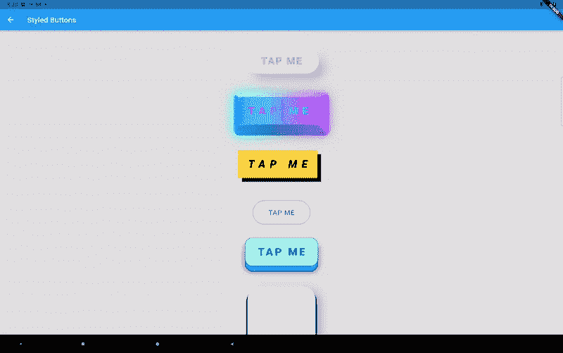
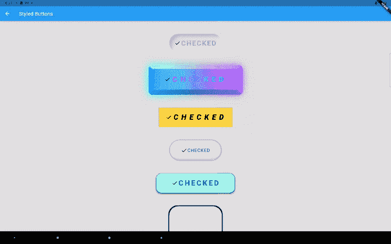
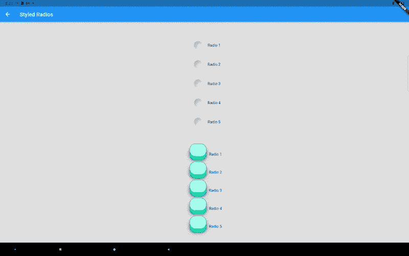
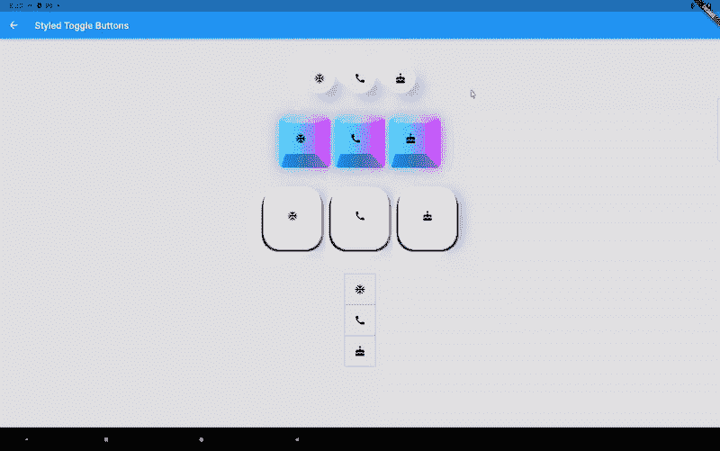
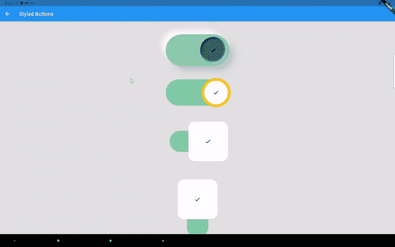
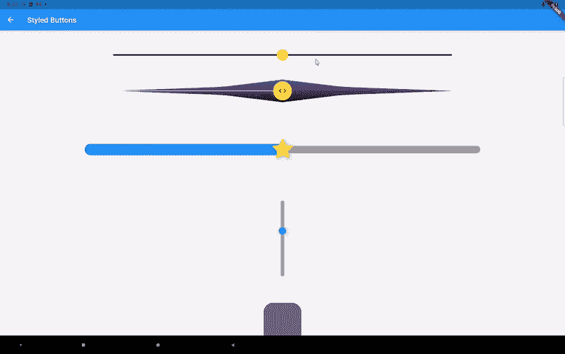

# 你的 Flutter 应用程序不一定要使用材质组件——引入风格化组件

> 原文：<https://itnext.io/your-flutter-app-doesnt-have-to-use-material-components-introduce-the-styled-components-61994765c4bc?source=collection_archive---------2----------------------->

我喜欢 Flutter 让你创建漂亮的、可定制的用户界面。有许多内置的小部件供您使用，如果您想要更多的定制，您可以使用 CustomPainter 并按照您喜欢的方式绘制屏幕。但是当涉及到 **UI 组件**如按钮、开关、复选框、滑块等时，我们通常只使用内置的小部件。它们易于使用，并为您提供一些定制能力，但它们必须遵循**材料**或**库比蒂诺**设计准则。如果这是你的目标，它们非常好用。但是，如果你想拥有自己的设计风格或超越这些小部件提供的调整，你可能会想寻找一些第三方软件包。pub.dev 上有很多这样的包。然而，可定制性通常仍然有限。如果某个包给了你许多参数来调整，你需要记住它们并学习如何正确使用它们。

# 一颗纽扣的关键成分是什么？

按钮只是一个矩形区域，可以被按下、悬停或禁用。如果查看内置组件小部件的代码，就会发现它们是根据其内部 MaterialState 属性显示的。

```
final Set<MaterialState> _states = <MaterialState>{};

bool get _hovered => _states.contains(MaterialState.hovered);
bool get _focused => _states.contains(MaterialState.focused);
bool get _pressed => _states.contains(MaterialState.pressed);
bool get _disabled => _states.contains(MaterialState.disabled);
```

如果我们为这些不同的状态提供完整的样式会怎么样？

# 从样式容器到样式按钮

在我之前的文章:[https://it next . io/create-a-squishy-responsive-cyber punk-button-in-flutter-590488 b44a 78](/create-a-squishy-responsive-cyberpunk-button-in-flutter-590488b44a78)和[https://it next . io/make-implicit-and-explicit-animations-with-the-responsive-styled-widget-package-7303 BF Fe 5c 53](/make-implicit-and-explicit-animations-with-the-responsive-styled-widget-package-7303bffe5c53)中，我介绍了 **Style** 和 **StyledContainer** 类。样式由以下 UI 数据类组成:

*   调整大小和对齐

```
Dimension width
Dimension height
Alignment alignment
Alignment childAlignment
EdgeInsets margin
EdgeInsets padding
```

*   形状和装饰

```
BoxDecorartion backgroundDecoration
BoxDecorartion foregroundDecoration
List<ShapeShadow> shadows
List<ShapeShadow> insetShadows
MorphableShapeBorder shapeBorder
```

*   能见度

```
bool visible
double opacity
```

*   转换

```
SmoothMatrix4 transform
Alignment transformAlignment
```

*   排印

```
DynamicTextStyle textStyle
TextAlign textAlign
```

*   鼠标光标样式

```
SystemMouseCursor mouseCursor
```

*   着色器和过滤器

```
Gradient shaderGradient
ImageFilter imageFilter
ImageFilter backdropFilter
```

## 风格提供了什么额外的好处？

除了容器小部件接受的参数之外，Style 类还支持一些自定义 UI 数据类，它们可以进行复杂的样式设置，如下所示:

**尺寸**类型来自[尺寸](https://pub.dev/packages/dimension)包装。它支持绝对和相对单位。还可以在尺寸上组合/嵌套最小/最大/夹紧功能。你可以把这看作是 SizedBox 和 FractionallySizedBox 的超级组合。以前，维度需要从 LayoutBuilder 获取父约束，这将使 IntrinsicWidth 和 IntrinsicHeight 不起作用，我现在创建了一个 RenderObject 来解决这个问题。

**ShapeShadow** 和**morphableshabeborder**来自 [morphable_shape](https://pub.dev/packages/morphable_shape) 包。除了 BoxShadow 已经支持的内容之外，ShapeShadow 还支持嵌入阴影和渐变填充。MorpableShapeBorder 支持许多常用的形状、形状变形、部分绘制边框边等等。观看 fluttershape.com[的互动演示。](https://fluttershape.com/)

**DynamicTextStyle** 允许您使用绝对/相对值定义字体大小、字母间距等。300%字体大小是默认字体大小的 3 倍。

**SmoothMatrix4** 类似于 Matrix4，但确保所有的变换都可以平滑地动画化。它还允许您使用尺寸作为平移距离，以适应不同的屏幕尺寸。

定义样式后，可以使用 StyledContainer 小部件:

```
var widget=StyledContainer(
 style: style,
 child: …
 );
```

或者使用 AnimatedStyledContainer 小部件制作隐式动画。

现在让我们看看 StyledButton 小部件的构造函数:

```
StyledButton(
      {Key? key,
      this.onPressed,
      required this.style,
      this.hoveredStyle,
      this.pressedStyle,
      this.disabledStyle,
      this.curve = Curves.linear,
      this.duration = const Duration(milliseconds: 100),
      Widget? child});
StyledButton.builder(
      {Key? key,
      this.onPressed,
      required this.style,
      this.hoveredStyle,
      this.pressedStyle,
      this.disabledStyle,
      this.curve = Curves.linear,
      this.duration = const Duration(milliseconds: 100),
      this.builder});
```

您需要为不同的按钮状态提供相应的样式。但是请注意，只有默认(空闲)样式是必需的。如果没有提供，其他三种样式将使用该样式。您还可以指定不同状态之间转换的持续时间和动画曲线。子参数是这个按钮的子部件。但是您也可以提供一个可以访问按钮状态的生成器:

```
builder: (context, state) {
      Widget child;
      switch (state) {
         case StyledState.pressed:
            child = Text("TAPPED", key: UniqueKey());
            break;

         default:
            child = Text("TAP ME", key: UniqueKey());
            break;
       }
       return AnimatedSwitcher(
         duration: Duration(milliseconds: 200),
         child: child,
       );
}
```

当您按下按钮时，此生成器将在“点击”和“点击我”文本之间淡入淡出。



六种样式的按钮设计

# 可切换组件

复选框、单选按钮和其他可切换组件不同于按钮，因为它们根据是否被选中而显示不同。因此 StyledCheckbox 需要 selectedStyle 而不是 pressedStyle 参数。



样式复选框

第一个按钮的代码如下所示:

```
StyledCheckbox.builder(
  value: _selected,
  onChanged: (bool value) {
    setState(() {
      _selected = value;
    });
  },
  duration: Duration(milliseconds: 200),
  builder: (BuildContext context, StyledState state) {
    Widget child;
    switch (state) {
      case StyledState.selected:
        child = Row(
          mainAxisSize: MainAxisSize.min,
          mainAxisAlignment: MainAxisAlignment.center,
          children: [
            Icon(Icons.*check*),
            Text(
              "CHECKED",
              key: UniqueKey(),
            ),
          ],
        );
        break;
      case StyledState.hovered:
        child = Text(
          "HOVERED",
          key: UniqueKey(),
        );
        break;
      default:
        child = Text(
          "CHECK ME",
          key: UniqueKey(),
        );
        break;
    }
    return AnimatedSwitcher(
      duration: Duration(milliseconds: 200),
      child: child,
    );
  },
  style: neumorphicStyle,
  selectedStyle: neumorphicSelectedStyle,
  hoveredStyle: neumorphicHoveredStyle,
);
```

以下是 StyledRadio 和 StyledToggleButtons 的设计:



StyledRadio



样式标签按钮

# 开关和滑块呢？

它们的设计更加棘手，因为现在涉及到两个或更多的组件。对于一个开关，您需要为轨道和 thumb 提供样式。下面是 StyledSwitch 的构造函数:

```
StyledSwitch(
    {Key? key,
    required this.value,
    required this.onChanged,
    required this.thumbStyle,
    this.thumbHoveredStyle,
    this.thumbSelectedStyle,
    this.thumbDisabledStyle,
    required this.trackStyle,
    this.trackSelectedStyle,
    this.trackHoveredStyle,
    this.trackDisabledStyle,
    this.direction = Axis.horizontal,
    this.curve = Curves.*linear*,
    this.duration = const Duration(milliseconds: 100),
    Widget thumbChild,
    });
```



StyledSwitch，最后一个是垂直的

除了轨道和滑块之外，您可能还想为滑块设计活动轨道或工具提示。

```
StyledSlider({
  Key? key,
  this.direction = Axis.horizontal,
  required this.value,
  required this.onChanged,
  this.onChangeStart,
  this.onChangeEnd,
  this.min = 0.0,
  this.max = 1.0,
  this.divisions,
  this.label,
  required this.trackStyle,
  required this.thumbStyle,
  this.thumbPressedStyle,
  this.thumbHoveredStyle,
  this.thumbDisabledStyle,
  this.activeTrackStyle,
  this.toolTipStyle,
  this.thumbChild,
  this.curve = Curves.*linear*,
  this.duration = const Duration(milliseconds: 100),
})
```



StyledSlider

请注意当您轻按或拖移拇指时，它是如何改变大小的。工具提示与 thumb/track 一样可定制，因为它也使用了 StyledContainer。StyledSlider 的接口还没有最终完成，因为我可能会添加更多的样式。

# 结论

样式化的组件为 [animated_styled_widget](https://pub.dev/packages/animated_styled_widget) 包增加了更多的功能。该产品包的主要特点是:

1.  嵌入阴影、可变形的形状边框、响应尺寸等。事情扑不提供开箱即用。
2.  在一个地方组合几个常用的小部件，像容器、文本样式、不透明度、图像过滤器等等，类似于 CSS 所做的。
3.  隐式和显式动画。滚动动画。与其他小部件全局协调的动画。预定义的动画。
4.  样式组件:StyledButton、StyledToggleButtons、StyledSwitch、StyledRadio、StyledCheckbox、StyledSlider。
5.  序列化支持。
6.  零安全。兼容所有运行颤振的平台。

下一步，我可能会支持这个包的主题化。所以你可以定义一个全局按钮样式，按钮悬停样式等。

今天到此为止。感谢您的阅读！