# 在不到 1 小时的时间内，在 AWS 上建立您自己的人工智能呼叫中心

> 原文：<https://itnext.io/your-own-ai-powered-call-center-on-aws-in-less-than-1-hour-d0494049977c?source=collection_archive---------0----------------------->

未来派的呼叫中心股票照片是如此糟糕，它实际上是好的，是吧？

[Amazon Connect](https://aws.amazon.com/connect/) 一直是我的好奇心所在，我曾在一家初创公司工作过一段时间，这家公司的主要目标是让呼叫中心的操作员生活更轻松。在那段时间里，我去马尼拉跟踪了其中一个地方，经营这样一家企业的精力、努力和耐心是惊人的！

*第一个重要讨论——呼叫中心还是呼叫中心？取决于你是不是英国人…所以让我们继续…我在这里做了不同的写作，这样每个人都高兴:-)*

所以我决定:我要建造它。现在。用例是什么？嗯，我现在对技术和局限性更感兴趣，因为我知道成千上万个呼叫中心的用例。因此，我设想了以下场景:我工作的公司 LINKIT 处于一个非常苛刻的阶段，我们无法再处理演示我们的 MLOps 工具的会议请求。我们已经做了一个系统，可以通过网站做到这一点，但由于一些疯狂的假设原因，我们仍然有人打电话给我们安排演示。我能用 Amazon Connect 建立这样一个东西吗？AWS 中的所有东西最终都会工作，但我也做了一段时间，知道在开始之前我必须使用其他几个服务。

# 最终解决方案

一个用户将拿起他的电话，打电话给我们的联系号码。该电话将被转接到 Amazon Connect。Amazon Connect 会将它链接到 Lex，对用户的对话和意图进行自然语言理解。然后，Lex 能够调用 lambda 函数来安排演示时间(存储在 DynamoDB 中)。通话到此结束。然而，在幕后，我们必须等待演示时间表的持续和确认。然后，我们可以向打电话的用户发送一条确认短信。

我想让它包含更多不同的意图和用法，那么如果用户想查看他的演示时间段呢？就这样结束了。

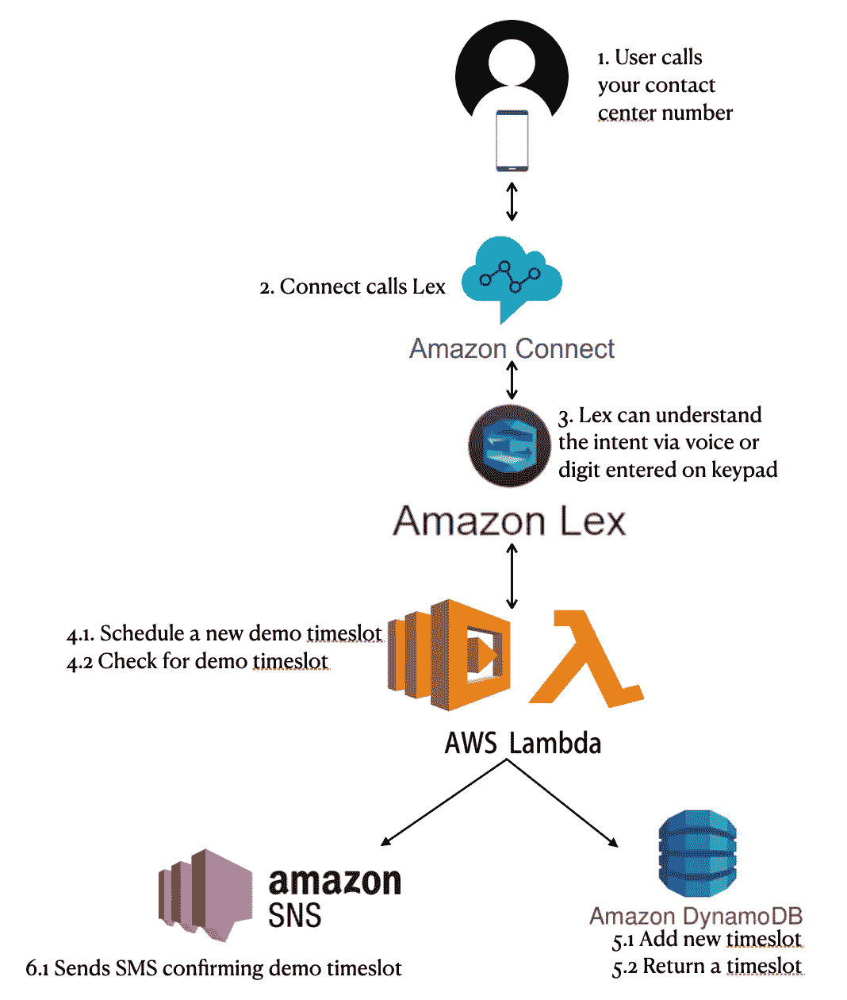

*Ps:我不知道的一件好事是，Lex 可以通过解释 DTMF(双音多频)值来识别键盘上输入的数字。*

# 1.初始设置

正如 AWS 上的每个设置一样，你需要在 IAM 上创建一些东西。在这种情况下，我创建了一个角色，允许 Lambda`sts:AssumeRole`一些服务策略，如下所示:

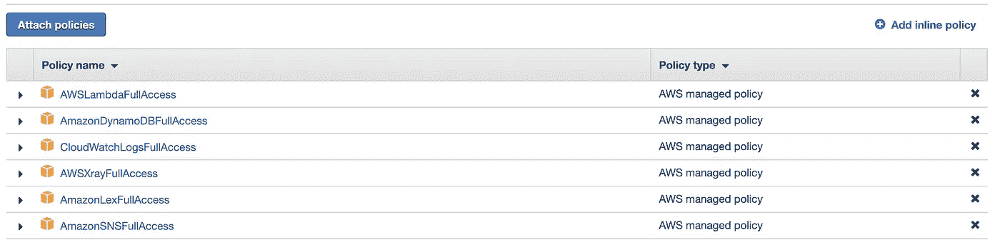

你会在生产中这样做吗？不要。最低准入原则！不给全权限…周末左右演示和黑？当然可以…

我们还知道，在 DynamoDB 上需要一个简单的表，包含呼叫者的电话号码作为标识符，以便能够安排、取消或检查时隙。

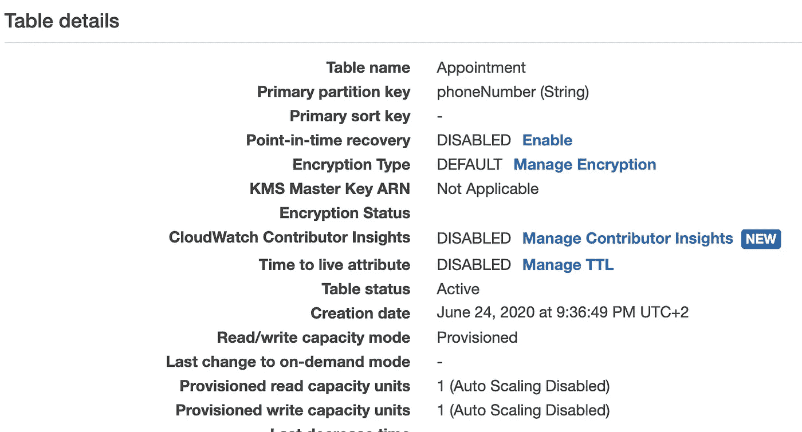

1 为读写？是啊！演示…

# 2.λ函数

我们知道我们有两个意图要通过 Lex 来识别。这些意图将生成不同的事件，这些事件将触发对 DynamoDB 和/或 SNS 的不同调用。Lambda 和获取 API 调用并传递它的简单性在这里有点不同，因为我们需要通过 Lex 确认意图和插槽。那么它是如何工作的呢？

我最终得到了一个庞大的 567 行 Python 3.7 作为 lambda 函数。所以，让我们一步一步来。该处理程序非常简单，返回一个函数`dispatch(event)`，其中 JSON 主体作为`event`槽出现。我使用这个函数根据意图路由请求。

那么，我的`dispatch()`函数是做什么的呢？它从事件 JSON 中获取意图，并调用特定的函数。所以最终，我“只有”两个最终执行的主要任务:`schedule_demo`或者`check_demo`。

现在，让我们看看下面用于安排演示的函数是做什么的。你可以看到它本身是一只野兽——167 行。这是因为我使用了几个没有显示的帮助函数。

它从请求中获得大量信息(日期、时间、电话号码等等)，然后开始几次检查。如果它来自 Lex 的对话框，如果预定日期有效，如果没有日期信息，那么它必须询问它，如果日期或时间不可用，如何回答，等等。确认一切后，保存到 DynamoDB，它使用 SNS 发送短信给呼叫者。

独特且最具挑战性的部分是`build_response_card`功能，你可以看到每个`if statement`的结果。一开始，理解我如何在 Lex 和 Lambda 之间建立联系并不直观。您必须为 Lex 组装一个具有特定内容类型的按钮卡，`application/vnd.amazonaws.card.generic`正如您在下面的函数中看到的。

第二个也是最后一个目的是检查你安排的时间段。从上面的代码可以看出，电话号码成为查询 DynamoDB 表的唯一标识符。这意味着我们可以为同一个人安排几个演示，不会重写，但会在文档中添加一些内容(如下图所示)。

*有意思的是，你可以打“匿名电话”，这些会被保存和捆绑。我从 Skype 通话中测试了我的手机，也能安排时间，但不能保证唯一性。*

跳过前面，但有趣的是…

现在你需要部署你的 Lambda 函数。SAM，Cloudformation，Terraform，console，CLI…随便你。只要确保上面创建的 Lambda 和 DynamoDB 表位于您将部署 Amazon Connect 的相同区域中。下面您可以看到可用的区域:

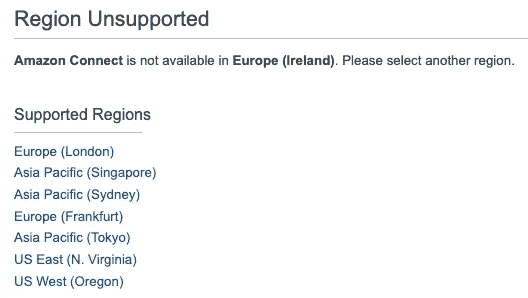

# 3.法律

所以现在，我们创建聊天机器人来安排和检查演示时间。进入 Alexa 服务(确认你和之前在同一个地区)，点击**开始。**

选择**自定义机器人**，配置类似下图的东西，继续前进。

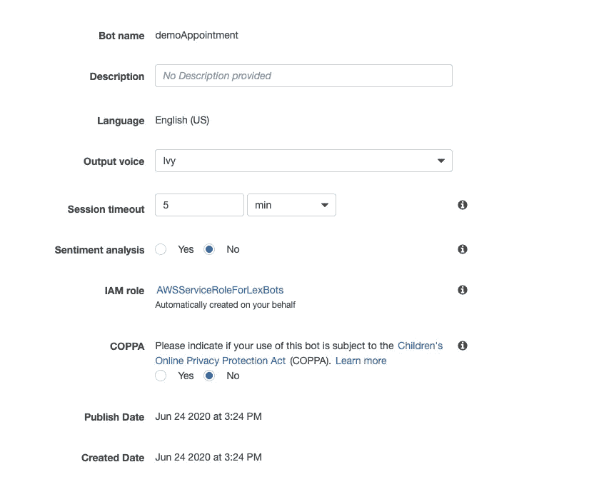

## 3.1 创建演示

现在，点击 **+创建意图**，添加一个意图。选择名称并继续。现在我们可以创造出激发这种意图的口语/打字短语——这些被称为**话语**。

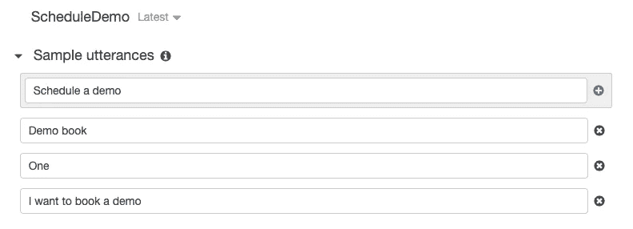

转到 **Lambda 初始化和验证**部分，展开它，并选择我们之前创建的 Lambda 函数。

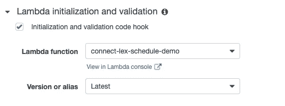

Lex 必须能够理解用户将要说的一些“变量”。在这种情况下，为了安排演示，我们只需要一个日期和时间。为此，我们必须创建**插槽**，并将其全部设置为“必需”。

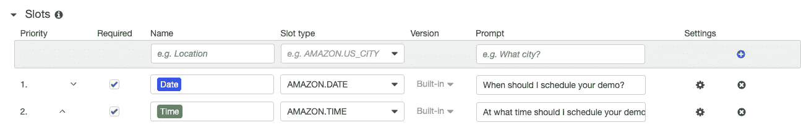

最后一部分是**实现**，当意图“达成”并最终确定时会发生什么。我们将使用与之前相同的 Lambda 函数，并单击**保存意图**。

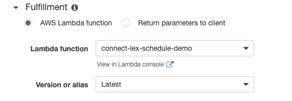

**3.2 检查演示**

现在我们需要创建一个检查所选时隙的意图。现在我们不需要 lambda 来初始化 nor 插槽。

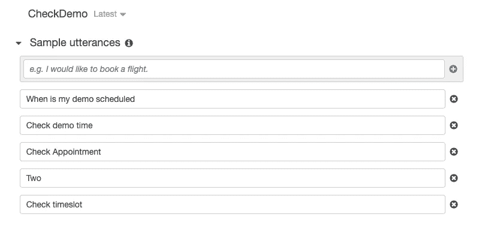

## 3.3 发布 Bot

在右上角，你可以选择**构建**你的机器人。点击它，等待它完成。完成后，你可以玩你的 Lex 机器人的测试版本。

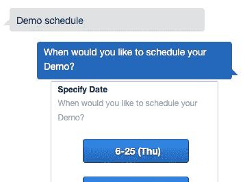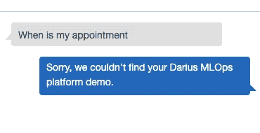

现在你可以**发布**你的机器人，你完成了(现在连接！).

# 4.你的虚拟呼叫中心

令人惊奇的是，我等待着！通过 Amazon Connect 让这一切协同工作！

首先，在控制台上进入亚马逊连接服务，点击**开始**。您将需要配置一些东西，如下所示。完成此操作后，点击**创建实例**，等待几分钟。

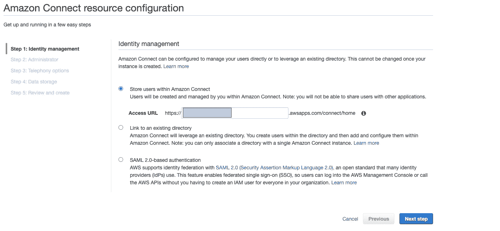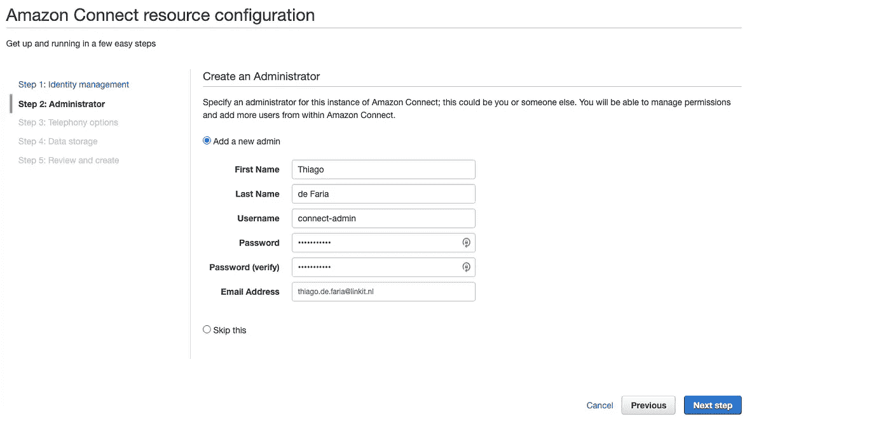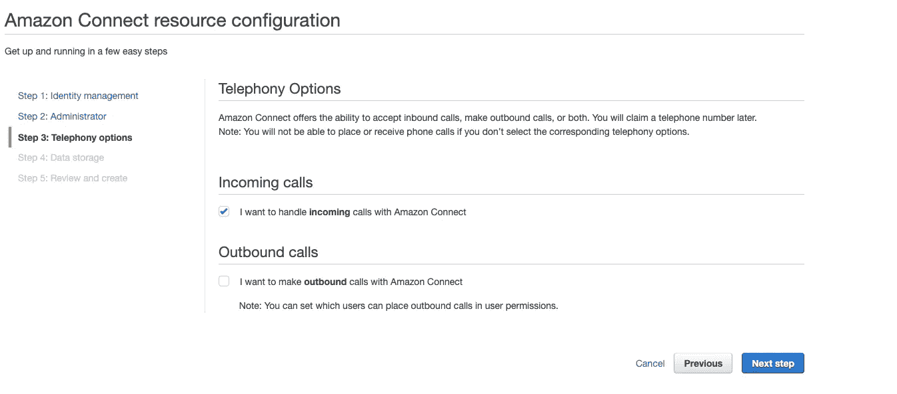

不用打电话，对吧？目前接收就够了。

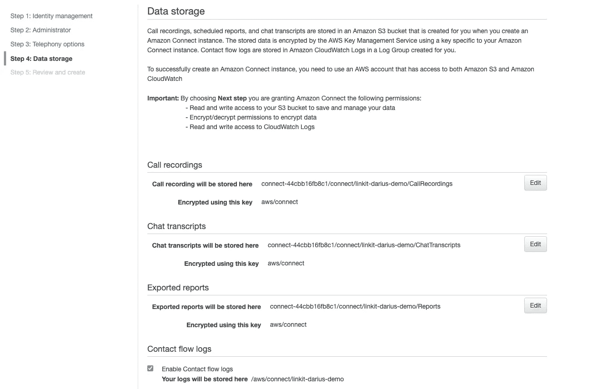

这种先进的数据存储和转录调用配置是一个惊人的功能！

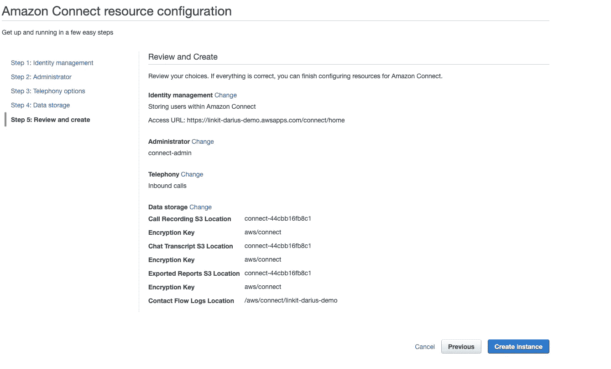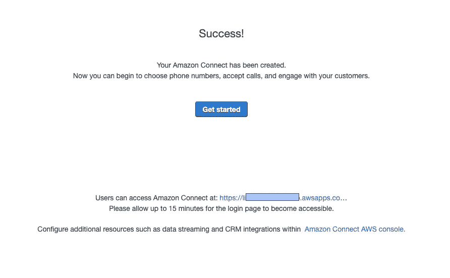

现在转到 Amazon Connect 的主控制台。检查所有连接实例并点击**实例别名**链接(我不知道为什么只在这里有效，但是嘿！)位于该实例的特定页面上。在此页面上，点击**联系流程**以便您可以 Lex。

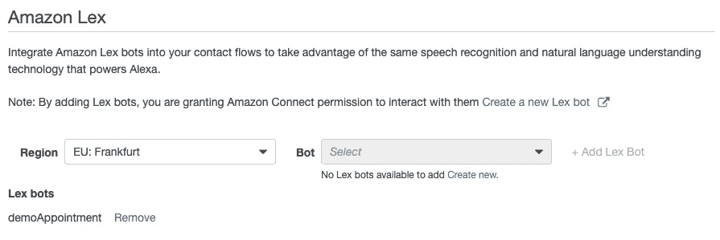

点击**概述**和**以管理员身份登录**进入连接 URL，进入呼叫中心的欢迎屏幕或复制连接 URL 并浏览该屏幕。

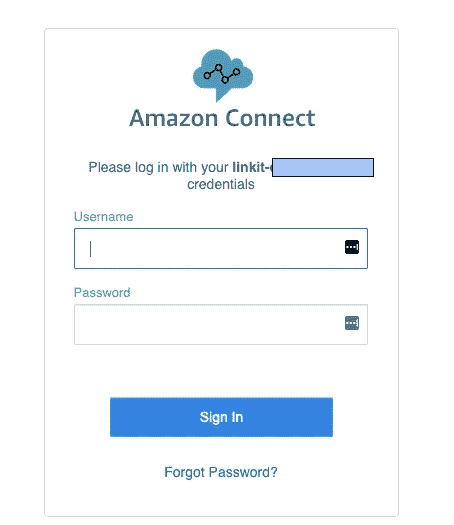

## 4.1 创建基本流程

现在，您可以转到**路由→联系流程**来创建新的流程。不要忘记输入一个名字，并按照下面的图像。现在你在接触流 GUI 中，如果你想通过 Terraform/Cloudformation 做任何事情，这部分会使你感到困惑。流的可视元素是基本的，很难通过编程来构建。

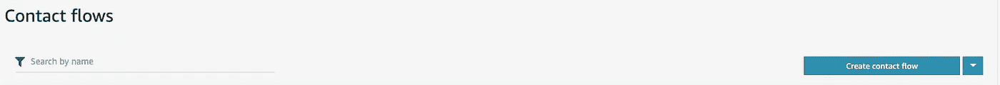

在**交互**部分下，将**获取客户输入框**拖到设计器上。单击框标题进行配置，如下图所示。

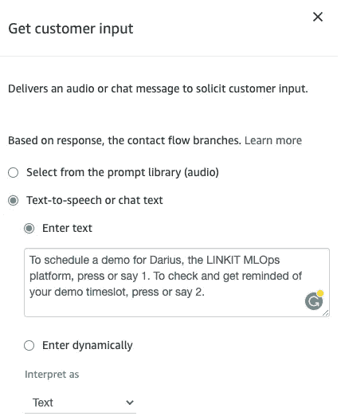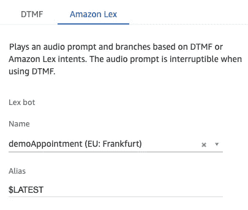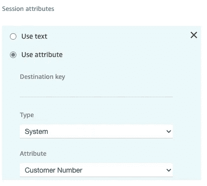

通过系统提取电话号码以便“转发”

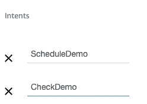

不要忘记映射意图名称！

在 Get Customer 输入框中，您可以看到四个出站圆圈，对吗？两个意图，一个默认，一个错误。如果它默认或出错，我们需要为它播放一些东西，在这种情况下，我更愿意说我们无法识别意图或类似的东西(如下所示)。这就来了**交互→播放提示**框。不要忘记连接它们！也不从**开始**循环连接到**获取客户输入**框，如下图所示。

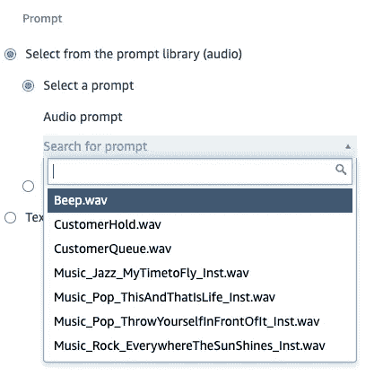

播放提示有惊人的等待音乐。那些不好的，你知道吗？:-D

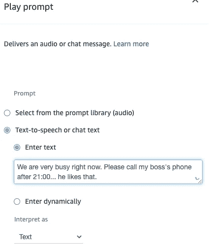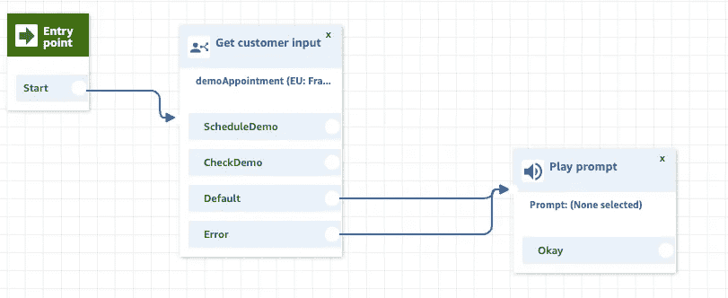

在意图被理解和实现之后(还记得在 Lex 上吗？)，我们可以终止通话。这可以通过拖动**终止/传输→断开/挂断**并进行正确连接来完成。

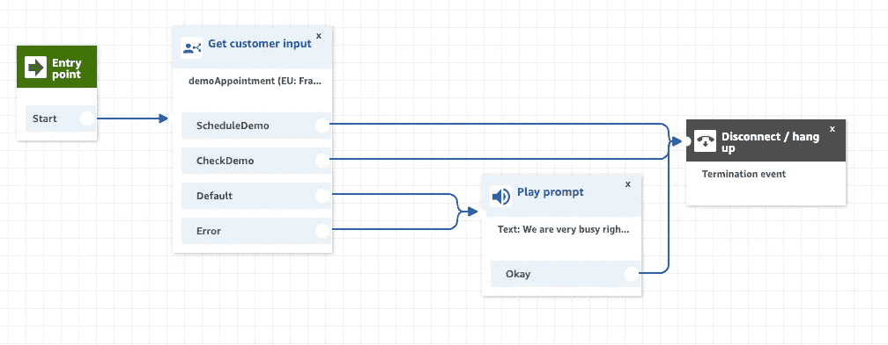

现在你可以保存并发布你的流量了！完成了，对吗？

差不多！我们需要路由到一个电话号码！

## 4.2 路由至电话号码

在左侧栏中，选择**路由→电话号码**。你现在可以点击**申请一个号码**，**，**确保选择你想申请的国家**。**

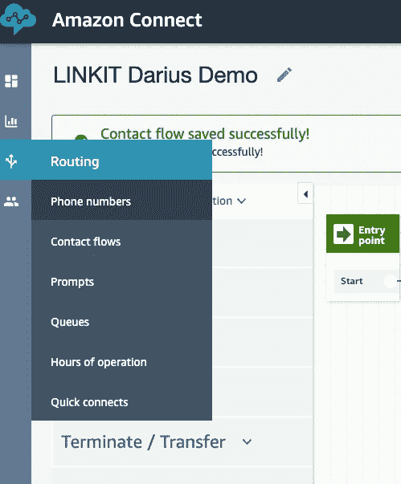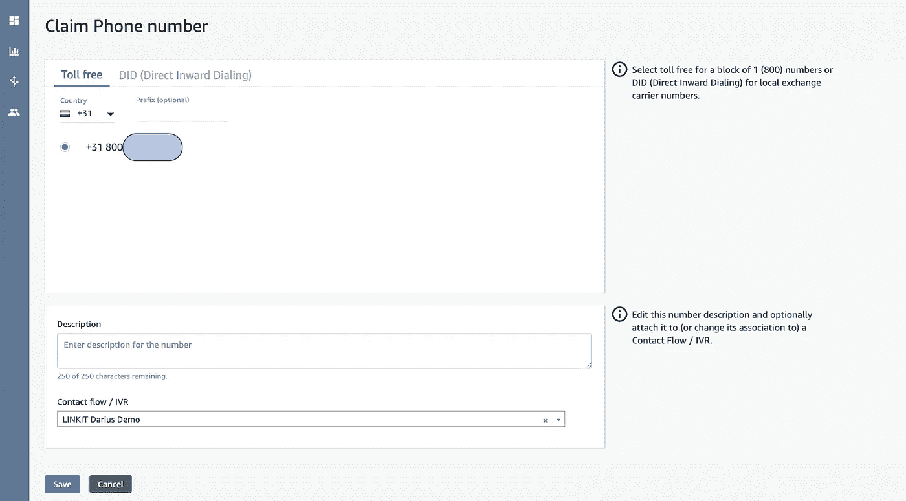

在页面底部，在**联系流程/ IVR** 列表中选择您的流程名称。现在你可以保存它，最后，完成！

这就对了。现在调用那个号码，与它交互，玩自然语言理解你的机器人的属性，等等。当你确认你的演示时，你应该会收到短信。如果您再次调用它们并检查 demo，它们应该会从 DynamoDB 表中检索它。现在你可以去和哥斯达黎加和美国电话电报公司竞争了，对吗？

这里你可以看到当 [Gino Heetkamp](https://medium.com/u/bd28806f72a6?source=post_page-----d0494049977c--------------------------------) 打电话的时候和它的对话。首先，安排一次演示。

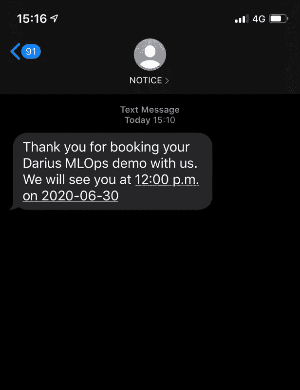

收到短信[吉诺·海特坎普](https://medium.com/u/bd28806f72a6?source=post_page-----d0494049977c--------------------------------)

这是他选择第二个选项时的情况。

哦耶！有用！

为了避免更多的费用，不要忘记清理你的账户。如果你编写了脚本或者使用了 cloud formation/terra form/Pulumi，那就简单多了。如果没有，提醒一下。

*   在呼叫中心网页上发布您声称的号码
*   移除您的 Amazon Connect 实例
*   删除你的 Lex 机器人
*   删除你的 Lambda 函数
*   删除您的 DynamoDB 表
*   删除您的 IAM 角色

我希望你喜欢这个，学到了一些东西，并准备好震撼世界。