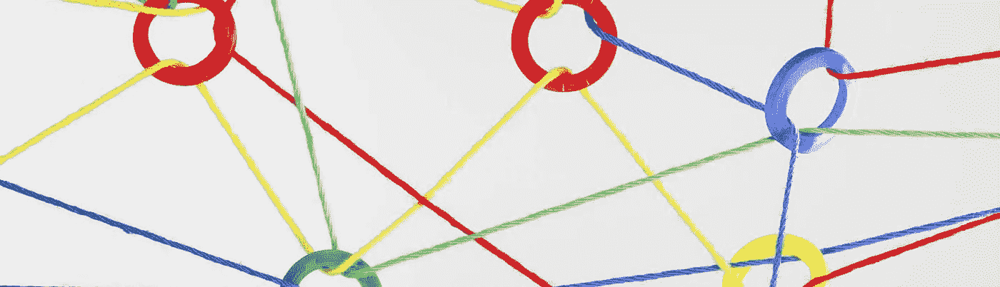
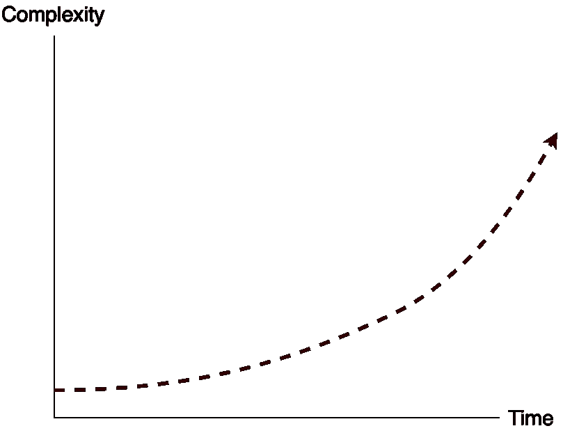
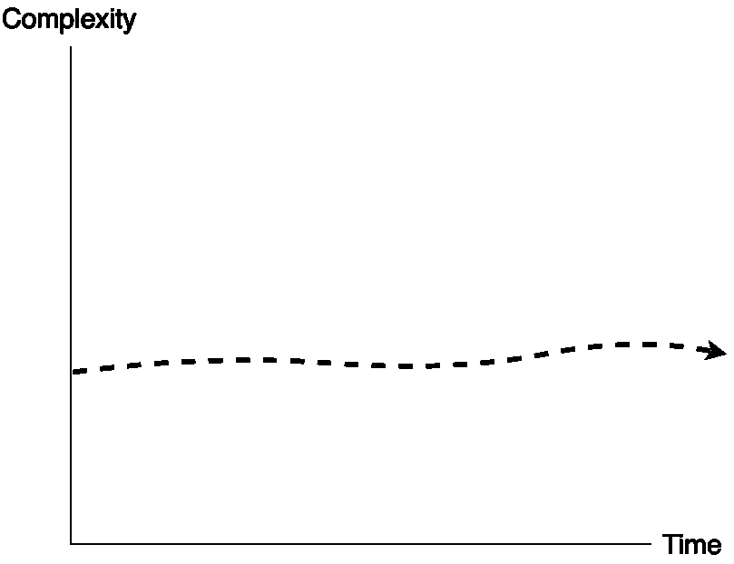
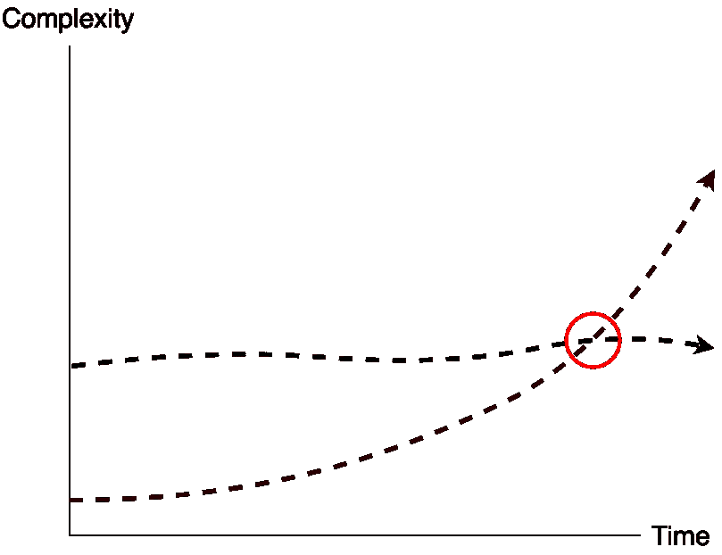
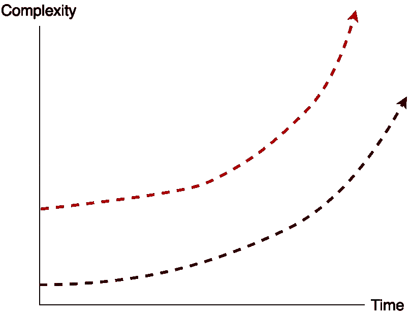

# 你不会因为不是你创造的错误而受到表扬

> 原文：<https://itnext.io/youre-not-praised-for-the-bugs-you-didn-t-create-ef3df6894d5c?source=collection_archive---------1----------------------->

## 一个编程奖励策略的故事

一张彩色缠结的纱线网的照片。都是用一个塑料圈连接起来的。

最近我在看一个技术演练。在那篇文章中，作者主要通过修复代码中的错误来取得进展。作者知道他正在解决的问题的解决方法。他用最少的测试进行调试，并且所有的测试都是端到端的。

这让我想起了一家公司，那里的软件有太多的缺陷，他们负担不起任何新功能。那家公司的所有者开始给开发人员奖励，作为减少 bug 数量的激励:修复大多数 bug 的开发人员将在冲刺阶段结束时获得相当不错的奖励。

几个月后，人们开始意识到 bug 的数量在增加，而不是减少。原来是开发人员在制造越来越多的 bug，只为了修复它们，拿奖。

那家公司的老板给出了古德哈特定律的最好例子。

> 如果有一个好的奖品，每个人都会为了得到它而和系统博弈。

股东和非技术利益相关者很容易察觉到修复 bug 的努力和成本。它与金钱的损失有直接的关系。然而，修复它们并不会带来进步。虫子会让你慢下来。取得进步的最好方法是不要一开始就去创造它们。

然而，那并不容易。

> 当一个度量成为目标时，它就不再是一个好的度量。
> 
> —“提高评级”:英国大学系统中的审计，第 308 页

在一个真实的系统中有许多依赖关系和移动部件。软件是硬的，而且[复杂，有时混乱](https://en.wikipedia.org/wiki/Cynefin_framework)。复杂性不仅仅在于代码；也在背后的人的沟通结构中。想出诸如“使用 TDD”或“创建微服务”这样简单的解决方案是幼稚的，到了近乎荒谬的程度。

> 你不能完全消除软件的复杂性，但是你可以驯服它。

这让我想起了我经历过多次的一种效应。当你开始在一个功能失调的系统中编写幼稚的代码时，你会在开始时有一种进步的感觉。随着复杂性的增加，您开始发现错误，开发新功能变得很有挑战性。

一开始，复杂性很低；一切都是快速而敏捷的。一段时间后，事情开始变得越来越慢，直到你开始修复上周开发的功能中的错误。随后，你开始修复以前试图修复的错误，这就是你面临噩梦的时候。

团队外部的感觉是，随着时间的推移，他们变得越来越慢。

在水平维度上显示“时间”,在垂直维度上显示“复杂性”的图表。随着时间的推移，复杂性呈指数增长。

复杂性增加得越多，参与其中的每个人的挫折感就越大。

这是这个光谱的另一面。当大多数开发人员有技能理解他们编写的每个代码的权衡和他们进行的每个讨论的价值时，随着时间的推移，事情就不会变得越来越慢。

然而，它们在开始时变得很慢！

开始时，复杂性比平常高得多。感觉是开发进行得更慢了，这可能关系到非技术的涉众。然而，随着时间的推移，复杂性不会增加太多。开发人员构建新功能的速度保持不变。评估开始变得更加准确，因为团队有一个标准的步调，不会经常改变。

总之，交付变得可预测。

在水平维度上显示“时间”,在垂直维度上显示“复杂性”的图表。随着时间的推移，它从一开始就保持着平均复杂度。

在第二种情况下，有时复杂性会因为技术债务的偿还而降低，有时会因为技术债务的增加而升高。尽管复杂性可以指数级增长，但不可能指数级下降，无论你支付多少技术债务。

团队给人的感觉是每个人都一直很慢。这种感觉保持不变，直到有一天一致性战胜了指数复杂性。

在水平维度上显示“时间”,在垂直维度上显示“复杂性”的图表。这个图包含了之前的两个例子，只是现在它们在同一个图中。随着时间的推移，第一个例子的复杂性开始很低，然后呈指数增长。第二个例子的复杂度开始很高，但是很少改变。在某个时候，两者相交，这时第二个例子的收益是明显的。

这有一个有趣的效果。

在第一个例子中，每个人在开始时都感觉到巨大的进步。最终，当复杂性高到无法避免被注意到时，有人可能会带着**沮丧的表情**提出这个问题:“我们是如何走到这一步的？”。

在第二个例子中，有类似的反应，尽管方向相反。每个人在开始时都感觉到缺乏进展，但是在某个时候，每个人都意识到复杂性没有增加。当其他人不能时，团队可以以同样的速度交付。这时，有人带着**笑脸**提出了一个问题:“我们是如何走到这一步的？”。

> 在一个项目的后期，你会听到这样的修辞:“我们是如何达到这种状态的？”。如果这个项目带着微笑，你就知道它是成功的。

要小心；有个陷阱。

许多项目从第二个例子开始，但是以指数级的复杂性结束。错误不断出现，只是现在它们更难修复了。这个系统从第一天开始就太复杂了。

这比遵循第一个例子的路径要糟糕得多。

在水平维度上显示“时间”,在垂直维度上显示“复杂性”的图表。有两个例子。随着时间的推移，第一个例子的复杂性开始很低，然后呈指数增长。类似地，第二个例子的复杂性开始很高，并呈指数增长，最后变得更糟。

虽然你只能在事后才发现这些影响，但在给定的方向上还是有办法的。您可以通过将已知的基本软件原则、技术和实践应用到软件开发中来获得第二个例子。同样，你可以忽略其他的例子。

这就是我写基本面的原因:通过意识到他们的可能性来防止别人重复同样的错误。

一个呆伯特卡通，在第一个场景中有一个经理说“我们的目标是编写无错误的软件。你每找到并修复一个漏洞，我就给你 10 美元的奖金”。在下一个场景中，开发人员尖叫道:“雅虎！”“我们发财了！”“是的！是啊！是啊！”。在最后一个场景中，经理说:“我希望这能推动正确的行为。”后来，一个开发人员说:“今天下午我要给自己写一辆新的小型货车！”。[点击此处查看来源](https://dilbert.com/strip/1995-11-13)。

传统的思维模式是:

> 每个人都期望软件没有 bug。如果你没有制造 bug，你只是在做你的工作。

有些地方仍然相信这句话。现实是，如果每个人都期望软件没有错误，那么当他们修复软件时，就没有理由表扬他们。

像给工作做得好或不好的人奖励这样的激励措施不会有助于产生质量更好的软件。它利用开发人员的时间来解决问题，而不是创造价值。奖金激励在某些情况下可能有意义，但对编程没有意义。

作为程序员，对我们来说，正确的激励是确保我们热爱我们所做的工作和与我们一起工作的人。确保我们可以有正确的技术挑战，在高[心理安全](https://www.nytimes.com/2016/02/28/magazine/what-google-learned-from-its-quest-to-build-the-perfect-team.html?smid=pl-share)的环境中工作，学习不同的东西，与更熟练的开发人员、[和其他东西](https://medium.com/@fagnerbrack)一起工作。

创建高绩效团队还有其他值得追求的激励。给修复 bug 的人发奖不在其中。

我确信没有人会因为我没有创造的错误而表扬我。然而，如果我努力实现无 bug 代码，我也许可以回家，因为我知道系统不会在一夜之间崩溃。

还有，我的朋友……**足以获奖。**

**如果你的团队从我关于这篇文章或我正在进行的任何其他项目的谈话和/或问答中受益，请在`contact at fagnermartins.com`给我写信。**

**感谢阅读。如果你有一些反馈，请通过 [Twitter](https://twitter.com/FagnerBrack) 、[脸书](https://www.facebook.com/fagner.brack)或 [Github](http://github.com/FagnerMartinsBrack) 联系我。**

**感谢 [Ian Tinsley](https://medium.com/u/c4ccb3ab8d17?source=post_page-----ef3df6894d5c--------------------------------) 、 [Tim Schraepen](http://twitter.com/timschraepen) 、 [Al Ernst](https://www.linkedin.com/in/rogerwernersson) 和 [Dustin Paluch](https://www.linkedin.com/in/dustinleepaluch/) 对本文的深刻见解。**

**想当面聊聊吗？你可以在 [**悉尼软件工匠聚会**](https://www.meetup.com/Software-Crafters-Sydney/) 找到我。**