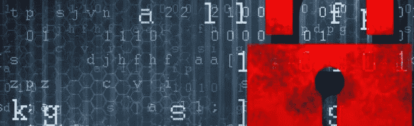

# 即使是最好的防毒软体也无法保护您的档案，不受「转译」的影响

> 原文：<https://itnext.io/zelfs-de-beste-antivirus-kan-je-bestanden-niet-beschermen-tegen-ransomware-dff8951cf55f?source=collection_archive---------0----------------------->

互联网可能是一个危险的地方，这是众所周知的。恶意软件是一个大多数人都知道的术语。也许它已经走得太远，已经失去了它的惊吓作用。[业务内部人员](http://uk.businessinsider.com/fighting-ransomware-with-antivirus-2016-1?r=US&IR=T)与 Trend Micro、Cisco 和 kapeniak lab 的防病毒专业人员进行了交谈，并向他们发出“ransomware”警报，这是当前流行的恶意软件形式。

转发器在计算机上加密(个人)文件。除非受害人支付所谓的"解密密钥"的费用否则文件是不可访问的。现在的加密技术非常好以至于支付赎金通常是唯一的方法。这种犯罪模式已经被证明是非常成功的。甚至成功到可以赚上百万美元。

对抗反转录病毒最好的方法就是按照抗病毒专家的说法简单地避免它。防病毒软件通常通过跟踪一个庞大的数据库来运行，并具有已知病毒的特性。此方法确实可以保护您的计算机免受已知病毒的侵害，但当前的防病毒软件在检测新病毒、隐藏病毒或更改病毒时遇到问题。因此，防病毒专业人员必须不断适应病毒和恶意软件的创新。

恶意软件的两大创新是“矛钓鱼”和“水洞攻击”。Spear 网络钓鱼是一个改进的更有针对性的假电子邮件版本。在水洞攻击中，合法、可靠的网站会被感染。保安公司正在联手打击网络犯罪。Trend Micro 的网络安全副总裁 ed cabrera 说:“我们不认为其他安全供应商是我们的竞争对手，这些都是网络罪犯。”在[商业内幕文章](http://uk.businessinsider.com/fighting-ransomware-with-antivirus-2016-1?r=US&IR=T)中，他们描述了在反病毒方面的哪些发展，他们正在打击这些网络罪犯，并提供了联合建议，帮助您武装反转录病毒。

如果你感兴趣的话，请继续阅读并通过社交媒体与我们分享你的观点