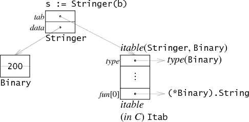

# Rust 中的零成本抽象

> 原文：<https://itnext.io/zero-cost-abstractions-in-rust-26d058eb1724?source=collection_archive---------1----------------------->

你好，

在这篇文章中，我们将讨论 Rust 中的零成本抽象。

这个帖子的视频版本也有[可用](https://youtu.be/yKA9PCvzbqA)。

但是首先，我们需要问这个问题什么是零成本抽象？

正如 C++编程语言的创始人所说:

*C++实现遵循零开销原则:*

1.  *不用的东西，不用付钱*
2.  你所使用的，你不可能比手工编码更好了。

但是让我们更深入地挖掘每一点。

想象一下 Golang goroutines，每个 Golang 二进制程序都带有一个调度程序和一个运行时，其中包含了管理 goroutines 的代码，无论您是否使用它们，因此我们可以说 Golang goroutines 不是零成本的，因为即使您不使用它们，您也在为它们付费。现在比较一下 Rust Async/Await，如果你明确地说你想要 Async 特性，runtime 只是捆绑了。

现在我们已经知道了第一个陈述，让我们看看第二个。

在 Golang 和几乎所有主流语言中，有一个概念叫做接口，这是一种为不同类型定义共享行为的方式，但 Golang 实现接口和 Rust 实现特征(Rust Interfaces)的方式略有不同。在 Golang 中，正如这里详细解释的每个接口变量由两部分构成，

一部分保存接口的元数据(方法列表和签名)，另一部分是指向该接口的实际实现的指针。

现在考虑这段代码

两个变量 a 和 b 看起来一样，因为它们都有相同的数据，但在运行时它们的行为不同，如果你在 a 上调用 String()方法，它是静态分派的，几乎没有额外的成本，但如果你在 b 上调用 String()方法，你首先在接口包装器内对指针进行解引用，正如我们在上面的图片中看到的那样，所以通过在 Go 中使用接口，你在运行时会获得额外的成本。添加到您的代码中的代码并不是最快的实现，您可以通过移除接口并直接调用 String()方法来手工编码它(当然，您会失去接口的好处。我只是说还有一个更快的实现，你可以自己编写，Rust 中零成本抽象的另一个例子是迭代器特性。

但是 C++/Rust 如何处理这种情况呢？最终，这两种编程语言将零成本抽象作为自己的核心价值。

再来说说铁锈。

Rust 具有类似于接口的特性，请看下面的代码。

[Rust 零成本抽象(github.com)](https://gist.github.com/amirrezaask/34c9b401a35c7fce86ddc194d4ec51b4#file-trait-rs)

正如你在上面的代码中看到的，我们有几乎与 Golang 版本相同的东西，我们有一个 trait(接口)和一个使用该 trait 作为输入的函数，但不同的是，当 rust 被编译时，该 trait 方法调用变成了一个静态调度，使用一种称为“单态化”的方法，这基本上意味着对于每个 trait impl 块，rust 编译器将生成一个单独版本的函数，该函数将类型作为参数，例如对于我们的 struct:

[Rust 零成本抽象(github.com)](https://gist.github.com/amirrezaask/34c9b401a35c7fce86ddc194d4ec51b4#file-trait_cmpl-rs-L1-L3)

如果我们有其他实现，它也会生成其他函数。然后 Rust compiler 用调用这些生成的函数替换所有对 trait 方法的调用，这样 trait 就像函数一样便宜。

我希望这篇文章能帮助你更好地理解什么是零成本抽象，以及其中一些是如何在 Rust 中实现的。

最后的话:

零成本抽象是 Rust 语言的核心价值，知道它们是什么以及它们如何工作有助于我们理解语言。