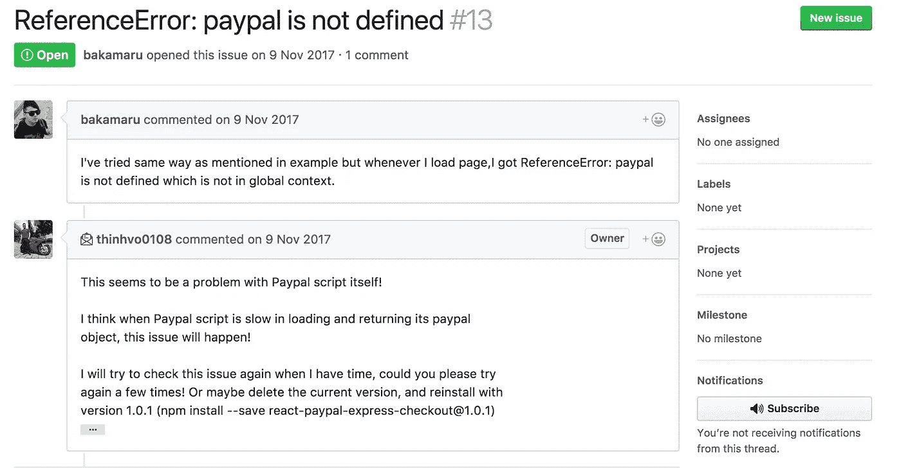
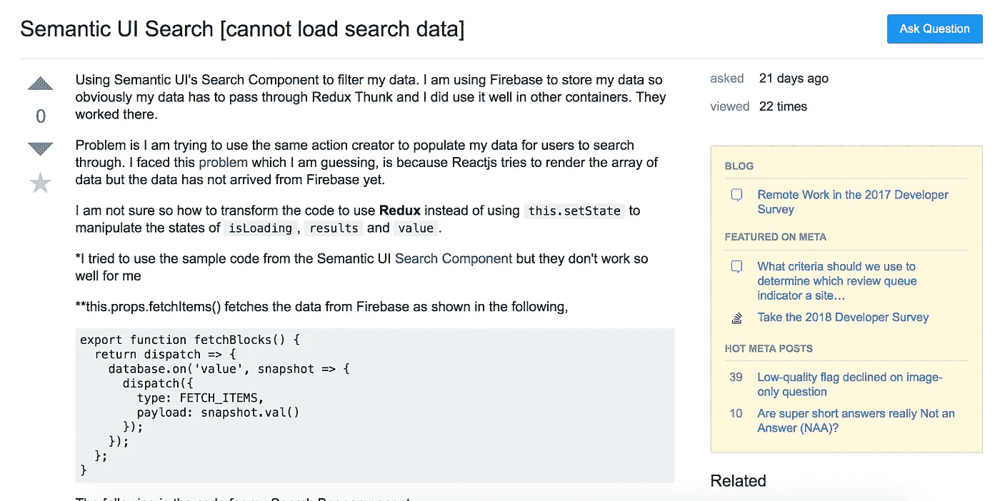
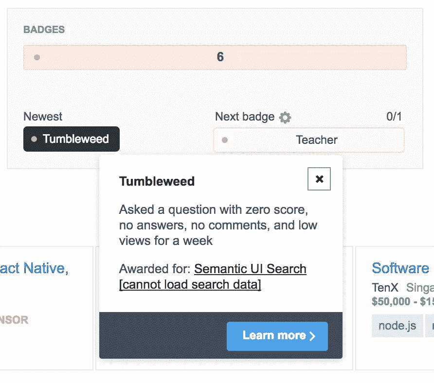
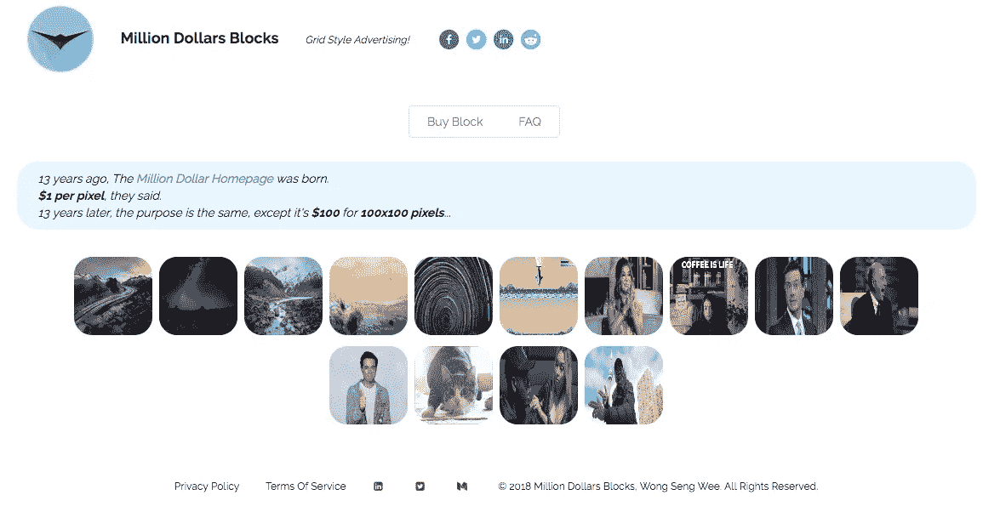

# 从零到英雄——从头开始创建全栈 Web 应用程序

> 原文：<https://itnext.io/zero-to-hero-creating-a-full-stack-web-app-from-scratch-5f94add9f185?source=collection_archive---------0----------------------->


[*点击这里在 LinkedIn* 上分享这篇文章](https://www.linkedin.com/cws/share?url=https%3A%2F%2Fitnext.io%2Fzero-to-hero-creating-a-full-stack-web-app-from-scratch-5f94add9f185)

# 背景

我可能会学习计算机科学，但学校不会教你网络开发。尽管如此，通过工作经验，我意识到 web 应用程序在商业世界中实际上非常普遍，需求量很大。与 iOS 应用、Android 应用等原生应用不同，网络应用的覆盖范围要大得多，因为网络应用可以在桌面和移动设备上访问。

谷歌的人也对网络应用寄予厚望，可能是认为进步的网络应用有一天会改善本地应用开发者面临的棘手问题——为各种平台(如 iOS、Android)开发一款软件。更不用说软件运行的不同平台所引起的兼容性问题。就像谷歌的人解释的那样，网络平台将是开发者分发问题的一个很好的解决方案，但是到目前为止，网络应用的能力还没有达到本地应用的水平。点击阅读更多关于[的内容。](https://developers.google.com/web/ilt/pwa/why-build-pwa)

要创建一个全功能的 web 应用程序，你需要知道如何管理 web 应用程序的前端和后端。幸运的是，有许多可靠的后端即服务(BaaS)提供商可以减轻您的一些压力。稍后我会详细介绍。

# 从哪里开始？

有许多流行的 web 开发技术，如 **Angular.js** 、 **React.js** 以及更多可供选择的技术。我怎么知道什么最适合我？

[**Angular.js**](https://angularjs.org/) 是一个主要由 **Google** 和一个开发者社区维护的前端 web 应用框架。它采用了一种称为模型-视图-控制器(MVC)的框架来呈现单个页面应用程序中的组件。Angular.js 维护的相当好，有很多 Angular 模块供你使用。截至 2018 年 1 月，Angular.js 已经从 1 版进化到 5 版。你可以看出框架已经有了很多改进，这对开发者来说是一件好事！(尽管学习曲线也相当陡峭)

[**React.js**](https://reactjs.org/) 也是一个主要由**脸书**及其开发者社区维护的前端 web 应用框架。它还采用 MVC 模式在单个页面应用程序中呈现组件。有许多 Javascript 库由专门的开发人员支持。

Angular.js 和 React.js 都不容易掌握，如果你没有编程背景，就更不容易了。尽管如此，还是有很多很棒的教程可以帮助你熟悉这些框架。我相信付费学习 web 开发框架，因为付费内容往往比免费内容质量更好(废话！)无论如何，在促销期间，有许多 10 美元的 Udemy 课程。(只找评分高的课程就行了)我买了一门课学习 React.js + Redux，我创建全栈 web app 的旅程开始了！


# 我学习 React.js/Redux 时遇到的困难

*你可能有一套不同的经验学习 Reactjs/Redux

## 1.过期/破损的包装

不仅仅是 React.js，许多网络应用程序的软件包更新都非常快。这通常是一件好事，因为功能得到了更新，网络应用得到了优化。

然而，许多包都有依赖关系(意味着包本身需要其他包才能工作)，这些依赖关系也会随着时间的推移而更新。如果包的作者决定更新他的依赖项，而没有检查与他自己的代码的兼容性，那么整个包可能会崩溃。使用这些包的开发者将会看到无穷无尽的麻烦。

在我自己的网络应用程序中，我为我的用户集成了 Paypal 支付选项，并在那里进行了调试。专门为 React.js 编写的 Paypal API 脚本没有说太多，所以我决定求助于其他包。


React.js 的 Paypal 官方框架截图

因此，我使用了一个名为[react-paypal-express-check out](https://github.com/thinhvo0108/react-paypal-express-checkout)的包来集成 Paypal 支付功能，但最新版本出现了问题(1.0.3 版)。该包在编译时损坏。整个应用程序不会运行，仅仅是因为软件包中的代码损坏。



Paypal 整合问题的截图

作者告诉用户使用 1.0.1 版本，因为它是更稳定的构建版本。像这样的问题总是发生*！解决这些问题的诀窍是什么？*

*毅力和对你的发展问题孜孜不倦的研究。几个小时的调试和询问你的朋友——谷歌。这是软件开发的一部分。如果这个包不行，试试另一个。继续测试和编码，直到你的 web 应用程序执行期望的动作！*

## *2.缺乏支持*

*你有没有因为没有人可以求助而感到无助？答案往往是肯定的。如果你读过关于编程的在线评论，人们总是说，*

> *“谷歌！答案都在那里！如果没有，试试 Stack Overflow 或者 Github。大部分答案都已经有了！”*

*如果你所面临的问题是一个影响到其他人以同样的方式编码或者使用同样的依赖关系的主要问题，这是真的。*

*当你真正开始做自己的项目时，你会发现情况并不总是这样。不是每个人都像你一样使用相同的依赖关系。不是每个人都像你一样编码。不同软件包之间的冲突可能会引发问题。*

*让我给你看一个例子，*

**

*我在栈溢出上问了一个问题，希望得到解答*

*为了结束这尴尬的一集，Stack Overflow 给了我一个奖。*

**

*问了一个零分的问题，没有答案，没有评论，一个星期的低浏览量*

*没有回答，没有评论，一周的低浏览量。你期望栈溢出中至少有一个人回答你的问题，或者至少尝试回答你的问题，但是没有。*

*情况并不完全糟糕，我问了几个与 Firebase 和 Redux 相关的问题，一些人给我指出了正确的方向。如果他们足够友好，他们会写出伪代码或样板代码供您复制并粘贴到您的源代码中。*

*重要的是当你有疑问的时候**去问**。如果你把问题留给自己，并决定走捷径，你将永远不会构建一个高质量的应用程序。如果你试着问别人，你有机会在你的项目上取得进展。我知道这听起来很老套，但是你应该快速失败，然后继续你的下一个目标。如果你阅读有关企业家精神的材料，这个观点会经常出现。关键是，你应该验证一个想法是否值得投入时间。如果答案是否定的，继续前进。不要在一个调试问题上纠缠几天。这样你永远也做不成事情。*

# *我学到了什么/做了什么？*

*在完成 React.js 上的 Udemy 课程后，我可以有把握地说，我对以下内容感到满意，*

1.  *React.js 状态管理*
2.  *React.js 生命周期*
3.  *Redux —应用程序状态级别管理*
4.  *呈现异步请求(例如 Axios/Redux Thunk)*
5.  *使用 Fireback 处理后端*

*我决定给自己一个挑战。使用 React.js + Firebase stack 重新创建[百万美元主页](http://www.milliondollarhomepage.com/)。对于那些不知道百万美元主页的人来说，13 年前有一个机会主义的学生创建了一个网站，以 1 美元的价格出售 1 像素的广告空间。网站上有一百万像素可供人们购买。那会儿闹得满城风雨。你可以在它的[维基百科页面](https://en.wikipedia.org/wiki/The_Million_Dollar_Homepage)上读到更多。*

*这个概念非常简单，创建一个显示图像的空间，当用户悬停在空间块上时有一个弹出消息。当用户点击该块时，将被重定向到提供的超链接。在买家填写表格并付款后，广告空间块应该出现在主页上。有点像 Instagram 风格的广告形式。*

*听起来很简单，对吗？对于一个刚到 React.js/Redux.的人来说，如果你知道这个网站包含一个无法用 Wordpress 复制的功能，那就没你想的那么简单了。*

# *警告:下一节的技术知识*

## *布线冗余形式*

*对于熟悉 Redux 的人来说，您应该知道如何使用 reduxThunk 来调度操作数据的动作。我不太确定我们使用调度功能有多灵活。在我深入研究之后，我意识到你不必总是导出你的动作创建器。事实上，你可以在你的`*actions/index.js*` 中创建一个函数，并在另一个动作创建器中使用它。*

*我需要允许我的用户上传一张图片到我的 Firebase 存储器中，并获取下载 URL，然后将它附加到表单提交中。对于那些好奇的人，我的上传动作创建器看起来像这样，*

```
*export function UploadDispatch(file) { return dispatch => {
 dispatch(LoaderDispatch())
 var storageRef = firebase.storage().ref(‘clientImg’).child(file.name);
 storageRef.put(file)
 .then((snapshot) => {
 var snapUrl = snapshot.downloadURL
 dispatch(fileDispatch(snapUrl));
 dispatch(LoaderDispatch())
 })
 .catch((error) => {
 var errorMessage = error.message;
 dispatch(LoaderDispatch())
 console.log(errorMessage, ‘errorMessage’)
 dispatch(ErrorDispatch(errorMessage))
 toastr.error(‘Either your image exceeded the accepted file size or it is not in the correct image format. Please check again!’, { icon: ‘error’ });
 })
 }}*
```

*接下来，我的 web 应用程序需要保存表单提交细节，同时我的用户被重定向到 Paypal 支付页面，以便在数据实际提交到 Firebase 数据库之前进行支付。*

*我在修复表单时遇到的两大问题是**验证**图片*上传字段*和*复选框字段*(用户需要在购买 block 之前同意服务条款)。*

*Redux-form 不是专门为验证上传字段或复选框字段而设计的。我绞尽脑汁试图找出一种方法来确保用户勾选复选框，并在允许他们付款前上传一张图片。*

***提示:使用组件状态检查上传的状态是否为空(* `*‘’*` *)可能是这样的，**

```
*onSubmit(props) {
 let submit = {
 name: props.name,
 email: props.email,
 imageUrl: this.props.Uploaded
 }
 if (submit.imageUrl === ‘’) {
 this.setState({ img: true })
 } else {
 this.setState({ img: false })
 }
}*
```

# *最终结果*

**

*我的 web 应用主页截图*

*我喜欢“干净”的外观，白色背景，天蓝色是我的第二颜色。当买家成功付款后，他们的区块会出现在首页，占据一个区块的空间。*

**

*弹出消息*

*将鼠标悬停在该区域时，会弹出一条消息，显示他们在购买表单中填写的描述。点击表单会将他们带到买家指定的超链接。*

# *包裹*

*如果你还在考虑是否从事网络开发，我会说去吧！这是一个非常有用的技能！想想所有的大型科技公司，像*脸书*、*推特*、*媒体*、 *Instagram* ，他们都有一个网络平台。事实上，他们中的许多人都是从拥有一个 web 应用程序开始的！*

*如果你担心内容对你来说太难理解，不要担心。就像我之前提到的，**有疑问就问**。大多数时候，社区会尽力帮助你。我推荐 Firebase 作为您的 BaaS，因为它们有许多有用的功能，如用户身份验证、数据库和文件存储服务，而且价格合理！*

*这个 API 很容易理解，你所要做的就是从你的前端调用 API 来获取数据或者将数据推送到你的 Firebase 数据库。省却了一半麻烦！你只需要专注于前端开发。*

*在[https://milliondollarsblocks.com](https://milliondollarsblocks.com)查看网站！*

*很快就会有赠品，所以请务必关注 Twitter 上的更新，关注账号 [@1000000blocks](https://twitter.com/1000000blocks) 。谢谢，干杯！*